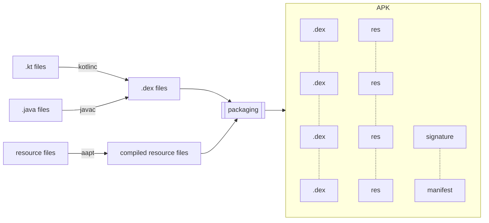

If you maintain an Android application, you might be relying on performance monitoring SDKs like Firebase Performance or New Relic, to name a couple.

These plugins usually have a light setup process, and manage to collect statistics about every network call and database query in your app automatically. If you have ever wondered how this is achieved and, most importantly, how to debug the issues this might be causing—read on!

# Diving into the Android build process

To understand what instrumentation really is and how it works, we first need to know a little about the Android app build process. Don't worry, we'll only need to cover the basics.

To put it simply, your source files (Kotlin and Java) are compiled to Dalvik bytecode, into `.dex` files. These files are then packaged into an APK file, which is basically just a ZIP file with all your code and resources.

<!-- TODO use Mermaid instead -->




## Understanding bytecode instrumentation

Now, let's say you want to take an existing application with its untouched source code, and automatically inject calls to *your* SDK every time a network call is made, to log whether it was successful or not. How would you achieve this?

The easiest way is to plug yourself into the build, right after the code is compiled into bytecode, and **modify the bytecode** to your will.

<!-- TODO use Mermaid instead -->


The Android Gradle Plugin (AGP) offers APIs to do this, so SDK vendors can just provide a Gradle plugin and ta-da! Your app is instrumented.

<!-- TODO remove M6 mentions -->
```
.method private final getContent()Lfr/m6/m6replay/feature/home/presentation/viewmodel/HomeViewModel$State$Content;

    .locals 2
    .line 119

    iget-object v0, p0, Lfr/m6/m6replay/feature/home/presentation/viewmodel/HomeViewModel;->state:Landroidx/lifecycle/LiveData;

    invoke-virtual {v0}, Landroidx/lifecycle/LiveData;->getValue()Ljava/lang/Object;

    move-result-object v0

    instance-of v1, v0, Lfr/m6/m6replay/feature/home/presentation/viewmodel/HomeViewModel$State$Content;

    if-eqz v1, :cond_0

    check-cast v0, Lfr/m6/m6replay/feature/home/presentation/viewmodel/HomeViewModel$State$Content;

    goto :goto_0

    :cond_0

    const/4 v0, 0x0

    :goto_0

    return-object v0
  
.end method
```

## Reverse-engineering a built APK

## Understanding Dalvik bytecode

https://source.android.com/devices/tech/dalvik/dalvik-bytecode

# Using a decompiled APK as a debugging tool

## Inspecting suspicious code

## Debugging by iteration

```sh
#!/bin/sh
apktool --use-aapt2 b <your-decompiled-apk> \                     # path to your previously decompiled APK
    && ~/Library/Android/sdk/build-tools/30.0.2/apksigner sign \  # path to your Android SDK
        -ks ~/debug.keystore \                                    # path to a debug keystore
        --ks-pass “pass:<password>" \                             # your keystore password
        <your-decompiled-apk>/dist/*.apk \
    && adb install <your-decompiled-apk>/dist/*.apk
```


## Finding the right fix

# Conclusion


