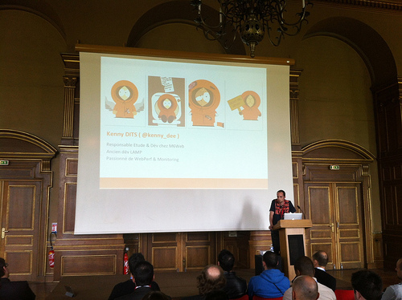
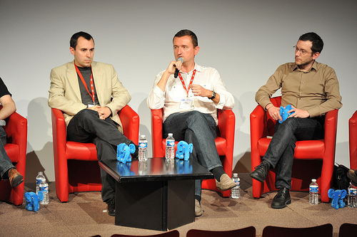
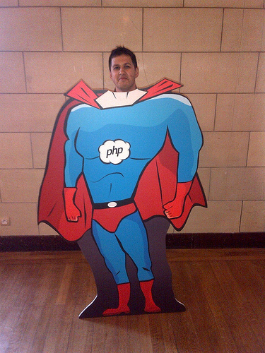

Voici quelques photos des membres d'M6Web prises lors du Forum PHP 2012.

Kenny a animé une conférence sur le monitoring applicatif.

Martin, notre CTO, a participé une table ronde.

Olivier était également présent en tant que membre de l'[Afup](https://www.afup.org "Site de l'afup")

Ainsi que Didier et Julien, développeurs dans nos équipes R&D, et trop préssés d'assiter toutes les conférences pour être photographiés.

