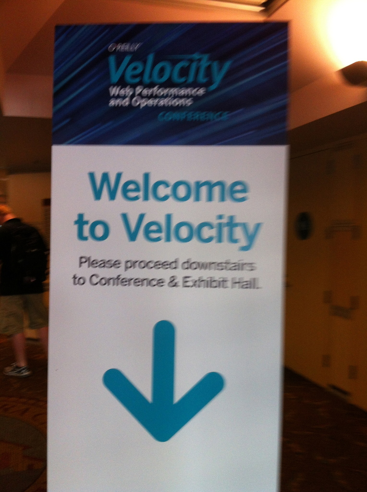
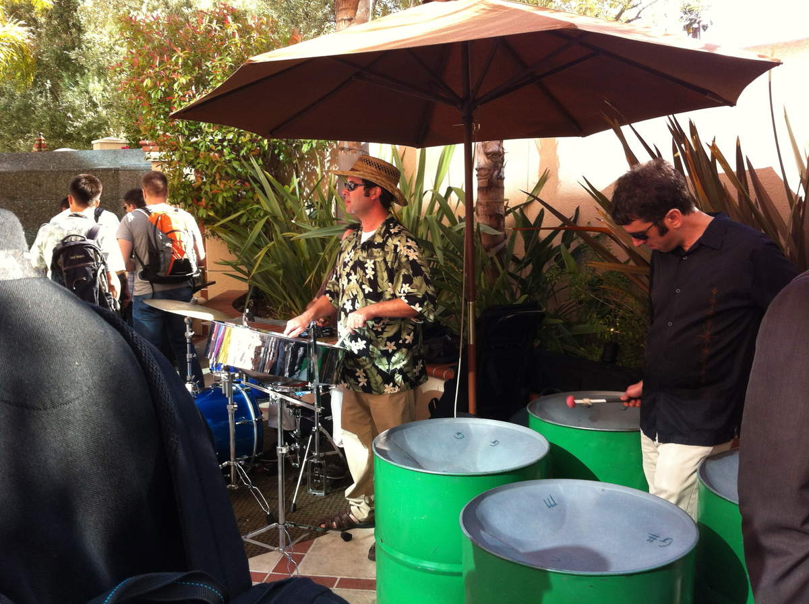
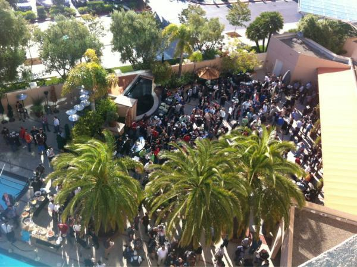
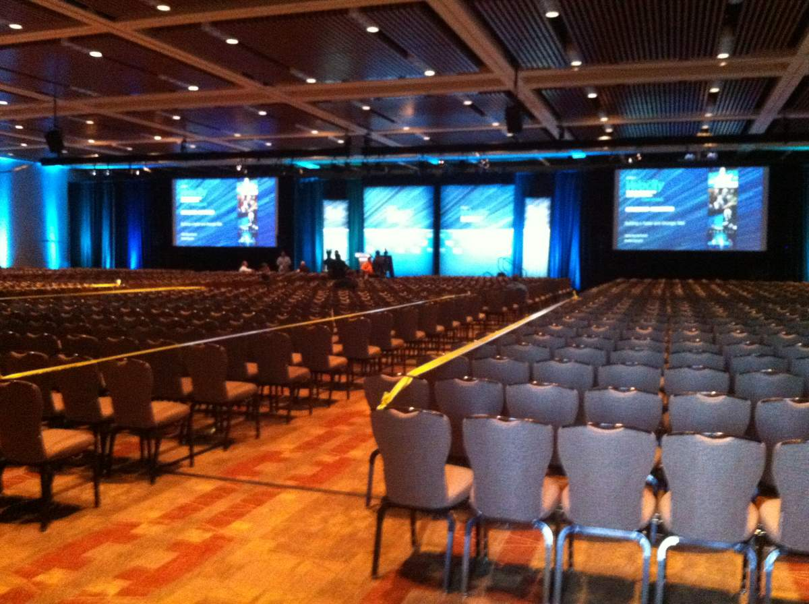

Nous voici à Santa Clara, CA, ce lundi 25 juin pour notre première Velocity Conference (Web Performance & Operations) aux states (nous avions déjà pu avoir un aperçu l'année dernière avec la première Velocity Europe Berlin).

L'évenement se situe au Convention Center, et la première chose que nous remarquons, c'est la taille démesurée du lieu ! Et pour cause, 800 personnes sont attendues !

Pour cette première journée sous le signe des tutoriaux, il y avait entre trois et quatre tracks parallèles de 90 minutes chacun, dont un réservé aux sponsors. Dur de faire des choix parmi toutes les confs et le programme alléchant de la journée !

Je m'oriente donc sur le coté Dév / WebPerf / Monitoring, pendant que mon collègue, Francois, part sur le coté operations qu'il couvrira dans une autre série de CR.

#### [WebPerf] Understanding and Optimizing Web Performance Metrics, par Bryan McQuade de chez Google

Au menu :

- Explication des métriques de performance orientées réseau
- Fonctionnement du parser HTML5
- Explication des métriques de performance orientées rendu
- Démo de Critical Path Explorer (PageSpeed Online)
- Optimisation de l'affichage perçu utilisateur

Les slides parlent d'elles même et sont disponibles ici :   
[https://perf-metrics-velocity2012.appspot.com](https://perf-metrics-velocity2012.appspot.com) .

Elles parcourent l'intégralité des notions de WebPerf existantes "à jour", dont certaines peu connues comme la Speculative loading, et permettent surtout de comprendre ce qu'elles signifient très précisément.

A retenir aussi le SSL Server Test ici [https://www.ssllabs.com/ssltest/](https://www.ssllabs.com/ssltest/)

C'est donc un Must Read pour tout ceux que la WebPerf intéresse.

**Page Speed Insights : **

Nous avons eu droit ensuite une démo très intéressante de la fonctionnalité Critical Path Explorer (déjà entraperçue en version béta à la Velocity Europe), et qui sera je pense lancée officiellement demain.

En attendant et pour la tester :   
[https://developers.google.com/speed/pagespeed/insights?velocity=1](https://developers.google.com/speed/pagespeed/insights?velocity=1)

Cette fonctionnalité permet, comme son nom l'indique, de montrer le chemin critique de votre page. Sur les quelques tests que j'ai pu effectués, c'est très efficace. On apprécie le détail au niveau du waterfall sur l'exécution des javascripts, l'affichage de "qui bloque quoi", ou le render css. A approfondir de toute urgence !

Bryan McQuade (Google)

<iframe allowfullscreen="" frameborder="0" height="360" src="https://www.youtube.com/embed/NTAi3ILOa1c?wmode=transparent&fs=1&feature=oembed" width="640"></iframe>
La Lightning Démo de Page Speed ayant eu lieu le lendemain

#### [WebPerf] A Web Perf Dashboard: Up & Running in 90 Minutes, par Cliff Crocker et Aaron Kulick.

L'idée ici était de montrer en 90 minutes avec quels outils obtenir un dashboard orienté WebPerf, qui sera fourni comme une VM à la fin de la session.

Après une longue présentation orale d'outils plutôt connus désormais comme :

- [Boomerang.Js](https://github.com/yahoo/boomerang)
- [WebPageTest instance privée + API](https://www.webpagetest.org)
- [Piwik](https://piwik.org/) (clone de Google Analytics)
- [StatsD](https://github.com/etsy/statsd) (collecteur pour Graphite)
- [Graphite](https://graphite.wikidot.com/)
- [REDbot.org](https://redbot.org/)
- cUrl
- [ShowSlow](https://www.showslow.com/)
- …

Les deux conférenciers nous présentent un site réalisé pour l'occasion : "Sally Squirrel’s Dance Emporium", hommage aux gifs animés d'écureuils dansant, et nous font une démo (un peu capricieuse) de leur dashboard basé sur Piwik, alternative Google Analytics avec un système de "plugin" visiblement pour aggréger un peu le tout.

L'idée est clairement bonne, le résultat ne m'a pas convaincu titre personnel. On vante au départ de la présentation, le faite qu'une image bien choisie suffit au monitoring, et qu'un dashboard ne doit pas être complexe, et au final, on se retrouve avec un dashboard remplis d'images en tout genre, de données tabulaires, … complexe quoi ...

**Piwik en alternative Analytics ?**

Je doute aussi de la robustesse de Piwik que nous avions déjà étudier, et voir des pages listant les temps de latence ou de chargement utilisateur par utilisateur, me fait réellement peur avec une audience dépassant la centaine de personnes la journée …

Pour l'anecdote, sur le wiki de Piwik, on lit cette phrase que je vous laisse apprécier : "If your website has more than a few hundreds visits per day (bravo!), waiting for Piwik to process your data may take a few minutes"

Je vous invite tout de même à lire les slides :   
[https://assets.en.oreilly.com/1/event/79/A%20Web%20Perf%20Dashboard_%20%20Up%20_%20Running%20in%2090%20Minutes%20Presentation.pptx](https://assets.en.oreilly.com/1/event/79/A%20Web%20Perf%20Dashboard_%20%20Up%20_%20Running%20in%2090%20Minutes%20Presentation.pptx)

Ainsi qu'à tester la VM mise à disposition, car le travail derrière est conséquent, et peut correspondre à certains, ou peut au moins donner des idées pour d'autres : [https://t.co/uLv1fX1A](https://t.co/uLv1fX1A)

**A retenir : **

A retenir aussi dans cette présentation, tout le bien qui a été dit de Graphite (même si je ne suis plus convaincre la dessus), et de quelques features pour lesquelles j'étais passée travers :

- Support du SVG ( &format=svg) qui va enfin nous permettre de tester l'enrichissement des graphs par du contenu "connexe" (liste des erreurs 404 sur le graph lorsque l'on clic sur un point, nom du développeur ayant fait la mise en production etc)
- Les fonctions de HoltWinter afin d'avoir des tendances hautes et basses pour mieux savoir quand alerter par exemple.

#### [WebPerf] How to Walk Away From Your Outage Looking Like a HERO par Teresa Dietrich (WebMD), Derek Chang (WebMD)

L'une des conférences que j'attendais beaucoup : le titre annonçait un talk sur la gestion d'incident avec un coté humoristique.

Les deux conférenciers ont présentés des templates très complet de gestion d'incident qu'ils réalisent pour des posts-mortems qu'on peut retrouver ici : [https://www.teresadietrich.net/?page_id=37](https://www.teresadietrich.net/?page_id=37)

Personnellement, il me parait très important de réaliser des posts mortems. Mais si c'est pour passer plus de temps à rédiger des rapports d'incidents trop complet qu'on ne relira jamais qu'a en tirer un quelconque bénéfice, cela me parait inutile.

Du coup, la première demi-heure a consisté à présenter ces templates, lire et expliquer quelques incidents ayant eu lieu chez WebMD.

J'ai, comme une bonne partie de la salle, fait l'impasse rapidement : entre le sujet dans lequel je ne suis jamais rentré ainsi que des slides avec beaucoup de texte illisible passés les premiers rangs de la très grande salle, je n'ai pas accroché.

A revoir tête reposée : [https://velocityconf.com/velocity2012/public/schedule/detail/23615](https://velocityconf.com/velocity2012/public/schedule/detail/23615) (slides non dispo à l'heure actuelle)

Teresa Dietrich (WebMD), Derek Chang (WebMD)

#### [WebPerf] The 90-minutes Mobile optimization life cycle par Hooman Beheshti (VP strangeloop)

Conférence orientée WebPerf Mobile.

Ici, on retrouve tout ce que j'aime dans les conférences Vélocity :

- Un conférencier avec un grand talent d'orateur : précis, drôle et captivant
- Un sujet très maitrisé
- Des slides propres et parlantes même sans avoir assisté au talk
- Des débats lancés …

L'idée était de partir d'un site, au hasard Oreilly.com, puis le site mobile velocityconf.com par la suite, et de démontrer les étapes d'optimisation WebPerf, étape par étape, avec à chaque fois, ce que l'on souhaite obtenir, ce que l'on obtient réellement, et une comparaison vidéo du changement.

Des points ont été approfondis comme la gestion du cache, via LocalStorage, du fonctionnement des CDN (pour le mobile), du Pipellining HTTP, de la congestion TCP etc …

Beaucoup d'outils ont aussi été mentionnés pour la WebPerf mobile :

- Chrome remote debugging : [Http://developers.google.com/chrome/mobile/docs/debugging/](Http://developers.google.com/chrome/mobile/docs/debugging/)
- iWebInspector for IOS simulator : [www.iwebinspector.com](https://www.iwebinspector.com)
- Weinre : Remote debugging from the desktop for what the phone is doing : [https://people.apache.org/~pmuellr/weinre/](https://people.apache.org/~pmuellr/weinre/)
- Aardwolf : Remote js debugging [lexandera.com/aardwolf](https://https://lexandera.com/aardwolf/)
- Mobile Perf Bookmarklet : [stevesouders.com/mobileperf/mobileperfbkm.php](https://www.stevesouders.com/mobileperf/mobileperfbkm.php)
- Pcap2har : Turn packet captures to waterfalls [https://pcapperf.appspot.com](https://pcapperf.appspot.com)
- …

Bref, un très bon panorama pour la WebPerf mobile avec deux cas concret d'étude, chacun avec deux approches différentes :

- Améliorer les métriques de WebPerf pour le site d'Oreilly
- Améliorer la perception utilisateur sans regarder les métriques pour le site mobile de la Vélocityconf

Slides dispo ici : [https://www.strangeloopnetworks.com/blog/the-90-minute-mobile-optimization-life-cycle/](https://www.strangeloopnetworks.com/blog/the-90-minute-mobile-optimization-life-cycle/)

Je vous invite aussi à regarder son interview ci dessous.

<iframe allowfullscreen="" frameborder="0" height="360" src="https://www.youtube.com/embed/TpkxPEurk9M?wmode=transparent&fs=1&feature=oembed" width="640"></iframe>

#### [Event] Akamai Pool Party

Cette journée touche à sa fin avec une Pool Party extérieure par Akamai avec un orchestre (qui nous joué notamment le thème de Mario ! Très fun), beaucoup à boire, et beaucoup à manger (légumes tremper dans du brie chaud, WTF ?). L'occasion de rencontrer quelques sponsors et 2 autres français. :-)

DevOps drinking session / @jstinson

#### [Event] Ignite Sessions

A 19h30 avait lieu les Ignite sessions, des confs "lightning talks" de 5 minutes sur des sujets divers, certains très intéressant comme :

- le "Perceptual Diff" par un ingénieur de chez Google, pour être alerté (par l'intégration continue) lorsque la page du Service customers de chez Google change. [Photos de la présentation ici](https://www.onebigfluke.com/2012/06/i-showed-how-perceptual-diffs-are-core.html) + [https://pdiff.sourceforge.net/](https://pdiff.sourceforge.net/)
- les #lolops, avec une série de Twitt orientée Devops à mourir de rire : Voir ici [https://www.slideshare.net/cwestin63/lolops-a-years-worth-of-humorous-engineering-tweets](https://www.slideshare.net/cwestin63/lolops-a-years-worth-of-humorous-engineering-tweets)
- ...

Le concept est vraiment efficace avec des speakers ultra dynamique et pour la majorité très drôle.

Mention spéciale pour la partie centrale, où 11 personnes de la salle (dont certains speakers, Allspaw et Souders en tête), avait 1 à 2 minutes pour improviser sur des slides plutôt très drôle qu'ils n'avaient jamais vu.

J'espère que les vidéos seront disponible car c'était juste hilarant au possible. Je ne m'attendais pas à pleurer de rire non stop ici :-)

#### Conclusion

Excellente première journée, déjà des tonnes d'infos à condenser / retenir, et ce n'était que le premier jour !

Sinon l'organisation est impeccable, lieu exceptionnel, wifi public qui fonctionne, repas de très bonne qualité (et table qui plus est), pas mal de multiprises dans les salles, à boire à volonté … La grande classe !

Les comptes rendus des prochaines journées et des sessions orientés Ops suivre ;-)

N'hésitez pas à faire un maximum de retour sur ce compte rendu, cela nous aidera et nous motivera pour les prochains ;-)

P.S: Retrouvez moi sur Twitter : [@kenny_dee](https://twitter.com/#!/kenny_dee)

