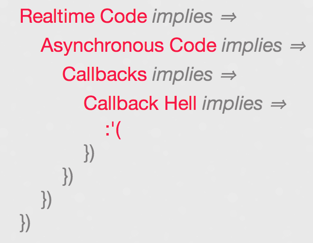
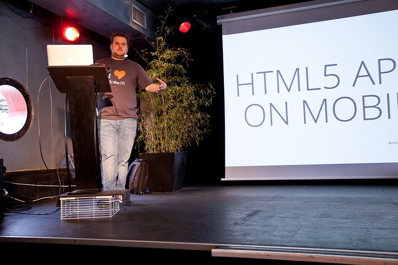

Les 22 et 23 Avril 2013, ont eu lieu, la [Real Time Conférence](https://realtimeconf.eu/) en version Européenne.

Pour cette première édition, les festivités se déroulaient à Lyon, à la Plateforme, une péniche posée sur les quais du Rhône très sympathique.

Passé l'accueil "la Titanic" avec l'orchestre dans le hall d'entrée, nous descendons au sous-sol pour commencer suivre la première journée de conférence, qui s'annonce déjà très chargée.

La vue de la salle de conférence (Crédit : https://twitter.com/frescosecco/status/326302218515017729/photo/1 )

### WebSuckets, par Arnout Kazemier

Première conférence autour des Websockets et des bugs ou difficultés d'implémentation que l'on peut rencontrer.

On parle notamment de Firefox qui en prend pour son grade : Si l'on appuie sur ESC après que la page soit chargée, toutes les connexions sont fermées ... Firefox ne peut pas se connecter non plus sur une Websocket non sécurisée en HTTPS.

Coté Safari Mobile, écrire dans une Websocket fermée plante votre téléphone, et cela arrive quand on revient sur un onglet qui utilisait des Websocket, ou lorsque l'on réouvre un safari précédemment réduit.

Bref, en gros, ca démotive un petit peu sur l'utilisation des Websockets !

Arnout ( [@3rdEden](https://twitter.com/3rdEden) ) déconseille aussi l'utilisation des Websocket sur mobile, et indique de ne les utiliser que quand c'est vraiment nécessaire sur desktop.

Quelques présentations d'outillages :

- [HA Proxy](https://haproxy.1wt.eu/)
- [HTTP-Proxy](https://github.com/nodejitsu/node-http-proxy)
- [Nginx-devel](https://nginx.org/)

Vous pouvez retrouver une battle sur les perfs de ces proxys ici : [github.com/observing/balancerbattle](https://github.com/observing/balancerbattle)

On aborde aussi les problématiques de tirs de charge sur les Websocket avec :

- [wsbench](https://github.com/pgriess/wsbench)
- [websocketbenchmark](https://npmjs.org/package/websocket-benchmark)

Les deux étant, d'après Arnout, incomplets ou dépassés ...

Il a donc développé son propre outil : Thor, "smasher of Websockets" à tester de toute urgence : [https://github.com/observing/thor](https://github.com/observing/thor)

Les frameworks mentionnés pour en simplifier l'implémentation :

- [Faye](https://github.com/faye/faye-websocket-node)
- [Signalr](https://github.com/SignalR/SignalR)
- [xsockets](https://xsockets.net/)
- [sockjs](https://github.com/sockjs)
- [socket.io](https://socket.io/)

Attention aussi aux éléments perturbateurs : firewall, extensions de browsers, antivirus, ou proxy qui peuvent bloquer les ports utilisés par les Websockets.

Bref, une première entrée en matière très complète et intéressante qui couvre vraiment toute la partie moins glamour des Websockets.

Je vous invite aussi à consulter son blog si le sujet vous intéresse : [https://blog.3rd-eden.com/](https://blog.3rd-eden.com/)

(Crédit : https://twitter.com/hintjens/status/326243158109347841/photo/1 )

### SocketStream 0.4, par Owen Barnes

Voici l'un des frameworks pour l'implémentation des Websockets, où son créateur ( [@socketstream](https://twitter.com/socketstream) ) nous partagé ses idées de la conception et de l'utilisation d'un framework : découplage, simplicité, modularité etc.

Le framework est "Transport Agnostics" et peut donc utiliser sockJs, Engine.io, ou Websockets native juste en changeant une simple ligne.

Le FW est basé sur Prism, un module de serveur realtime, lui aussi open-sourcé sur [github.com/socketstream/prism](https://github.com/socketstream/prism).

La 0.4 présentée est en cours de finalisation, et sera disponible prochainement en version finale sur le github [https://github.com/socketstream/](https://github.com/socketstream)

(Crédit : https://www.flickr.com/photos/andyet-photos/8672407195/in/set-72157633306379029/ )

### XSockets, par Magnus Thor

Magnus ( [@dathor](https://twitter.com/dathor) ), nous présente son framework [Xsockets](https://xsockets.net/) pour l'utilisation des Websockets avec une démo "live coding" peut-être intéressante, mais tentée "online" et avec une connexion bien foireuse (comme dans toutes les conférences techniques, non ?) ...

Bref, un peu douloureux à regarder, mais la démo avait l'air d'avoir du potentiel : une application web utilisant WebRPC pour partager en mode Peer To Peer la Webcam de l'utilisateur.

(Crédit : https://www.flickr.com/photos/andyet-photos/8673638532/in/set-72157633306379029/ )

### ZeroMQ as scriptable sockets, par Lourens Naudé (Bear Metal)

Lourens ( [@methodmissing](https://twitter.com/methodmissing)) est l'un des "co-maintainer" de [ZeroMq](https://www.zeromq.org/).

Il nous présente ZeroMq comme une solution de messagerie instantanée pour les apps. Ca n'est pas un serveur, ni un broker, mais une librairie sur la communication et gestion de la concurrence.

On parcourt ensuite les différents types de sockets supportés :

- Req / Rep
- Pub / Sub
- Push / Pull

Voir la présentation ci dessous :

<iframe allowfullscreen="" frameborder="0" height="356" marginheight="0" marginwidth="0" mozallowfullscreen="" scrolling="no" src="https://fr.slideshare.net/slideshow/embed_code/19543723" style="border:1px solid #CCC;border-width:1px 1px 0;margin-bottom:5px" webkitallowfullscreen="" width="427"></iframe>

(Crédit : https://www.flickr.com/photos/andyet-photos/8672695927/in/set-72157633306379029/ )

### WebRTC, par Sam Dutton (Google)

Sam Dutton, Developper Advocate chez Google ( [@sw12](https://twitter.com/sw12) ), qu'on à déja vu/entendu par le passé à la Vélocity Conf (voir précédent CR) nous parle de WebRPC.

On parcourt [les différentes API disponible](https://simpl.info/webrtc/), le support des navigateurs (Chrome, Firefox Nightly et IE Chrome Frame ...).

On découvre ensuite de nombreuses démos très sympa :

- [Ascii Caméra](https://idevelop.ro/ascii-camera/)
- [GetUserMedia](https://simpl.info/getusermedia/)
- [Webcam Toy](https://webcamtoy.com/fr/)
- [Magic Xylophone](https://www.soundstep.com/blog/experiments/jsdetection/)
- [Screen Capture](https://simpl.info/screencapture/) (nécessite Chrome Canary)
- ...

Pour débugger plus facilement, utilisez le [chrome://webrtc-internals](chrome://webrtc-internals)

Libs, apps et frameworks pour XML RPC :

- [easyRTC](https://github.com/priologic/easyrtc) : full stack
- [conversat.io](https://conversat.io/) built with [SimpleWebRTC](https://github.com/henrikjoreteg/SimpleWebRTC)
- [PeerJS](https://peerjs.com/) : API abstraction
- [webRTC.io](https://github.com/webRTC/webRTC.io)
- [Sharefest](https://github.com/peer5/sharefest)

Plus d'infos/codes ou démos sur les slides : [https://samdutton.net/realtime2013/](https://samdutton.net/realtime2013/)

> "WebRTC and HTML5 could enable the same transformation for real-time communications that the original browser did for information." Phil Edholm / Nojitter

(Crédit : https://www.flickr.com/photos/andyet-photos/8673907134/in/set-72157633306379029 )

### Enemy of the state : An introduction to functional reactive programming with Bacon.Js, par Phiilip Roberts (Float)

L'une des présentations les plus intéressantes de la journée par Philip Roberts ( [@philip_roberts](https://twitter.com/philip_roberts) ), CTO et co-founder de [Float](https://floatapp.com/) avec l'introduction Bacon.Js et la "[Functional Reactive Programming](https://stackoverflow.com/questions/1028250/what-is-functional-reactive-programming/1030631#1030631)" en Javascript. Une façon différente de coder pour éviter les "callback hell" notamment.

Le projet répond aussi à une problématique très courante des dév JS, avec l'exemple du "Check Username Availibility" qui lance une requête Ajax chaque KeyPress et dont l'ordre n'est pas maitrisé. (partir de la slide 38)

Bacon.Js est dispo sur Github : [https://github.com/raimohanska/bacon.js](https://github.com/raimohanska/bacon.js)

P.s: la visualisation des streams sur ses slides était très sympa : [https://latentflip.com/bacon-examples/](https://latentflip.com/bacon-examples/)

Plus d'infos sur les slides : [https://latentflip.com/bacon-talk-realtimeconfeu/](https://latentflip.com/bacon-talk-realtimeconfeu/)

(Crédit : https://www.flickr.com/photos/andyet-photos/8673684632/in/set-72157633306379029 )

### Quick Wins with Redis for your website, par Cathering Jung

Catherine Jung ( [@bufferine](https://twitter.com/bufferine) ) travaille sur des services de paris en ligne. Elle explique les problématiques de temps réel qu'elle doit affronter, et comment [Redis](https://redis.io) lui permet de mieux supporter la charge.

Au final, on parle un peu plus de Scala que de Redis, mais tout retour d'expérience est toujours bon prendre.

Retrouvez les slides ici :

[https://docs.google.com/file/d/0By6ZH5wplIR-MzgyOEJCMEkyWmc/edit?usp=sharing ](https://docs.google.com/file/d/0By6ZH5wplIR-MzgyOEJCMEkyWmc/edit?usp=sharing)

(Crédit : https://www.flickr.com/photos/andyet-photos/8673926016/in/set-72157633306379029/ )

### Realtime and Go : Leaving the frameworks behind, par Paddy Foran

Paddy ( [@paddyforan](https://twitter.com/paddyforan) ) nous présente le language Go.

A la question : "What is Go ?" la réponse est :

> A better C, from the guys that didn’t bring you C++

[https://goonaboat.com/](https://goonaboat.com/)

Bref, Go c'est :

- Compiled
- Static typed
- Fast
- Elegant
- Concurrent

Les slides sont disponibles ici : [https://goonaboat.com/](https://goonaboat.com/) et le code de la présentation : [https://github.com/paddyforan/goonaboat](https://github.com/paddyforan/goonaboat)

Plus d'infos sur le langage ici : [https://golang.org/](https://golang.org/) avec un "Tour" qui parait très bien fait : [https://tour.golang.org/#1](https://tour.golang.org/#1)

(Crédit : https://www.flickr.com/photos/andyet-photos/8673939104/in/set-72157633306379029 )

### Cloud Messaging with Node.Js and RabbitMQ, par Alvaro Videla

Alvaro ( [@oldsound](https://twitter.com/old_sound) ) est le co-auteur de "Rabbit Mq In action".

Il a présenté l'intérêt d'utiliser un rabbitMQ dans un projet qui est un fork d'Instagram, mais Real Time : CloudStagram, sur une stack "Cloud Foundy", Rabbit MQ, Redis, MongoDB et SockJS

Notamment le concept de tout gérer via événement (slide 54 ci-dessous).

Bref, pas mal de bonnes idées à retenir et pas mal de projets intéressants sur son github : [https://github.com/videlalvaro](https://github.com/videlalvaro) , comme le [RabbitMqSimulator](https://github.com/RabbitMQSimulator/RabbitMQSimulator) pour présenter clairement le fonctionnement des RabbitMQ

(Crédit : https://www.flickr.com/photos/andyet-photos/8673976982/in/set-72157633306379029/ )

<iframe allowfullscreen="" frameborder="0" height="356" marginheight="0" marginwidth="0" mozallowfullscreen="" scrolling="no" src="https://fr.slideshare.net/slideshow/embed_code/15145124" style="border:1px solid #CCC;border-width:1px 1px 0;margin-bottom:5px" webkitallowfullscreen="" width="427"></iframe>

### Offline first!, par Jan Lehnardt

Jan ( [@janl](https://twitter.com/janl) ) bosse sur CouchDb. [Apache CouchDB](https://couchdb.apache.org/) est une base de données de type document basée sur le format JSON et utilisant Javascript (notamment pour les MapReduce).

Il commence sa présentation par un "You are all doing it wrong !". En réexpliquant que le réseau est toujours rapide, mais que c'est la latence qui est problématique. (Voir [l'excellent article de 2010 de @edasfr](https://calendar.perfplanet.com/2010/know-your-enemy-latency/) sur le sujet toujours aussi pertinent ).

Il faut aujourd'hui travailler Offline First ! (un peu l'équivalent d'un Mobile First coté apps), et prend pas mal d'exemples de bonne ou mauvaise implémentation (de la gestion hors connexion, du passage dans un tunnel, en se moquant de la mauvaise couverture française dans le TGV).

On aborde ensuite les :

- [CouchDB](https://couchdb.apache.org/)
- [PouchDB](https://pouchdb.com/) : Javascript database that syncs!
- [TouchDB](https://touchdb.org/) : CouchDB-compatible embeddable database engine for mobile & desktop apps

et la présentation du framework Hoodie : [https://hood.ie/](https://hood.ie/), basé sur le Offline par défaut.

> "Think of CouchDB as Git for your application data" Jan Lehnardt

(Crédit : https://www.flickr.com/photos/andyet-photos/8672884965/in/set-72157633306379029/ )

### Building Realtime HTML5 apps for Android and Firefox OS, par Anthony Ricaud

Présentation par Anthony Ricaud ( [@rik24d](https://twitter.com/rik24d) ) des fonctionnalités HTML5 implémentées par les équipes de Mozilla, notamment pour connaitre l'état de la batterie, l'orientation, la gestion des apps supportant la sélection de photos par exemple...

Chaque site peut être une apps, à condition de mettre les lignes nécessaires dans un fichier manifest. Beaucoup de débats aussi autour des systèmes fermés de MarketPlace.

Plus d'infos dans les slides ci dessous :

(Crédit : https://www.flickr.com/photos/andyet-photos/8672894401/in/set-72157633306379029 )

<iframe allowfullscreen="" frameborder="0" height="356" marginheight="0" marginwidth="0" mozallowfullscreen="" scrolling="no" src="https://fr.slideshare.net/slideshow/embed_code/14515183" style="border:1px solid #CCC;border-width:1px 1px 0;margin-bottom:5px" webkitallowfullscreen="" width="427"></iframe>

### NodeCopter + Hackathon

Je laisse la parole à Olivier Mansour pour la présentation du NodeCopter :

Romain Huet ( [@romainhuet](https://twitter.com/romainhuet) ) nous a présenté et fait une petite démonstration du pilotage d'un AR Drone avec NodeJs.  
  
  
 Issu du projet nodecopter [https://nodecopter.com](https://nodecopter.com)/, un ensemble de librairies Node.js est disponible et rend le pilotage du drone complètement accessible. Mouvements en vol, stream de la caméra, Romain nous a fait une démonstration fun et captivante de l'engin.

Et faire voler un drone dans un bateau … on avait jamais vu ça !

### Fin de la 1ère journée :

Une première journée très sympathique, bourrée d'idées et d'outils en tout genre. L'organisation est vraiment au poil, et on repart en voulant refaire le monde techniquement :-)

Le compte rendu de la deuxième journée est ici : [https://tech.bedrockstreaming.com/cr-real-time-conference-europe-2013-day-2](/cr-real-time-conference-europe-2013-day-2)

P.s : Merci &Yet pour la plupart des photos présentes ici : [https://www.flickr.com/photos/andyet-photos/sets/72157633306379029/](https://www.flickr.com/photos/andyet-photos/sets/72157633306379029/)

Pour les plus motivés, la conférence été enregistrée en vidéo :

<iframe allowfullscreen="" frameborder="0" height="480" src="https://www.youtube.com/embed/rzXN4Nleayw?wmode=transparent&feature=oembed" width="854"></iframe>
Vidéo de la première journée de la RealTime Conf Europe
