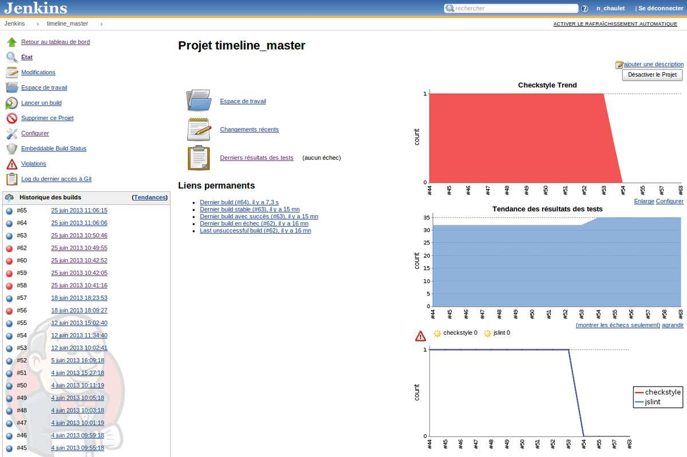

(Source : https://www.flickr.com/photos/dieselbug2007/414348333/)

Chez M6Web, nous avons récemment réecrit un de nos projets [Node.js](https://nodejs.org/).
Le monde Node.js évolue très rapidement et a fait d'énorme progrès dans le domaine de la qualité logicielle.
Nous avons donc decidé de monter en qualité sur nos projets Node.js en utilisant les derniers outils proposés par la communauté.

Pour cela, nous mesurons maintenant différentes métriques sur nos projets Node:

- la qualité du code (checkstyle)
- des tests unitaires et fonctionnels

et tout ceci est lancé par notre serveur d'intégration continue: [Jenkins](https://jenkins-ci.org/).

#### Tests unitaires

Pour tout ce qui est "tests", nous avons choisi le très bon duo :

- [Mocha](https://visionmedia.github.io/mocha/)
- [Chai](https://chaijs.com/)

[Mocha](https://visionmedia.github.io/mocha/) c'est un "test-runner" javascript qui fonctionne aussi bien sur Node que dans un navigateur web. Plus simplement mocha est l'outil qui va contenir nos tests: il va exécuter les tests et afficher les résultats.

[Chai](https://chaijs.com/) est une librairie d'assertion assez complète, permettant plusieurs syntaxe :

- assert.equal(foo, 'raoul');
- foo.should.equal('raoul');
- expect(foo).to.equal('bar');

Ces deux outils fonctionnent aussi bien pour tester vos javascripts Node que front.

Ce duo permet une écriture de test simple et très lisible, dont voici un exemple : 

#### Tests fonctionnels

Pour les tests fonctionnels, nous avons choisi d'utiliser [Supertest](https://github.com/visionmedia/supertest), un package Node.js qui permet de simplifier l'écriture de requête HTTP (*une surcouche au package http disponible dans Node.js)*.

Ci-dessous, un exemple de tests fonctionnels :

#### Checkstyle

En javascript, on peut aussi écrire du code propre et respecter des conventions de codage.  
 Afin de vérifier que notre code respecte les standards en vigueur, nous utilisons [JsHint](https://www.jshint.com/).

#### Intégration continue

Toutes ces métriques sont récoltées grâce à [Jenkins-CI](https://jenkins-ci.org/) à l'aide du fichier Ant suivant :

Le résultat de l'intégration continue dans jenkins.

#### Conclusion

Node.js propose des outils très performants pour la qualité logicielle, et écrire des tests avec le duo "Mocha + Chai" devient vite quelque chose de simple. Et même les développeurs les plus réfractaires aux tests devraient apprécier.

N’hésitez pas à commenter cet article et à indiquez la solution que vous utilisez pour vos projets Node.

