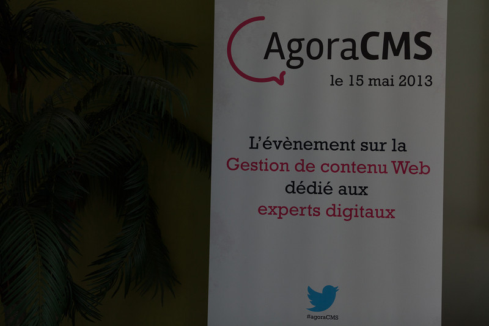
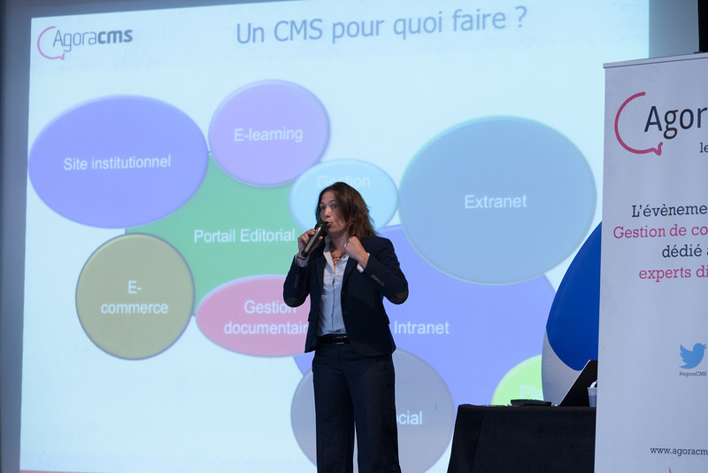
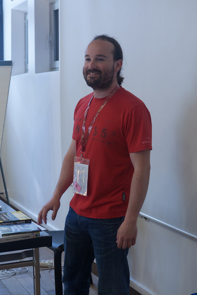
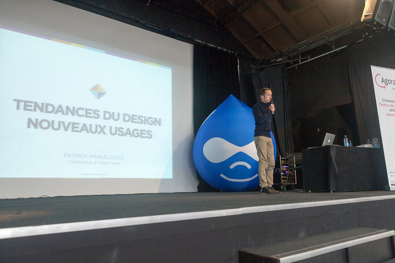
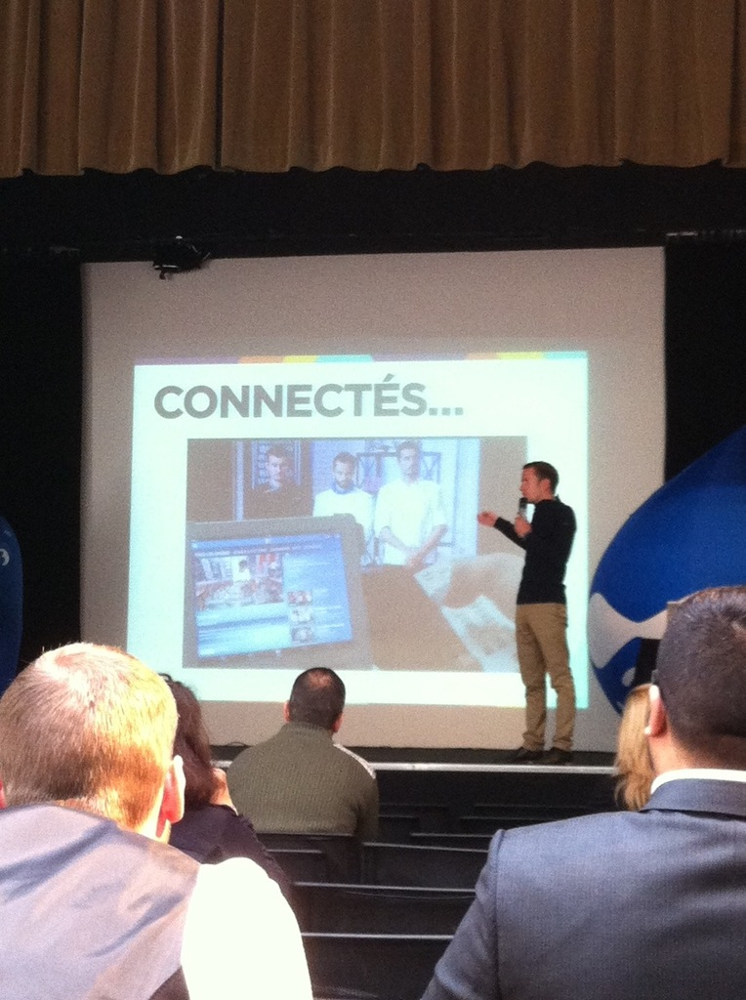
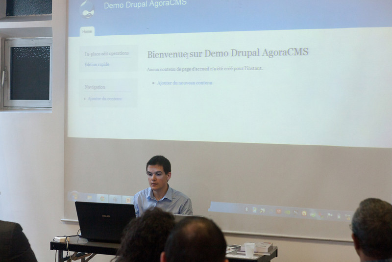
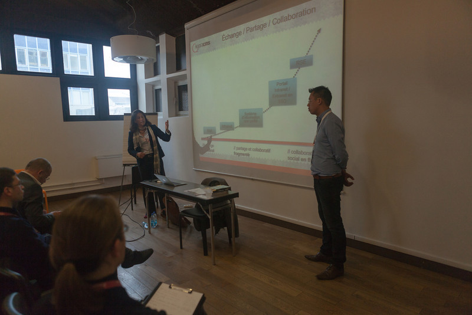
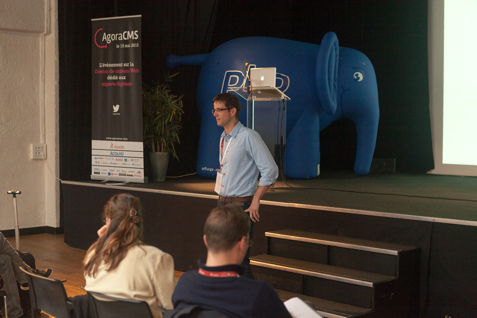
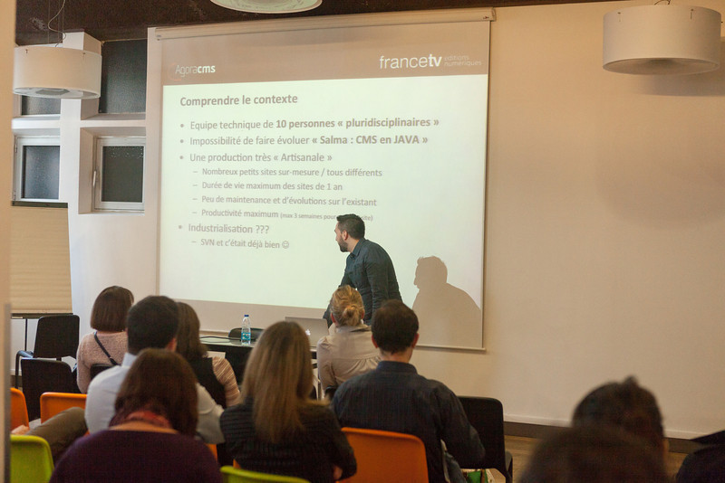
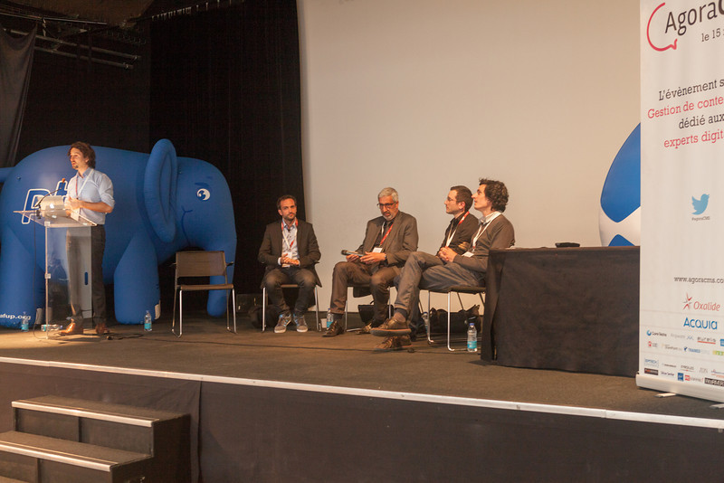

Le 15 mai 2013 avait lieu à Paris, la première édition de l'AgoraCMS, Conférence axée sur les CMS et la gestion de contenu Web.

Cette conférence est organisée par des acteurs importants du milieu, de chez Microsoft, Epitech, Oxalide, Cap Gemini ...

  
 Au rendez-vous, des sujets sur Drupal, Wordpress, le Responsive, les Réseaux Sociaux d'entreprise, et des retours d'expérience de différents acteurs français sur leurs utilisations de CMS public, "home made" ou propriétaire.

### Les CMS - écosystème - état des lieux et tendance, par Marine Soroko (CoreTechs) et Frédéric Bon (Clever Age)

Première conférence, et bonne introduction en la matière avec une présentation de la typologie des CMS.

On nous met en garde sur les "éditeurs de contenu" notamment, ou un CMS ne doit pas permettre de générer du contenu dans les pages. Un CMS de nos jours, doit permettre de gérer un référentiel de contenu, que nos pages doivent pouvoir requêter, sinon nous devenons vite confrontés a des problèmes de ré-usabilité.

Les différents acteurs du marché sont présentés via les fameux "Quadrant magic" qu'on nous annonce finalement très loin de la réalité.

On finit sur une projection du futur des CMS qui devront répondre aux problématiques suivantes :

- multi-canal (support tablette / site tiers etc)
- multi-source
- personnalisation
- intégration e-commerce
- Analyses et statistique
- interactions et e-services

(Source: https://photos.silberman.fr/Other/AgoraCMS/ )

### Votre CMS intelligent grâce l'analyse des logs, par Jérome Renard (Belogik)

Jérome Renard, ancien développeur EzPublish, a monté ces derniers mois une start-up proposant du Log As a Service, avec une solution du nom de Belogik, un peu comparable un [Loggly](https://loggly.com/).  
  
 La conférence présente l'intérêt d'analyser les logs (ici sortant d'un CMS, mais transposable tout site/service web) :

- Incident de production
- Service de la preuve
- SEO
- Performances
- Gestion applicative
- Sécurité
- Développement

Mais aussi la difficulté à traiter des logs de formats différents, pas forcément disposition, quand vous ne maitrisez pas ou peu l'hébergement.  
  
 Pour la recherche dans ses logs, on a des solutions comme [SolR](https://lucene.apache.org/solr/) ou les différents produits basés sur Lucene comme [ElasticSearch](https://www.elasticsearch.org/) (je rajouterais aussi le couple [LogStash](https://logstash.net/) + [Kibana](https://kibana.org/) utilisant aussi ElasticSearch)  
  
 Bref, une excellente présentation, dans la veine de celles que nous avions pu présenter [chez m6web au niveau du Monitoring](/monitoring-applicatif-pourquoi-et-comment), un sujet très complémentaire avec le Logging.  
  
 Pour plus d'informations, [belogik.com](https://www.belogik.com/), ou sur leur compte twitter : [@belogikCom](https://twitter.com/belogikCom).

Sinon vous pouvez consulter les slides sur le lien ci-dessous.

(Source: https://photos.silberman.fr/Other/AgoraCMS/ )

[Votre CMS intelligent grâce l'analyse des logs](https://jrenard.info/talks/agoracms2013/)

[https://jrenard.info/talks/agoracms2013/](https://jrenard.info/talks/agoracms2013/)

### Tendances du design et nouveaux usages, par Patrick Maruejouls (Think Think)

Très bonne présentation sur l’importance du design dans le premier sens du terme : un outil pouvant et devant permettre de servir les intérêts stratégiques d’une entreprise. Il en découle qu’il serait bon de placer le design en amont des décisions et non en aval comme c’est souvent le cas.  
  
  
 De ses nombreuses expériences, nous pouvons retenir qu’une des plus importantes tendances pour les années venir est l'adaptation du design l’utilisateur. Ainsi, une grande enseigne de prêt-à-porter masculin a inséré une puce RFID dans l’étiquette de ses vêtements pour que l’ambiance des cabines d’essayage s’adapte aux vêtements essayés (ex: une petite musique des îles se déclenche lorsque le client essaye une chemise hawaïenne).  
  
  
 De même, cette tendance d’adaptation du design l’utilisateur pourra se voir magnifiée par la TV connectée et le second écran.

Le second écran chez M6Web

### Les meilleurs thèmes et modules Drupal, par Dorian Marchan (Kernel 42) et Romain Jarraud (Trained People)

  
  
 Petite introduction [Drupal](https://drupal.org/), présenté comme un CMS, mais surtout un CMF (Content Management Framework), avec la présentation de quelques modules très intéressants pour des développeurs ou pour réaliser son "Usine à Site".

  
 On retiendra [GCC](https://drupal.org/project/gcc) dont une démo très intéressante sera faite, [Drupal Commerce](https://www.drupalcommerce.org/), étant une distribution de Drupal avec un assemblage de modules et personnalisation pour orienter son drupal vers le e-commerce, mais aussi la présentation d'un des thèmes les plus évolués de Drupal : [Omega](https://drupal.org/project/omega), thème ultra complet, Responsive avec un back-office assez puissant.

(Source: https://photos.silberman.fr/Other/AgoraCMS/ )

<iframe frameborder="0" src="https://docs.google.com/gview?url=https://www.agoracms.com/wp-content/uploads/2013/05/meilleurs-modules-themes-drupal-agoracms.pdf&embedded=true" style="width:518px; height:500px;"></iframe>

### Les Réseaux sociaux d'entreprise, par Edouard Ly (Oxalide) et Marine Soroko (Core Techs)

  
 Terme la mode depuis ces dernières années, les RSE commencent envahir les entreprises.  
 Présentation (sans démo ou screenshot malheureusement), des différents acteurs du marché (très peu d'acteurs open source d'ailleurs :( ) :

- [Jive](https://www.jivesoftware.com/) (leader du marché)
- [BlueKiwi](https://www.bluekiwi-software.com/fr/)
- [Telligent](https://telligent.com/)
- [BuddyPress](https://fr.buddypress.org/) : extension Wordpress
- [Yammer](https://www.yammer.com/)
- [Elgg](https://elgg.org/)
- [Chatter](https://www.chatter.com/fr/)
- [Sharepoint](https://office.microsoft.com/fr-fr/sharepoint/)
- [Liferay](https://www.liferay.com/fr)
- [Drupal commons](https://drupal.org/project/commons)
- …

(Source: https://photos.silberman.fr/Other/AgoraCMS/ )

<iframe frameborder="0" src="https://docs.google.com/gview?url=https://www.agoracms.com/wp-content/uploads/2013/05/reseaux-sociaux-entreprise-etat-lieux-tendances-agoracms.pdf&embedded=true" style="width:518px; height:500px;"></iframe>

### Responsive design : un site mobile en moins d'une heure, par Raphael Goetter (AlsaCreations)

  
  
 Raphael Gotter ( [@goetter](https://twitter.com/goetter)), le créateur [d'AlsaCréations](https://www.alsacreations.com/), est complètement incontournable pour tout ce qui touche l'intégration HTML, ou le RWD (Responsive Web Design) dans la communauté francophone, nous explique les approches à avoir pour réaliser un site RWD.  
 Notamment que le Mobile First, paraît toujours être la bonne approche, ainsi qu'un rappel sur le fait que le RWD doit être pensé et prévu en amont.  
  
 Raphael nous démontre aussi que son titre, et la réalisation d'un site RWD en moins d'une heure est infaisable. En prenant l'exemple du site d'[Agora CMS](https://www.agoracms.com/), et en nous présentant l'approche pour transformer sa HP en Responsive.  
 Plus de 15 jours de boulot au final, et des slides très intéressantes découvrir ci-dessous, remplies d'astuces, de checklists, et autres notions à bien comprendre avant de s'intéresser et de se lancer dans le RWD :

- Comprendre les surfaces d'affichage
- Connaître les Media Queries css 3
- le Box-sizing
- Halte aux débordements

Je vous invite à tester sur un mobile [Mobitest.me](https://mobitest.me/) pour bien comprendre la différence entre viewport, largeur en pixel réelle, ...  
  
 Présentation de la propriété hyphens aussi pour [gérer les débordements de texte](https://www.alsacreations.com/tuto/lire/1038-gerer-debordement-contenu-css.html), coupler avec la propriété word-wrap, le framework / css de base [Knacss.com](https://www.knacss.com/), les tailles de typo en "rem".  
  
 Bref, conférence très riche, drôle et a creuser impérativement pour tout ceux qui travaillent de près ou de loin sur ces problématiques.  
  
 Compte rendu par Raphael lui même : [https://blog.goetter.fr/post/50567713227/conference-un-site-responsive-en-une-heure](https://blog.goetter.fr/post/50567713227/conference-un-site-responsive-en-une-heure) avec le résultat voir ici : [https://kiwi.gg/rg/agora/](https://kiwi.gg/rg/agora/)

Et les slides ci-dessous :

<iframe allowfullscreen="" frameborder="0" height="356" marginheight="0" marginwidth="0" mozallowfullscreen="" scrolling="no" src="https://fr.slideshare.net/slideshow/embed_code/21238783" style="border:1px solid #CCC;border-width:1px 1px 0;margin-bottom:5px" webkitallowfullscreen="" width="427"></iframe>

### 20 minutes: gérer le multi-canal, apps, web, devices, par Arnaud Limbourg (20 minutes)

  
  
 Arnaud ( [@arnaudlimbourg](https://twitter.com/arnaudlimbourg)) a rapidement expliqué la stratégie mise en place par [20minutes](https://www.20minutes.fr/) pour permettre le multi-support : centralisation des données dans un référentiel accessible via une API permettant aux différents devices de se fournir en données, chacun leur manière.  
  
 Il a ensuite donné quelques conseils afin de fournir une bonne API, en précisant qu’il était très difficile d’en réaliser une bonne :

- architecture REST en HTTP,
- faibles temps de réponse,
- bon monitoring,
- facilité d’apprentissage et d’utilisation,
- concepts simples,
- documentation.

  
 Enfin, Arnaud explique qu’il n’y a pas de solution miracle entre l’internalisation ou l’externalisation des développements (l’app Android a été développée en interne alors que le développement de l’app iOS a été externalisée).  
 De la même manière, le choix entre le HTML5 et le code natif dépends des besoins et des ressources.

(Source: https://photos.silberman.fr/Other/AgoraCMS/ )

### Retour d'expérience : France Télévisions, par Léo Poiroux (France Télévisions)

  
  
  
 Nos confrères de chez France Télévisions nous présentent leur retour d'expérience sur leurs usines site, avec au micro, Léo ( [@Leo_Px](https://twitter.com/Leo_Px)).  
  
 Au départ, sur [Spip](https://www.spip.net/), il nous explique pourquoi ils ont migré (douloureusement au début) sur Drupal, et qu'est ce que cela leur a apporté.  
  
 Une conférence très transparente, drôle, agréable et intéressante.  
  
 L'avenir de leur côté tend vers une transformation de l'usine à site, vers une "usine à interface" notamment pour gérer les multi-écrans, et une ouverture de leurs api/services vers de l'openApi, OpenData.  
  
 FT c'est une très grosse DT (une centaine de personnes), une équipe d'expert transverse surnommée SWAT (composée d'Expert frontend JS/WebPerf, Expert Archi/Varnish, Expert Drupal, et de deux Coach Agile).

  
 D'autres excellentes idées comme leurs Dojo et Safari.  
 Les Dojo sont des sessions d'une heure où les développeurs se relaient toutes les 5 minutes sur un même code, pour avancer un développement..  
 Les safaris sont une sorte de "Vis ma vie" avec une journée en immersion dans une autre équipe de développement par exemple ou dans une équipe de journaliste utilisant l'un des sites qu'ils ont développés.

> Pourquoi Drupal ?   
>  "La maison blanche utilise Drupal"

(Source: https://photos.silberman.fr/Other/AgoraCMS/ )

<iframe frameborder="0" src="https://docs.google.com/gview?url=https://www.agoracms.com/wp-content/uploads/2013/05/retour-experience-france-television-cms-agoracms.pdf&embedded=true" style="width:718px; height:500px;"></iframe>

### Table Ronde. Quel modèle choisir : créer mon propre CMS ? utiliser un CMS existant ? OpenSource / propriétaire ?

  
  
 La journée se termine sur une table ronde composée de différents responsables techniques :

- Olivier Grange Labat – [@ogrange](https://twitter.com/ogrange) DT @ Le Monde interactif : Olivier est en charge de la technique de Lemonde.fr. Il a fait le choix de développer son propre outil de gestion de contenu
- Damien Cirotteau – [@cirotix](https://twitter.com/cirotix) : Damien est CTO chez Rue89 qui utilise et est spécialisé en Drupal.
- [Olivier Fouqueau](https://fr.linkedin.com/pub/olivier-fouqueau/38/132/575) – DSI de la mairie d’Aulnay-sous-bois : Olivier est en charge des Systèmes d’informations et de l’innovation la Mairie d’Aulnay-sous-bois. Il fait le choix du CMS Ametys.
- Galdric Pons – [@hebiflux](https://twitter.com/hebiflux) Chef de projet digital @ BNP Paribas : Galdric est Chef de projet digital au pôle innovation de BNP Paribas ou il a mis en place une usine site avec WordPress.

  
  
 Chacun des participants au cours d'une interview animée par Cyril Pierre de Geyer ( [@cyrilpdg](https://twitter.com/cyrilpdg)) , va expliquer son choix de CMS, les avantages et les inconvénients et donner de précieux conseils aux personnes dans la même situation.

(Source: https://photos.silberman.fr/Other/AgoraCMS/ )

### Conclusion

  
  
 Une journée haute en couleur, avec de très bonnes conférences et des retours d'XP toujours aussi intéressants.  
 On salue une organisation impeccable et le tout pour un prix très accessible (20€).

Ce CR ne rend-compte finalement que d'une mince partie des conférences (4 conférences en parallèle pour cause), mais vous pouvez retrouver d'autres slides sur le [site officiel de l'évenement](https://www.agoracms.com/).

N'hésitez pas commenter ce CR si vous avez des remarques ;-)

P.s: Merci [@nsilberman](https://twitter.com/nsilberman) pour les photos que vous pouvez retrouver en intégralité ici : [https://photos.silberman.fr/Other/AgoraCMS/](https://photos.silberman.fr/Other/AgoraCMS/)
