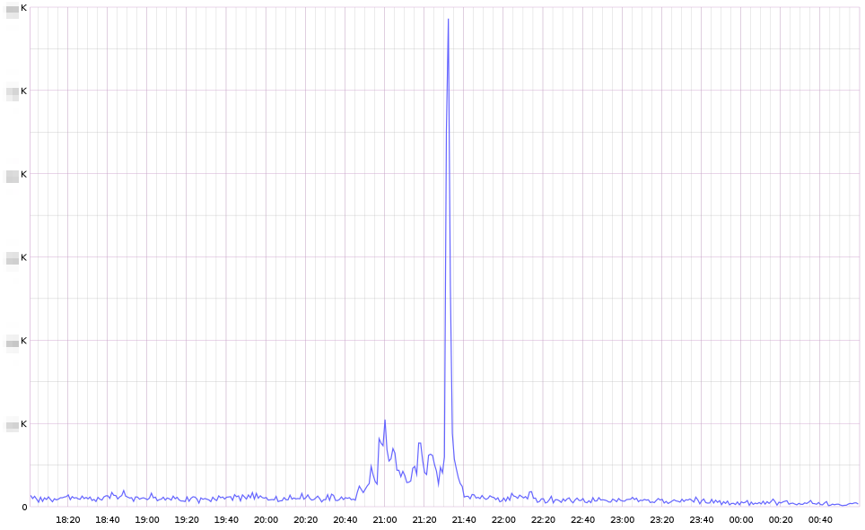

Notre système de vote est utilisé d'une part pour gérer l'ensemble des questions et des réponses associées utilisées dans nos [quizz](https://www.m6.fr/emission-top_chef/jeux.html) et d'autre part pour récolter le nombre de votes des internautes lors des [jeux concours](https://www.m6.fr/jeux-concours.html).

Actuellement, le trafic généré par cette fonctionnalité varie entre quelques votes par minute la nuit à quelques dizaines de votes par seconde lors des premières parties de soirée.

## Historique

Comme souvent, les besoins ont régulièrement évolué depuis la mise en place initiale du système en 2009, faisant parfois prendre des chemins tortueux à l'implémentation technique. Au fil des demandes, notre système a par exemple dû stocker ses données dans nos forums pour une fonctionnalité qui a ensuite été rapidement abandonnée.

L'année 2012 a vu l'arrivée du *second écran* : à l'aide de l'application gratuite adéquate, les périphériques mobiles peuvent désormais se synchroniser avec l'émission en cours de visionnage, en direct ou en différé, sur la TV ou sur le web (la synchronisation se fait par la bande son). Cette synchronisation nous permet de *pusher* instantanément sur les périphériques mobiles du contenu adapté à ce que le téléspectateur regarde : le détail de la recette que le cuisinier prépare dans Top Chef ou un sondage concernant la dernière trouvaille linguistique d'un ch'tit face à sa ch'tite.

Le *second écran* s'annonçait alors comme une source importante de trafic supplémentaire pour notre système de vote. Effectivement, en plus du trafic historique généré par les sites web, nous allions aussi recevoir tous les votes provenant des périphériques mobiles.

Ce nouveau trafic a une saisonnalité très marquée : il est principalement présent en début de soirée et reste très dépendant du programme diffusé et de la contribution apportée.

## Problématique

La principale problématique venait de l'architecture des bases de données MySQL. Étant fortement couplées sur l'ensemble de la plateforme, la moindre défaillance de l'une d'elles, due à une surcharge sur un sondage, risquait de pénaliser les internautes de tous nos autres sites (un sondage du *second écran* pouvait donc impacter l'expérience utilisateur de [Clubic](https://www.clubic.com/)).

Le code était aussi fortement couplé entre nos différentes applications : l'action PHP d'un vote était exécutée sur la même plateforme que notre BO permettant à tous nos web services de fonctionner ainsi qu'aux contributeurs d'ajouter du contenu. Une surchage sur les votes aurait donc pu entrainer des perturbations sur le fonctionnement global du site [m6.fr](https://www.m6.fr/) et de ses web services, donc de beaucoup de produits par extension.

Pour résumer, l'imbrication du code et des bases de données dans l'usine logiciel ne permettait pas de calibrer le système de vote pour qu'il puisse recevoir la charge attendue par le *second écran*.

C'est donc début 2013 que [Kenny Dits](https://twitter.com/kenny_dee) m'a contacté pour que nous trouvions une solution permettant de découpler le système de vote tout en faisant évoluer son architecture interne afin qu'il puisse facilement s'adapter à la charge inconstante du *second écran*.

## Solution

Nous avons alors conçu un nouveau service dédié uniquement à la gestion des questions, réponses et votes des utilisateurs. Ce nouveau *service Polls* est autonome, ce qui nous permet de le découpler complètement de notre usine logicielle avec laquelle il communique via une API REST.

Concernant le stockage des données, nous avons simplement choisi un moteur très performant qui supporterait la charge sur une seule machine bien calibrée. Cela nous évitait alors les problématiques complexes de *clustering*. Mais nous devions tout de même stocker quelques informations relationnelles : il fallait donc avoir accès à quelques primitives nous permettant d'émuler les relations minimum entre nos données. [Redis](https://redis.io/) s'est donc imposé comme la [solution adéquate](https://stackoverflow.com/questions/10558465/memcache-vs-redis). Cela reste malgré tout une solution théoriquement insatisfaisante, car non réellement scalable. Mais en pratique, les très bonnes performances de Redis permettent de répondre à (bien plus que) nos attentes.

Le code se trouve, pour sa part, complètement isolé sur son propre serveur.
Comme ce service est complètement [stateless](https://en.wikipedia.org/wiki/Stateless_protocol) et que notre base de donnée est centralisée et suffisamment performante, nous pouvons donc facilement ajouter ou supprimer des serveurs web selon la charge attendue : on peut dire qu'en pratique le service Polls est [scalable horizontalement](https://fr.wikipedia.org/wiki/Exigences_d'architecture_technique#Scalabilit.C3.A9).

Lorsque l'architecture mise en place permet de répartir la charge sur un nombre variable de machines, le contrat est rempli : ce n'est plus qu'une question d'argent pour supporter n'importe quelle charge. Et comme tout le monde le sait : l'argent n'est pas un problème, c'est une solution.

## Développement

Le service Polls a été développé en PHP avec [Symfony](https://symfony.com/) et le [FOSRestBundle](https://github.com/FriendsOfSymfony/FOSRestBundle#fosrestbundle). Nous avons d'abord suivi certaines [références](https://williamdurand.fr/2012/08/02/rest-apis-with-symfony2-the-right-way/), puis nous avons ensuite développé un micro ORM maison pour faire persister nos données dans Redis et enfin [nous avons monitoré](/2014/01/28/how-we-use-statsd) tous ce que l'on pouvait à l'aide de notre [bundle dédié](https://github.com/BedrockStreaming/StatsdBundle).

Une attention toute particulière a été portée à la qualité avec des tests unitaires couvrant un maximum de code et des [tests fonctionnels](/redismock-qui-a-bouchonne-mon-redis) couvrant la plupart des cas d'utilisation des clients. Les nombreuses mises en production journalières pendant la phase d'optimisation ont ainsi été grandement facilitées, notamment grâce à la sérénité apportée par l'intégration continue.

## Mise en production

L'intégration de ce nouveau service Polls a cependant été bien plus longue que son développement. Nous l'avons d'abord mis en production en doublon de l'ancien système : toutes les écritures étaient faites sur les deux systèmes, mais l'ancien était encore la référence lors de la lecture des résultats par les clients.

Puis après deux semaines, lorsque nous avons validé l'exacte corrélation entre les deux courbes du nombre de votes par minute à l'aide de [Graphite](https://graphite.wikidot.com/), nous avons alors changé les clients pour qu'ils viennent lire les résultats sur le service Polls.

Encore deux semaines plus tard, lorsque tout était validé et que nous avions développé et exécuté un script d'import de l'historique, nous avons débranché l'ancien système. 

L'intégration a donc été au moins trois fois plus longue, et donc couteuse, que le développement du service en lui-même.

## Optimisation

La première optimisation est simplement conceptuelle : nous avons concentré la criticité sur une seule route, celle qui est utilisée par chaque client pour voter. Il est ainsi plus simple de mesurer et donc d'améliorer les performances du service Polls. Cette route est critique parce qu'elle est utilisée par tous les clients, qu'elle ne peut pas être cachée et qu'il faut écrire des données en base lors de chaque appel.

Il existait plusieurs pistes d'optimisation connues (système de queue, node.js, etc.) mais dans une optique [KISS](https://fr.wikipedia.org/wiki/Principe_KISS), nous avons d'abord opté pour l'utilisation des technologies en place pour ensuite interpréter les résultats récupérés lors des tests de charge et s'adapter si besoin.

Dans un premier temps, nous avons légèrement ajusté notre modèle de données pour limiter le nombre d'action à réaliser sur la base de données : nous avons seulement deux instructions Redis de [complexité constante O(1)](https://fr.wikipedia.org/wiki/Analyse_de_la_complexit%C3%A9_des_algorithmes#Complexit.C3.A9.2C_comparatif) à réaliser pour chaque vote. Puis nous avons utilisé les transactions pour grouper ces deux instructions et éviter la latence d'une connexion supplémentaire vers notre serveur Redis.

Nous avons enfin supprimé la vérification de deux contraintes d'intégrité sans importance. Le code retour en cas d'erreur est juste un peu moins cohérent (`400` au lieu de `422`) mais cela n'impacte ni l'intégrité des votes ni la sécurité du service.

Afin de savoir si nous n'avions pas complètement pris une mauvaise direction dans notre utilisation de Symfony, nous avons alors fait appel à [Alexandre Salomé](https://twitter.com/alexandresalome), consultant SensioLabs, pour auditer notre code.

Lors de cette journée, durant laquelle nous avons beaucoup appris, nous avons simplement désactivé tous les bundles que nous n'utilisions pas réellement en production : principalement Twig. Cela a occasionné une légère modification de notre code car le FOSRestBundle nécessite Twig pour afficher les erreurs même lorsque celles-ci sont en JSON.

Une fois cette modification apportée, nous avons gagné les ultimes millisecondes nous permettant de passer sous la barre symbolique des 10ms de temps de réponse sur notre route critique.

Vous remarquerez que nous avons d'abord déployé le système en production avant de chercher à l'optimiser : nous pouvions ainsi mesurer en temps réel l'impact de nos développements sur une multitude d'indicateurs dont le temps de réponse.

## Mise en pratique

Le service Polls a facilement tenu la charge pour la première émission mettant en avant le *second écran* : un épisode de Hawaï 5-0 durant lequel les internautes pouvaient [choisir le coupable](https://www.programme-tv.net/news/series-tv/39233-hawaii-5-0-m6-ce-soir-vous-decidez-fin-episode/) avec un sondage (sur leur téléphone, tablette ou PC).

Plus précisément, nous sommes montés à 150 requêtes par secondes (ce qui est évidemment bien moins que nos tests de charge), mais nous savons que nous pourrons maintenant nous adapter très simplement à une charge beaucoup plus forte en ajoutant des serveurs web. Notamment lors d'émissions faisant grandement appel au *second écran*.

Dans le pire des cas, si le service Polls devient indisponible, aucune autre partie de notre infrastructure ne sera compromise.

## Leçons

Au cours du développement, de la mise en production et de la maintenance de ce service, j'ai appris plusieurs choses que j'essaierai de ne pas oublier trop vite :

* Yes we can! Il est possible de combler petit à petit [la dette technique](https://blog.octo.com/maitriser-sa-dette-technique), mais uniquement si c'est [la volonté des décideurs](https://twitter.com/mbohlende/status/431446680874258433),
* la sérénité apportée par les tests automatisés est sans égale pour le confort de développement,
* Redis est très performant.

Ha ? Attendez ! On me dit dans l'oreillette que certains doutaient encore qu'il était possible de faire du code performant avec un framework *full stack* comme Symfony.

Pas moi :-)
