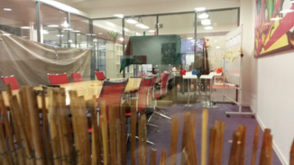
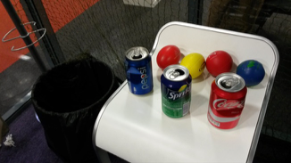
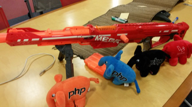

Depuis quelques années les équipes d’M6Web se sont organisées autour des méthodes agiles. Scrum, Kanban, Lean, méthodes adaptées, nous nous efforçons de toujours garder en tête l’amélioration continue et le fun spirit au coeur du travail de nos équipes. 

Au delà des rituels “classiques”, l’équipe des scrum master cherche de temps en temps à thématiser et casser les routines en créant des jeux autour de l’agilité. 

Nous souhaitons aujourd’hui au travers de ce blog, partager avec vous ces jeux et surtout vous permettre de les reproduire. Ainsi chaque jeu s’accompagnera de règles et d’un « kit » vous permettant d’imprimer le matériel nécessaire au bon déroulement. 

Au menu de ce premier jeu, nous avions choisi de profiter de l’arrivée de [l’émission “Garde à vous”](https://www.6play.fr/garde-a-vous-p_5614) sur M6 afin de proposer une rétrospective pas comme les autres. 

* Nom : La rétro Garde à vous ! 
* Type : Rétrospective d’équipe.
* Durée : 1 heure. 

# PunchLine : 

Votre équipe est sélectionnée pour une retro spéciale. Un défi difficile qui les mènera à dépasser leur limite. 
Épreuve physique et mentale, il y en aura pour tous. Mais surtout c’est en groupe qu’ils réussiront les épreuves. :) 

# Objectifs :

* Changer de la rétro classique : 2 activités sur les 4 sont des mini-jeux.
* Créer du team building : Le 1er jeu demande confiance et cohésion entre les membres de son équipe. Et accessoirement c’est très fun !
* Stimuler les équipes entre-elles autour d’une compétition sympa (nos 5 équipes ont fait la même rétro lors de la rotation). 
* Garder à l’esprit l’amélioration continue au travers des 2 activités post-it. 

# Préparation / matériel : 

* Vous trouverez ici [un lien vers le kit](https://drive.google.com/file/d/0B3bDuFzbbA8nNG9rUXhuaDlBdWs/view?usp=sharing) de la rétro garde à vous. 
* Créer un décor : Mettez vos équipes dans l'ambiance et poussez l’aspect « jeux de rôle ». 
*Exemple : filet à chat, bâche de tente Quechua, palissade, affiche militaire, etc..*
* Costume de l'animateur : pantalon/veste militaire (demander autour de vous), cravache, casque avec lunette de ski, chemise beige, etc..
* Pour l’étape #1 : Post-it, feutres pour écrire, l’affiche paperboard « Motivation ». 
* Pour l'étape #2 : 4 bandanas ou serviettes pour bander les yeux + gilets fluos de sécurité + un chronomètre + un parcours dans vos bureaux.
* Pour l’étape #3 : Post-it, feutres pour écrire, l’affiche paperboard « 4 thèmes d’amélioration ». 
* Pour l’étape #4 : 2 Nerfs, 4 canettes vides, 4 peluches (ou autre), 4 balles en mousse, une poubelle, tapis de sol.
* La feuille des scores. 

# Le déroulement : 

Volontairement nous n’avons donné aucun détail à nos équipes sur cette rétro. 
Quelques jours avant, nous leur avons envoyé la vidéo bande annonce sous forme de « convocation ». 
Le jour même, ils ont eu la surprise de voir la salle décorée et leur scrum master déguisé. 

## Étape.1 - Motivation - 10 minutes : 

Texte possible : « Bonjour équipe [nom_équipe]. Je suis le sergent “Badass”, on vous a placé chez moi aujourd’hui pour évaluer votre trouillomètre. 

> « Cette rétro va se dérouler en 4 étapes. Comme je suis sympa, je ne vous dis rien. ça permettra de voir votre capacité d’adaptation.» 

> «  Sachez que nous aurons 2 épreuves physiques et 2 épreuves mentales. Lors des épreuves physiques, nous noterons vos scores afin de  déterminer quelle est la meilleure équipe du plateau. » 

> «  êtes vous prêts ? » 
                 
Paperboard #1 : La motivation    

> « On va commencer doucement. Prenez vos post-it et vos crayons.» 

> «  Dites moi ce qui vous motive à vous levez le matin ? pourquoi vous aimez venir bosser ? » 

> «  Si un aspect du boulot vous ennuie, vous cloue au lit, dites le également.» 

> «  TimeBox : 2 minutes. » 

Au bout des 2 minutes : chacun passe au paperboard coller ses post-it et les expliquer. 

Objectif du scrum master : 

* récupérer les aspects positifs de l’environnement, du travail de vos équipes : ce sont des bases solides à avoir en tête et à maintenir dans le groupe.
* récupérer les aspects négatifs : ça peut être la cantine, la distance des locaux, etc.. même si certains post-it sont difficilement ‘améliorables’ c’est toujours bien de l’exprimer.

## Étape.2  - En avant, Marche ! - 10 minutes

### Règle du jeu :

* On se met par 2. Si vous êtes un nombre impair, explication plus bas.
* L’une des 2 personnes va avoir les yeux bandés. On l’équipe d’un gilet fluo de sécurité afin d’éviter de lui rentrer dedans… :p
* L’autre personne devra le guider en utilisant les mots : « avance / recule / à droite / à gauche ». 
* Il est interdit de toucher son coéquipier pendant la course.
* Vous êtes chronométrés. Un classement général sera fait avec les autres équipes pour déterminer les plus rapides.

* Faites mettre le bandana ou la serviette. Prenez les guides et montrez leur le parcours.
* Faites aligner les paires devant la ligne de départ.
* 3, 2, 1, Partez. N'hésitez pas à les encourager ou à parler fort afin de les stresser ^^. 

_Version à 3 : vous aurez 1 guide et 2 personnes avec les yeux bandés. Les 2 yeux bandés sont en file indienne._

_La personne derrière pose ses mains sur les épaules sur la personne de devant. Bonne chance :p_

Feuille des scores : Notez le temps de chaque paires.  

## Étape.3 - les 4 thèmes - 20/25 minutes

### Règles : 

* Nous avons 4 thèmes affichés au paperboard. 
* Pour chaque thème, vous pouvez écrire au maximum 2 post-it positifs & 2 post-it négatifs

Nous limitons le nombre de post-it pour une question de temps. Libre à vous d'ajuster.

### Les thèmes sont : 

* Communication - Dialogue dans l’équipe, avec le PO, les clients finaux, utilisation des mails, etc… 
* Les outils - De développement, méthode agile, communication, de déploiement/MEP, de testing, etc..
* Réactivité - Lors d’une demande PO, d’un incident de production, phase de cadrage avec PO, etc...
* Leadership - Présence de votre Lead-Dev / Responsable R&D, écoute de vos managers, méthode d’organisation dans le travail, etc...

Nous laissons 7 minutes d’écriture de post-it (à ajuster selon vous).
Au bout des 7 minutes : chacun passe au paperboard coller ses post-it et les expliquer. 

### Objectif du scrum master : 

* Récupérer des axes d’amélioration de l’équipe. 
* Conclure sur les aspects positifs et définir les post-it négatifs sur lesquels on cherche à agir en 1er. 
* Éviter de définir les actions à mettre en oeuvre pour les post-it négatifs. Faites le en dehors sinon ça prendra trop de temps et cassera la dynamique.

## Étape.4 - Duck Hunt - 15 minutes

Règles : 3 stands sont proposés

* Chacun choisit un stand. Les participants peuvent faire un essai rapide si c’est demandé. 
* Nous vous laissons ajuster la distance entre les cibles et le joueur.
* Stand 1 - Le grenadier : 4 grenades (balle en mousse), une poubelle => lancer les grenades dans la poubelle. 4 essais, 1 réussite = 1 point
* Stand 2 - le chasseur : 4 canettes, un nerf => toucher les canettes. 4 essais, 1 réussite = 1 point
* Stand 3 - le sniper : 4 peluches éléphant PHP, un gros nerf => mode allongé dans les bois, 4 essais, 1 réussite = 1 point

Ceci afin de répartir les personnes sur plusieurs stands. 

Feuille des scores : Notez le score de chacun.

# Conclusion :

Afficher le tableau des scores et féliciter tout le monde. 
Next step : 

 *  Les résultats des équipes seront affichés le lendemain / fin de journée / autres (à vous de voir)
 *  Les post-it négatifs de l’étape 1 et 3 seront pris en compte par les scrum master qui travailleront avec les personnes adéquates pour continuer à s’améliorer. Vous pouvez ajouter à votre DSK (Do, Store, Keep) certaines actions.

N’hésitez pas à nous envoyer vos feedbacks sur ce jeu. 

Force et Scrum !
