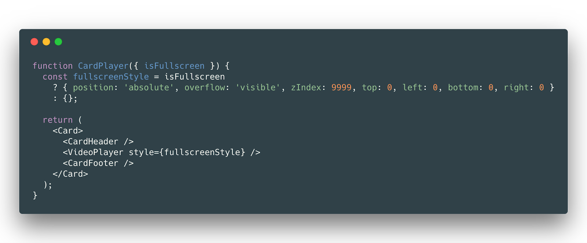
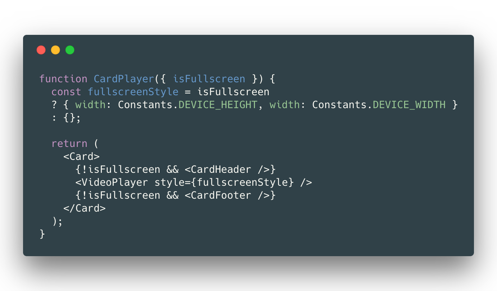
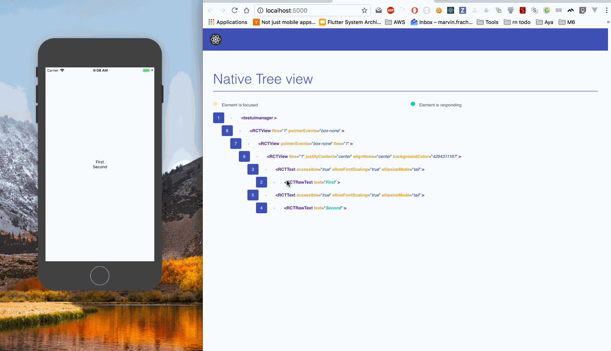
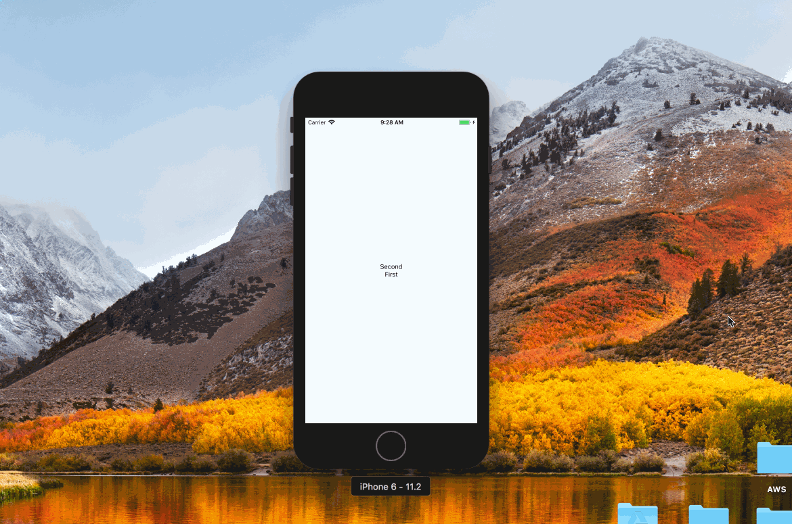

This story introduces a declarative native side portal implementation module called rn-reparentable.

My teammate ([Laetitia BONANNI](https://medium.com/@LaetitiaBonanni)) and I are working on a React Native module embedded in the [6Play application](https://itunes.apple.com/fr/app/6play/id369692259?mt=8) that aims to provide best moments of different TV shows from the [M6](https://www.6play.fr/m6) channel.

The module, called Refresh, is a list of videos that are playing while the user is scrolling. It also provides a “theater mode” which is a way to create an immersive user experience by obscuring the cards that are not focused:


As any other video application, it provides a fullscreen experience to the user by rotating the device.

At the time I’m writing this article, creating such a thing using React Native is a pain. Here’s the story why.

## Creating a fullscreen, the web developer way

While being a web developer, we usually work with positioning to display something over the rest (like a popup for example).

Dealing with React Native and its style APIs (which really looks like the web one), we thought that it would be super-easy to simulate the exact same behaviour.

That’s why our main idea was to manage the fullscreen mode by adding a style that takes the screen size and an absolute position. Thus, the video would have followed the device edges while rotating:



### React Native styles are not the same as the web ones

The idea of creating an almost equivalent API as the web one is really good for the learning curve of React Native. It is a real asset when you want to create simple user interfaces.

But there is a drawback. This approach makes us want to get **the exact same result** as we would have on the web.

In our case, the use of absolute positioning was sadly not working. In fact, it is written in the [React Native documentation](https://facebook.github.io/react-native/docs/layout-props.html#position):

```
Position

position in React Native is similar to regular CSS, but everything is set to relative by default, so absolute positioning is always just relative to the parent.

If you want to position a child using specific numbers of logical pixels relative to its parent, set the child to have absolute position.

If you want to position a child relative to something that is not its parent, just don’t use styles for that. Use the component tree.

See https://github.com/facebook/yoga for more details on how position differs between React Native and CSS.
```

The fact that an element is always positioned relatively to its parent has been a problem for us since our player component is part of the list.

### Overflow and android are not friends

And even if we would have found a way (we could have cheated by calculating negative values, relative to the parent, in order to stick to the edges of the device), we would have met other problems such as the fact the equivalent of overflow prop doesn’t work on Android.

_There are actually multiple opened issues concerning this problem. [Grabbou](https://github.com/grabbou) gave a shot on this one [#7229](https://github.com/facebook/react-native/issues/7229):_

![Mike GRABOWSKI on 2017-11-27 concerning overflow on Android]"./grabowski.png)

## Let’s make a fullscreen, the native way

Hopefully, we are working with native developers, from both platforms. We have shared a lot of information and finally have found a solution.

This time, while rotating the device, we would have hidden everything around the VideoPlayer component. No more headers, no more footers, nothing except the player. Then, we would have set the player size so that it matches the device size:



Here’s the result we have got:


### What is happening on here?

There are multiple interesting things here, at ~200 cards down:

* Special visual effects are appearing (gray and blue background color)

* The list scrolls too high and then refocuses

* **The video restarts**

### Explanations

The first thing to know is that we only keep **5 players alive (2 above, the focused one, and 2 below) and otherwise we display images.** It’s important because of memory. Without this limitation, the application would have thrown some OutOfMemory errors ([we met this kind of problems with Bitmap objects](https://github.com/facebook/react-native/issues/15930)).

The second thing to notice is that we are always playing the video that is **the most centered** on the screen.

The last thing to know is that we actually have multiple rendering cycles to hide the different components around the VideoPlayer.

For now, with that information, let’s imagine the following scenario:

1.  Scroll ~200 cards down

2.  The most centered video is now playing

3.  Rotate the device

4.  It resizes all the images / VideoPlayer to match the device size

5.  It removes ~200 headers + ~200 footers

During the 5th step, the list is scrolling up, because it has earned some space with the headers and footers disappearing. This creates the strange behaviour of “yo-yo” list scrolling. Moreover, when the list is scrolling, the application finds a new “most centered card”, and creates the associated player. If the previous player is not part of the 5 new conserved ones, **it’s destroyed.** Thus, the further we scroll in the list, the worse it becomes.

The combination of the 4th and 5th step creates the actual gray / blue screen in background.

For now, we have a quasi-functional solution. It’s not really user friendly but we have something close to work. The key point here is that improving the functional solution (avoid the “yo-yo” effect) would also give a better user experience.

So, how can we avoid this “yo-yo” behaviour ?

## Portal to the rescue

Recently, we heard about [React portals](https://reactjs.org/docs/portals.html). It seems that it could have saved us from this specific situation. The idea is quite simple, we would have teleported the player from its current location to somewhere higher in the component tree, like the React Native documentation encourages us to, **without triggering special state based rendering-cycles (aka: Headers + Footers removals):**


The problem is that React Native doesn’t support them natively: portals are part of [ReactDOM](https://reactjs.org/docs/portals.html), not React itself. We can’t use it in our application.

We’ve found and experienced some great open source alternatives on the JavaScript side such as [react-gateway](https://github.com/cloudflare/react-gateway) and we even managed to create our own one for this specific case.

The problem is that React would have created a new instance of the VideoPlayer each time we would have moved it, instead of keeping the old one. It means that we would have created 2 VideoPlayer, and lost both context.

**Each time we rotate the device, the video will restart from the beginning.**

## What can we do with portal ? On the native side?

The portal idea is quite interesting: we need to find a way to create a portal-like behaviour with React Native, but on the **native side**, so that we won’t lose the VideoPlayer native context.

Since we had the chance to be at the [React Native Europe](https://medium.zenika.com/takeaways-from-the-first-react-native-eu-b48b234ebab0), we have learnt the way React Native is managing views thanks to [Emile Sjolander](https://www.youtube.com/watch?v=jFiQ6FxBDqY).

To demonstrate this idea, let’s take an example :



This is a simple application which provides two <Text> components and displays some content. On the right, we can see the native tree view. The cursor shows the two native views that need to permute. The idea is to make <Text>First</Text> taking place of <Text>Second</Text> and vice versa.

It’s possible, using React Native, to use the module responsible of view management: UIManager (available directly from react-native module):

```javascript
 componentDidMount() {
    setTimeout(() => {
      // Permute child at indice 0 and 1 of parent tag 6
      UIManager.manageChildren(6, [0], [1], [], [], []);
    }, 3000);
  }
```

This will end up making something like:



It seems that creating a portal-like behaviour is possible using ReactNative.

The main reason we didn’t choose this solution is the fact that we didn’t find a way to get the UIView native identifier from the JavaScript side (I’m not talking about nativeID or testID props, but the unique identifier of the view set on the native side).

[Here's a tweet from me concerning unique identifier](https://twitter.com/mfrachet/status/959344416300380161)

## Native implementation of “portals”

We finally decided to implement a React Native native component called <Reparentable> that is able to move View children from a parent view to another one using a declarative API.

Using this approach, we gain more control over what we would like to do leveraging native side power.

Reparentable owns two props :

* name that represents the **destination** of the teleportation

* target that represents the name of the target

```javascript
<View style={styles.container}>
  <Reparentable name="1" target="">
    <Text>First</Text>
  </Reparentable>

  <Reparentable name="2" target={this.state.shouldGo ? "1" : "goNowhere"}>
    <Text>Second</Text>
  </Reparentable>
</View>
```

On this gist, <Reparentable name="2" .../> will take place of <Reparentable name="1" .../> when the state shouldGo will change.

_What does it mean?_

In our context, it means that when the state isFullscreen is true, we are able to move the player from its current view to the higher one:

```javascript
<View style={styles.container}>
  <Reparentable name="fullscreenView" target="">
    <FullScreenContainer />
  </Reparentable>

  <Reparentable
    name="videoPlayerId"
    target={this.state.isFullscreen ? "fullscreenView" : ""}
  >
    <VideoPlayer />
  </Reparentable>
</View>
```

Here’s the result we’ve got:


## Comparing both variants


It took us time to get this result, but we finally have something that meets our needs.

Link to the library : [https://github.com/mfrachet/rn-reparentable](https://github.com/mfrachet/rn-reparentable)

Thanks for reading,
