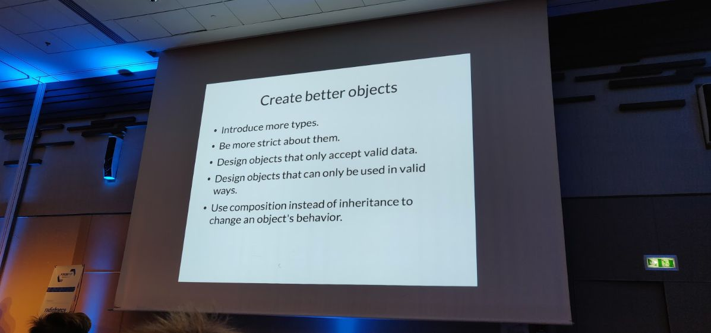
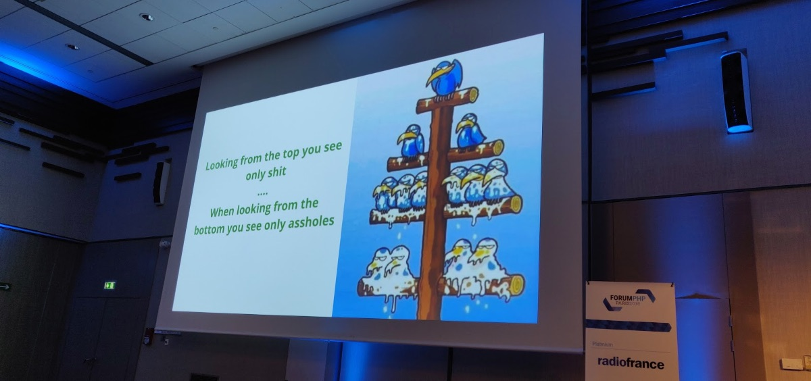

Comme tous les ans, nous étions au [Forum PHP 2018](https://event.afup.org/forumphp2018/) organisé par l’AFUP ! Encore une fois, nous avons pu assister à plusieurs conférences et échanger avec grand nombre d’entre vous. Voici quelques mots sur celles qui nous ont le plus marqué.

### "Boostez vos applications avec HTTP/2"

Nous connaissons et utilisons tous HTTP au quotidien. Mais que se cache-t-il derrière ce protocole ?
[Kévin Dunglas](https://twitter.com/dunglas) nous à présenté les nouvelles fonctionnalités apportées par HTTP/2.
Il nous a d'abord fait un rappel sur les concepts HTTP et sur l’évolution de ce protocole conçu pour échanger des données documentaires.
Après plus de 20 ans en version 1, HTTP évolue et passe en version 2 !

HTTP/2 était initialement propulsé par Google. Première bonne nouvelle, pas de changement nécessaire du côté de nos applications PHP. La version 2 introduit de nouvelles fonctionnalités intéressantes :

 * Priorisation des requêtes
 * Passage au binaire (optimisation de la taille des messages)
 * Notifications push
 * Et bien d’autre

Kévin nous a aussi présenté le protocole [Mercure](https://github.com/dunglas/mercure). Il permet de faire des notifications push server side vers différents clients. Mercure semble simplifier grandement les échanges push client / serveur. Toutes les parties dialoguent au travers d’un hub (rôle primaire de Mercure) et se synchronisent entre elles. Une petite démo à confirmé l’effet *“whaou”* de cette nouvelle solution.

### "Beyond the design patterns and principles - writing good OO code" et "How I started to love what they call Design Patterns"

Ce Forum a aussi été l’occasion de voir (ou revoir) quelques principes fondamentaux autour des Design Patterns, avec [Matthias Noback](https://twitter.com/matthiasnoback) et [Samuel Roze](https://twitter.com/samuelroze).

Ils ont présenté des exemples concrets, des mises en application de certains *Design Patterns* incontournables, toujours dans l’optique de découpler notre logique métier, de mieux réutiliser notre code et en améliorer la maintenabilité. Le *Domain Driven Design* a donc logiquement été mis à l’honneur, ainsi que le typage fort pour donner du sens au code et favoriser sa bonne utilisation. Pour éviter la dette technique, il faut *"acheter en avance la capacité de changer"*.

### "We got rid of management"

[Michelle Sanver](https://twitter.com/michellesanver) nous a présenté l’holacratie : un système d’organisation basé sur l’intelligence collective, utilisé chez Liip. Elle a démarré la conférence en expliquant les défauts de la hiérarchie pyramidale (la photo de la slide parle d’elle-même ;-)) :

En holacratie, la société s’organise en cercles et sous cercles de responsabilité et chaque collaborateur se voit donner des rôles et les moyens de l’assumer. Les décisions sont prises collectivement et le pouvoir n’est pas centralisé dans les mains de quelques personnes. Tout est basé sur la transparence, en particulier la rémunération et les budgets. Le but principal est d’assurer des conditions de travail bienveillantes et que chacun se sente en sécurité pour exprimer au mieux ses talents et réduire les tensions. Notamment, toutes les réunions sont facultatives :-D

Liip a développé un outil communautaire en SAS ([www.holaspirit.com](https://www.holaspirit.com)) qui simplifie l’organisation en gérant les cercles, les prises de décisions et la remontée des propositions d’améliorations (ou “tensions”). Cette outil paraît indispensable, car central dans l’organisation. 

On voit très bien comment une holacratie peut se mettre en place dans une nouvelle organisation ou de taille réduite mais la conférencière n’aborde pas trop cet aspect pour les entreprises de taille conséquente.

### "Vous n’avez pas besoin de ça"

Le début de la conférence était volontairement critique sur l'utilisation des nouvelles technos puis peu à peu se dirigeait sur du bon sens dans le choix des technos avec de bonnes raisons (et non pas car elles sont "à la mode").

Pour cela ([Charles Desneuf](https://twitter.com/Selrahcd)) nous a cité les avantages et inconvénients de différents outils (micro-services, GraphQL, SinglePageApp, Microservices, GraphQL,...)

Le but était vraiment de pousser à la réflexion dans ce type de choix en prenant bien en compte le contexte (utilisateurs, équipe, qualités attendues,...) et de ne pas apporter de la complexité inutilement (optimisation/abstraction prématurée, modélisation inadapté,..).

Une conférence bien dirigée en concluant par :
*"Vous n’avez (peut-être) pas besoin de ça (maintenant)."*

### "Cessons les estimations"

[Frédéric Leguédois](https://twitter.com/f_leguedois) nous a livré une conférence proche du one man show sur les estimations et les deadlines. Il nous a rappelé un point important que l’on oublie parfois : Les estimations ne sont QUE des estimations, on ne peut pas les prendre comme des engagements de la part de celui qui les fait. Ses exemples humoristiques sur les différentes façons dont sont faites les estimations provoquaient fréquemment l’hilarité de l’audience qui répondait par des applaudissements généreux.

Même si le trait était forcément grossi pour le « spectacle » on a passé un très bon moment et ça fait réfléchir, notamment sur le fait que le changement est normal. 

#### "En vrac"

**Quelques autres conférences** que vous pouvez visionner sur [le site de l’AFUP](https://afup.org/talks/) :

 * « Serverless et PHP » : Matthieu Napoli nous a montré comment déployer des fonctions Lambda chez AWS en PHP -- et pourquoi.
 * « Développeurs de jeux vidéo: les rois de la combine » : Laurent Victorino nous a complètement *enfumé* avec sa présentation *interactive* !
* « Voyage au centre du cerveau humain, ou comment manipuler les données binaires » : un retour d’expérience enrichissant de Thomas Jarrand, parlant d’IRM, de binaire, ou encore de voxels.

Nous avons aussi présenté trois conférences, autour de sujets que nous pratiquons au quotidien chez M6 Web :

 * [Benoit Viguier](https://twitter.com/b_viguier) a parlé de programmation asynchrone avec les générateurs de PHP : une fonctionnalité extrêmement puissante, mais encore trop peu connue. Il a d’ailleurs annoncé la sortie de la bibliothèque [Tornado](https://github.com/BedrockStreaming/Tornado). [(vidéo de la conférence)](https://afup.org/talks/2752-generateurs-et-programmation-asynchrone-mode-d-emploi)
 * [Guillaume Bouyge](https://twitter.com/BouygeGuillaume) nous a raconté l’histoire de la migration à l’international de la plate-forme 6play : comment, en partant d’un produit développé pour M6, nous sommes arrivés à un produit en marque-blanche vendue à d’autres clients d’autres pays. [(vidéo de la conférence)](https://afup.org/talks/2776-de-6play-fr-a-une-plate-forme-internationale-retour-d-experience)
 * Et [Pascal Martin](https://twitter.com/pascal_martin) a présenté Kubernetes, l’outil que nous utilisons pour piloter des conteneurs Docker dans Le Cloud. Il a enchaîné avec plus de détails sur le processus que nous suivons pour migrer nos projets vers cet hébergement ; vous pourrez en apprendre plus en lisant [Le Plan Copenhague](https://leanpub.com/6cloud/). [(vidéo de la conférence)](https://afup.org/talks/2816-docker-en-prod-oui-avec-kubernetes) 

Vivement l’AFUP Day Lyon 2019, où nous aurons sans doute le plaisir de vous rencontrer à nouveau ?
