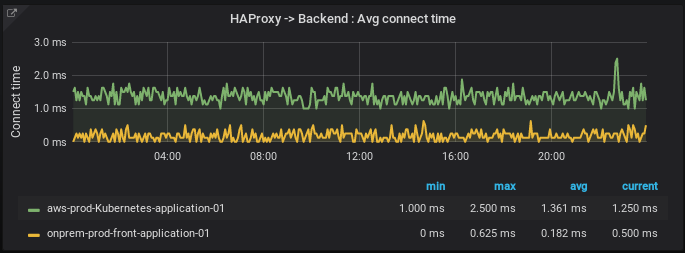
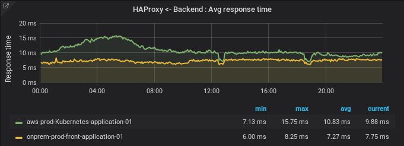
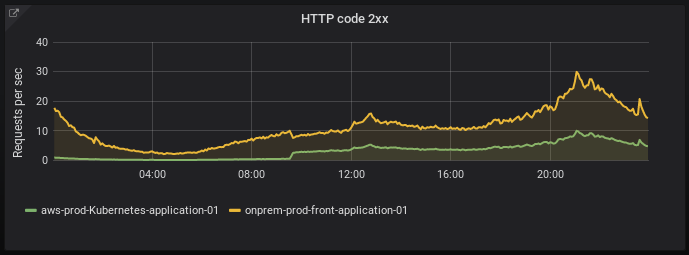
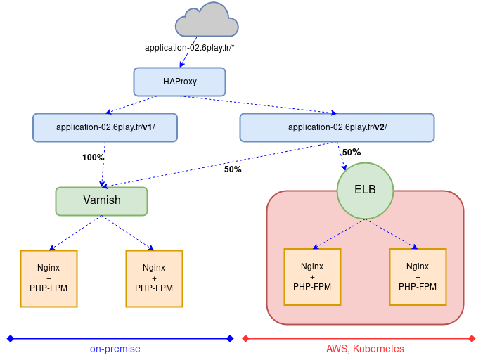

We are migrating all our on-premise applications to AWS cloud.
Most of them are/will be migrated to Kops-managed Kubernetes clusters, and some are/will be migrated as lambdas.
To secure this migration, we are using HAProxy in front of both on-prem and on-AWS deployments (first only sending 1% of each application's requests to AWS, then 5%, then 25% and so on).
Disclaimer: This article describes a feedback from production environment. We have changed the name of applications mentioned here, but everything else is true within the limits of our knowledge.


You can find the content of this blogpost (and more) in a 25mn talk at the HAProxy conf given in Amsterdam in 2019 :
<iframe width="560" height="315" src="https://www.youtube.com/embed/NmStcGBkXmQ" frameborder="0" allow="accelerometer; autoplay; encrypted-media; gyroscope; picture-in-picture" allowfullscreen></iframe>


## The first migrated application

It's an API written in PHP. It has no external dependency (database, redis…), except for another API, called over HTTP.
We have migrated this application to the cloud like we've done with other applications since.

The first step was to deploy this application to a kubernetes cluster and expose it over an ELB.
Then, we wanted to send real-user requests to that app. We wanted to see how it would behave with real production traffic.
But we didn’t want to send 100% of our users over there at once: we’d first rather check everything works fine with just 1% of our users.


## HAProxy

We’ve been using HAProxy for several years now.
Because of its features, like advanced backend monitoring or its enormous number of metrics, it's the perfect tool to help us on this migration.

At first, we didn't know how the app, the Horizontal Pod Autoscaler, Liveness probes etc. would react with real live production requests.
So, we decided to migrate only 1% of production HTTP requests to our Kubernetes cluster. The other 99% of HTTP requests would remain on premise, where the application works for sure.

Here's a part of the associated HAProxy configuration:


backend application-01
    http-response add-header X-Backend-Server %s
    balance roundrobin
    http-request set-header Host application-01.6play.fr
    option httpchk GET /HealthCheck HTTP/1.1\r\nHost:\ application-01.6play.fr
    server aws-prod-Kubernetes-application-01 aQuiteLongURLCorrespondingToOurELBEndpoint.eu-west-3.elb.amazonaws.com:443 check ssl verify required sni req.hdr(host) check-sni application-01.6play.fr ca-file ca-certificates.crt inter 1s fall 1 rise 2 resolvers m6dns observe layer7 weight 25
    server onprem-prod-front-application-01 onprem-application-01.6play.fr:80 check resolvers m6dns weight 75


Some explanations on key elements of this configuration:

* `http-response add-header`: adds an HTTP header to the response, with the server chosen by HAProxy to handle the request. We added this for debugging purposes: to know who handled our request when requesting the service
* `balance roundrobin`: because we're using a stateless application
* `check .. inter 1s fall 1 rise 2` in the server directive: healthchecks have 1 second of timeout, only 1 bad healthcheck is enough to mark the server as unhealthy and we need 2 good healthchecks in a row to mark it as healthy again
* `observe layer7`: It will simulate a bad healthcheck for each application server error (e.g: 500, 502, 503, etc.) making this server fall in such a situation
* `weight 25`: We use weights from 0 to 100 (you can go up to 256), so that corresponds to traffic percentages in our case

With the above configuration, as soon as there is an error, HAProxy won't send traffic to our AWS/Kubernetes application anymore; consequently, it will have a minimum impact on endusers.


## Tests

We first tested this with staging proxies, with a temporary domain name and a 50-50% loadbalancer, to ensure the load-balancing worked fine.
We tried to kill the deployment on Kubernetes to check 100% of requests came back on-prem. We tested killing random pods to see if we had some user impact. We tested to slow down the application so it would be slower than 1s to respond. We also tested to slow down only one of two pods running the application.
It was all OK, so we were confident to go to production.


## Migration steps

Before its migration, the application infrastructure looked like this:


We inserted HAProxy servers in that schema, so the traffic passes through them before being sent to the caches.
That way, HAProxy controls where traffic is sent.
To make those migrations as transparent as possible, we first configured HAProxy to send traffic to on-prem servers only.
In the same time, developers have deployed all mandatory resources (RDS, DynamoDB, elasticache, etc.) with Terraform and verified the application works fine. The application itself could have changed: either the code or kubernetes manifests.
When ready, both ops and devs gave their approval to send traffic to the cloud.

We started by load-balancing 1% to the AWS ELB with HAProxy:


We compared everything we could:
- 2xx, 3xx, 4xx and 5xx percentages
- connect and response times
- failed healthchecks and healthchecks return codes
- backend retries and bad responses


We were amazed: only 3ms in average difference between on-prem and our Kubernetes cluster in AWS cloud.
And no error. Everything worked as expected. It was almost suspicious.


This graph shows the average connect times from HAProxy.

We're using Paris as AWS zone and our datacenters are located in Paris too, so that explains the few milliseconds to go back and forth from HAProxy (on prem) to the cloud. In fact, this one to two millisecond between our on-prem servers and AWS is one of the reasons adding HAProxy in the mix was possible.



This graph shows the average response times from the application.

We also had some PHP configurations to update to be ISO prod (OPCache, APCu, etc.). Why? Well, at first, we created a quick’n dirty (working, but not optimized) Docker image for our application and it went straight to production, before our sysadmins could take a better look at it.



This graph shows the number of 2xx HTTP codes with 25% of traffic sent to AWS.

Once those PHP optimisations were fixed, we had only 2ms difference between our on-premise and our Kubernetes on AWS. It's low enough to allow us to test this setup a bit longer without any visible user impact.


## Deploying more and more

1% on our kubernetes cluster was great, but it was not enough to see perfs issues.
So we raised HAProxy's load balancing from 1%/99% to 10%/90%.
Still not enough. We raised it to 25%/75%.
We checked application's pods CPU usage, it was really low. Too low to even trigger the Horizontal Pod Autoscaler based on cpu usage. We couldn't validate our pods Requests and Limits for that Kubernetes deployment therefore.

So far, it was enough for us to validate things we could check were working fine. The application cache was efficient, we had stable performances and no surprise on traffic peaks.

On this first application migration, we decided to stay at 25% of traffic sent to the cloud for the moment, to observe.
We did it because HAProxy would have saved us if something bad happened.

It did behave well: nothing happened for 26 days.


## Some errors encountered

### Unknown nodes

On the 27th day, we noticed two of our three nodes were in `Unknown` state. As our Replicas specified we wanted several pods, Kubernetes started new pods. But as we only had one `Ready` node left (3 worker nodes in the cluster, including two in `Unknown` state), all pods for our application were now on that single node. Not great for reliability.  
We found that the CoreOS image we used was doing automatic updates that restarted nodes regularly. On those two nodes (and on the third one a few days later!), the restart did not go well and Kubelet wasn't starting at bootime. After investigation, it appears we changed the [KOPS STATE STORE](https://github.com/kubernetes/kops/blob/master/docs/state.md) bucket. Nodes started before that change were impacted as Kubelet couldn't find its configuration. Starting new nodes and killing the old ones solved this issue.  
That allowed us to identify two problems: we didn't restrict when and how automatic updates were started; and we didn't have enough cluster monitoring.

From that, we knew we had to monitor:
* Nodes in a state different from Ready for a certain time
* If the number of Ready nodes is at least equal to the Auto Scaling Group minimum
* If the number of Ready nodes is at most 90% the Auto Scaling Group maximum


### Differences between cluster-autoscaler and ASG values

While trying to solve the problem above, we also found that pods were living around 5mns before being destroyed and created again. After some investigation, we found that min and max EC2 instances were not configured to the same values between the AWS Auto Scaling Group and the cluster-autoscaler pod.  
Some day, we modified the Kops configuration for those worker nodes and the configuration was well applied to the ASG, but was not applied to the cluster-autoscaler. As a result, we had an ASG minimum of 4 worker nodes, but a cluster-autoscaler minimum of 3.  
At some point in the history, the cluster-autoscaler defined that the current amount of worker nodes (four) was too high compared to the real need, so it tried to reallocate pods to free up a node. It have done that by draining pods from a node. At the same time, the cluster-autoscaler tried to change the ASG's desired value to 3 nodes. Because the minimum nodes configured for the ASG was 4, the latter denied the request. Kubernetes scheduler chose to reschedule those recently-killed pods on available nodes, starting by the one with no running pods, AKA: the one that just drained them all.  
This last phase started again every 5 minutes, making sure that our pods did not survive longer than that.


### Application latencies undetected by health checks

Our application was really slow on Kubernetes/AWS (due to a network misconfiguration) but HAProxy did not disable it. We specified a 1s timeout as shown in the example above, but this is only for healthchecks. Our global server timeout is upper than 1s. Because our application calls another webservice, those calls were timeouting. HAProxy was not aware of that, because the application's `/HealthCheck` health page doesn't check external webservices and thus, were not impacted by those external webservices timeouts. This is an application choice that we can encounter on-premise too, with the exact same behavior. For that reason, we decided to change nothing for now (and we'll discuss this with the devs teams to see if there's something we can do).
We don't check external webservices in our `/HealthCheck` page on purpose, because that page is also tested by kubernetes for livenessProbe. Kubernetes restarts a pod when it is not healthy anymore but when it comes to an external service that is failing, restarting the current pod is non-sens. Kubernetes will restart pods again and again even if the application itself can't to anything about it! The livenessProbe should test only what the pod does. The Amadeus team [talked about that at the KubeCon EU 2018](https://www.youtube.com/watch?v=HIB_haT1z5M) while presenting Kubervisor.


## Pedal to the metal

We were stabilized again.
So we raised HAProxy load-balancing to 50% on our application in the cloud.
After seven days without any error, we pushed it to 75%.
After another seven days, we passed the on-prem server as a backup in HAProxy, making the application in kubernetes receiving 100% traffic.


We stayed with that configuration for 2 months.
That gave us plenty of time to adapt pods Requests and Limits.
That is really important for us, because we use HorizontalPodAutoscaler resources with CPU metrics to scale most of our APIs. [Here you can find slides](https://fr.slideshare.net/VincentGallissot/how-we-auto-scale-applications-based-on-cpu-with-kubernetes-at-m6web) deep diving one of our applications that autoscales in prod with kubernetes.
We had several events during those 2 months that helped us optimize Requests and Limits for that app. For example, we had holiday traffic, a football match and some special primetime sessions.
We also improved our knowledge of both Kubernetes and AWS during this time (I.e: What happens when we rolling restart worker nodes?). Finally, we have configured our Prometheus servers with effective and non-noisy alerts.

After weeks of optimizations, we migrated this app's DNS directly on ELB without HAProxy.
Everything works perfectly as expected since that day.


## Next applications to migrate

We've done a lot of work for our first migration. We've capitalized that time for the next projects to finally be able to migrate them in few days.
The workflow stays unchanged:

* Deploy the application into a kubernetes cluster
* Add HAProxy servers in front of both on-prem and in-cloud instances
* Load balance from 1% to 100% traffic to the in-cloud instance
* Configure accurate Requests and Limits
* Create efficient alerting
* Point DNS to ELB


## Migrate an application path by path

Some of our applications needed to be partially rewritten to be cloud native.
Only specific paths were affected by this rewrite.

So we decided to use HAProxy to migrate those applications, path by path.
We also used GOReplay to replicate production traffic for each path, to be sure we didn't messed up things before sending end-users traffic.


This schema shows how HAProxy were routing traffic according to specific paths.

The workflow is almost the same as above, with few changes:

* Deploy the application into a kubernetes cluster
* Add HAProxy servers in front of both on-prem and in-cloud instances
* Use HAProxy `map_reg` to route traffic, depending of the requested URL
* Define path routing preferences in the map file created in step 3 (see example below)
* Configure and test each path:
    * Let developers rewrite paths, I.E: /HealthCheck
    * Replicate production traffic with [GOReplay](https://github.com/buger/goreplay), to specific paths, including /HealthCheck, from on-prem to the application in the Kubernetes cluster in AWS
    * Stabilize the application: either code optimisations or Kubernetes Requests and Limits adaptations
    * Add this newly created path /HealthCheck on the HAProxy's routing map file
    * Repeat for each new path 
* Create a specific HAProxy Backend section for each route to load balance traffic differently for each route
* Increase traffic load balancing up to 100% to the cloud
* Create efficient alerting
* Point the DNS to the ELB


### Traffic replication with GOReplay

We use a lot [GOReplay](https://github.com/buger/goreplay).
Not only because it's light and easy to work with, but because we can do whatever we want with it to replicate traffic. It can rewrite headers, catch only a specific domain or a specific url. It's the perfect tool to complete our migration workflow.

Here is a script we used in the step 5.b of the workflow above:

#!/bin/bash

replicate_traffic() {
    if [[ -z $1 ]]
    then
        local REPLICATION_PERCENTAGE=5%
    else
        local REPLICATION_PERCENTAGE=$1
    fi

    if [[ -z $2 ]]
    then
        local TIMEOUT=45s
    else
        local TIMEOUT=$2
    fi

    echo "Replicating traffic at ${REPLICATION_PERCENTAGE} for $TIMEOUT"

    ./gor -exit-after $TIMEOUT \
    -input-raw :8080 \
    -http-disallow-url /v2/critical/sensible_datas/payments/ \
    -http-allow-url /v2 \
    -input-raw-bpf-filter "dst host 127.0.0.72" \
    -output-http "https://application-02.6play.fr/|${REPLICATION_PERCENTAGE}" \
    -http-original-host \
    2>/dev/null
}

# The above allows a normal ramp-up of the traffic.
# That means application replicas can be low and increase naturally without an insane peak
replicate_traffic 1% 45s
replicate_traffic 2% 45s
replicate_traffic 5% 45s
replicate_traffic 10% 45s
replicate_traffic 20% 60s
replicate_traffic 40% 60s
replicate_traffic 60% 60s
replicate_traffic 80% 60s
replicate_traffic 100% 7h


We're using this script and not directly the gor command, to do a slow ramp-up of traffic to the application in Kubernetes.
Otherwise, since the application is not stressed before traffic is replicated, replicating 100% of traffic all of a sudden would not be representative of real user behavior. It would led to unwanted alerts that would disappear in minutes with auto-scaling, but that would have rang anyway. So we chose to avoid that noise by doing a slow ramp-up to make traffic replication more real.

We could follow the replication with HAProxy dashboard, like the following graph:


### HAProxy configuration

To achieve a path-by-path migration of an application, we used this HAProxy configuration:

frontend application-02
    ...
    # Defined with a "map" style, from file /etc/haproxy/domain2backend.map
    # CF https://blog.haproxy.com/2015/01/26/web-application-name-to-backend-mapping-in-haproxy/
    use_backend %[base,map_reg(/etc/haproxy/domain2backend.map,bk_default)]

backend application-02-on-prem
    http-response add-header X-Backend-Server %s
    option httpchk GET /HealthCheck HTTP/1.1\r\nHost:\ application-02.6play.fr
    server onprem-prod-front-application-02 onprem-application-02.6play.fr:80 check resolvers m6dns

backend application-02-on-cloud
    http-response add-header X-Backend-Server %s
    option httpchk GET /HealthCheck HTTP/1.1\r\nHost:\ application-02.6play.fr
    server aws-prod-Kubernetes-application-02 aQuiteLongURLCorrespondingToOurELBEndpoint.eu-west-3.elb.amazonaws.com:443 check ssl verify required sni req.hdr(host) check-sni application-02.6play.fr ca-file ca-certificates.crt resolvers m6dns

backend application-02-mixed
    http-response add-header X-Backend-Server %s
    option httpchk GET /HealthCheck HTTP/1.1\r\nHost:\ application-02.6play.fr
    server onprem-prod-front-application-02 onprem-application-02.6play.fr:80 check resolvers m6dns weight 75
    server aws-prod-Kubernetes-application-02 aQuiteLongURLCorrespondingToOurELBEndpoint.eu-west-3.elb.amazonaws.com:443 check ssl verify required sni req.hdr(host) check-sni application-02.6play.fr ca-file ca-certificates.crt resolvers m6dns inter 3s fall 1 rise 2 observe layer7 weight 25

backend application-02-mixed-critical
    http-response add-header X-Backend-Server %s
    option httpchk GET /HealthCheck HTTP/1.1\r\nHost:\ application-02.6play.fr
    server onprem-prod-front-application-02 onprem-application-02.6play.fr:80 check resolvers m6dns weight 99
    server aws-prod-Kubernetes-application-02 aQuiteLongURLCorrespondingToOurELBEndpoint.eu-west-3.elb.amazonaws.com:443 check ssl verify required sni req.hdr(host) check-sni application-02.6play.fr ca-file ca-certificates.crt resolvers m6dns inter 3s fall 1 rise 2 observe layer7 weight 1



And here's the associated map file:

```
#HOST Header                                                            #HAP backend_name
application-02\.6play\.fr\/v2\/critical\/(\w{1,45})\/payments\/         application-02-mixed-critical
application-02\.6play\.fr\/v2\/customers\/                              application-02-mixed
application-02\.6play\.fr\/v2\/                                         application-02-on-cloud
application-02\.6play\.fr\/v1\/                                         application-02-on-prem

# Catch ALL for application-02.6play.fr
application-02\.6play\.fr\/                                             application-02-on-prem
```


Some examples of traffic routing made by HAProxy with the configuration above:

- application-02.6play.fr/v2/critical/sensible_datas/payments/
    * sent on the specific `application-02-mixed-critical` backend,
    * with 1% traffic sent to the cloud
- application-02.6play.fr/v2/customers/
    * sent on `application-02-mixed`,
    * load balanced at 25% on the cloud
- application-02.6play.fr/v2/
    * sent on `application-02-on-cloud`,
    * only on the AWS ELB: cloud only
- application-02.6play.fr/v1/
    * sent on `application-02-on-prem`,
    * only on-premise
- application-02.6play.fr/admin/
    * sent on-premise only,
    * this is the default

With HAProxy map files and the according backend sections, we're able to migrate path by path any application from on-premise to our kubernetes cluster in the cloud.
With gor on top of it, it's even easier to allow developers develop a specific path while another is being migrated, and all that, with no downtime.


## Next steps

We've done most of our cloud migration with workflows explained in this blogpost.
Thanks to HAProxy, most of our applications could be migrated at the same time with no impact from on migration to another.

There are still some applications to migrate though and one of them is a tough one. This application is heavily using Cassandra database. There is no Cassandra managed in AWS, so we are completely rewriting the application to adapt it to DynamoDB and also to face upcoming business needs.
The challenge is to keep existing pathUrl of the application, working. In other words: the new version have to give same functionalities, keeping the same URLs, but with totally different data management under the hood.
GOReplay is a wonderful asset to help us in this task.

If you found this useful and you'd like more production return of experiences like this one, please let us know. We plan to write more in the coming weeks.
