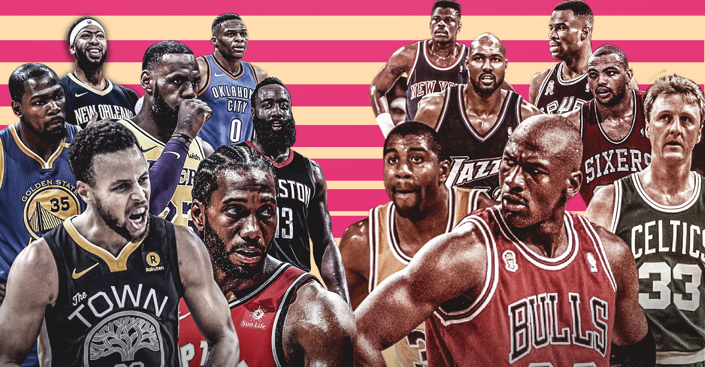
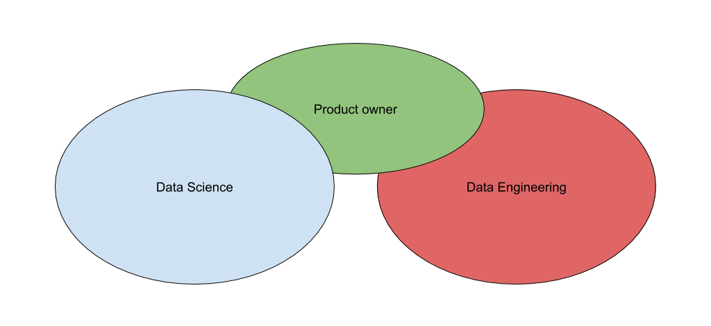
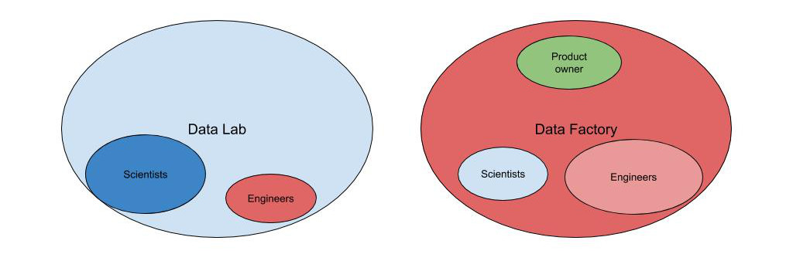

Disclaimer: this is a post I've been meaning to share ever since the Dailymotion team published [this post](https://medium.com/dailymotion/collaboration-between-data-engineers-data-analysts-and-data-scientists-97c00ab1211f), so it's going way back into our history but updated to our current status. It's also an attempt to bring a counterpart to the blog posts of many web leaders that have written about what worked but rarely detail the difficulties they met and the lessons they learnt.
Here's a very personal (therefore biased) feedback of our story and the lessons we learnt down the road.

At Bedrock we're building the best streaming platform in Europe to help our customers be local streaming champions.
Within Bedrock (and before that within M6 where our team was born), we embraced Data in 2016. From a top management perspective the move was straight forward once the company had understood the strategic importance of Data and the major use cases we could address: staff a team and deliver massive value (since Data was definitely the new oil back in those days). But for the teams we built (now north of 40 people), it was another story.

## First iteration: the Dream Team

The first step M6 took was to hire an amazing, PhD qualified, Business focused, Data Scientist whose mission was to build a Data Science team and explore the company's data to find valuable use cases. A few months later, we added an experienced Product owner (me) to help set the vision, the roadmap and lead our Data initiatives. And some months later we were joined by a rock star Data/Machine learning Engineer who was to create an engineering team and the data platform we could build upon.

Our collective mission was very ambitious but also very unclear. Basically, we were in charge of using Data to have a major impact on the company's business. Nobody in the management had a very clear idea of what that meant and how to get there, that was up to us.
Each one of us had many ideas on how to make that happen, and quite different approaches of the way to get there. The caricatural (but quite realistic) outline was:
- Our lead Data Scientist wanted data, tools and manpower to explore the data, find awesome machine learning use cases that he would build with the DS team he had staffed, onboard the business, have them buy in and go to production (instantly, in his view the step to production was the tiny part).
- Our lead Data Engineer wanted to start with small use cases, build a production infrastructure and enrich the science step by step later down the road.
- I wanted to align with our stakeholders and management to build a shared vision, prioritize ideas and then organize the team work to iterate and increase value on a regular basis.

This misalignment led to an early split between the Data Scientists who did a lot of exploration + POC's and the Data Engineers who worked on an industrial production platform. The projects were of different nature and everything was pretty smooth except for some frustration on my side because I was playing little to no role in the Data Science part of things. Overall, everybody was happy, and we started to deliver value... until our first real business (beyond tooling) cases entered the roadmap.

The first business case where we needed to leverage both engineering and scientific skills was A/B testing. After having scanned the market solutions to find a nice solution we chose to build our own because we wanted deep integration into all our frontends (including mobile apps and set-top boxes) and backends, a lot of freedom to build KPI’s upon all of our Data Lake and a few other things. 
To build the complete toolbox, we had to create a backend serving layer that would return the correct feature flags for the A/B user groups, calculate KPI's with a large combination of filters, ensure that the calculation pipeline was run every day and display the results in a decent dashboard. From a project management perspective, it was a headache because the KPI part needed to bring statistical expertise to production, combining statistical excellence and production grade reliability. In our first iteration, a Data Scientist did a POC, but it was no way near production standards. On a separate track, the Data Engineers did a totally separate POC that delivered a decent framework, the KPI's were calculated incorrectly. Our third iteration (that took 6 months to make happen) was a 2-day session of peer programming between a Data Scientist and a Data Engineer that (at last!) delivered something real: a POC that actually calculated the right metrics in a way that could be industrialized.

The second business case was just as messed up. Our Data Science team headed off solo to build a POC of a program recommendation engine (we stream videos that belong to TV programs). Within a couple of months, they built something that seemed nice, but didn't scale when run for our millions of users. They then went into optimising their code, rewriting and optimising again without any Data Engineer help for 4 more months until the algorithm was ready for an A/B test against our long standing business rules. And the POC lost the test. After some rounds of tuning, we stopped the initiative altogether because nobody believed in any potential success.

We repeated this type of scenario a few times, building up more and more frustration within the 2 teams and the stakeholders. We tried to break it down and make the collaboration work quite a few times, but 2 points couldn't be resolved:
- The Data Scientists didn't want to embrace any product/project management, agile or not (though I believe the underlying issue was more about control in a “us” versus “them” mindset).
- The Data Engineering team refused to put any Python code (the Data Scientists language of choice) into production and imposed that everything would be Java or Scala, versionned on git, unit tested and monitored.
This looks like very usual trolls, but they kept us stuck for more than a year.

At the end, our organization literally cracked up. The tensions became conflicts, some people left the team and our top management had to dive in to pacify and rebuild something that would work.
Although we had delivered value in several places, we were clearly under effective.

My personal take away on our collective difficulties boils down to 2 things:
- Starting off with a bunch of rock stars made collaboration impossible because each one wanted to lead in a very personal way, without much compromise.
- Letting things slip towards a comfortable separation of 2 expertise teams with 2 very different organisations and agenda's instead of insisting on aligning them led to a form of cold war with no collaboration at all.

## Second iteration: pluridisciplinary teams

The conclusion of the management's deep dive was that we needed to split the historic teams in a more official and long term way.
The Data Scientists would form the Data Lab in which they would do research and produce POC's and whitepapers + staff their own engineers if they needed any. And we would create the Data Factory that would be focused on delivery with the Data Engineers and some new Data Scientists that would work on the team's backlog with the Data Engineers on a daily basis.

From the Data Lab perspective, that relieved most of the stress because they were now officially free to set a very scientific agenda for themselves. At the start it was cool, but over time (this was 3 years back), their disconnection from "production" put them very far away from the real world. The internal stakeholders turned away from them because their target was to make real things. It ultimately led them to having small business impact and a poor dynamic, ultimately reducing the team down.
From the Data Factory perspective, the new organisation fixed it! Over the past couple of years, we have been building the vision and roadmap within the team with no distinction between the Data Science and Data Engineering roadmap. Our work with the stakeholders feels like we're now walking on our 2 feet, the solutions we imagine for their challenges mix plain data engineering solutions with algorithms and statistics seamlessly, and we're definitely delivering more value. And of course, there is no debate on what goes to production, everything the team does will end up live! At the time I’m writing, the Data Factory has scaled from ~10 people to more than 40 members.

## Organization is one thing, collaboration is another

Our approach to overcome our challenges was totally around changing the organization, but I truly believe the solution was also within the evolution of our mindset.
When we officially split the Data Science and Data Engineering teams, we also increased staffing bringing new people into the game. During that round of staffing, we focused very much on soft skills and mindset, considering that authentic team players would ultimately bring us more value than very strong individuals. Somehow, we moved away from building the dream team and aimed to create a real team. Our idea was that we weren't doing rocket science, we were working on a bunch of features that needed to incorporate some data science properly in our pipelines.
Once the newcomers joined the team, we put a lot of attention into the way people work together, the team spirit they build, the collective dynamic. That went through team building events, defining team values, helping each team member know and understand the other individuals around, creating collaboration rituals, maximizing pair programming between Data Scientists and Data Engineers, etc. And more than anything, entering a more agile test and learn approach, including within the organisation and ways to collaborate.
I truly believe that this was the key to our success and it's my major learning today: build a team.

## Putting the pieces together

In the Dailymotion team post I quoted in the introduction, there's a quite precise and documented blueprint of the organisation about who does what between Data Scientists, Data Analysts and Data Engineers. We've never been that documented and structured for now, we've given each team a lot of freedom about who does what in the process depending on individual capabilities and what the team likes best.
One thing we did do is to sort out the language & tooling trolls. At first, anything that went to production was written in Scala, deployed and reviewed via our Git & continuous deployment pipeline, unit tested and monitored. So if a Data Scientist wanted to work on the production code it was following those rules (that has made some of our Data Scientists need to learn Scala and other things). This is now evolving, thanks to strong local collaboration and we now deliver more and more Python to production :)

## Conclusion

Over the past 4 years, our data team has scaled from 2 to more than 40 people. In the early days we underestimated the fact that putting excellent individuals together wouldn't just work. We learnt the hard way that there was specific attention to be put into the organisation and the way we build teams and successful collaboration patterns between people with different domains of expertise and backgrounds. In that, our conclusion is totally similar to the learnings of the Dailymotion team.
Now we have fixed the mindset and collaboration part of things, we feel nothing can go wrong, even if we changed our organization pattern.
If you want to go further, we spoke about this and some other challenges we faced with Morgiane Meglouli in a conference, the slides (in French) are [available here](https://www.slideshare.net/CoryChaplin/3-enjeux-imprvus-pour-produire-de-la-valeur-avec-la-donne)

Last but not least, Bedrock is scaling fast to help build streaming champions around Europe. If you'd like to join us, check out our [open positions](https://www.bedrockstreaming.com/career)

