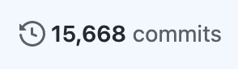
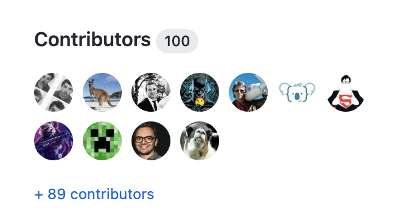
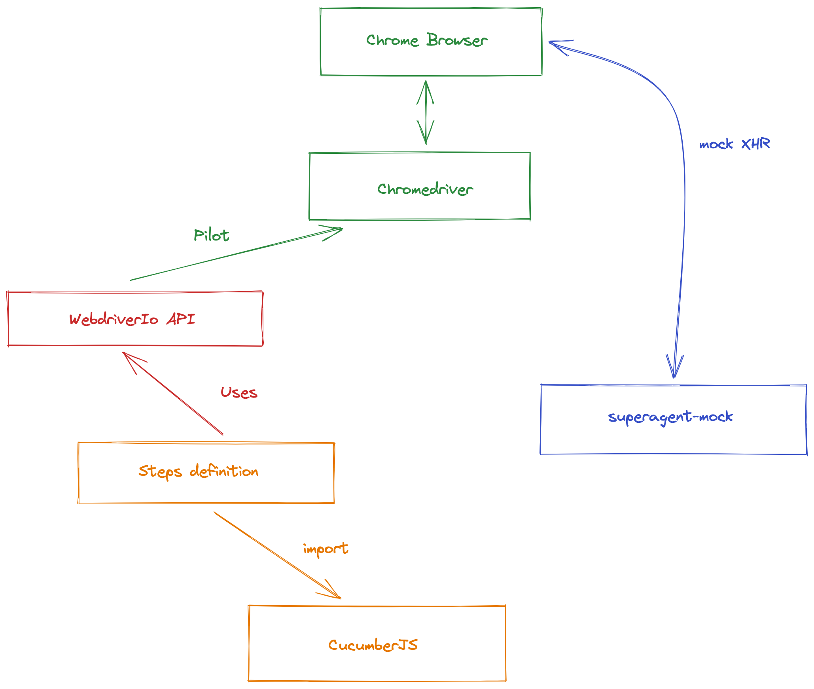
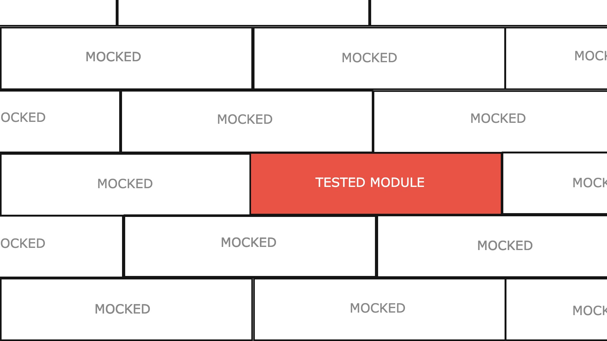
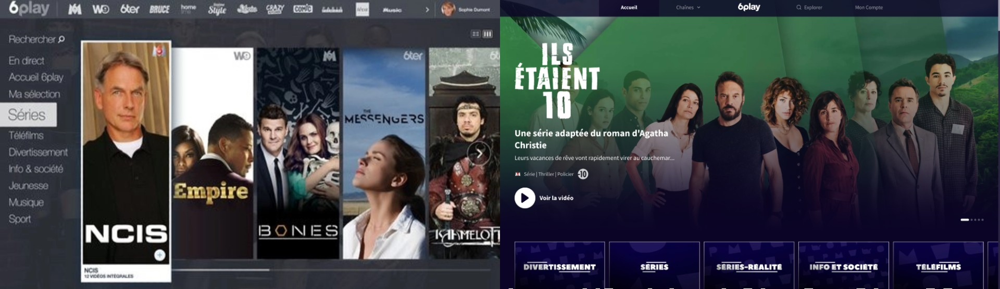
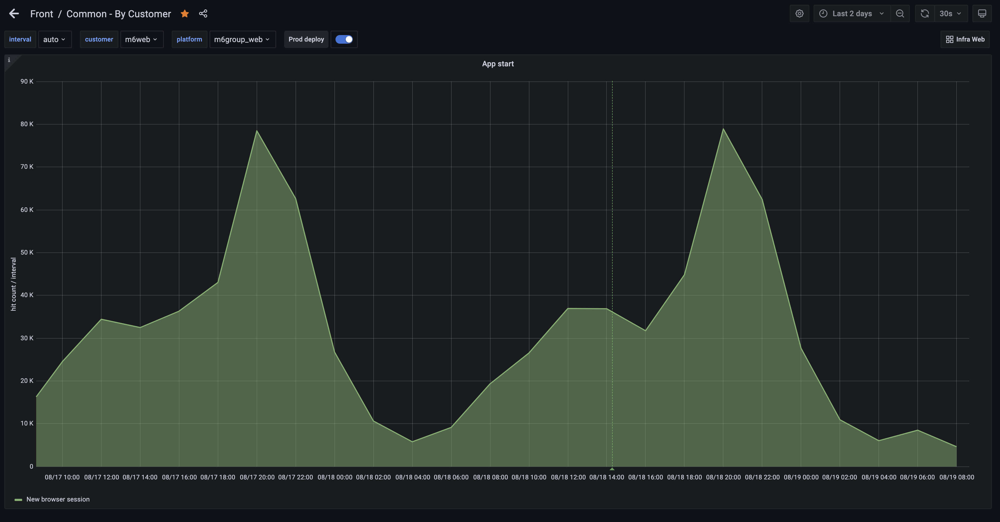

> How not to throw away your application every two years?

Feedback based on best practices applied to the web platform developed at _[Bedrock Streaming](https://www.bedrockstreaming.com/)_

## A bit of context

At Bedrock Streaming many teams develop and maintain _frontend_ applications for our customers and users.
Some of those applications are not very young.
In fact, the application I'm mainly working on is a website whose developments started in 2014.
I have already mentioned it in different articles of [this blog](https://slashgear.github.io/).



You might think: "Oh poor people, maintaining an almost 10 year old application must be hell!"

Don't worry, it's not the case!
I have worked on projects that are much less old but where the development of new features was much more painful.

Today the project is technically up to date, we must be on the latest version of React while it had started on a version _0.x.x_.
In this world of often criticized web technologies where tools and practices are constantly evolving (eg: the many articles on the _Javascript Fatigue_), to keep a project "up to date" remains a real challenge.


Moreover, in the context of this project, in almost 10 years, we have had about 100 contributors.
Some have only stayed a few months/years.
How can we keep the maximum knowledge on "How we do things and how it works?" in such a moving human context?



This is what I would like to demonstrate in this post.

With the help of my colleagues, I have collected the list of good practices that still allow us to maintain this project today.
With [Florent Dubost](https://twitter.com/fooragnak), we have often thought that it would be interesting to publish it.
We hope you will find it useful.

## Set rules and automate them

A project that stands the test of time is first and foremost a set of knowledge that is stacked one on top of the other.
It's like the Kapla tower you used to build as a child, trying to get as high as possible.
A solid base on which we hope to add as much as possible before a potential fall.

From the beginning of a project, we have to make important decisions about "How do we want to do things?
We think for example about "What format for our files? How do we name this or that thing?"
Writing accurate documentation of "How we do things" might seem like a good idea.

However, documentation is cool, but it tends to get outdated very quickly.
Our decisions evolve, but documentation does not.

> "Times change but not READMEs."
>
> [_Olivier Mansour (deputy CTO at Bedrock)_](https://twitter.com/omansour)

Automating the checking of each of the rules we impose on ourselves (on our codebase or our processes) is much more durable.
To make it simple, we avoid as much as possible to say "We should do things like that", and we prefer "we'll code something that checks it for us".
On top of that, on the JS side we are really well equipped with tools like [Eslint](https://eslint.org/) that allow us to implement our own rules.

So the reflex we try to adopt is the following:

- "We should try to do it like this now!"
- "Ok that's interesting, but how can we make sure we do it like that automatically with our CI (Continuous Integration)?"

Continuous Integration of a project is the perfect solution to not miss anything on every _Pull Request_ we provide.
Reviews are only easier because you don't have to worry about all the rules that are already automated.
In this model, the review is more for knowledge sharing than for typo copying and other non-compliance with the project conventions.

In this principle, we must therefore try to banish oral rules.
The time of the druids is over, if all the good practices of a project have to be transmitted orally, it will only take longer to guide new developers into your team.


A project is not set in stone. These rules evolve with time.
It is therefore preferable to add rules that have a script that will _autofix_ the whole codebase intelligently.
Many Eslint rules offer this, and it is a very important selection criteria when choosing new conventions.

```shell
eslint --fix
```

A very strict rule that will force you to modify your code manually before each push is annoying in the long run and will annoy your teams.
Whereas a rule (even a very strict one) that can auto-fix itself at commit time will not be seen as annoying.

**How to decide to add new rules ?**

This question may seem thorny, take for example the case of `<tab>` / `<space>` in files.
For this, we try to avoid the endless debates and follow the trend and rules of the community.
For example, [our Eslint configuration base](https://github.com/BedrockStreaming/eslint-tools) is based on Airbnb's which seems to have some success in the JS community.
But if the rule we want to impose on ourselves is not available in Eslint or other tools, we sometimes prefer not to follow the rule rather than say "We'll do it without a checking CI".

### The _almost_ exhaustive list 🤞


- The file format is managed by [Editorconfig](https://editorconfig.org/), [prettier](https://prettier.io/) and [Eslint](https://eslint.org/).
  We have opensourced [our own configuration](https://github.com/BedrockStreaming/eslint-tools), if it is of any use to you.
- We use a [specific commit name](https://www.conventionalcommits.org/en/v1.0.0/) to generate our changelog.
  To make sure devs follow it, a simple step in our CI checks it.
- We don't want a dev to make our JS bundles very big in production, so we track and measure their size in the CI.
  We use an in-house tool but we recommend to use the [BuildTracker tool](https://buildtracker.dev/).
- Test coverage is not an indicator for the team, not all lines have the same need for us to be tested.
  Some teams at Bedrock however follow this indicator which at least has the interest to give a trend.
- Our unit tests obviously run on the CI, these must pass.
- Our functional tests (End to end: E2E) run on Chrome Headless, they must be green.
- The logs of our E2E tests are retrieved and parsed to avoid errors or React warnings (the parsing script is however complicated to maintain)
- Functional tests run in a _sandbox_ where the whole network is proxied.
  We make sure that our tests do not depend on a non mocked API that could slow down their execution.
- During the E2E tests we check that no image request has generated a 404.
- We perform some [accessibility checks with Axe](https://www.deque.com/axe/) during our E2E tests.
- We check some rules on the CSS with [Stylelint](https://stylelint.io/) and [bemlinter](https://github.com/BedrockStreaming/bemlinter) (we don't use BEM anymore but there is still some style managed in SCSS that we migrate little by little in StyledComponent)
- The project is a monorepo on which we try to maintain the same dependencies versions for each package.
  We developed a tool which automates this check: _[monorepo-dependencies-check](https://www.npmjs.com/package/monorepo-dependencies-check)_
- We check that our `yarn.lock` file has not been inadvertently modified or that it has been updated with respect to the modifications of the `package.json`.
- [Terraform](https://www.terraform.io/) is used to manage our cloud resources, we check that the file format is correct.

## Test, test, test

I hope that in 2021 it is no longer necessary to explain why automatic testing of your application is essential to make it sustainable.
In JS, we are rather well equipped in terms of testing tools today.
However, the eternal question remains:

> "What do we want to test?"

Globally if we search on the internet this question, we see that different needs make emerge very different practices and testing tools.
It would be very presumptuous to think that there is a good way to automatically test your application.
This is why it is preferable to define one or more test strategies that meet defined and limited needs.

Our test strategies are based on two distinct goals:

- To automate the verification of the functionalities proposed to the users by putting ourselves in their place.
- To provide us with efficient solutions to specify the way we implement our technical solutions to allow us to make them evolve more easily.

To do this, we perform two "types of tests" that I propose to present here.

### Our E2E tests

We call them "functional tests", they are End-to-end (E2E) tests on a very efficient technical stack composed of [CucumberJS](https://cucumber.io/docs/installation/javascript/), [WebdriverIO](https://webdriver.io/) with [ChromeHeadless](https://developers.google.com/web/updates/2017/04/headless-chrome)
This is a technical stack set up at the beginning of the project (at the time with [PhantomJS](https://phantomjs.org/) for the oldest among you)

This stack allows us to automate the piloting of tests that control a browser.
This browser will perform actions that are as close as possible to what our real users can do while checking how the site reacts.

A few years ago, this technical stack was rather complicated to set up, but today it is rather simple to do.
[The site that hosts this blog post](https://github.com/Slashgear/slashgear.github.io) is itself proof of this.
It only took me about ten minutes to set up this stack with [the WebdriverIo CLI](https://webdriver.io/docs/gettingstarted) to verify that my blog is working as expected.

I recently published [an article presenting the implementation of this stack](https://slashgear.github.io/how-to-setup-e2e-tests-with-webdriverio/).

So here is an example of an E2E test file to give you an idea:

```gherkin
Feature: Playground

  Background: Playground context
    Given I use "playground" test context

  Scenario: Check if playground is reachable
    When As user "toto@toto.fr" I visit the "playground" page
    And I click on "playground trigger"
    Then I should see a "visible playground"
    And I should see 4 "playground tab" in "playground"

    When I click on "playground trigger"
    Then I should not see a "visible playground"

    # ...
```

And it looks like this in local with my Chrome browser!


Here is a diagram that explains how this stack works:



Today, Bedrock's web application has over 800 E2E test cases running on each of our _Pull Request_ and the `master` branch.
They assure us that we are not introducing any functional regression and that's just great!

👍 The positives

- WebdriverIO also allows us to run these same tests on real devices on a daily basis through the paid SAAS service [Browserstack](https://www.browserstack.com/).
  So we have every day a _job_ that makes sure that our site works correctly on a Chrome last version on Windows 10 and Safari on MacOs.
- These tests allow us to easily document the functionality of the application using the Gherkin language.
- They allow us to reproduce cases that are far from nominal.
  In a _TDD_ logic, they allow us to advance on the development without having to click for hours.
- These tests allowed us not to break the old version of the site which is still in production for some customers while our efforts are concentrated on the new one.
- They give us real confidence.
- Thanks to our library [_superagent-mock_](https://www.npmjs.com/package/superagent-mock), we can _fixturer_ (plug, mock) all the APIs we depend on and thus even check the error cases.
  Also, mocking the browser's XHR layer allows for a significant improvement in test execution time. 🚀
- They give us access to extended uses like:
    - checking accessibility rules
    - check the browser console logs (to avoid introducing errors or React Warning for example)
    - monitoring all network calls of the site through a proxy
    - and so on...

👎 The complications

- Maintaining this stack is complicated and expensive.
  Since few resources are published on this domain, we sometimes find ourselves digging for days to fix them 😅.
  Sometimes we feel quite alone in having these worries.
- It is very easy to code a so-called _flaky_ E2E test (ie: a test that can fail randomly).
  They make us think that something is broken.
  They sometimes take us a long time to stabilize.
  It is still **much better to remove a test that will not give you a stable result.**
- Running all the tests takes a lot of time on our continuous integration.
  We must regularly work on their optimization so that the feedback they provide you is as fast as possible.
  These important times also cost money, because we have to run these tests on machines.
  For your information, the infrastructure of the website (just the hosting of our Node servers + static files + CDN) cost much less than our continuous integration.
  This obviously makes our Ops team smile! 😊
- The new recruits in our teams have often never done this kind of testing, so there is a ~~struggle~~ phase of learning...
- Some features are sometimes too complicated to test with our E2E stack (for example, payment paths that depend on third parties).
  So we sometimes fall back on other techniques with Jest, especially with a less unitary scope.

### Our "unit" tests

To complete our functional tests we also have a stack of tests written with [Jest].
We call these tests unit tests because we have as a principle to try to always test our JS modules independently from the others.

Let's not debate here about "Are these real unit tests?", there are enough articles on the internet about this topic.

We use these tests for different reasons that cover needs that our functional tests do not cover:

- to help us develop our JS modules with TDD practices.
- to document and describe how a JS module works.
- test very/too complicated edge cases with our E2E tests.
- facilitate the refactoring of our application by showing us the technical impacts of our modifications.

With these tests, we put ourselves at the level of a utility function, a Redux action, a reducer, a React component.
We rely mainly on [the `automock` functionality of Jest](https://slashgear.github.io/discover-jest-hidden-feature-automock/) which allows us to isolate our JS modules when we test.



The previous image represents the metaphor that allows us to explain our unit testing strategy to newcomers.

> You have to imagine that the application is a wall made of unit bricks (our ecmascript modules), our unit tests must test one by one the bricks in total independence from the others.
> Our functional tests are there to test the cement between the bricks.

**To summarize, we could say that our E2E tests test _what our application should do_, and our unit tests make sure to check _how it works._**

Today there are more than 6000 unit tests that cover the application and allow to limit regressions.

👍

- [Jest] is really a great library, fast, complete, well documented.
- Unit tests help us a lot to understand _several years later_ how it all works.
- We always manage to unit test our code, and it complements our E2E tests well.
- The `automock` feature is really handy for breaking down tests by modules.

👎

- Sometimes we found ourselves limited by our E2E test stack and couldn't rely solely on unit tests.
  We were missing something to be able to make sure that the _cement between the bricks_ worked as we wanted it to.
  For this, a second test stack [Jest] was set up called "integration test" where the `automock` is disabled.
- The abuse of [_Snapshot_](https://jestjs.io/docs/snapshot-testing) is dangerous for your health.
  The use of _"Snapshot testing"_ can save time on the implementation of your tests but can reduce the quality.
  Having to review a 50 line object in _Snapshot_ is neither easy nor relevant.
- With the depreciation of [EnzymeJS], we are forced to migrate to [React Testing Library].
  It is of course possible to unit test components with this new library.
  Unfortunately, this is not really the spirit and the way to do it.
  [React Testing Library] pushes us [not to play with _shallow rendering_](https://kentcdodds.com/blog/why-i-never-use-shallow-rendering).

### Our principles

We try to always follow the following rules when asking the question "Should I add tests?".

1. If our _Pull Request_ introduces new user features, we need to integrate E2E test scenarios.
   Unit tests with Jest can complete / replace them accordingly.
2. If our _Pull Request_ aims to fix a bug, it means that we are missing a test case.
   We must therefore try to add an E2E test or, failing that, a unit test.

_It is while writing these lines that I think that these principles could very well be automated._ 🤣

## The project stays, the features don't

> "The second evolution of a feature is very often its removal."

As a matter of principle, we want to make sure that every new feature in the application does not base its activation on simply being in the codebase.
Typically, the lifecycle of a feature in a project can be as follows (in a [Github Flow](https://guides.github.com/introduction/flow/)):

- a person implements on a branch
- the feature is _merged_ on master
- it is deployed in production
- lives its feature life (sometimes with bugs and fixes)
- the feature is not needed anymore
- a person unravels the code and removes it
- new deployment

To simplify some steps, we have implemented _feature flipping_ on the project.

**How does it work?**

In our config there is a _map_ key/value that lists all the features of the application associated with their activation status.

```js
const featureFlipping = {
  myAwesomeFeature: false,
  anotherOne: true,
}
```

In our code, we have implemented conditional treatments that say "If this feature is activated then...".
This can change the rendering of a component, change the implementation of a Redux action or disable a route in our _react-router_.

**But what's the point?**

- We can develop new evolutions progressively by hiding them behind a configuration key.
  We deliver features in production without activating them.
- In a test environment, we can overload this config to test features that are not yet activated in production.
- In the case of a white label site, we can propose these features to our customers as possible options.
- Before deleting code of a feature, we deactivate it and clean it up without risk.
- Thanks to an in-house tool called _Applaunch_, this feature flipping config can be overloaded on time in a GUI without deployment.
  This allows us to activate features without putting the code into production.
  In the event of an incident, we can deactivate features that have been degraded.

To give you a more concrete example, between 2018 and 2020 we completely overhauled the application's interface.
This graphical evolution was just a featureFlipping key.
The graphical redesign was not a reset of the project, we still live with both versions (as long as the switchover of all our customers is not completed).



### A/B testing

Thanks to the great work of the backend and data teams, we were even able to extend the use of _feature flipping_ by making this configuration modifiable for sub-groups of users.

This allows us to deploy new features on a smaller portion of users in order to compare our [KPI].

Decision making, technical or product performance improvement, experimentation, the possibilities are numerous and we exploit them more and more.

### The _future flipping_.

> Based on an original idea by [Florent Lepretre](https://twitter.com/SuperFlaw).

We regularly had the need to activate features at ~~very~~ early hours in the future.
For that we had to be connected at a precise time on our computer to modify the configuration on the fly.

To avoid forgetting to do this, or doing it late, we made sure that a configuration key could be activated from a certain date.
To do this, we evolved our _Redux selector_ which indicated if a feature was activated so that it could handle date formats and compare them to the current time.

```js
const featureFlipping = {
  myAwesomeFeature: {
    offDate: '2021-07-12 20:30:00',
    onDate: '2021-07-12 19:30:00',
  },
}
```

> Many coffees ☕️ at 9am have been saved by _future flipping_.

## Monitor, Measure, Alert

To maintain a project as long as Bedrock's web application, testing, documentation and rigor are not enough.
You also need visibility on what works in production.

> "How do you know that the application you have in production right now is working as expected?"

We assume that no functionality works until it is monitored.
Today, monitoring in Bedrock on the frontend side takes the form of different tools and different stacks.
We rely on [NewRelic](https://newrelic.com), [Statsd](https://github.com/statsd/statsd), a [ELK](https://www.elastic.co/fr/what-is/elk-stack) stack and even [Youbora](https://youbora.nicepeopleatwork.com) for the video streaming part.

To give you an example, each time a user starts a browsing session we send an anonymous monitoring _Hit_ to increment a counter in Statsd.
We then have to define a dashboard that displays the evolution of this number in a graph.
If we observe a too important variation, it can allow us to detect an incident.



Monitoring also offers us solutions to understand and analyze a bug that occurred in the past.
Understanding an incident, explaining it, finding its root cause are the possibilities that are open to you if you monitor your application.
Monitoring can also allow you to better communicate with your customers about the impact of an incident and also to estimate the number of impacted users.

With the multiplication of our customers, monitoring our platforms well is not enough.
Too much data, too many dashboards to monitor, it becomes very easy to miss something.
So we started to complement our metrics monitoring with automatic _alerting_.
Once we have enough confidence in the metrics, we can easily set up alerts that will warn us if there is an inconsistent value.

However, we try to always trigger alerts only when it is actionable.
In other words, if an alert sounds, we have something to do.
Sounding alerts that do not require immediate human action generates noise and wastes time.


## Limit, monitor and update your dependencies

What goes out of date faster than your shadow in a web project based on Javascript technologies are your dependencies.
The ecosystem evolves rapidly and your dependencies can quickly become unmaintained, out of fashion or completely overhauled with big _breaking changes_.

We therefore try as much as possible to limit our dependencies and avoid adding them unnecessarily.
A dependency is often very easy to add but it can become a real headache to remove.

The graphic component libraries (e.g. React bootstrap, Material Design) are a good example of dependencies that we do not want to introduce.
They can make integration easier at first, but they often freeze the version of your component library later on.
You don't want to freeze the React version in your application for two form components.

Monitoring is also part of our dependency management routines.
Since the addition of [reporting security flaws in an NPM package](https://docs.npmjs.com/auditing-package-dependencies-for-security-vulnerabilities), it is possible to know if a project has a dependency that contains a known security flaw with a simple command.
So we have daily jobs on our projects that run the `yarn audit` command to force us to apply patches.

> Dependency maintenance is greatly facilitated by our E2E test stack which sounds the alarm if the version upgrade generates a regression.

Today, except for security flaws, we update our dependencies "when we have time", often at the end of _sprint_.
We are not satisfied with this because some dependencies can be forgotten.
I personally use tools like [`yarn outdated`](https://classic.yarnpkg.com/en/docs/cli/outdated/) and [Dependabot](https://dependabot.com/) on my personal projects to automate the update of my dependencies.

## Accepting your technical debt

A project will always accumulate technical debt.
**This is a fact.**
Whether it is voluntary or involuntary debt, a project that resists the years will inevitably accumulate debt.
Even more so, if during all these years you keep adding features.

Since 2014, our best practices, our ways of doing things have evolved well.
Sometimes we decided these changes but sometimes we underwent them (an example, the arrival of functional components with React and the Hooks api).

**Our project is not completely _"state of art"_ and we assume it.**


We try to prioritize our _refactoring_ topics on the parts of the application on which we have the most concern, the most pain.
We consider that a part of the application that we don't like but on which we don't need to work (bring evolutions) doesn't deserve that we refactor it.

I could name many features of our application that have not evolved functionally for several years.
But since we have covered these features with E2E tests since the beginning, we didn't really have to touch them.

As said above, the next evolution of a code feature is sometimes its deactivation.
So why spend time rewriting the whole application?

- In any case, the code becomes "legacy".
- As long as the features are tested, nothing obliges us to refactor everything permanently so that our entire codebase is _state of art_.
- We focus on our _pain points_, we re-factor what we really need to evolve.

## To summarize

The best practices presented here are obviously subjective and will not be perfectly/directly applicable in your contexts.
However, I am convinced that they can probably help you identify what can make your project go from fun to stale.
At Bedrock we have other practices in place that I haven't listed here but that will be the occasion for a new article sometime.

Finally, if you want me to go into more detail on some of the chapters presented here, don't hesitate to tell me, I could try to dedicate a specific article to it.

[jest]: https://jestjs.io/en/
[enzymejs]: https://enzymejs.github.io/enzyme/
[react testing library]: https://testing-library.com/docs/react-testing-library/intro/
[kpi]: https://en.wikipedia.org/wiki/Performance_indicator