At Bedrock, the last Friday of every other month[^lft-history] is *Last Friday Talk* -- or *LFT*.

[^lft-history]: Historically, it was the afternoon of the last Friday of every month. We revised the format in 2019 to make it a full day every other month.

This event encourages sharing: technical topics, less technical topics, cross-team topics...
We also take the opportunity to meet and talk with colleagues we don't work with daily. And the post-LFT snack, put aside during COVID but which I hope will come back, is also meant for that!
Finally, these LFTs are an excellent opportunity for beginner speakers to practice in front of a friendly audience. We also use them to rehearse and validate talks we will give in public later.

During the COVID full-remote period, we moved our LFTs to *Google Live Stream*, where each speaker shared their screen and showed their face through the camera.
With the return to the office[^return-to-office] and partial telecommuting, a new problem arose: how can we broadcast the talks given in our auditorium to 150+ remote colleagues? In good quality, to encourage people to attend several talks in a row? While remaining enjoyable and lively on-site?

[^return-to-office]: In France, some companies -- including ours -- started returning to the office, full-time or not, in June 2021, following recommendations from the government.

## The goal: to broadcast live

We can seat up to 70 people in our amphitheater, where most of our speakers were giving their talks[^talk-remote-speaker]. And we were aiming for 100 to 200 people remotely, for whom we wanted to broadcast live[^remote-audience-count].

[^talk-remote-speaker]: One of the talks was given by a remote speaker, I will not talk much about it in this article: he joined the Google Meet of the organizers and shared his camera and screen. An organizer then projected the Google Meet into the auditorium for the live audience.

[^remote-audience-count]: We went up to 150 people watching the stream simultaneously.

For the broadcast, we worked with one of our usual tools: the organizers and speakers broadcast in a Google Meet, and the audience follows the stream via Google Live Stream[^google-live-stream]. This solution supports a large number of participants, and access is filtered through our SSO, ensuring that only our colleagues have access to the stream.

[^google-live-stream]: [Google Live Stream](https://support.google.com/meet/answer/9308630). We use this solution because Google Meet alone does not support enough people in a call.

We thought we were going to do this in a bit of an ugly way, like when we were all telecommuting: each speaker joins the Google Meet, shares their screen, and speaks into their microphone, often the headset provided by the company. But, still... We decided to make an effort and try to provide a better experience for our colleagues attending LFT remotely!

## So, how we did it, this time

How did we capture and stream slides (or even code and video!), audio, and video of each speaker?

### First step: our amphitheater

Let's start from the room where we broadcast: our amphitheater.

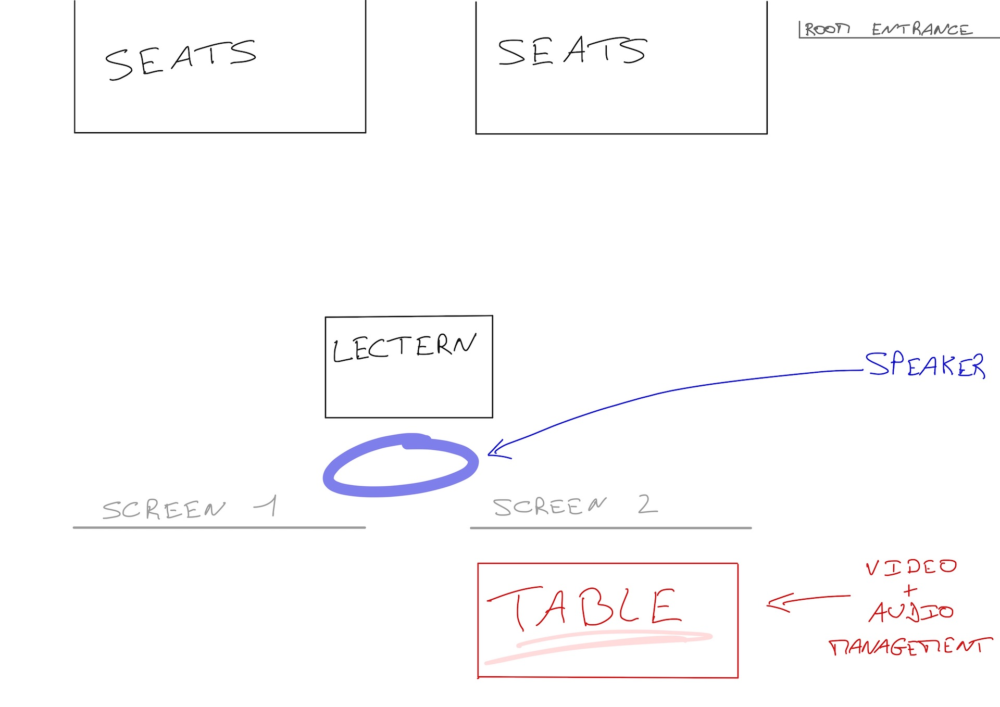

You can see the room below. This photo is taken[^photo-front-room] from the first row of the bleachers, on the right on the picture above:

[^photo-front-room]: Photo taken while projecting talks of the Demuxed conference, for those who wanted to see them on a big screen and together...

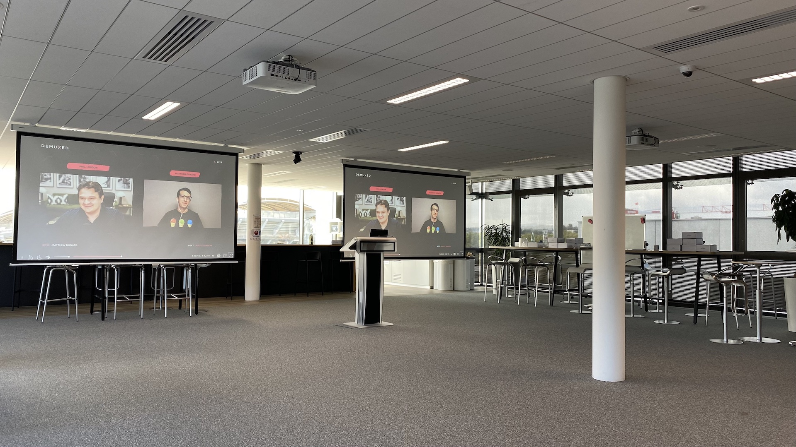

So, the configuration of the room:

 * a speaker;
 * a lectern to put his or her PC;
 * from the HDMI output of this PC (possibly via a USB-C to HDMI adapter), we connect an HDMI cable that goes to the two projectors in the room;
 * these two projectors project (the same thing) on two screens, on the left and on the right of the speaker.

Behind a screen, we placed a table for the capture and broadcast computer[^photo-hidden-table]. This way, it is not too far from the speaker[^orga-tap-shoulder], without being visible from the audience.

[^photo-hidden-table]: In the photo above, we see the legs of the table and high chairs placed around it. Yes, this space also serves as a break room.

[^orga-tap-shoulder]: And the organizers can tap them on the shoulder, to tell them to start their talk or ask them to take a break in case of technical problems...

Equipment: 

 * speaker's laptop, placed on the lectern;
 * USB-C to HDMI adapter;
 * HDMI cable;
 * two projectors (fixed to the ceiling of the room);
 * two screens (fixed to the ceiling of the room).

This setup allows for efficient presentation in the room... But we haven't started working on the live stream yet.

### A PC to manage the video and audio

To broadcast live, the speaker could join the Google Meet and share their screen. That's what we were doing during the COVID... But we can also do much better!

Let's install a PC on the table behind the screen. It will broadcast, to the Google Meet, the video generated by [OBS](https://obsproject.com/)’ virtual camera -- a free and open-source video recording and streaming software.

A second PC, also placed on this table, is used to watch the Google Live Stream watched by all our remote colleagues. This feedback helps us validate that everything is working well, even if we suffer from a few dozen seconds of lag.

Equipment:

 * a table, not too visible from the room;
 * a PC (laptop) -- the one used this time had two USB-A ports and one USB-C port, which affects the cables/adapters required later on;
 * its charger and, perhaps, an extension cord;
 * a good quality internet connection;
 * a second PC (laptop) to view the live stream;
 * and a headset to listen to the live stream.

### Video capture of the speaker's slides / screen

We want to broadcast to the live stream what the speaker is projecting in the room. To do this, we place an HDMI capture box between her PC and the projector:

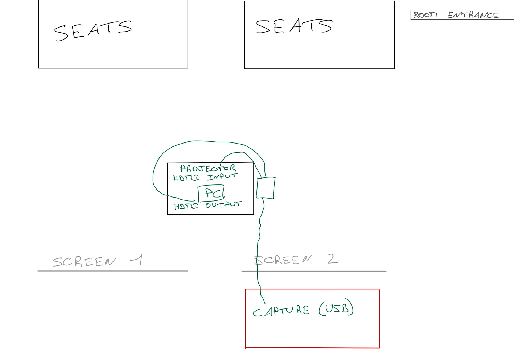

This capture box has an HDMI input *(= the cable coming out of the speaker's PC)*, an HDMI output *(= the cable going to the projector)* and a USB-C output *(= the cable going to the control / broadcast PC)*.

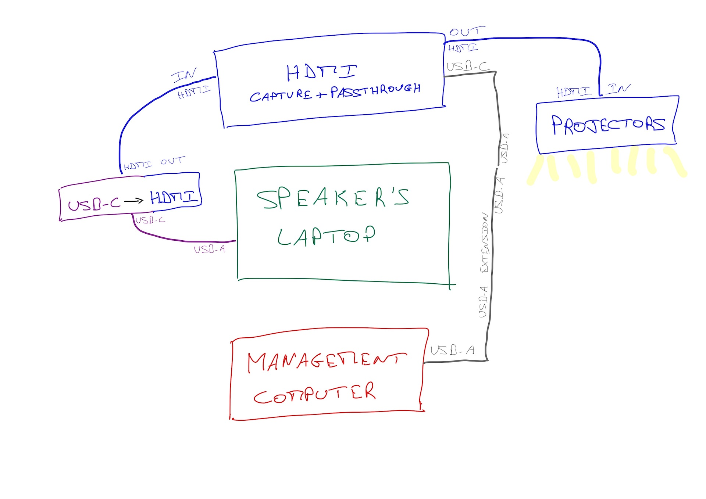

On the control / broadcast PC, the capture box connected via USB is recognized as a webcam. It is then used as a video input device in OBS.

Hardware: 

 * additional HDMI cable;
 * capture device + passthrough: [Elgato HD60 S+](https://www.elgato.com/en/game-capture-hd60-s-plus);
 * USB-C to USB-A cable;
 * USB-A extension cable (because the control desk is a bit far).

### The video recording of the room

It would be even cooler if the remote audience could see the speaker! As a matter of fact, part of the message of each talk is transmitted by the speaker's gestures.

So let's position a camera in the room, at the level of the audience sitting in the stands, to give the impression the speakers are looking at the camera when they are looking at the audience.

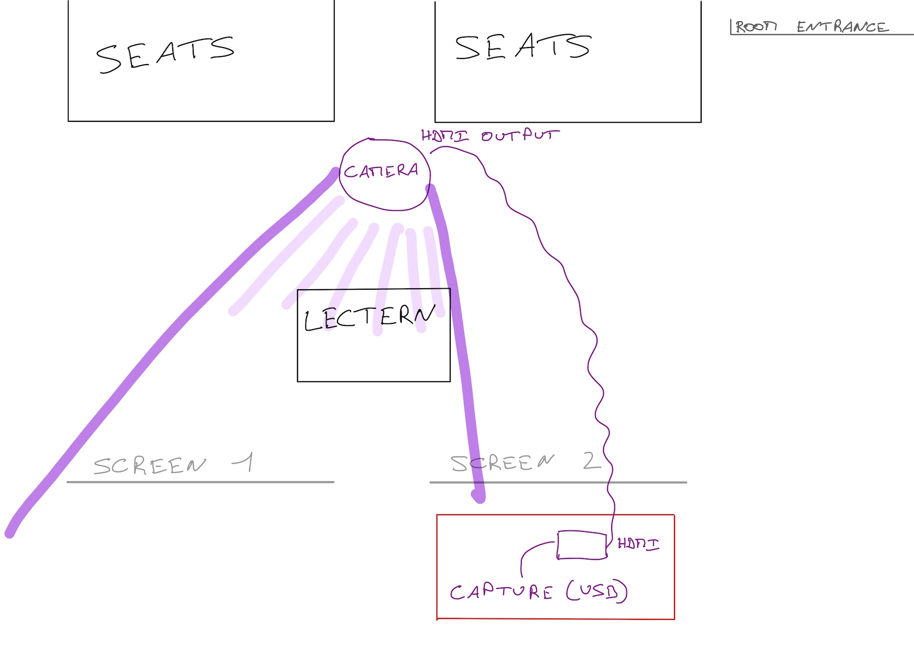

We did not have a real camera at hand. So we used an iPhone 11 Pro Max[^iphone-good-enough]. It has only a Lightning port... And, with an adapter, we can connect an HDMI cable. And the *Filmic Pro[^filmic-pro]* application knows how to stream a *clean HDMI[^clean-hdmi]* video.

[^iphone-good-enough]: High-end smartphones have had very good quality cameras for several years. An iPhone 11 is more than enough to film and broadcast a live conference.

[^filmic-pro]: Filmic Pro: a not cheap application, but very good when it comes to filming with an iPhone.

[^clean-hdmi]: Clean HDMI: the filmed video, in real time, without the decorations of the application interface.

To capture the HDMI signal from the iPhone to the PC, we used a second capture box, simpler than the previous one: it has an HDMI input *(= to connect the iPhone)* and a USB output *(= connected to the PC)*:

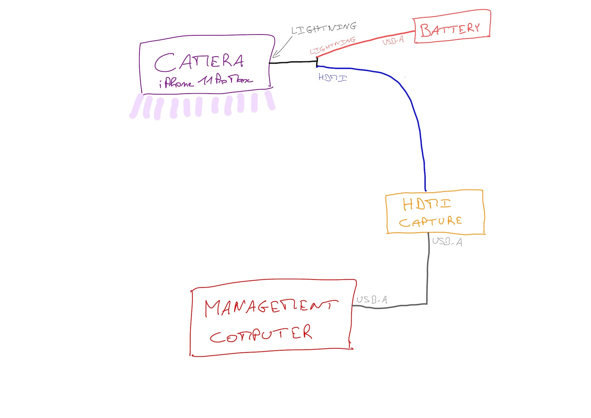

Fearing the iPhone's battery wouldn't last all day while filming, we powered it via an external battery[^external-battery]. The Lightning-to-HDMI adapter happens to include a lightning plug for power.

[^external-battery]: External battery: because there are no electrical outlet in this part of the room and we didn't want to add more cables and extension cords.

Hardware: 

 * iPhone 11 Pro Max *(another high-end model less than four or five years old would have done the trick as well)*;
 * [lightning to HDMI adapter](https://www.apple.com/fr/shop/product/MD826ZM/A/adaptateur-lightning-av-num%C3%A9rique), with Lightning input for power supply; 
 * 10m HDMI cable *(to reach the control PC)*;
 * external battery;
 * HDMI capture box: [Elgato Camlink 4K](https://www.elgato.com/en/cam-link-4k);
 * USB cable *(between camlink and PC)*;
 * USB to lightning cable *(between the battery and the adapter connected to the iPhone)*.

The capture box is recognized as a USB webcam. We use it as a video input device in OBS.

We first put the camera on the side of the room, to not disturb. But the speakers never looked in its direction, and it was not very nice for the remote audience, which felt less *included*. So we moved the camera almost in front of the speaker. This way, the remote audience feels more like the person speaking is looking in their direction.
Also, the camera that films the speaker also films a screen, including when the speaker wants to point to a part of what they are presenting.

### Audio recording of the speaker

Our amphitheater is equipped with microphones and speakers, but we don't yet know how to get the sound from this audio system to inject it into a live stream.

With the resources and time we had, the best we could do for the speakers was a wireless lapel mic:

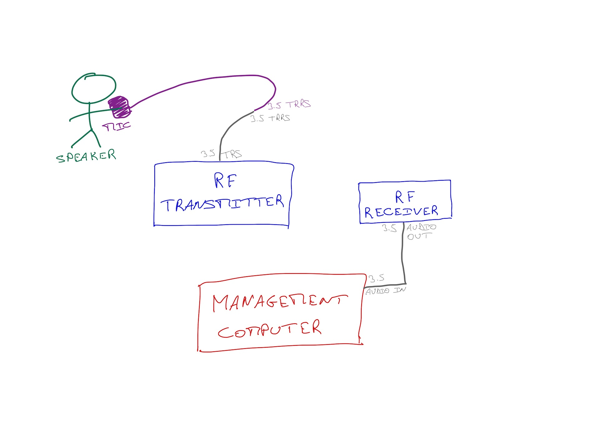

We didn't have a wireless mic, but we had something that could act as such, and we ended up with a 3.5" jack to plug into the microphone port of the control PC. This microphone is then used as an audio source in the Google Meet.

Equipment: 

 * Lapel microphone with TRRS Jack 3.5 port: [RODE SmartLav+](http://www.rode.com/microphones/smartlav-plus);
 * TRRS female to TRS male adapter *(between the microphone and the transmitter box)*;
 * wireless transmitter + receiver kit *(TRS 3.5 jack input on transmitter, TRS 3.5 jack output on receiver)*: [RODE Wireless Go (1st generation)](https://www.rode.com/wirelessgo#home_hero_banner_1);
 * TRS 3.5 male to male cable *(between the receiver box and the PC)*.

### Some other points and nice "bonuses"

Of course, we didn't stop at these main points, and lots of other little things came into play throughout the day.

#### Remote speakers?

I wrote above that I wouldn't talk about it, and I lied a bit: one of the talks that day was given by a colleague who was working from home.
He joined the organizers' Google Meet, shared his screen, activated his camera, and presented, exactly as many of us have done during more than a year of forced telecommuting because of COVID.
For those in the auditorium, one of the organizers plugged in his computer to the two screens in the room and its sound system.

#### Transitions between sessions

At the end of each talk, we quickly took over the speaker's desk and microphone. We wanted to set up the next person, plug in their PC and position the mic so as not to interfere with them, explain how we were broadcasting and validate the setup and configuration.
An organizer was in charge of managing the transition, indicating at what time we would resume. But this transition, in the room, was done without a microphone -- and therefore, without being broadcast to the live stream.
For the live stream, another organizer made the same transition by joining the Google Meet of organizers and speakers. This way, our remote colleagues were not left in the dark and knew when the next talk would resume.

#### Some useful, or even essential, utilities

Of course, in a large room with few electrical outlets that are not always well placed, you need to bring extension cords and power strips.
Also, to avoid someone getting their feet caught in the extension cords or cables *(USB, HDMI)*, bring a roll of duct tape to secure everything to the floor.
And depending on where the lapel microphone is attached *(shirt collar, shirt buttonhole...)* and where its cable goes *(above the shirt in front, under the shirt / under the shirt, on the shoulder and in the back...)*, more delicate tape[^delicate-tape] is very handy.

[^delicate-tape]: I use medical tape, which is easy to cut, sticks well and comes off easily too; and is not too aggressive with clothes and skin.

#### At OBS level

On the control PC, in OBS, we configured several scenes to highlight the speakers or their slides. The images below are screenshots from the live stream, so in 720p maximum and much too compressed...

##### Screen only

To display large code examples, videos...

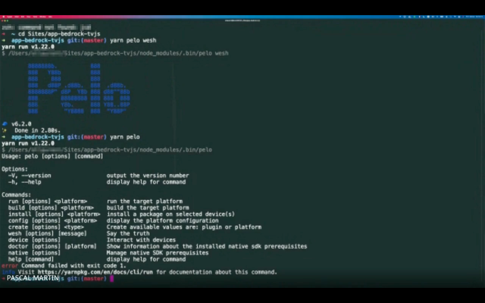

##### Large screen

With speaker overlay in the bottom right corner: for slides written small, while reflecting an idea of the gestures. And we also had the same thing with the speaker inlay in another corner, for slides with important texts in the bottom right of the screen.

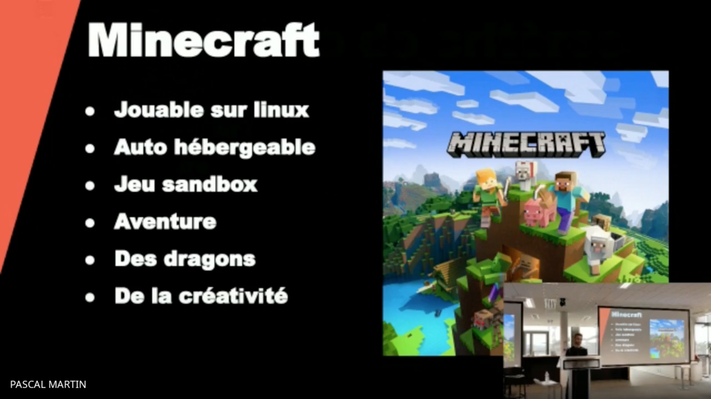

##### Mosaiq

Screen on the left half of the screen, video of the speaker on the right half: for large written slides and to allow people at a distance to see the speaker clearly. We used this view a lot when the camera was on the side of the room -- and we didn't use it anymore once the camera was in front of the speaker.

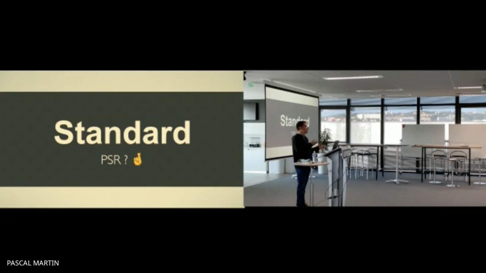

##### Speaker only

Only the speaker's video, framed to include one of the two screens. We used this view "as if the person watching the stream was sitting in the stands" for much of the afternoon, when the camera was placed in the middle of the audience.

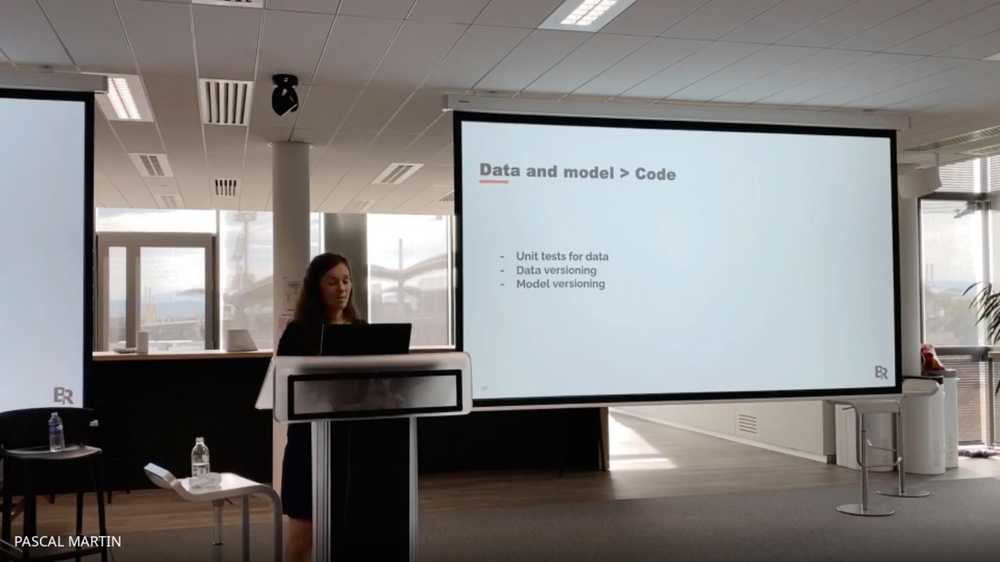

#### For the practical aspects of managing the live stream

Changing scenes in OBS can be done with the mouse *(but it's not convenient)* or with keyboard shortcuts *(but you have to remember the shortcuts and the scenes they correspond to)*.

But it's much more fun with a Stream Deck: a command pad with big buttons, which you can customize! Yes, it's a bit gimmicky and not at all essential, but it's also very cool to use ;-)

Hardware: 

 * [Elgato Stream Deck](https://www.elgato.com/en/stream-deck);
 * since it connects to USB-A: an adapter or a USB hub.

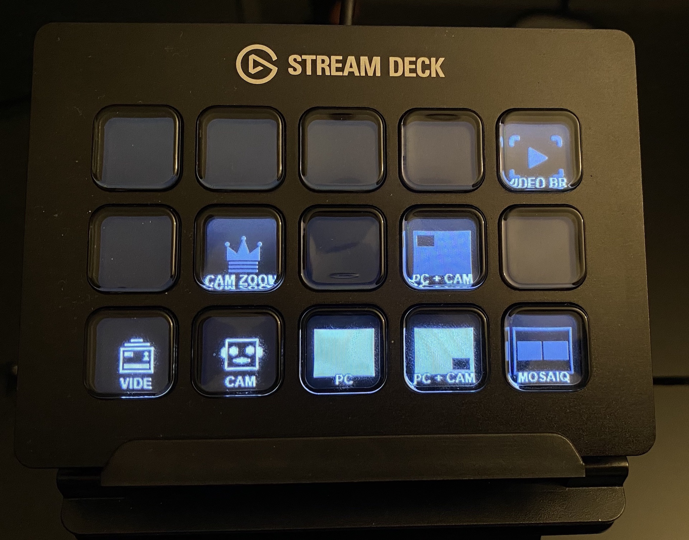

#### The control desk, in photo

A lot of unorganized cables... Here is what the table looked like with the control PC[^control-pc-mess]:

[^control-pc-mess]: Yes, it's a bit of a mess... And, no, you can't see everything: when we took this picture, we didn't think we would post it ^^

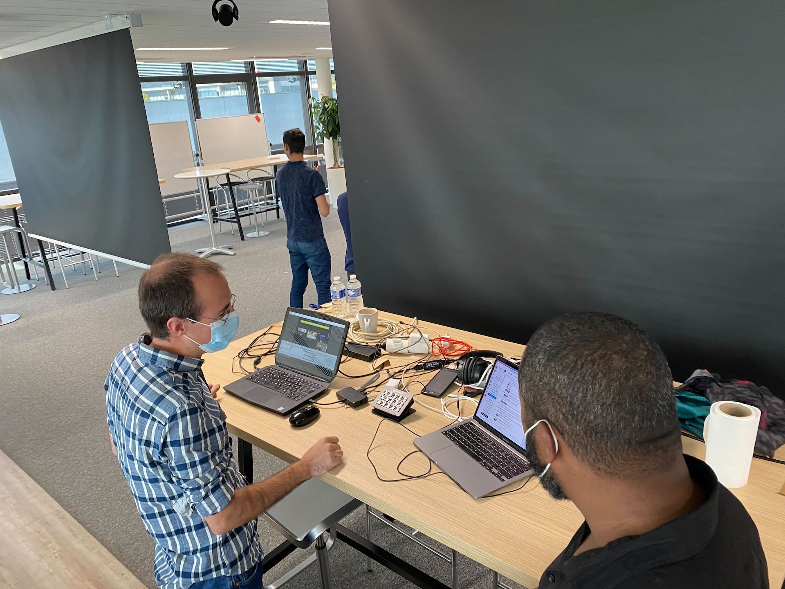

## Some things to improve

Of course, not everything was perfect... Still, for less than an hour and a half of installation and testing that morning, we were quite happy with the result!

First of all, Google Live Stream: the solution, integrated to Google Workspace, is very practical. Including the aspect of *"limiting access to our employees"[^private-talks]*. However, the video quality, in 720p too compressed, is not optimal :-/. 

[^private-talks]: We may broadcast some talks in public in the future... But it was not a topic for this time and we know that some topics will remain internal no matter what.

Our auditorium has two cameras fixed to the ceiling. Today, they are not yet functional[^recent-move], but we hope they will soon replace the iPhone -- and allow us to get a view of the audience for questions.

[^recent-move]: We moved in recently and other more important items were configured first.

Also, having only one microphone is problematic when two speakers are speaking for a talk. It happened once during the day, and we put the lapel mic on the lectern and asked the speakers to move closer to it when it was their turn to speak. The RODE SmartLav+ being omni-directional and of good quality, it was just about right... Without being optimal. Also, we didn't have a microphone for the questions, so the speakers had to repeat them[^repeat-questions].
We have two wireless microphones in the auditorium. Currently, they are used to amplify the sound in the room and we didn't have time in the morning when we were setting up to figure out how to capture their output and integrate it into the live stream. Maybe an improvement for next time, because they seem to be pretty good ;-)
Also, we didn't have the time[^prepare-in-advance] to talk with our colleagues who were managing the sound of these events before the COVID: somewhere in a closet, we have a physical mixer, which could have been useful! Another area for improvement!

[^repeat-questions]: A person in the control room tapped the speakers on the shoulder when they forgot to repeat the questions…

[^prepare-in-advance]: We should have done it a few days in advance, not the morning itself…

That said, now that we've seen that it is possible, we want to do even better next time, in two months ;-). And, clearly, a prototype in 1h30 of setup, which worked that well all day long and which improved the experience of 150 or more remote colleagues, is a big success which will push us to do better - and we know we will be able to do so!
And then, with time and successive improvements, we may spend less time each time installing and configuring!
Also, a more turnkey solution -- like Streamyard[^streamyeard] -- might make our lives easier, compared to OBS...

[^streamyeard]: Which we've already used at conferences, both as organizers and speakers.

Every two months, we organize a LFT day at Bedrock: our Last Friday Talks.
After COVID and with the partial return to the office, we wanted our remote colleagues to experience this LFT as best as they could.
For this iteration, we did with what we had. It's up to us to iterate and do even better next time!
And you, how do you share these kinds of events with your remote colleagues?
