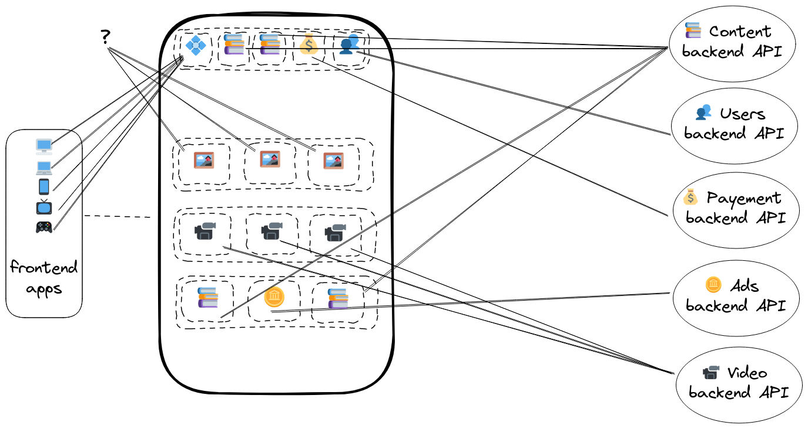
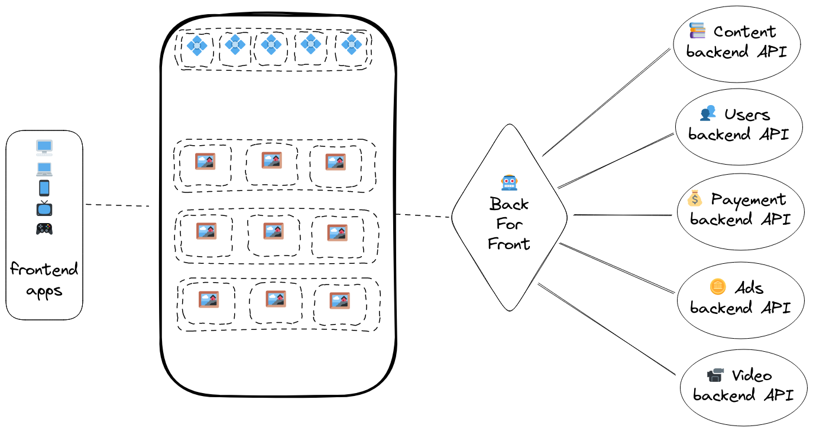
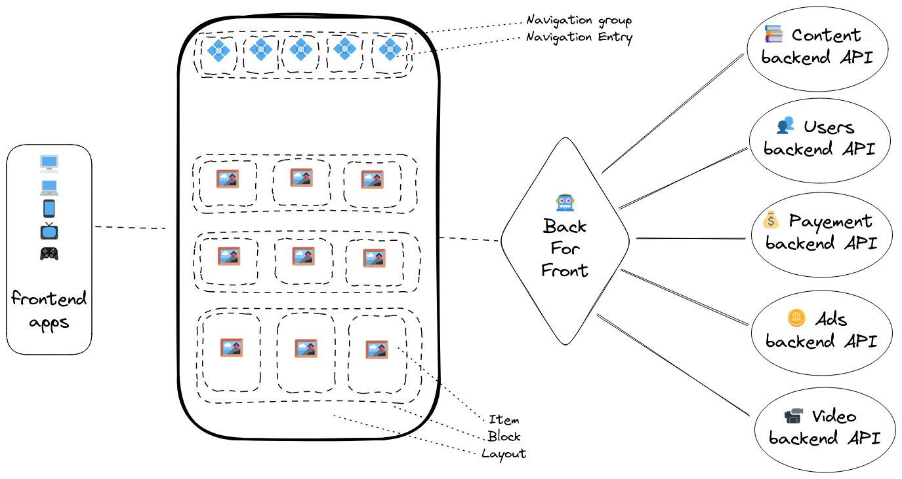

What is a BFF, and how does it simplify the development of frontend applications?

## Introduction

Ahoy there o/

This article is the first in a series explaining the backend architecture we use at Bedrock.
This first piece is dedicated to the *BFF* API. Without further delay, let's jump into the subject!

## So, what's a BFF?

For years, we have been using a microservices pattern [(1)](#notes). Each with their own responsibilities.

Backend and frontend development have long been decoupled.
Every frontend applications had to know about all microservices, call them and know what to do with their data.

This approach had three main limitations from a frontend point of view:
* It forced Bedrock to duplicate logic in each application.
* It prevented us from deprecating legacy APIs.
* New features implied a frontend development and deployment.

There were other downsides, which were mainly derivatives from those listed above.
> As an example, updating an icon into the menu bar required us to deploy all applications. It is not always easy or doable, and cannot be forced onto users without losing some of them.

The BFF tries to answer those limitations!

It's a single API [(2)](#notes) that handles all the frontend applications queries to display contents, navigation, or even start downloads.
In addition, this gateway [(3)](#notes) gathers all business logic. This is done in order to avoid repeating the logic in each application.
That's what we call a *Back For Front*!

### Abstracting the microservices

The first main advantage is to abstract the backend complexity for the frontend teams.
In the previous model, each application had to know where each data came from, how to parse it, and what to do with it.

In the new model, we can easily deprecate an API, replace it, change how the data is stored or returned.
To do so, we only need the team leading the change, and the team handling the BFF to work together at their own pace.
They can decide, depending on the change, how to handle the migration.
They might decide to use a new endpoint to be switched at some point, or add a new attribute in the response, etc.

All those changes will happen without any frontend application noticing it.

### Simplification of the data structure

Another advantage is to simplify the data representation.

By taking all this responsibility in a single API, it now translates the data from the APIs to a single unified representation that all applications can use.

This representation is maintained by the BFF in a single openapi schema [(4)](#notes). It shares the same concepts between the multiple endpoints of the API.

The main usage of the BFF is to handle the navigation between the pages of the application.
In the pictures above and below, the central block shows the application screen. The application page is split into two parts.

The top is answered by the navigation endpoint which gives a list of groups and entries.
Every entry can have nested groups, and an action.

The second part is what we call the *layout*. It's a representation of the page, composed of multiple blocks, each with a list of items.
Each item has a title, a description, an image, and an action (the same type as in the entries).

This makes the BFF responsible for what to display in the page, and in which order and how to display it.
How to display things is described through template strings that tell how to display each block.

It's important to understand that the BFF does not return HTML! It returns a JSON string that needs to be parsed and interpreted by the application.

Every application still has to care about its design system, what font to use, which iconography.
This means that a template `Card` might not be displayed exactly the same between a computer, a mobile phone or a television; even if the data are the same.

There are other usages to the BFF [(5)](#notes), such as handling downloads, and some others to come, but it shares the same concept by answering to the front something to display.

### Keeping all logic in one place

The last main gain with the BFF, is that we're able to put all the logic in one place.
This allows us to update and change the business rules at any time.

Here are a few examples

> When a user tries to navigate the application, if he uses a new device while he has already reached the limit of allowed devices, we can display a layout asking him to delete a device first.

This limit can be removed or changed at any time in all applications.

> In France, explicit contents must be filtered out during daytime

If this rule changes, we will do so directly in the BFF, and no application will ever notice it.

## Conclusion

The model known as back for front or API Gateway is nothing new and other major services already use it.
We've been using this model for more than 3 years now. It has undergone some major updates [(6)](#notes) but this is a model we're happy with.

We plan to expand this pattern to handle even more logic inside the BFF in the coming years and keep being frontend application's best friend.

That's all for today's post!

In the next part we will talk about handling the failures of the dependencies the BFF is calling, and what to do to always answer something usable by the applications.

## Notes

1. For more details about microservices, you can read [this piece from AWS](https://aws.amazon.com/microservices/).
2. There are some other APIs called by our applications, such as the authentication service, but let's not get lost into details…
3. There's a lot of resources about API Gateway, here is [one from nginx](https://www.nginx.com/learn/api-gateway/).
4. Open API is used to define the communication standards between our BFF and the clients, more explanation on the [dedicated website of the organization](https://www.openapis.org/).
5. In addition to note 1, we are currently moving to the api gateway model, and some behaviors still require the application to call dedicated microservices.
6. ( in French 🇫🇷 ) [An old conference](https://afup.org/talks/3241-6play-api-v2-final-1-doc) from 2020 given by Benoit VIGUIER, previous Team Lead in charge of the BFF, about API gateway and asynchronous development.

## From the same series

1. [What's a BFF](/2022/06/10/backend-bff-intro.html)
2. [Handling API failures in a gateway](/2022/08/12/backend-fallbacks.html)
3. [What's an error, and handling connection to multiple APIs](/2022/08/25/backend-errors-connections.html)
4. [Using a circuit breaker](/2022/09/02/backend-circuit-breaker.html)

---
In the meantime, feel free to have a look at other articles available on this blog:

- 🇺🇸 [Announcing BedrockStreaming/pr-size-labeler github action](/2022/05/31/github-action-pr-size-labeler.html)
- 🇫🇷 [Retour sur l'AFUP Day Lille 2022](/2022/05/30/afup-day-lille-2022.html)
