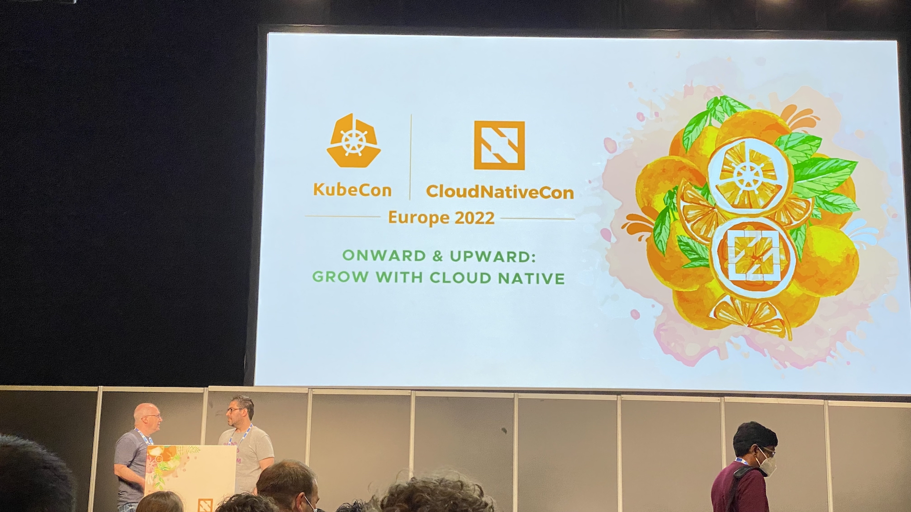
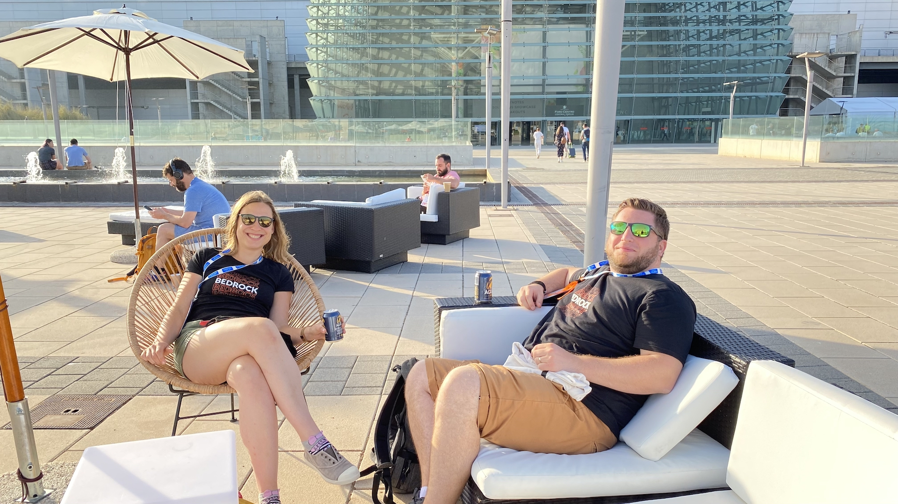

Pour ce second article de synthèse de la KubeCon Europe 2022, continuons sur le thème des performances, peut-être plus bas niveau,
et plongeons aussi dans des outils pouvant être déployés au cœur de nos clusters !

<i>Ca va commencer, @ KubeCon 2022 !</i>

## L’autoscaling, autrement

Une des conférences : *"Autoscaling Kubernetes Deployments: A (Mostly) Practical Guide"* ([vidéo](https://www.youtube.com/watch?v=n8t_hbchQcc)) présenté par NewRelic présentait le principe *d'autoscaling* dans Kubernetes, avec les trois principales ressources associées à ce concept : `ClusterAutoscaler`, `HorizontalPodAutoscaler` et `VerticalPodAutoscler`.

Cette conférence présentait :

 * le fonctionnement du scale up/down des pods avec les périodes de stabilisation ;
 * le calcul par rapport aux indicateurs utilisés ;
 * les types de métriques utilisables par les HPA et VPA.

Pas de grande découverte technique pour nous, mais cette conférence nous a surtout permis de confirmer que, chez BedRock, 
nous sommes de plus en plus matures sur la scalabilité de nos clusters Kubernetes.

La conférence donnée par AWS ([vidéo](https://www.youtube.com/watch?v=UBb8wbfSc34)) portait sur deux aspects :

 * Premièrement, l’utilisation d’instances *Spot* (une option à ne pas négliger si vous souhaitez fortement réduire vos coûts de *compute*) et les bonnes pratiques à mettre en place en utilisant ce type d’instances EC2.
 * Le second traitait de la scalabilité des nœuds avec ClusterAutoscaler mais présentait un nouvel outil de provisionnement de nœuds Kubernetes proposé par AWS : [Karpenter](https://karpenter.sh/).

Une des différences notables par rapport à cluster-autoscaler est que Karpenter ne fonctionne pas avec des AutoScalingGroup AWS 
mais provisionne directement des instances EC2.  
Outre cette fonctionnalité, Karpenter est actuellement à l’étude chez BedRock, notamment car il permet l’utilisation de la 
dimension *région*, ce qui n’est pas possible avec cluster-autoscaler et nous pose des problèmes avec nos statefullsets dans des ASG multiAZ.

## Réseau, Bande passante et GPU

Autre point abordé lors de la KubeCon : comment intégrer la bande passante comme une ressource limitante, de la même façon que le CPU et la RAM actuellement.  
Nous avons pu suivre deux présentations à ce sujet : *"Network-aware Scheduling in Kubernetes"* de José Santos, Ghent University ([video](https://www.youtube.com/watch?v=E4cP275_OCs) et *"Better Bandwidth Management with eBPF"* de Daniel Borkmann et Christopher M. Luciano, Isovalent ([video](https://www.youtube.com/watch?v=QTSS6ktK8hY)).

La première session proposait un nouveau plugin ([repo github](https://github.com/kubernetes-sigs/scheduler-plugins/tree/master/kep/260-network-aware-scheduling)) pour permettre l’orchestration du déploiement de nouveaux pods en fonction de leur charge et coût réseau, afin de réduire la latence des déploiements.  
Une nouvelle fonctionnalité de ce plugin est par ailleurs en développement et permettra d’éviter de déployer sur un nœud ou la bande passante est déjà saturée.

La seconde présentation exposait comment eBPF permet de mettre en place de nouveaux pods en prenant en compte la bande passante. Le replay de la conférence est disponible [ici](https://www.youtube.com/watch?v=QTSS6ktK8hY), nous vous conseillons son visionnage.  
Cette approche pourrait être très intéressante pour Bedrock si nous décidions de migrer [notre plateforme VOD](/2021/12/15/scaling-bedrock-video-delivery-to-50-million-users) sur un cluster Kubernetes : en effet, elle nous permettrait de mieux gérer les burst réseaux et le throttling de la bande passante qui se produisent sur nos instances.

Côté GPU, Google, dans son exposé *"Improving GPU Utilization using Kubernetes"* de Maulin Patel et Pradeep Venkatachalam ([video](https://www.youtube.com/watch?v=X876kr-LkPA)), nous a présenté deux façons de partager des ressources GPU dans un cluster kubernetes :

 * soit en partageant le temps d’utilisation (timesharing, temporal multiplexing) entre conteneurs sur un même nœud,
 * soit en multi-instance GPU (MIG, spatial multiplexing) permettant de partager les ressources en parallèle entre conteneur en allouant une partie des cœurs GPU et de sa mémoire pour chaque conteneur.

Cette conférence sur l’utilisation des GPU dans un cluster k8s nous incite à réfléchir aux optimisations que nous pourrions faire sur nos plateformes vidéo et data…

## Service Mesh : Cilium

Au cours de diverses conférences, nous avons plusieurs fois entendu le nom de *“Cilium”* associé au concept de *Service Mesh*.  
La conférence *“A guided tour of Cilium Service Mesh”* ([vidéo](https://www.youtube.com/watch?v=e10kDBEsZw4)) nous a permis d’en apprendre plus sur ce nouveau service qui ne se base plus sur des sidecars, mais sur eBPF.

Un outil peut-être encore un peu jeune, mais clairement prometteur -- et très certainement quelque chose que nous allons étudier lors d’un POC dans le courant de l’année ;-)

## Récapitulatif

Il n’existe toujours pas d’outils magique pour passer à l'échelle et supporter les pics de charges.  
Toutefois, les solutions présentées au cours de cette KubeCon EU 2022 viennent répondre à des besoins qui sont apparus au fil des années et dont peu d’utilisateurs avaient mesuré l’impact au début de leur périple avec Kubernetes.

Aussi, eBPF continue à faire parler de lui et son utilisation semble se répandre.  
L’idée d’un service mesh plus léger que Istio, par exemple, a l’air fort intéressante !

<i>Rejoignez-nos équipes et venez vivre les prochaines conférences avec nous l’an prochain</i>

