Many of the microservices in our VOD and Replay platform use DynamoDB as their database.  
Performance is very good if the data is architected for it, scalability is reasonably fast, and the serverless aspect offloads a lot of the administration and hosting work. Whether it's performance, resilience or time-to-market, DynamoDB helps us achieve our business goals.

That said, when we spend several hundred thousand dollars on DynamoDB every year, any optimization is good for us!

With DynamoDB, committing to a certain capacity for a year can help reduce costs -- up to 50% savings on that capacity. But how do we know how much to reserve when traffic on our platform varies throughout the day?

<!--more-->

**Table of Contents**

 * [DynamoDB: a not always obvious cost model!](#dynamodb-a-not-always-obvious-cost-model)
 * [How many WCUs and RCUs do we consume?](#how-many-wcus-and-rcus-do-we-consume)
 * [In theory: how much should we reserve, to achieve maximum savings?](#in-theory-how-much-should-we-reserve-to-achieve-maximum-savings)
 * [In practice: let’s calculate how much to reserve!](#in-practice-lets-calculate-how-much-to-reserve)
 * [Finally, let’s create those reservations!](#finally-lets-create-those-reservations)
 * [After reserving, viewing the costs](#after-reserving-viewing-the-costs)
 * [Conclusion](#conclusion)

## DynamoDB: a not always obvious cost model!

*[To skip all the theory about how DynamoDB is priced and WCUs, RCU, on-demand and provisionned billing modes, click here…](#in-practice-lets-calculate-how-much-to-reserve)*

> DynamoDB is serverless[^serverless-but-still-some-work]!

But, as with many AWS services, you have to think for a while before you really understand DynamoDB costs…

[^serverless-but-still-some-work]: DynamoDB is one of the _most serverless_ services we use and I like it a lot. Still, there are a few _admin_ tasks left in our hands. Typically, we have to specify the capacity we need and configure an auto-scaler. We also have to enable encryption, backups, to setup permissions -- and to check all this is done, for all tables, managed by many teams.

### Out of scope costs

We pay for the volume of data stored, the volume of data backed up. These costs are outside the scope of this article and I won't talk about them again today. They are not zero, however, and can even be a significant part of your bill -- for example, if you store large data for a long time[^dynamodb-standard-ia] in DynamoDB. Something you probably shouldn't do!

[^dynamodb-standard-ia]: If you do store a lot of data for a long time in DynamoDB, take a look at [Standard-IA](https://aws.amazon.com/dynamodb/standard-ia/), it might help you reduce costs.

### WCUs and RCUs

Each DynamoDB table can be configured in either *on-demand* or *provisioned* billing mode.

In the second case, we pay for RCUs *(Read Capacity Units)* and WCUs *(Write Capacity Units)*, depending on the capacity we provision for each table.  
Reservations only matter for these RCUs and WCUs, in purple in the screenshot below.

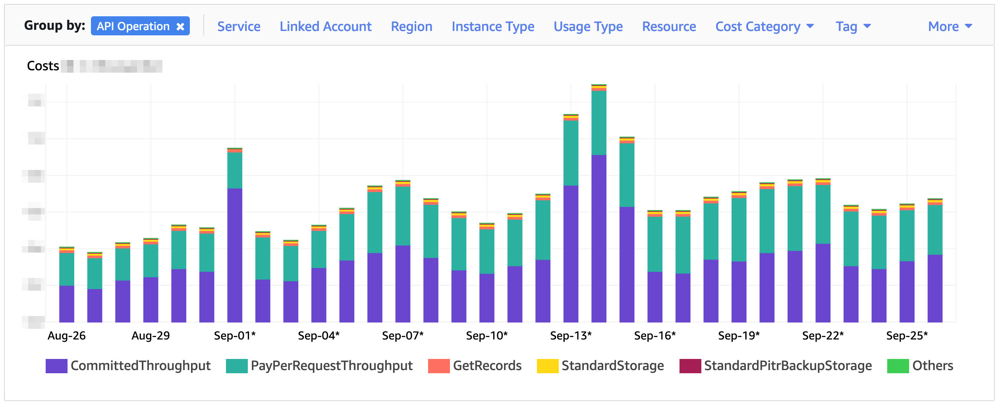

Over the past year, our WCU and RCU costs in provisioned mode represent about half of our DynamoDB costs.  
Storage and backups have costs that we consider negligible today.

*And, from a financial standpoint, we work with far too many pay-per-request tables[^why-so-much-pay-per-request] for my taste.*

[^why-so-much-pay-per-request]: Why do we use pay-per-request so much? Well, in short, because this mode is more flexible than the provisioned one, and several of our projects are willing to pay much more in exchange for this flexibility. 

[The documentation](https://aws.amazon.com/dynamodb/pricing/) will tell you more, but in very broad terms:

* One WCU is consumed when writing one line of data. Or for each 1 KB block written.
* One RCU is consumed to read one line of data. Or for each 4 KB block read.
* In eventually-consistent read mode, only 1/2 RCU is consumed to read one line of data. Or for each 4 KB block.
* Transactional mode costs twice as much.

As you can imagine, the first optimization is to store only what is necessary and to request DynamoDB in the way that best meets the needs of the application, including consistency and costs. Developing a data schema that efficiently meets the needs of the application is crucial. I highly recommend you read [Alex DeBrie's very good "The DynamoDB Book"](https://www.dynamodbbook.com/)! Financial optimization based on reservations should -- and can -- only come afterwards, when usage patterns have been dealt with.

### The on-demand / pay-per-request mode

In *on-demand* mode, we *theoretically* don't have to worry about scalability, DynamoDB handles it for us[^dynamodb-on-demand-scalability].

[^dynamodb-on-demand-scalability]: DynamoDB in on-demand mode and scalability: in practice, AWS hides what's going on, but doesn't scale to infinity instantly either.

In this mode, we pay for each RCU and WCU we consume. If we don't use DynamoDB, we don't pay. If we use DynamoDB, we pay.  
The counterpart is that RCUs and WCUs are more expensive in this mode than in the one presented below.

This mode is therefore very practical, in my opinion, in two cases:

* In an environment where we only perform a few queries from time to time (dev, staging).
* For tables that are usually not used much, but receive large and sudden peaks of requests at certain times.

This mode is not adapted, especially because costs are too high:

* For tables where consumption is stable or varies slowly. Typically, tables for which usage follows our daily traffic wave, which is gentle enough on most applications for a reactive auto-scaling mechanism to meet our needs.

### Provisioned mode

In *provisioned* mode, we configure how many RCUs and WCUs we want and we pay for that number of RCUs and WCUs -- no matter if we consume them or not.  
This billing mode is therefore less flexible than *on-demand*. On the other hand, RCUs and WCUs are less expensive.

In *provisioned* mode, we can set up an auto-scaler on the RCUs and WCUs of the tables that need it. It will dynamically reconfigure the provisioned RCUs and WCUs for those tables, to approximate the actual usage. With an auto-scaler, we can pay as close as possible to our actual consumption, at the provisioned price, which is lower than the on-demand one.  
However, scale-out is not instantaneous: it takes several minutes to detect it needs to act, and then up to several minutes *(especially on a large table)* to do so. Also, scale-in can only be triggered around once per hour. For more detailed information, read [the documentation](https://docs.aws.amazon.com/amazondynamodb/latest/developerguide/AutoScaling.html) and [the quota page](https://docs.aws.amazon.com/amazondynamodb/latest/developerguide/ServiceQuotas.html).

This mode is especially recommended, in my opinion and considering our workloads:

* As often as possible, since each RCU and WCU costs much less than in on-demand mode.

This mode is not suitable:

* On tables where consumption varies very abruptly.

### In provisioned mode, reservations

By agreeing to pay for a certain amount of RCU and WCU for one year *(or even three years in some regions)*, these RCU and WCU become even cheaper: up to ~50%[^50-percent-savings] cheaper than in default-provisioned mode.  
Reserving capacity is a great way to considerably reduce the cost of read/write operations on DynamoDB!

[^50-percent-savings]: 50% is kind of the maximum possible saving we can achieve if our usage is flat and we reserve exactly what we provision. Flat usage might be what you see on your applications, but it's not how our platform works!

Reservations lock us for one year. We will pay for the reserved RCUs and WCUs, whether we use them or not.  
It is therefore important to calculate correctly the reservations to be made.

Also, we pay a part of the total yearly amount at the beginning of the commitment *(= "upfront")*, which means we must be able to invest a certain amount in advance.  
The other part is spread over all the months of the commitment period.

As a consequence, the *big question*, to which the rest of this document tries to answer, is: *"how many RCU and WCU should we reserve to keep our costs as low as possible?"*  
When our consumption varies throughout the day, this calculation is pretty fun ;-)

Reservations are global to an AWS account, or even to all accounts on a consolidated bill[^consolidated-billing].

[^consolidated-billing]: At Bedrock, we have a dedicated billing account -- a *"payer account"* -- that aggregates costs from all our other accounts. Reservations are also shared amongst all (whitelisted) accounts that have a shared payer account.

→ Reserved pricing is documented on the [page of "provisioned" pricing](https://aws.amazon.com/dynamodb/pricing/provisioned/).  
→ You can also read [this whitepaper](https://docs.aws.amazon.com/whitepapers/latest/cost-optimization-reservation-models/amazon-dynamodb-reservations.html).

## How many WCUs and RCUs do we consume?

For the rest of our reasoning and this article, we only count the consumption in *provisioned* mode (and exclude *on-demand*), since that's where we can play with reservations.  
Also, we count provisioned WCU and RCU and not what is actually consumed -- so beware of any potential *waste*.

On the DynamoDB Web Console home screen, we can see, for an account and a region, how many WCUs and RCUs are provisioned at the current time:

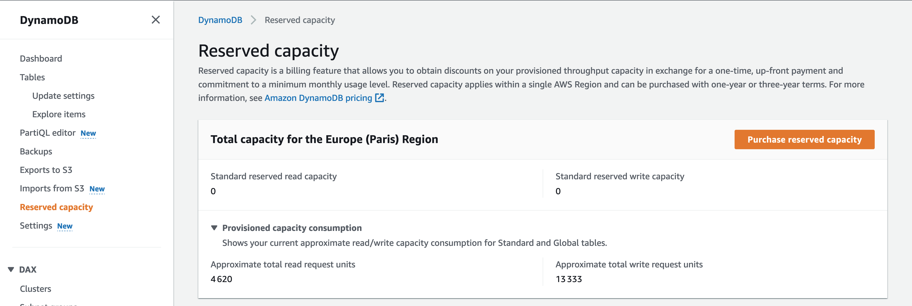

But these numbers only give a view at a given instant, in a single AWS account and in a single region.  
We deploy our platform across dozens of accounts and multiple regions, with traffic that changes throughout the day, so this is not enough.

### Table WCUs/RCUs

For a global view of all tables in an account in a region, we can query Cloudwatch Metrics, analyzing the `ProvisionedWriteCapacityUnits` or `ProvisionedReadCapacityUnits` metrics:

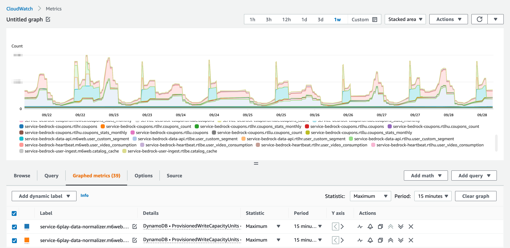

The Stacked Area view shows, at any given time, the total WCUs (or RCUs) provisioned for all of our tables, in an account and a region.

### WCU/RCU of GSI

We also need to count the WCUs/RCUs of the Global Secondary Indexes -- and these are different metrics! Or, at least, the metrics are shown in a different category in the Cloudwatch web console.

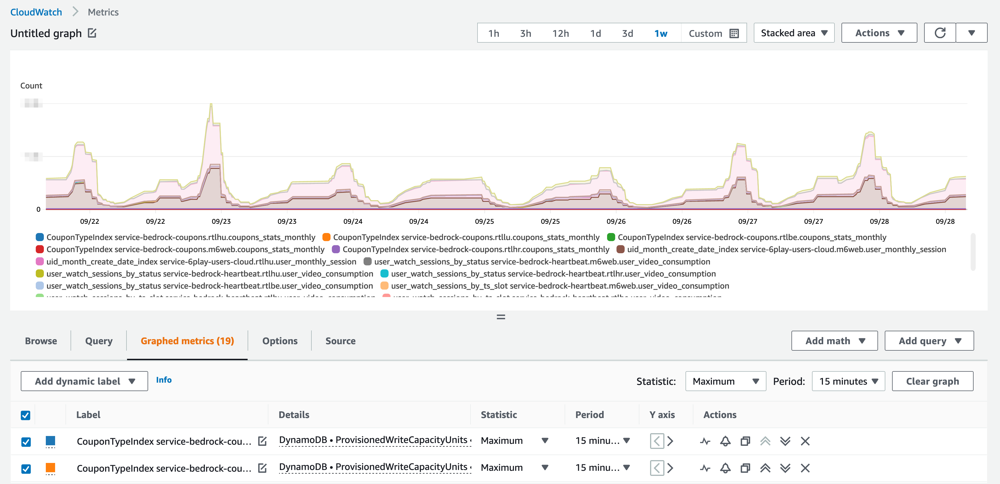

### So, in total...

To get the total, you have to consider this metric for the tables and for the Global Secondary Indexes! In the Cloudwatch console, you have to search in two categories.  
Graphing it all :

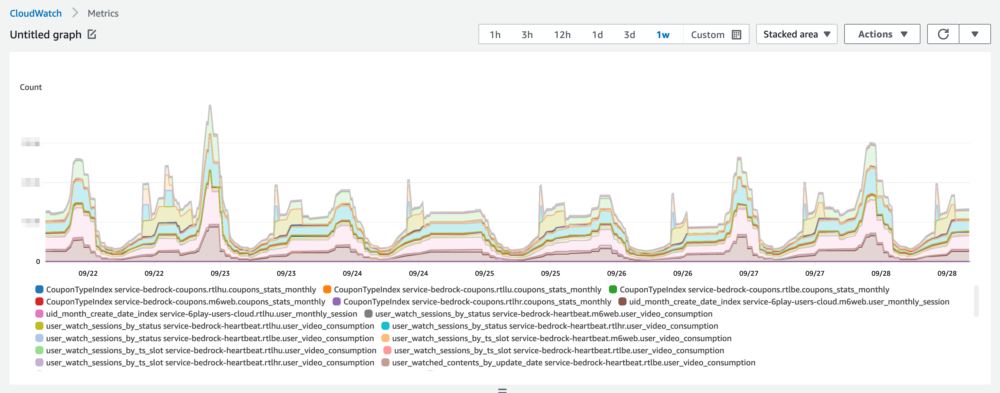

Of course, this is to be looked at for WCUs, but also for RCUs, following exactly the same principle.  
And, again, we're working in multiple accounts and regions.

## In theory: how much should we reserve, to achieve maximum savings?

Once we know how much capacity we're actually using, we can move on to reservations.

But the calculation would be far too easy if our usage was flat!  
In reality, thanks to auto-scaling, our provisioned capacity follows our usual traffic pattern: a wave.

And, two things:

* if we reserve more than we provision, we'll waste money.
* if we reserve less than we provision, we won't save as much as we could.

### Reserve at the bottom of the wave

A first idea is to reserve the lowest value we provision throughout the day: what we provision at the bottom of our traffic wave, at night.

In this case, we are not wasting money, as we always provision 100% or more of our reservation.  
But we are probably minimizing our savings, since we are provisioning more than the reservation, all day long.

### Reserve at the top of the wave

A second idea, kind of the opposite, is to reserve the highest value we provision throughout the day.  
This way, we will never pay the full rate for any WCU/RCU.

But, in this case, we will be wasting a lot of money, since all day long we will be provisioning less than our reservation.  
This is a *bad idea*.

### Reserve "in the middle", thanks to careful calculations

Now, the real solution: calculate the *right value*:

* Less than *the highest value*, to minimize waste.
* And more than *the lowest value*, to optimize savings.

## In practice: let's calculate how much to reserve!

Manipulating metrics in Cloudwatch, for visualization, may be acceptable, although we rarely do it since we use other stacks for our metrics. And aggregating metrics from multiple accounts should be feasible *(we haven't tried it)*.  
But for calculations, it is not enough.

### Exporting metrics

As a first step, we exported the metrics visualized above, to be able to manipulate them in another tool -- in a spreadsheet, for example.  
To export these metrics from Cloudwatch, we can query its API. We need to do this for all accounts and for each table, which is complicated to do manually.

To simplify the task, we started working with a script that exports this data to a CSV file.  
Specifically, this script exports one data point per hour: the number of WCUs or RCUs actually provisioned during that hour.

Running this script for a *representative week*, we have enough data to calculate the ideal reservations.

> **🗓️ Representative week?**  
> Of course, we have to be careful to choose the week we focus on.  
> If we work with data from a week with a huge unexplained peak of traffic, the results of our calculation will fit that week, but not so much to the rest of the year!

### A Google Spreadsheet calculation

Importing this data into a Google Spreadsheet, we get two columns: a date+time and a number of WCUs.  
And this is for each one-hour range during an entire week:

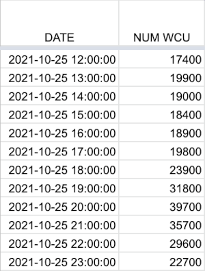

> **ℹ️ Only twelve hours**  
> Here, I only reproduce twelve rows corresponding to twelve hours, but keep in mind that there are actually 168 rows in my spreadsheet: one row per hour, 24 hours per day, for 7 days.  
> Also, the values used for this article are all *simulated*, to avoid sharing sensitive information, but they scrupulously respect the shape of our traffic and usage wave.

The next step is to integrate the cost of these WCUs.  
Easy anough, we multiply the number of WCUs by the cost of a WCU in Paris, i.e. $0.000772.  
And the sum of the cost of each line gives us the total cost, without reservation:

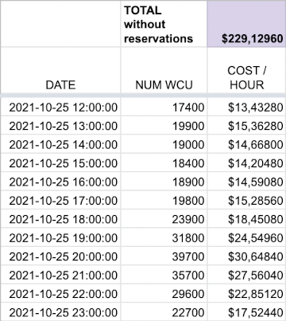

### The calculations, on an assumption

Now, let's assume, for the time being, that we reserve 25,000 WCUs:

 * The upfront, each hour, is $5.07991.
 * And, each hour, we also have to pay $3.82500 for this capacity, since the upfront is only partial.

In addition:

 * During some hours, when we consume less than 25,000 WCU, we will not pay anything extra.
 * During some other hours, when we consume more than 25,000 WCU, we will have to pay a supplement, at the full provisioned rate.

Adding these data, we obtain a different hourly cost, often lower than the one determined above.  
And, therefore, we get a lower total cost as well:

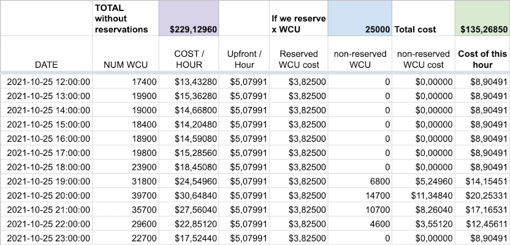

With this hypothesis of a 25,000 WCU reservation, over these twelve hours, we would pay 135 dollars instead of 229 dollars without reservation.  
We would then realize 40.96% savings!

### The calculations, until we find the right value

Of course, during the hours when we consume less than 25,000 WCU, we are wasting capacity: we are paying for it, without using it.

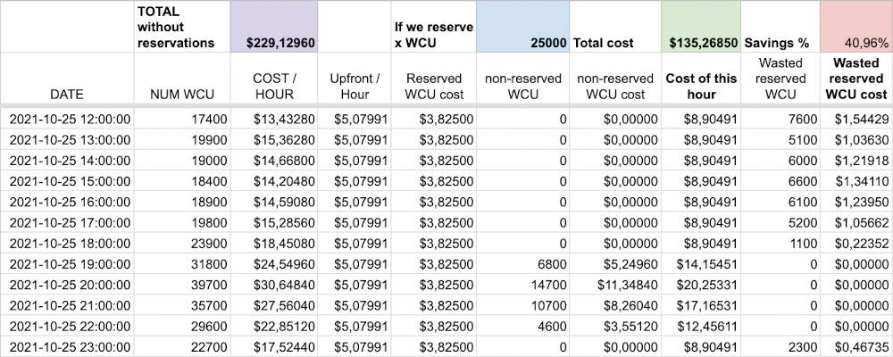

The goal of the game is to find the *right number* of WCUs to reserve: we want to reduce the total cost as much as possible, maximizing the percentage of savings.

To do so, we try different values for the number of WCUs reserved, until we find the one that maximizes the percentage of savings:

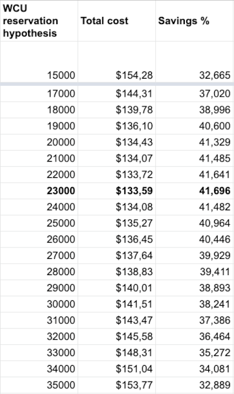

Here's the same thing as a graph:

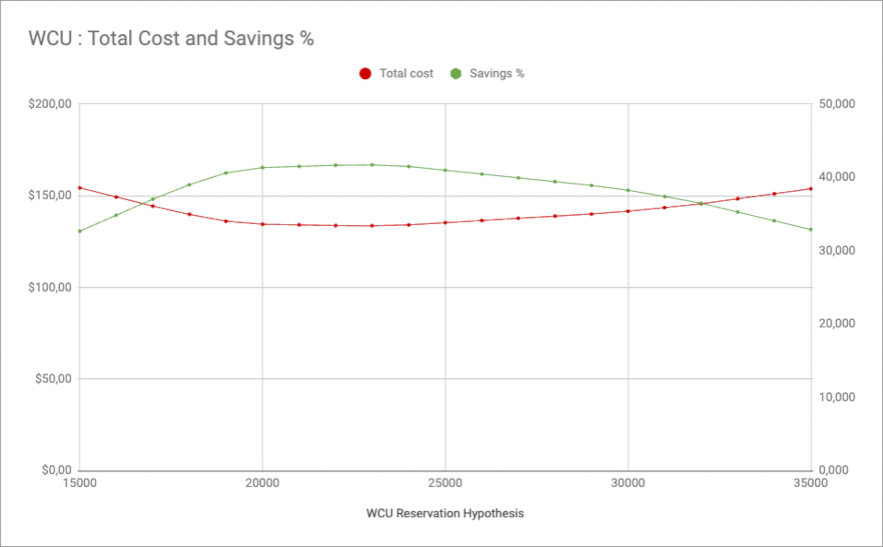

Here, over these twelve hours, the optimal approach would be to reserve 23,000 WCU.

> **💪 Getting real: an entire week**  
> In reality, we perform exactly the same calculation and we follow this very same logic, on 168 lines of data, corresponding to a *representative week*.

### Easier calculations?

The first year we tried to reserve capacity, we quickly wrote a script to collect the data from Cloudwatch and export it as CSV.

We still haven't, after three or four years now, written a program that would perform the calculations based on this data to come up with the *right value* for the number of WCUs or RCUs to reserve.  
As a matter of facts, copying and pasting data from the CSV export to a spreadsheet only takes a minute, we reuse the same year after year, and its visual aspect is nice!

Also, we only do these calculations and reservations twice a year, so we don't spend too much time working on this, while still refining more often than once each year.  
Each time, the process takes two of us[^pair-reserving] about two hours, or one day per year in total... And the most time-consuming part is talking to our colleagues who are heavy DynamoDB users, and asking them *"are you planning to reduce the consumption of your project over the coming year?"*

[^pair-reserving]: For these kind of calculations and reservations, we usually work in pair, as this involves large amounts of money. Lowering risk of doing a costly mistake is quite a good idea.

## Finally, let's create those reservations!

We calculated how many WCUs and how many RCUs we should reserve to achieve the best possible savings, hoping the week we chose to base our calculations on was actually a *representative week*.

### A commitment: be careful...

A reservation commits us to pay for a year, whether we use this capacity or not.

So, it's always a good idea to take a moment to validate with our colleagues that they are not planning to use less DynamoDB in the near future.  
Of course, the answer is often partly *"it depends"*, since usage depends on new projects as well as on the traffic on our platforms, but if we can already anticipate the next planned optimizations, it's always a good thing.

In November 2022, we can only open DynamoDB reservations for one year if we work in the AWS Paris region.  
Other regions *(us-east-1 for example) allow* reservations for three years, which means more substantial savings. On the other hand, would we be willing to commit for three years and lose a major advantage of *The Cloud*, its flexibility?

### Which account to reserve on?

[The documentation](https://aws.amazon.com/dynamodb/pricing/provisioned/) says (emphasis mine):

> If you have multiple accounts linked with consolidated billing, **reserved capacity units purchased** either **at the payer account level** or linked account level **are shared with all accounts connected to the payer account**.  
> Reserved capacity is applied first to the account that purchased it and then any unused capacity is applied to other linked accounts.

We have configured our AWS accounts to have a single payer account.  
We have decided to make all our reservations in this account and they are applied to the child accounts without discrimination.  
This applies to DynamoDB but also to RDS, EC2, Elasticache...

### Reserving!

To reserve, we go through the AWS DynamoDB Web console, in our payer account, in the region where these reservations will be used.

On this screen, you can see how many WCUs and RCUs we have already reserved.  
Since we make several reservations during the year, the reservations already in progress are to be subtracted from the values calculated above!

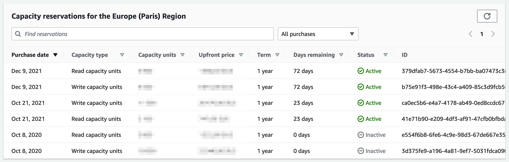

To create a new reservation, click on *"Purchase reserved capacity"* and fill in the form ;-)

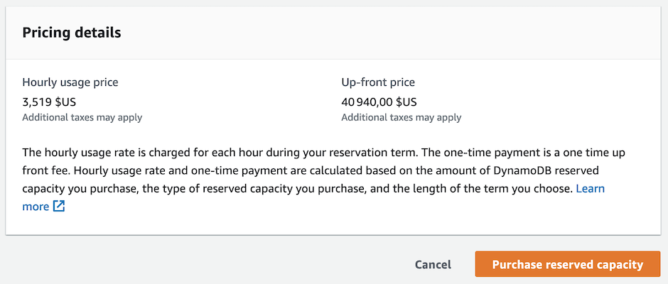

## After reserving, viewing the costs

Once the reservations are made, in AWS Cost Explorer, the upfront cost is clearly visible.  
It is charged at once, on the day we opened the reservation:

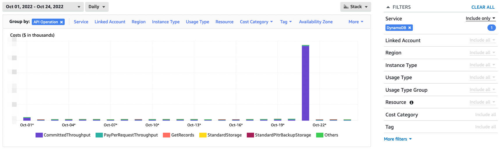

To have a daily view of WCU/RCU costs *(reserved + provisioned in addition to reservations)*, remember to fill in *"Show costs as: Amortized costs"* to smooth the monthly price of reservations over all days of the month:

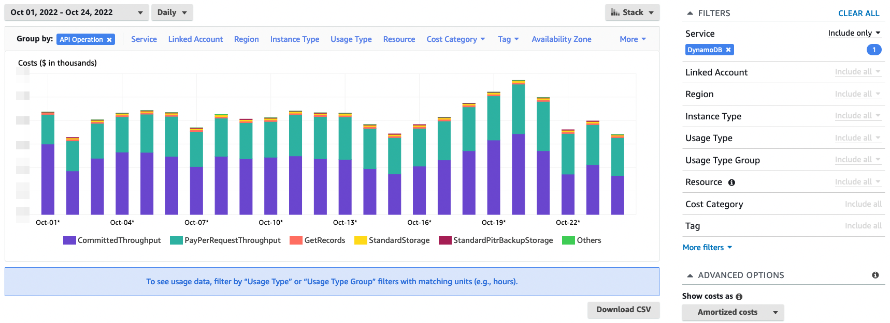

> **Reservations and one payer account**  
> Since reservations, which cover the bulk of our DynamoDB costs, are made on our payer account, the bulk of our DynamoDB costs go back to this account... And not to the tenant/environment accounts.  
> Good luck tracking costs and allocating them to projects and teams 💪

## Conclusion

We work with DynamoDB a lot, for several dozen microservices, and we face several types of infrastructure costs: on-demand reads/writes, provisioned reads/writes, storage, backups.  
In exchange for a loss of flexibility and through reservations that commit us for a year, AWS allows us to reduce the cost of provisioned reads/writes.

Determining how much to reserve, in the face of a constantly changing load, is not easy.  
We need to have a certain vision on the evolution of usage, over a year, and must accept to lose flexibility.  
And we need to find the *right values* to reserve for read and write capacity.

With three or four years of hindsight, by making reservations twice a year and by following the method detailed in this article, we realize savings of about 30% to 35% on our read and write capacity in provisioned mode.  
On our scale, this saving represents several tens of thousands of dollars per year -- which is great, considering we only spend a few hours working on this every six months!

 
