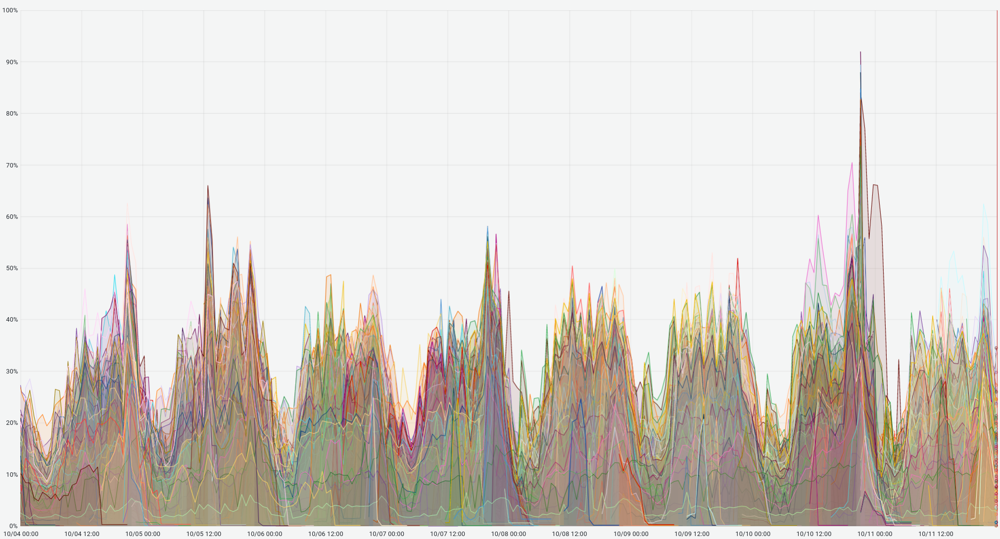
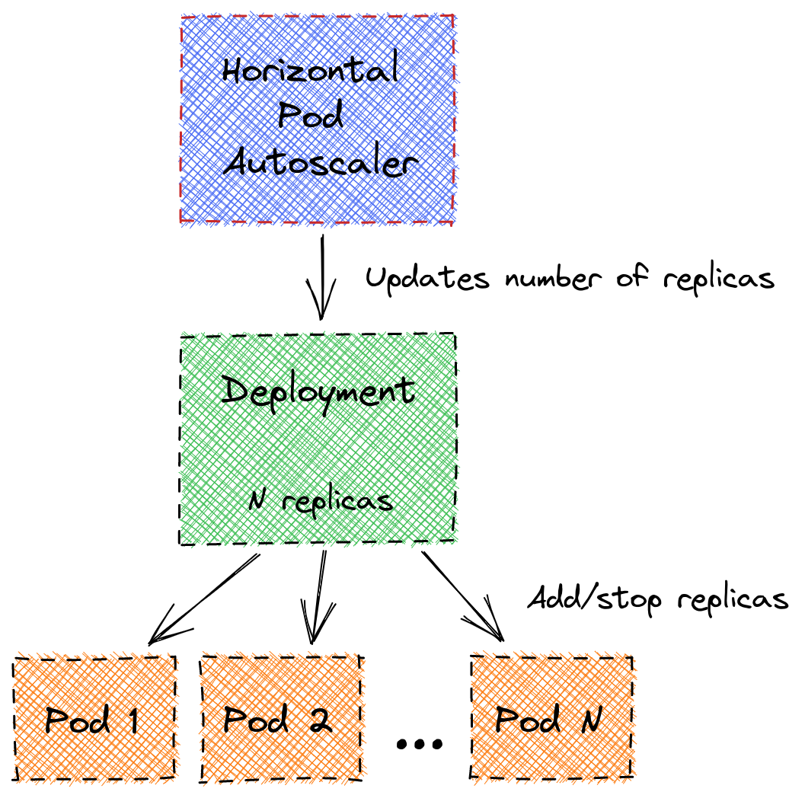
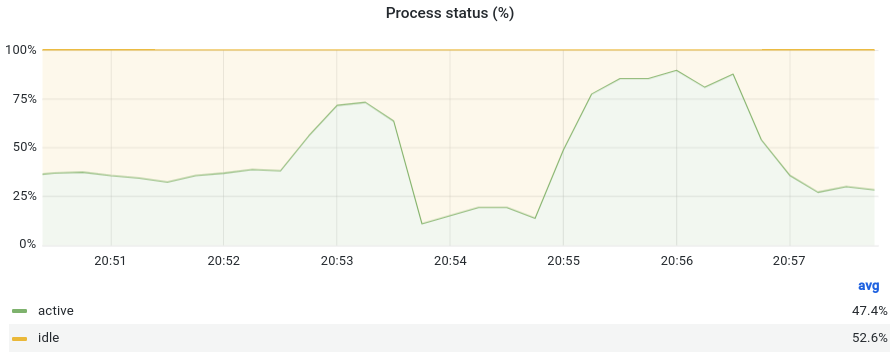
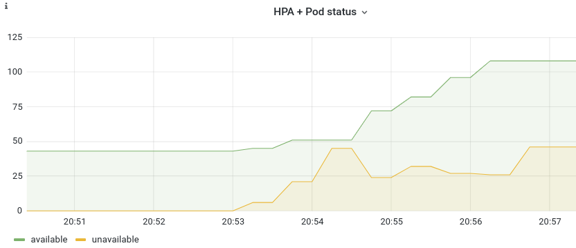
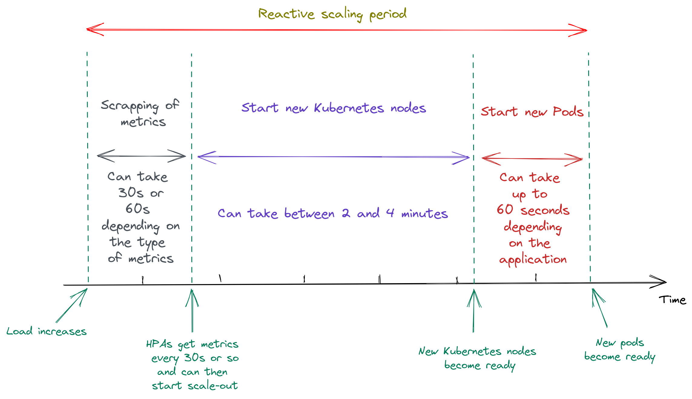
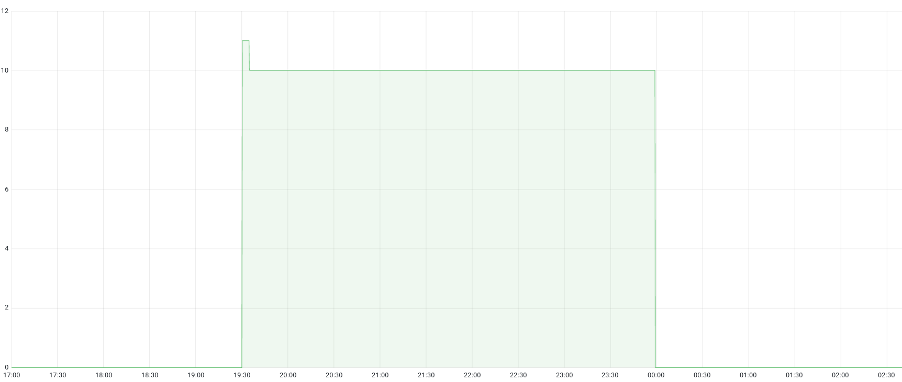

Are you experiencing peak loads on your Kubernetes-hosted platform? Rest assured, you are not alone.
At Bedrock, we have developed a prescaling solution. It allows us to handle sudden and abrupt, but predictable, 
traffic spikes, like soccer games. 

Kubernetes provides HorizontalPodAutoscalers to handle traffic variations. 
We'll look at their limitations in the case of meteoric spikes in load and how prescaling helps us deal with the 
sudden arrival of several hundred thousand users.

## Table of Contents

* [Load and traffic vary](#load-and-traffic-vary)
* [Beginning of the scaling problems](#beginning-of-the-scaling-problems)
* [How does reactive scaling work in Kubernetes?](#how-does-reactive-scaling-work-in-kubernetes)
  * [An HorizontalPodAutoscaler](#an-horizontalpodautoscaler)
  * [What scale out looks like in a real case](#what-scale-out-looks-like-in-a-real-case)
  * [How fast is reactive scaling?](#how-fast-is-reactive-scaling)
* [Prescaling… What is this about?](#prescaling-what-is-this-about)
* [Prescaling our applications](#prescaling-our-applications)
  * [Enabling and configuring prescaling on an HPA](#enabling-and-configuring-prescaling-on-an-hpa)
  * [The prescaling exporter](#the-prescaling-exporter)
  * [How can the HPAs prescale?](#how-can-the-hpas-prescale)
  * [Prescaling works!](#prescaling-works)
* [What about special, huge, events?](#what-about-special-huge-events)
  * [The prescaling API](#the-prescaling-api)
  * [Let’s see how an application scales during a very special event](#lets-see-how-an-application-scales-during-a-very-special-event)
* [Prescaling external services: another challenge](#prescaling-external-services-another-challenge)

## Load and traffic vary

Load and traffic have always varied over time on our platform:


<center><i>CPU per instance over time</i></center>

To deal with these load variations, several tools help us to automatically adapt our Kubernetes clusters’ capacity:
* [HorizontalPodAutoscaler](https://kubernetes.io/docs/tasks/run-application/horizontal-pod-autoscale/) 
(HPA): adds/removes Pods (= capacity) on a workload resource such as Deployment or a 
StatefulSet.
* [Cluster Autoscaler](https://github.com/kubernetes/autoscaler/tree/master/cluster-autoscaler): 
adjusts the size of a Kubernetes cluster by adding/removing nodes.
* [Overprovisioning](https://github.com/kubernetes-sigs/cluster-proportional-autoscaler): starts “empty” 
pods (and new “useless” nodes, as a consequence), so the cluster has available capacity that will be used to start 
applications pods quicker.

> If you wish to know more about which tools we use and why we use them in our Kubernetes clusters, I advise you to 
check out another dedicated blog post named 
["Three years running Kubernetes on production at Bedrock"](/2020/12/08/Three-years-running-kubernetes-on-production-at-Bedrock).

Unfortunately, all those tools are not sufficient to deal with heavy and sudden traffic spikes on some special 
evenings such as the final of a football game or a successful show. During this kind of events, users arrive massively, 
all at the same time. On some evenings, some of our applications see their load rise by 5 in 2 minutes, others even 
see theirs multiplied by 10 in 2 minutes!

The predictable aspect of those arrivals is very important because it means we are able to prepare our platform 
beforehand. That’s why our prescaling solution was born.

## Beginning of the scaling problems

On an ordinary evening, when the multiple Kubernetes scaling tools were kicking in, here is basically what was 
happening:


As the load increased, our capacity was increasing as well and we always had spare capacity. We were able to double our 
initial capacity every 5 minutes thanks to reactive scaling when load started to rise.

After a while and on some special evenings, we began to see this kind of behavior:


Sometimes, load was increasing faster than what reactive scaling could handle, that is to say about x2 in capacity 
every 5 minutes. The consequence is that we could not serve everyone. For a while, our platform would fail for some 
users, until autoscaling kicked in or until load stopped rising so fast.

Let's see how reactive scaling works to understand how we can leverage it to prepare the platform in advance.

## How does reactive scaling work in Kubernetes?

### An HorizontalPodAutoscaler

For a Deployment to be autoscaled (reactively, according to varying load), the number of replicas of a Kubernetes 
Deployment is reconfigured by an HorizontalPodAutoscaler:



Its manifest usually looks like this:
```yaml
apiVersion: autoscaling/v2beta1
kind: HorizontalPodAutoscaler
# …
spec:
  # …
  minReplicas: 2
  maxReplicas: 100
  metrics:
  - type: Resource
    resource:
      name: cpu
      targetAverageUtilization: 70
  - type: Pods
    pods:
      metricName: phpfpm_active_process_percentage
      targetAverageValue: "40"
  # …
```

Here:
* `minReplicas` is the minimum number of Pods that will run (under normal conditions).
* `maxReplicas` is the maximum number of Pods that will run.
* `metrics` is a list of metrics the HPA will analyze to determine if it must scale or not. If usage gets higher 
than the target specified for a metric, the HPA will add new Pods (= scale out). If usage gets lower than all targets 
specified for all metrics, the HPA will remove Pods (= scale in).

### What scale out looks like in a real case

At Bedrock, we use three types of metrics to scale: `Resource`, `Custom` and `External`. Here is an example of 
an application scaling out on a `Custom` metric:


<center><i>Process status (%) over time</i></center>

In this graph, around 20:52:30 and 20:55:00, the percentage of active processes rises to go above 
the target `40` we saw in the YAML example before. This triggers the scale out of the HPA of this application:


<center><i>Pod status over time</i></center>

We can see that around 20:53:00 (30 seconds after we first go above the target), the number of `unavailable` pods rises. 
The scale-out has just started. A few moments after, the pods become `available` and are able to serve users.

### How fast is reactive scaling?

Scaling in Kubernetes with HPA is not instantaneous:



* Metrics are updated every 30 seconds (for CPU or memory) or every 60 seconds (for external and custom metrics) or so.
* HPA analyses the metrics to know if scale-out is required every 30 seconds or more.
* We might not have enough EC2 servers running to host the new Pods that are trying to start (we usually have between 
10% and 20% of spare capacity). If starting new EC2 servers is necessary, this takes between 2 and 4 minutes.
* Pods (as our applications and Docker images are big) usually need between 30 and 60 seconds to start.

This means when a spike in load occurs, we need between 1’00’’ and 6’00’’ for new Pods to be able to handle that load. 
Scaling is clearly not instantaneous.

## Prescaling… What is this about?

Most our applications deployed in Kubernetes use an HorizontalPodAutoscaler. As we’ve seen, this autoscaling 
mechanism is reactive in nature: Pods are added when load (or another metric) gets higher than a target. 
It can handle load that increases slowly (say, instant +20% or x2 in 5 minutes), but not huge instantaneous spikes 
(say, x10 in less than 5 minutes). It works fine for most of our usual workloads, but cannot absorb spikes we receive 
during special events like Top Chef or when the France football team plays.

The only way we can handle a huge and sudden spike in traffic on an application is by pre-provisioning capacity. 
In Kubernetes, this is done by running more Pods than necessary so that they are ready to handle the additional load. 
Running additional, mostly superfluous, capacity has a cost…

We know our applications receive a sudden and brutal traffic spike once a day, between 20:50 and 21:00 Paris time. 
Not taking special events into account, that’s the only time load increases violently enough for reactive autoscaling 
to be unable to handle it – and, most days, it actually does quite fine. So, we could pre-provision more capacity 
around that time (only), and not pay for it the rest of the day…

## Prescaling our applications

### Enabling and configuring prescaling on an HPA

To enable and configure prescaling on an `HorizontalPodAutoscaler`, we add two sets of information:
* Three annotations to define:
  * Time when prescaling starts.
  * Time when prescaling stops.
  * The minimum number of Pods we want between those two times.
* A new metric to scale on.

The annotations are set in the metadata block:
```yaml
# …
metadata:
  # …
  annotations:
    annotations.scaling.exporter.replica.min: "25"
    annotations.scaling.exporter.time.start: "19:30:00"
    annotations.scaling.exporter.time.end: "23:30:00"
spec:
  scaleTargetRef:
    # …
    name: "service-6play-images"
```

In this example, we indicate we want at least 25 pods between 19:30:00 and 23:30:00. As a result, 
the number of pods of this application will rise up to at least 25 pods during this period of time.

Times are expressed in the local timezone of the Kubernetes cluster as prescaling is linked to events on the platform. 
Those events are usually linked to events on live TV and we deploy one cluster per TV broadcaster.

In the `metrics` block, you need to configure a new `External` metric:
```yaml
# …
metrics:
 # …
 - type: External
   external:
     metricName: "annotation_scaling_min_replica"
     metricSelector:
       matchLabels:
         deployment: "service-6play-images"
     targetValue: "10"
```

The label used for `deployment` must be set to the value of `scaleTargetRef.name` (= the name of the `Deployment` the 
HPA reconfigures). The `targetValue` must always be set to `10`.

You now know how we configure an HPA for prescaling. What you do not know yet is how the HPA annotations are used 
and which application exposes the metrics called `annotation_scaling_min_replica`. It’s now time to talk about the 
prescaling exporter.

### The prescaling exporter

The prescaling exporter is a [Prometheus](https://prometheus.io/) exporter we developed (in Python). 
It exposes metrics, used to scale Kubernetes applications on a day-to-day basis during a given time range.

> Prometheus is one of the tools we use in our monitoring stack at Bedrock. One of its purposes, among others, is to 
collect metrics from Pods. This article will not present our Prometheus stack in detail. 

Here is how the prescaling exporter works:


1. Every 15 seconds or so, Prometheus scrapes the prescaling exporter pod to get the metrics it exposes.
2. Scrapping triggers the generation of the metrics. Before they are exposed, the exporter first 
   calls the k8s API to list all HPAs in the cluster.
3. Then, it will:
   * Filter those HPA with the required annotations (the annotations we added a bit earlier on an HPA).
   * Calculate the new `annotation_scaling_min_replica` metric for each HPA with the prescaling annotations.
   * The prescaling exporter can now expose the metrics.
4. And Prometheus can retrieve them.

How does the prescaling exporter calculate the metrics of the HPA subscribed to the prescaling? Well, it depends 
on the content of the annotations you configured on the HPA.

Here is how a Prometheus metric of the prescaling exporter looks like:


In each metric, you will find several labels. I chose to put only one here to simplify.
The metric can take one of three values, depending on the content of the annotations we saw earlier:
* When we are not within the time range of the prescaling annotations of the HPA, it means that we do not 
need to prescale. As a result, the metric is set to `0`.
* If we are within the time range of the prescaling annotations, it means we are in the prescaling time range. 
From there, two possibilities:
  * If “Current number of replicas” < “Number of minimum replicas in the HPA annotation”, we need to add replicas so 
  the metric is set to `11`.
  * If “Current number of replicas” >= “Number of minimum replicas in the HPA annotation”, we have enough replicas so 
  the metric is set to `10`.

> When the metric is set to 10 and we already have enough replicas running, the number of replicas will never go below 
the minimum chosen in the prescaling annotation `annotations.scaling.exporter.replica.min`.

Here is what it looks like on Grafana for the application `service-6play-images` during the evening:


<center><i>annotation_scaling_min_replica over time</i></center>

In this example:
* Until 19:30, `annotation_scaling_min_replica` is set to 0.
* From 19:30 until about 19:35, `annotation_scaling_min_replica` is set to 11 (scale-out will happen).
* From 19:35 until 00:00, `annotation_scaling_min_replica` is set to 10 (scale-out is done, we have enough Pods).
* From 00:00 until the following evening, `annotation_scaling_min_replica` is set to 0 again.

We can guess two things from this example:
1. The prescaling period for this application was 19:30 until 00:00.
2. It took about 5 minutes to prescale (= add more Pods) the application.

### How can the HPAs prescale?

To understand how the HPAs can prescale, we need to talk about 
[the prometheus adapter](https://github.com/kubernetes-sigs/prometheus-adapter). It is an implementation 
of the Kubernetes metrics APIs. We use it to expose custom and external metrics for HPAs to use in order to scale:


1. Prometheus adapter collects metrics from prometheus once every minute and exposes them as `External` and
`Custom` metrics.
2. The HPA controller manager fetches metrics provided by metrics-server and prometheus-adapter to scale out or 
scale in Deployment/Replica Set/Stateful Set resources. To do so, it uses k8s aggregated 
APIs (`metrics.k8s.io`, `custom.metrics.k8s.io` and `external.metrics.k8s.io`). 
Metrics-server provides resource metrics (only CPU and memory). 
Prometheus adapter provides all non-resource metrics (external and custom).

For more information: [HPA Kubernetes documentation](https://kubernetes.io/docs/tasks/run-application/horizontal-pod-autoscale/).

### Prescaling works!

After prescaling has been deployed into production and teams started to add annotations in their projects, 
this is what happened:


<center><i>Number of pods regarding their status over time</i></center>

Around 19:30, the number of pods for this application goes from 25 to a bit more than 55. It means its HPA was 
scaled out, based on the prescaling metric of that application. Mission accomplished!

## What about special, huge, events?

Some days, during very special events, “normal” prescaling was not enough to handle the load that was rising 
way faster than what we usually see on our platform:


As you can see, even with prescaling doing its job before the start of the TV program (we can see capacity 
rising at the beginning of the graph), the traffic rises so quickly at 20:55 that we are still unable to scale fast 
enough to serve all users.

For these special events, we have developed an additional mechanism that allows us to set a multiplication coefficient 
to all prescaling. We use it to say “I want a 5x higher minimum number of Pods than what’s configured in the annotation 
we’ve seen before, for all HPAs bearing this annotation”.

To deal with those very special events, we added another component in the prescaling stack: the prescaling API.

### The prescaling API

The prescaling API is a backend application also developed in Python. It was designed to store prescaling 
settings for future events on the platform in AWS DynamoDB. We chose DynamoDB because it’s a serverless database 
easily maintainable through Terraform code. By “event”, understand a football game or another big show such as 
Top Chef. Those settings define when and how we must enlarge the platform to sustain bigger 
traffic spikes than on standard days (= on normal prescaling evenings).


With this API, our prescaling workflow has evolved:

1. Prometheus scrapes the prescaling exporter pod, same as before.
2. Scrapping triggers the exposition of the Prometheus metrics. Before the metrics are exposed, the exporter first 
calls the Prescaling API server to get the current special event if there is one.
3. After calling the prescaling API, the exporter calls the k8s API (as before) to list all HPAs in the cluster.
4. Then, it:
   * Filters those HPA with the required annotations.
   * Calculates the new `annotation_scaling_min_replica` metrics by merging information from the HPA annotations and 
     the special event from the `prescaling-api` server.
5. The prescaling exporter now exposes the metrics so that Prometheus can retrieve them.

### Let’s see how an application scales during a very special event

Here is how the number of pods evolves with a special prescaling event configured:


<center><i>Number of pods by status over time</i></center>

For this specific application, we had around 25 pods during the day and standard prescaling was configured at 
40 pods in the HPA annotations. On normal days, we would have had about 40 pods throughout the evening. 
On this particular day, we had around 125 pods: a ”x3” multiplier was applied, thanks to the prescaling API.

## Prescaling external services: another challenge

Reactive scaling still answers most of our needs. We are still able to do “x2 every 5 minutes” in Kubernetes. 
Prescaling is great, it can help critical applications to sustain sudden and expected traffic spikes we had 
problems dealing with before. On top of that, prescaling for special events even allows us to deal with extreme cases.

Still, the applications we prescale often depend on external services: a database, a cache, a search engine… 
Most of these external services will not prescale as easily as with our prescaling solution. 
Some services, like AWS DynamoDB or AWS Aurora serverless, come with a reactive autoscaling solution, 
but not all of them. And still, even those autoscaling services have limits…

---

_Very special thanks to all my Bedrock Streaming colleagues who helped me improve this blog post._
