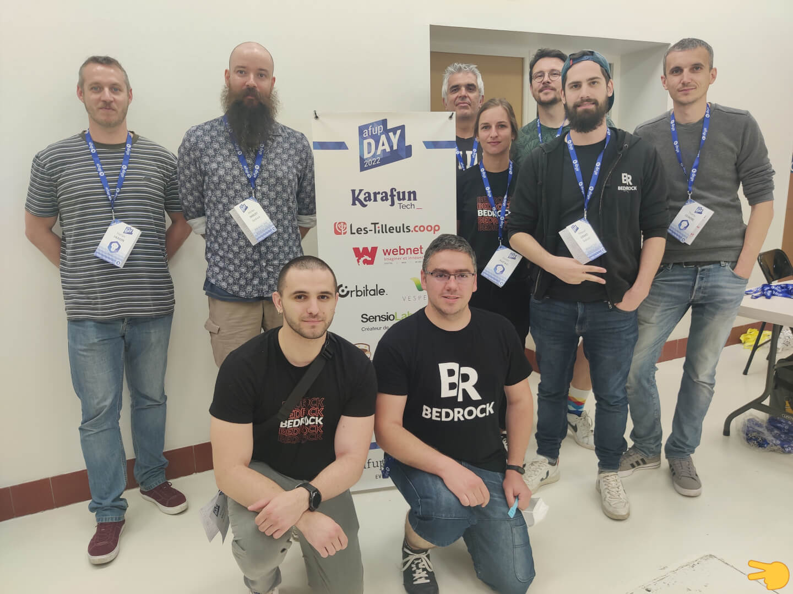
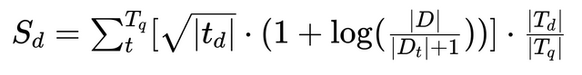
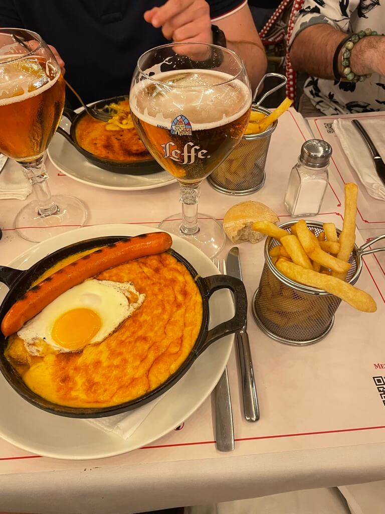

Cette année encore, Bedrock participait à l'[*AFUP Day 2022*](https://event.afup.org/afup-day-2022/), nous avons eu la chance de profiter de conférences de qualité et aux sujets variés.

## PHP 8.1 en détail

[*Damien Seguy*](https://twitter.com/faguo) nous a parlé des nouveautés de PHP 8.1 mais aussi de celles de PHP 8.2 qui arriveront prochainement.

Damien nous a parlé en vrac :

- de l'ajout du format [*AVIF*](https://www.php.net/manual/fr/function.imagecreatefromavif.php) dans [*GD*](https://www.php.net/manual/fr/book.image.php)
- l'ajout des fonctions [*fsync*](https://www.php.net/manual/fr/function.fsync.php) et [*fdatasync*](https://www.php.net/manual/fr/function.fdatasync.php) qui permettent de synchroniser les données d'un fichier sur l'OS. Cela veut dire que le fichier sera bien écrit sur le disque.
- l'arrivée de la prise en compte du format ristreto255 avec le libsodium
- de la fonction [*array_is_list*](https://www.php.net/manual/en/function.array-is-list.php)

Le conférencier a insisté sur le fait de ne pas hésiter à monter de version régulièrement. Il est possible d'utiliser les polyfills déjà existants (pour la [*8.1*](https://github.com/symfony/polyfill-php81) et même la [*8.2*](https://github.com/symfony/polyfill-php82)) ou d'ajouter ses propres fonctions, mais de bien faire attention d'utiliser [*function_exists*](https://www.php.net/manual/fr/function.function-exists.php) pour préparer les migrations.

Une des nouveautés phare de la version 8.1 est l'ajout de la gestion des [*enums*](https://www.php.net/manual/en/language.types.enumerations.php). Une énumération est un [*objet*](https://www.php.net/manual/en/class.unitenum.php) et non un type scalaire. Il est donc possible de l'étendre ([*via des interfaces*](https://www.php.net/manual/en/language.enumerations.methods.php), ...). Cela veut aussi dire que nous ne pouvons pas les utiliser comme clefs de tableau par exemple. Il est par contre possible d'utiliser la propriété \$myEnum-\>value. Attention, les énumérations et les classes partagent le même espace de nom, nous ne pouvons donc pas avoir une enum et une classe s'appelant pareil dans le même namespace.

Les Fibers, solution pour rendre les programmes interruptibles, a été rapidement introduite, mais nous vous conseillons de regarder la [*conférence sur ce sujet*](https://afup.org/talks/3794-fiber-la-porte-ouverte-sur-l-asynchrone) de notre cher et estimé collègue [*Benoit Viguier*](https://twitter.com/b_viguier).

Dans la dernière version, à ce jour, a été introduit le type de retour [*never*](https://www.php.net/manual/en/language.types.declarations.php#language.types.declarations.never). Une fonction ou méthode qui retourne ce type ne pourra pas faire de return (même vide) ni même un yield. Il sera, par contre, possible d'appeler [*die*](https://www.php.net/manual/en/function.die.php), [*exit*](https://www.php.net/manual/en/function.exit.php), [*throw*](https://www.php.net/manual/en/language.exceptions.php) ou [*suspend*](https://www.php.net/manual/en/fiber.suspend.php).

Les [*constantes*](https://www.php.net/manual/en/language.oop5.constants.php) peuvent maintenant être finales, cela bloquera la possibilité de surcharger leurs valeurs par héritage.

Il est désormais possible de faire des propriétés [*readonly*](https://www.php.net/manual/en/language.oop5.properties.php#language.oop5.properties.readonly-properties). Cette propriété devra forcément être typée, et ne pourra pas avoir de valeur par défaut. *readonly* ne peut pas être utilisé avec *static*. Si la propriété est un objet, l'instance pourra être modifiée (par exemple avec des setters), mais pas remplacée.

Il est maintenant possible d'instancier des valeurs par défaut. Par exemple :

```php
function serialize(
    string \$data, 
    Formatter \$formatter = new DefaultFormatter()
) { ... }
```

Cette instanciation est possible dans les arguments de fonction ou de méthode, les variables statiques ou encore les constantes globales. Par contre, ce n'est pas compatible avec les constantes de classes ou les propriétés de classes (sauf si ces dernières sont des propriétés promues).

Dans sa version 8.1, PHP apporte aussi les [*types d'intersections*](https://www.php.net/manual/en/language.types.declarations.php#language.types.declarations.composite.intersection). Un exemple présenté serait de vouloir une instance de type Traversable ET Countable. Les types scalaires ne sont pas acceptés, c'est uniquement avec plusieurs classes.

## De l'humain à l'ordinateur, ou découvrir le sens d'un texte avec ElasticSearch

[*Mathias ARLAUD*](https://twitter.com/matarld) nous a ensuite parlé d'ElasticSearch et de comment il est possible d\'attribuer un score de corrélation entre un texte donné et une multitude d\'autres.

\
Il a décortiqué cette équation (déjà simplifiée) en nous expliquant les mécanismes en place pour calculer ce score.\
Il nous a parlé de ***Term Frequency*** (la fréquence à laquelle un mot apparaît dans un document), d'***Inverse Document Frequency*** (la pertinence des mots) ainsi que de ***Coordination Factor*** (le fait de valoriser un document avec le plus haut pourcentage de mots présents dans la requête).\
Avec un exemple simple (***Les Développeurs 🥰 développer avec,VIM&excl;***), il nous a montré comment les filtres de caractères tels que *html_strip*, le *mapping*, les générateurs de tokens (*whitespace* -\> 1 token = 1 mot) ou bien encore les filtres de tokens (*phonetic*, *stopwords*) permettent d'enlever le bruit des phrases humaines pour ne récupérer que les informations les plus pertinentes pour calculer ce score de corrélation. Après application de ces différentes étapes, son exemple se transforme en **\[developp\] \[aim\] \[developp\] \[vim\]**, ce qui permet alors à ElasticSearch d'éliminer des documents non pertinents et qui seraient remontés si ces filtres n'avaient pas été appliqués.\
Pour plus d'informations, Mathias a mis à disposition [*les slides de son
talk*](https://slides.com/mathiasarlaud/elasticsearch).

## Guide pratique d\'une méthodologie UX pour la conception de features

[*Jessica Martel*](https://twitter.com/jess_m_martel) nous a présenté une méthodologie UX pour la conception de features qu'elle a mise en place et suivie lors d'une expérience chez Decitre et maintenant chez Unow.\
Elle nous a parlé de l'importance de la constitution d'une équipe projet regroupant tous les acteurs (PO, devs, le pôle Design et les équipes métier). Diversifier les acteurs permet d\'accroître l'adhésion du projet, d'apporter différentes cultures et de cibler le besoin.

S\'ensuivent plusieurs étapes :

- ***Product concept*** : évaluation du besoin, de la criticité
- ***UX Research et audit*** : bench global, entretiens
- ***User journey*** : identification des différentes étapes (déterminées suite au bench et entretiens), mise en place du workflow
- ***Specs fonctionnelles et design*** : cas d'usages, règles métier, versions, KPI / création de wireframes, maquettes UI et prototypes

Cette méthodologie comprend cependant des limites ! Elle prend beaucoup de temps et est soumise au contexte, aux priorisations d'autres features, au downsizer...

## Le Prométhée moderne : embarquer PHP dans Go

[*Kévin Dunglas*](https://twitter.com/dunglas) nous a parlé de comment embarquer PHP dans du Go. Après avoir listé les différentes SAPI (Module Apache, FPM, ...) et nous avoir expliqué brièvement le langage Go et sa librairie standard net/http, Kévin nous a présenté **FrankenPHP** et toute la réflexion et les contraintes rencontrées pour le créer. Ce projet est un nouveau serveur Web en Go qui est capable d'appeler l'interpréteur PHP et donc de faire tourner nos applications Web. Le projet est bien avancé, mais pas terminé. N'hésitez pas à le contacter si vous voulez essayer avec vos applications, les retours lui seront utiles. En tout cas, chez Bedrock, on va suivre ça de près !

## Les subtilités du e-commerce à la française

Après nous avoir présenté les différentes taxes françaises et chez quelques-uns de nos voisins européens, [*David Buros*](https://twitter.com/lanfisis) nous a résenté les différents problèmes qu'il a rencontrés avec Sylius:

- l'affichage du prix HT et du prix TTC
- la gestion des réductions avec ce double affichage
- la gestion des écotaxes
- le paiement par mandat administratif

## Comment on est passé de 1 800 emails à 70 000 par jour chez Trustt en 1 mois avec RabbitMQ

Cédric Driaux nous a expliqué comment ils ont mis en place RabbitMQ chez Trustt pour gérer l'envoi de plus de 70 000 mails par jour, afin de remplacer une ancienne solution qui lançait un CRON toutes les 15 minutes dans le but de faire les calculs et la distribution. Il y avait également des appels API à des outils externes, causant des ralentissements. De plus, certains reliquats de mail n\'étaient pas envoyés.

Pour répondre à ce problème, l'idée était de mettre les mails dans une file ou queue en anglais, permettant une mise en attente de l'envoi des messages, puis utiliser un consumer pour traiter les messages.

Cédric a décidé de choisir et de mettre en place (en à peine un mois !) RabbitMQ comme solution à cette problématique. Cela a permis : une baisse de charge des serveurs, notamment due à la suppression des CRON, une augmentation des mails envoyés, dont ces derniers peuvent désormais tous être traités dans la journée. Les erreurs sont mises de côté pour être traitées plus tard et ne pas ralentir le processus. Enfin, il est dorénavant possible pour eux d'ajouter d'autres mails dans la queue dans la journée.

Grâce à RabbitMQ, ils ont pu fortement augmenter leurs capacités d'envoi de mails tout en soulageant les serveurs.

## Cecil, mon générateur de site statique

[*Arnaud Ligny*](https://twitter.com/ArnaudLigny) nous a présenté son projet perso de générateurs de sites statiques en archive phar : [*Cecil*](https://cecil.app/). Il voulait une solution rapide à prendre en main, intuitive et avec une séparation entre le contenu et la mise en forme. Ce side project avait pour but de remettre ses connaissances à jour en appliquant les bonnes pratiques. L'application est automatisée, le paquet .phar est automatiquement généré par GitHub Action lors de la création d'une release, scrutinizer qui fait des corrections, des previews sont réalisables avec netlify.

## Et si on étendait SQL avec du PHP

[*Antoine BLUCHET*](https://twitter.com/s0yuka) nous a présenté plus en détail les projets Doctrine et principalement l'ORM. Cet outil est extensible, mais a quelques limites. Comment pouvons-nous faire des requêtes complexes avec Doctrine ? Peut-on utiliser des Common Table Expression ? La réponse à ces questions, proposée, est [*ESQL*](https://github.com/soyuka/esql). Cet outil permet de construire des requêtes SQL complexes facilement sans se soucier des noms des tables ou des colonnes, car il permet d'utiliser ces métadonnées depuis Doctrine.

## Pourquoi vous n'attirerez et ne retiendrez pas les femmes dans vos équipes tech.

[*Marcy Charollois*](https://fr.linkedin.com/in/marcy-ericka-charollois-1604) fait un constat sur le monde du travail dans le numérique, dominé largement par les hommes et ne laissant que trop peu de place aux femmes. Marcy commence par introduire la notion d'habitus, qui désigne un système de préférences, de style de vie particulier à chacun, qui influence les pratiques des individus au quotidien. Ces pratiques sont intériorisées inconsciemment, car l'individu s'adapte et s\'intègre à son environnement social. Cela crée un groupe majoritaire qui devient décisionnaire. Se met alors en place un statu quo qui va soit inclure ou exclure et qui est fortement dominé par la pensée masculine. Marcy nous dévoile que sur 100 % de freins ressentis par les femmes dans la tech, 30% proviennent des biais d\'oppression de groupe, une part donc assez conséquente.

Le constat est réel, les femmes dans la tech vivent mal leur condition de femmes, il faut changer ce sentiment, mais les attitudes face au changement sont variées. 15% de personnes sont réfractaires, il sera donc difficile de faire évoluer les choses avec eux, 15% sont déjà partantes et 70% sont neutres, potentiellement pour ce changement, mais ne savent pas comment le faire.

Marcy nous donne alors des clés qui permettront d'attirer les femmes dans nos équipes en mettant en avant les freins ressentis par celles-ci : une expression du genre, une légitimité face au métier exercé, des a priori sur la provenance des profils féminins qui sont souvent reconvertis et donc potentiellement juniors :

- féminiser les postes et en particulier sur les offres d'emploi, une femme est développeuse, pas développeur.
- mettre en avant les témoignages de femmes qui montent dans votre entreprise pour donner des exemples concrets de ce qu'elles pourraient trouver en venant chez vous
- s'intéresser réellement à elles et non pas de voir en vous ce qu'elles mettent en avant

La conférence continue sur les actions à mener pour garder les femmes dans nos équipes :

- parler d'égal à égal pour éviter la posture sachant(e)/ignorante
- soyez clair, transparent sur les salaires, les évolutions de poste
- mettez en place des moments conviviaux plus portés sur des préférences féminines
- minimiser les interruptions pendant les prises de parole
- écoutez des besoins spécifiques inhérents aux femmes et accommodez-les en offrant des ressources sans juger : parentalité, menstruation, assistance psychologique, adaptation à l'emploi du temps
- encouragez les femmes à prendre la parole, à devenir un rôle modèle parce que compétente

Marcy termine sa conférence par la présentation de quelques chiffres sur l'évolution de carrière des femmes et des enjeux psychosociaux résultant
de cette évolution et conclut en montrant les bienfaits de l'inclusion des femmes au sein des entreprises et en nous donnant quelques noms de femmes célèbres dans ce combat.

## Conclusion

Encore une fois, l'AFUP a réussi à faire un événement chaleureux, intéressant et diversifié

Nous sommes ravis d'avoir pu participer à cette manifestation qui nous a permis de rencontrer les membres de la communauté ainsi que de visiter rapidement la ville de Lille et manger des Welsh.


