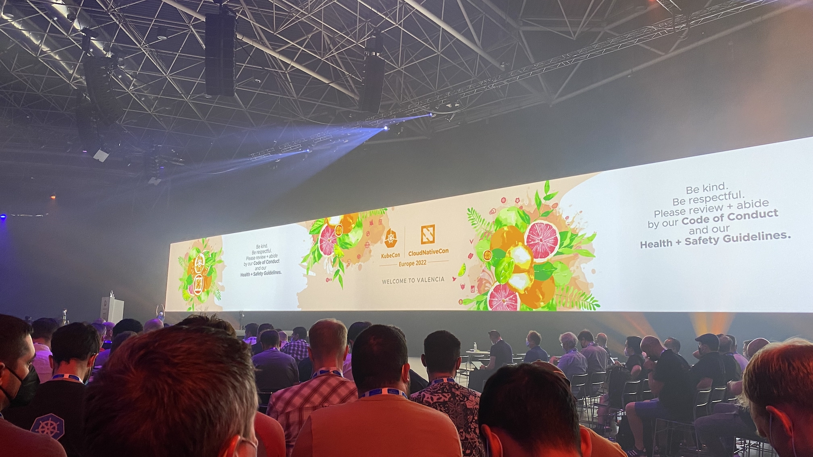
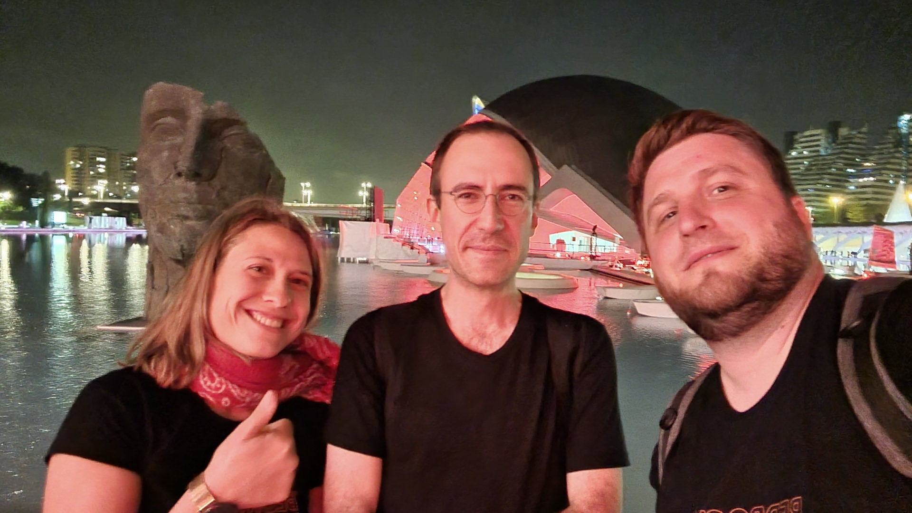

Pour terminer cette série, un ou deux sujets divers que nous n’avons pas regroupé dans les trois articles précédents
([les performances applicatives et la scalabilité](/2022/06/13/kubecon-2022-part-1.html), 
[les performances bas niveau, le système et le réseau](/2022/06/14/kubecon-2022-part-2.html),
[la dev XP, l'outillage, la CI/CD et l'observabilité](/2022/06/15/kubecon-2022-part-3.html)), 
puis une conclusion globale avec ce que nous avons retenu de cette KubeCon Europe 2022.

<i>La conclusion, @ KubeCon 2022 !</i>

## Chaos Engineering / Chaos Testing pour une meilleur résilience aux pannes

C’est un des sujets sur lesquels nous avons commencé à travailler activement cette année : *casser des choses* dans nos clusters, dans notre plateforme, entre nos microservices.  
L’idée sous-jacente est, bien sûr, que tout va casser un jour ou l’autre, donc autant provoquer du chaos nous-même, en environnement contrôlé. Nous identifierons ainsi des points sensibles de notre plateforme et pourrons les corriger, évitant ainsi des incidents, parfois majeurs, au mauvais moment.

Ce thème du *Chaos Engineering* est régulièrement abordé en conférences et nous étions contents de voir que nous ne sommes pas les seuls à nous interroger sur *“comment”* en mettre en place.  
Nous sommes repartis avec quelques pistes d’outils, comme [chaos mesh](https://chaos-mesh.org/) ou [Litmus Chaos](https://litmuschaos.io/), que nous allons peut-être prototyper pour les comparer à [chaos-controller](https://github.com/DataDog/chaos-controller) que nous avons récemment expérimenté.

Au cours de la conférence, *"Case Study: Bringing Chaos Engineering to the Cloud Native Developers"* ([vidéo](https://www.youtube.com/watch?v=KSl-oKk6TPA)) par Uma Mukkara, Litmus et Ramiro Berelleza, Okteto, nous avons pu avoir un aperçu de l'outil de chaos Litmus, sa force semblant résider dans le partage des scripts de chaos au sein la communauté.  
Puis, il a été décrit une approche CI des tests de chaos visant à intégrer certains tests de chaos dans le flux de développement plutôt qu'à la fin.

Enfin, toujours sur des questions de résilience en cas d’interruption de service, dans sa conférence *"Building for the (inevitable) Next Cloud Outage"* ([vidéo](https://www.youtube.com/watch?v=02a8VB__UQ4)), Pavel Nikolov de [Section](https://www.section.io/) nous a questionnés sur la manière d’être plus robuste à une catastrophe.  
La question n'est pas de savoir si une catastrophe se produira, mais quand elle se produira. C'est pourquoi il est aussi préférable de disposer d'un plan de reprise après sinistre mais surtout de prévoir en amont un système d'auto-guérison permettant d'être plus résilient aux catastrophes.  
Il nous a ensuite présenté un *use case* spécifique au réseau, nous invitant à préférer au traditionnel “DNS à la rescousse”, la mise en place de BGP (Border Gateway Protocol).

## Quelques sujets divers

À travers quelques talks, nous avons jeté des coups d'œil sur des sujets sur lesquels nous ne travaillons pas réellement au quotidien -- appelez ça de la curiosité intellectuelle si vous le voulez ;-)

 * Nous avons vu un ensemble de design patterns pour le développement de controllers Kubernetes ([vidéo](https://www.youtube.com/watch?v=I1-s7AxD1Ls)), approche qui devient petit à petit un moyen répandu de répondre à des problématiques, en codant directement dans Kubernetes.
 * La conférence *“A treasure map of hacking (and defending) K8s”* ([vidéo](https://www.youtube.com/watch?v=1HbwfpE4XKY)) était très sympathique, elle montrait à quel point il peut être *“facile”* de prendre le contrôle d’une infrastructure. Une façon de montrer que patcher est obligatoire !
 * Et dans un registre hors-technique, *“Composability is to software as compounding interest is to finance”* ([vidéo](https://www.youtube.com/watch?v=25aVkm89ZT8)) mettait en évidence à quel point, en construisant des outils, puis des projets, puis un écosystème, les uns profitent aux autres, on construit donc plus grand et plus gros. Il suffit de voir le landscape CNCF aujourd’hui par rapport à 4 ans en arrière.

## Conclusion, KubeCon Europe 2022

Nous avons commencé à migrer vers Le Cloud, vers AWS et Kubernetes, il y a plus de quatre ans. Notre première KubeCon était à Copenhague, en 2018. Que dire, en conclusion de cette conférence annuelle ? Comment conclure ces articles ?

Aujourd’hui, les grandes idées que nous avons retenues de cette KubeCon Europe 2022, en résumant, sont les suivantes :

 * Les problématiques d’auto-scaling sont bien cernées, les outils sont plutôt matures. Comme beaucoup d’autres entreprises, nous arrivons sur l’étape suivante, qui est de dimensionner en tenant mieux compte des couts et pas uniquement des performances et/ou de la disponibilité.
 * La gestion des coûts dans Kubernetes n’est toujours pas simple. À la fois pour les suivre et les répartir, mais aussi pour décider du bon compromis entre performances / disponibilité / souplesse / autonomie des équipes / couts.
 * Service Mesh : nous n’avons toujours pas franchi le pas et Istio, qui était un sujet très à la mode il y a quatre ans, nous semble désormais presque oublié. Aujourd’hui, Cilium semble être la nouvelle approche qui s’impose, et il se pourrait que nous jouions avec *“pour voir”* prochainement…
 * L’observabilité, plus vraiment un problème.
 * Le chaos engineering / chaos testing : toujours une idée séduisante, mais pas encore réellement industrialisée ?
 * L’outillage autour de la CI/CD, le déploiement progressif, le rollback (possiblement automatisé) progresse, et ça fait plaisir !
 * L’écosystème progresse, mûrit, et on parle de sujets de plus haut niveau que quelques années en arrière. Par exemple, nous avons entendu plusieurs fois parler de base de données magiquement scalable hébergée dans Kubernetes, alors que l’époque où nous évitions de stocker quelque état que ce soit dans un cluster ne nous semble pas si lointaine !

Et, pour finir, quelques points dont nous n’avons pas du tout ou très peu entendu parler :

 * Nous avons peut-être loupé des choses en créant nos programmes, mais nous n’avons vu aucun talk autour de *“comment nous développons des applications cloud-native”*. Pourtant, la problématique de l’environnement de développement, avec des services managés, des déploiements vers Kubernetes et des plateformes distribuées, ne nous parait pas encore réglée !
 * L’approche “FaaS” (Function as a Service) nous paraît encore moins répandue que quelques années en arrière ?
 * Nous n’avons pas entendu parler une seule fois de *Fédération*, alors que le terme revenait encore et encore il y a quatre ans. Nous avons bien fait de ne même pas essayer, on dirait ;-)

<i>Rejoignez-nos équipes et venez vivre les prochaines conférences avec nous l’an prochain</i>

