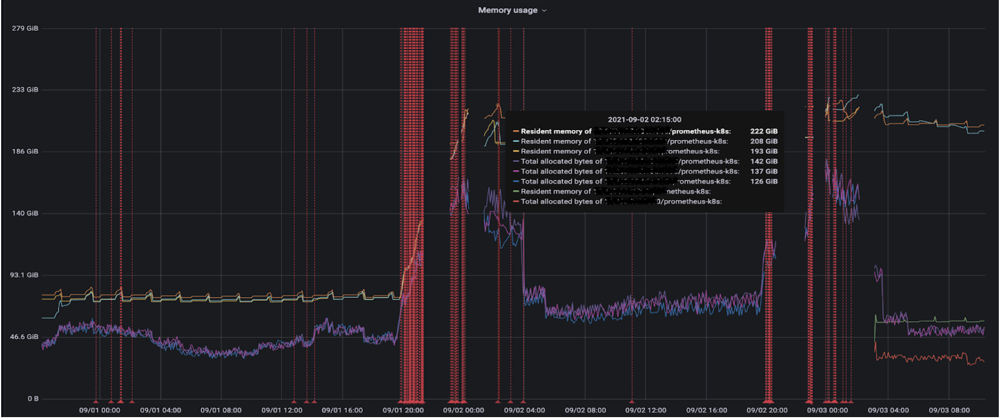
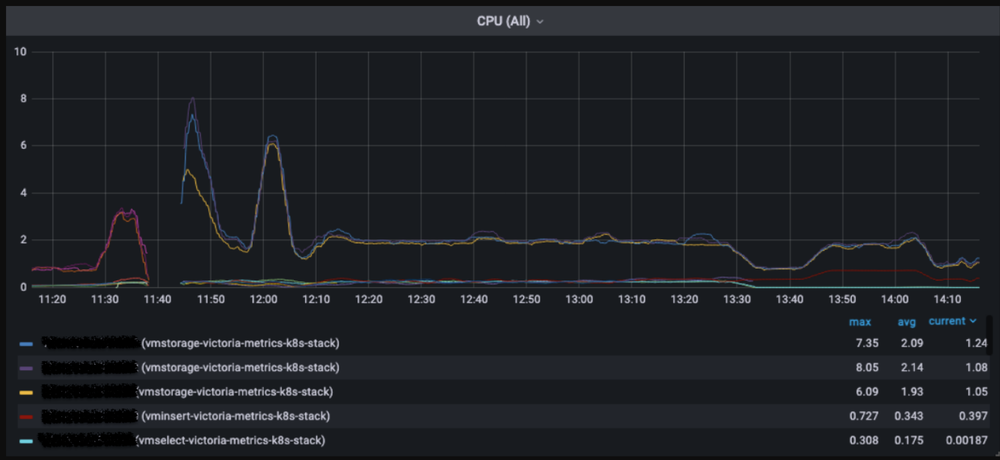
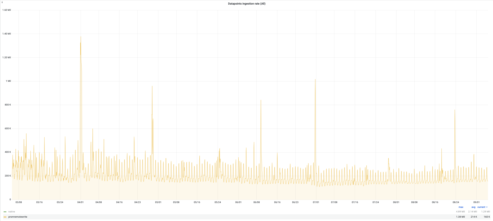
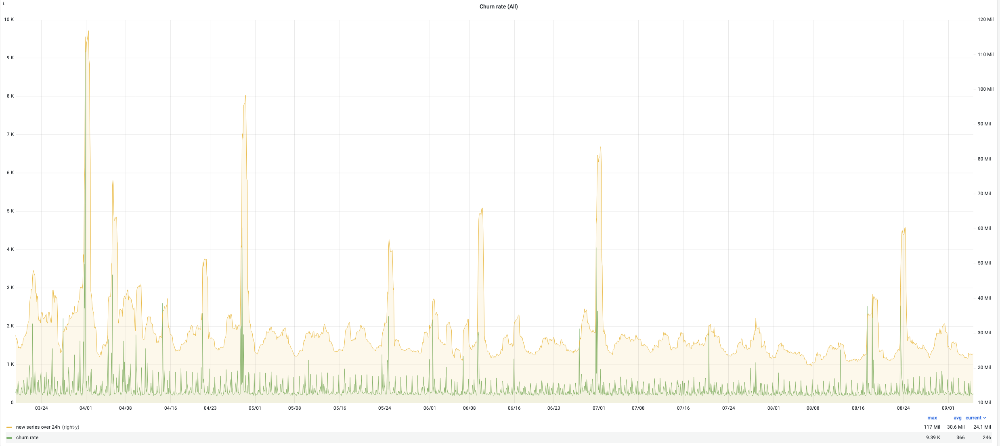

# Monitoring at Bedrock :
At [Bedrock Streaming](https://www.bedrockstreaming.com/), a large part of our applications are hosted on Kubernetes clusters, others use the EC2 service from AWS and a small part are hosted on "OnPremise" servers.

From 2018 until January 2022, we used Prometheus to monitor all these platforms, because Prometheus met all our needs: keeping control over our monitoring solution and supporting service discovery, which is essential in environments such as Kubernetes or AWS EC2. Prometheus also supports custom exporters we developed internally.

Over the years, our business has grown significantly, so the load on our platforms has increased. Indirectly, the load on our Prometheus instances has also increased, to the point where certain limitations have become too much for us. This is why we have changed our monitoring/alerting stack.

# Limits of Prometheus
Prometheus does not have a native High Availability mode: to have high availability, we had to duplicate our Prometheus instances. This implies that our targets were "scrapped" by all our Prometheus instances (same for our rules and records).
To avoid this, we had to use sharding, but this made the infrastructure more complex. More information on this subject in this [documentation](https://github.com/prometheus-operator/prometheus-operator/blob/main/Documentation/high-availability.md) from the Prometheus operator

Prometheus is not designed to store metrics on a long-term basis, as mentioned in the [documentation](https://prometheus.io/docs/prometheus/latest/storage/#operational-aspects) : 

_> Prometheus's local storage is not intended to be durable long-term storage; external solutions offer extended retention and data durability._

Prometheus's local storage is not intended to be durable long-term storage; external solutions offer extended retention and data durability.
We worked around this limitation by using Victoria Metrics (VMCluster) as a LongTermStorage via the remote_write protocol

All processes (scrapping, ingest, storage, etc.) were, until now, managed in the same "prometheus" instance, which implied a less flexible and vertical scaling only (since recently a [Prometheus agent](https://prometheus.io/blog/2021/11/16/agent/) is available for the "scrapping" part).

The RAM and CPU usage of a Prometheus instance is correlated to the number of metrics (and their cardinality) it has to manage. In our case, several Prometheus instances consumed more than 64 GB of RAM and 26 CPUs each, in order to absorb our peak loads. In a Kubernetes cluster, this high resources consumption can cause problems, especially for scheduling.

The Write-Ahead Log (WAL) system can cause rather slow restarts if the Prometheus instance runs out of RAM and can cause the Prometheus instance to hang for varying lengths of time. During the replay of the WAL, Prometheus doesn't scrape anything, thus there is no alerting and no way of knowing if something is going on.

## The cardinality of metrics
When our Kubernetes clusters manage a large number of pods, a constraint quickly appears: cardinality.

_> The cardinality of a metric is the number of TimeSeries of that metric with single-valued labels._


In the example above, the `status_code` label has a cardinality of 5, app has a cardinality of 2 and the overall cardinality of the `server_reponses` metric is 10.

In this example, any Prometheus instance can handle this cardinality, but if you add for example the label `pod_name` or `client_IP` (or both) to the `server_reponses` metric, the cardinality increases for each different clients calls and for each pod.

You should read the excellent [article](https://www.robustperception.io/cardinality-is-key/) from "Robust Perception" for more details on this subject.

At Bedrock the high cardinality metrics come from our HAProxy ingress. For our needs, we retrieve several labels like the name of the ingress pod as well as its IP address, but more importantly the name and IP address of the destination pod. In a cluster that can grow to more than 15,000 pods, the combination of unique labels (cardinality) is very significant for some of our ingress metrics.

We found that Prometheus performed poorly when we had multiple metrics with high cardinalities (> 100,000), and resulted in over-consumption of RAM.

During a high load event, Prometheus could consume up to 200 GB of RAM before being OOMKilled. When this happened, we would go completely blind as we had no metrics or alerting.
This also impacts us on scalability in our Kubernetes clusters, as we use [CustomMetrics](https://kubernetes.io/docs/tasks/run-application/horizontal-pod-autoscale/#scaling-on-custom-metrics) very heavily in HPAs to scale the number of pods in our applications.

_RAM and CPU consumption of our prometheus instances (the red lines represent the reboots of our instances, we also see a loss of metrics)_



Prometheus is still a good solution, which has served its purpose well for several years, but we have reached its limits in our production environments.

# Replacing Prometheus?

We spent time optimizing Prometheus to absorb the amount of metrics and their cardinality, in particular by either directly removing high cardinality metrics if they were totally unused, or by removing the labels of certain metrics that caused high cardinalities.
We have also optimized the Prometheus configuration directly, as well as the maximum IOPS of our EBS. The RAM and CPU consumption of Prometheus is linked to the number of metrics to manage and their cardinality. But we always have more traffic and therefore always more pods in our clusters: we should have perpetually increased Prometheus instances resources. This was a problem for scalability and costs.

Can we replace a critical tool like this? What are our short, medium and long term needs? How can we optimize costs? And especially in what timeframe?
The emergency of recent incidents forced us to exclude solutions such as [Thanos](https://thanos.io/) and [Cortex](https://cortexmetrics.io/). Testing these solutions completely would have required too much time, which we did not have.


It is also important to consider that we were already using Victoria Metrics, but only for the Long Term Storage part, without any problems.
Could replacing Prometheus with a stack based entirely on Victoria Metrics overcome the limitations we had with Prometheus?
High availability and fault tolerance is well-supported, their [documentation](https://docs.victoriametrics.com/guides/k8s-ha-monitoring-via-vm-cluster.html) explains how to manage this.

Managing long-term data is possible, as we were already doing it.
Victoria Metrics is built around a set of microservices. Each one is built in order to serve a specific job, and each supports vertical and especially horizontal scaling (with sharding). A very important point when used in a Kubernetes environment.

In addition, Victoria Metrics seemed to handle high cardinality metrics better (see [article](https://valyala.medium.com/high-cardinality-tsdb-benchmarks-victoriametrics-vs-timescaledb-vs-influxdb-13e6ee64dd6b) on this subject). It is also possible to do [rate limiting](https://docs.victoriametrics.com/vmagent.html#cardinality-limiter) on the number of Time Series to be ingested: 

CPU and RAM consumption is lower with better performance than with Prometheus and even other TSDBs, several comparative articles on this subject have already been published:
 - [Remote Write Storage Wars](https://promcon.io/2019-munich/talks/remote-write-storage-wars/)
 - [Prometheus vs VictoriaMetrics benchmark on node_exporter metrics](https://valyala.medium.com/prometheus-vs-victoriametrics-benchmark-on-node-exporter-metrics-4ca29c75590f)
 - [When size matters — benchmarking VictoriaMetrics vs Timescale and InfluxDB](https://valyala.medium.com/when-size-matters-benchmarking-victoriametrics-vs-timescale-and-influxdb-6035811952d4)
 - [Comparing Thanos to VictoriaMetrics cluster](https://medium.com/faun/comparing-thanos-to-victoriametrics-cluster-b193bea1683)

We also wanted to keep the Prometheus language: [PromQL](https://prometheus.io/docs/prometheus/latest/querying/basics/) in order to keep our Grafana dashboards and all our Prometheus alerts. Even though Victoria Metrics offers its own MetricsQL language, it is perfectly compatible with PromQL.

You can see the [main features](https://docs.victoriametrics.com/#prominent-features) of Victoria Metrics as well as various [case studies](https://docs.victoriametrics.com/#case-studies-and-talks) in their documentation.

# POC of Victoria Metrics
We wanted to validate the performance and consumption of a stack entirely based on Victoria Metrics, the results were really encouraging.

Test environment :
 - 1500 web app pods
 - 250 Haproxy Ingress pods (metric with high cardinality enabled)
 - 3700 scrapped targets

Comparative table between Prometheus and Victoria Metrics : 

|                      | Prometheus | Victoria Metrics |
| -------------------- | ---------- | ---------------- |
| CPU consumption      | 26         | 8                |
| RAM consumption      | 30Go       | 11Go             |
| New TimeSeries / min | 50K        | 6.5M             |
| Max active TimeSeries| 7M         | 91M              |
| Max cardinality      | 4 metrics > 100K | 10+ metrics > 1M |

_Graph on the CPU consumption of Victoria Metrics components_


_Number of active "TimeSeries" in Victoria Metrics_


Our benchmark persuaded us to use Victoria Metrics as a replacement for Prometheus.

# Implementation of Victoria Metrics :
We used the official [victoria-metrics-k8s-stack](https://github.com/VictoriaMetrics/helm-charts/blob/master/charts/victoria-metrics-k8s-stack/README.md) Helm chart which is based on an [operator](https://github.com/VictoriaMetrics/helm-charts/tree/master/charts/victoria-metrics-operator). This chart Helm permits to deploy a complete monitoring and alerting stack in a Kubernetes cluster.

A VMCluster (Insert, Select, Storage) is deployed to manage access to metrics. The collection of metrics (push/pull) from exporters in Prometheus format is handled by the VMagent. Its configuration is done in the form of a Prometheus configuration file. It is able to : 
 - Manage the relabeling of metrics. 
 - Temporarily store the metrics it has collected if the VMCluster is unavailable or not able to send the metrics to the VMCluster. 
 - Limit the cardinality of metrics.

One of the advantages of using this Helm chart is that it will deploy essential components to properly monitor a Kubernetes cluster such as Kube-state-metrics or prometheus-node-exporter, but also scraping configurations for services such as Kubelet, KubeApiServer, KubeControllerManager, KubeDNS, KubeEtcd, KubeScheduler, KubeProxy

Alerting is also managed via a VMAlert component, which will execute the alerting and recording rules set by VictoriaMetrics. Notifications are managed by an Alertmanager which is also deployable via this chart.


One of the advantages of using this Helm chart is that it will deploy essential components to properly monitor a Kubernetes cluster such as _Kube-state-metrics_ or _prometheus-node-exporter_, but also scraping configurations for services such as _Kubelet, KubeApiServer, KubeControllerManager, KubeDNS, KubeEtcd, KubeScheduler, KubeProxy_

_This is what our monitoring and alerting stack based on this Helm chart looks like._


# Resumption of the history
We wanted to keep historical metrics of our Kubernetes clusters. Victoria Metrics provides a tool to manage the export and import of data from different TSDB: [vmctl](https://docs.victoriametrics.com/vmctl.html).

In order not to overload our monitoring stack, we splitted the exports into smaller or larger time ranges, depending on the history of the cluster. For clusters with little activity and therefore few metrics, exports/imports were split day by day, for others we had to use smaller time slots.
A home-made bash script launched several kubernetes jobs simultaneously and took care of restarting one of them as soon as another one ended.

Below an extract of the definition of our Kubernetes job with the arguments we used to do our history transfer by time range: 

```yaml
      containers:
      - name: vmctl
        image: victoriametrics/vmctl
        resources:
          requests:
            cpu: "1"
        args:
          - vm-native
          - --vm-native-src-addr=http://victoria-metrics-cluster-vmselect.monitoring.svc.cluster.local.:8481/select/001/prometheus
          - --vm-native-dst-addr=http://vminsert-victoria-metrics-k8s-stack.monitoring.svc.cluster.local.:8480/insert/000/prometheus
          - --vm-native-filter-match={__name__!~"_vm.*"}
          - --vm-native-filter-time-start="{ { start } }"
          - --vm-native-filter-time-end="{ { end } }"
      restartPolicy: Never
```

# Feedback after months of use
Since we have been using our new monitoring stack, we have encountered a few bugs (as with all solutions).
Most of the time, these were not impactful, except for one that caused us a production incident.
We had an overconsumption of RAM of VMStorage which was fixed in version 1.76. I would like to highlight the responsiveness of the VictoriaMetrics team, whether on slack or on GitHub: I have had several discussions with them on various subjects, and they have always been reactive

Victoria Metrics regularly releases new versions, including performance improvements and new features. The [changelog](https://docs.victoriametrics.com/CHANGELOG.htm) will give you an idea of the latest improvements and their frequency.

Victoria Metrics has an [Enterprise](https://victoriametrics.com/products/enterprise/) version that adds some features, including one that we are interested in but have not yet tested: downsampling.
We have configured a one-year retention for each of our Kubernetes clusters, and on some clusters that’s mean more than 7 TB of data per VMStorage.

The downsampling allows you to configure how many metrics you want to keep per time interval.

In this example: `-downsampling.period=24h:10s,1w:30s,30d:1m,360d:5m`, (assuming we collect metrics every 5 seconds) we only keep: 
 - one measurement point every 10 seconds beyond 24 hours (instead of one point every 5 seconds)
 - one measurement point every 30 seconds beyond 7 days
 - one measurement point every minute beyond 30 days
 - one measurement point every 5 minutes beyond one year

It is rarely necessary to keep all the measurements of our metrics on such a long scale, when we want to retrieve measurements that are several months old, it is usually to see a trend and not all the measurements.
With this option, we could greatly reduce the storage used by our metrics.

# Conclusion
Through this article, you have discovered why and how we migrated our monitoring stack of our Kubernetes clusters at Bedrock from Prometheus to Victoria Metrics.

This was an important and critical subject for us, as monitoring is a critical need.
Now our monitoring stack, based entirely on Victoria Metrics, is robust and capable of absorbing large load peaks.

Here are some indicators of the victoria metrics stack performance of one of our Kubernetes clusters during last 6 months:
- active time series: up to 39 million (average 7.4M)
- total number of datapoints: 12 trillion
- ingestion rate : up to 1.3 million new samples per second (average 227K)
- churn rate : up to 117 Million new time series per day (average 30.6 Million)
- disk usage (data + index): 15 TB
- sample rate : up to 4.99M (average 343K)
- scrape target : up to 49K (average 4.4K)








