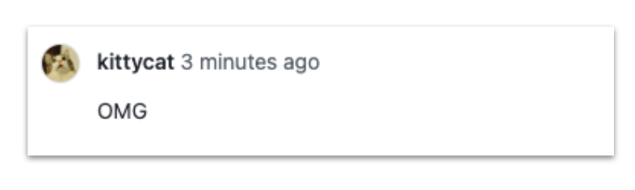
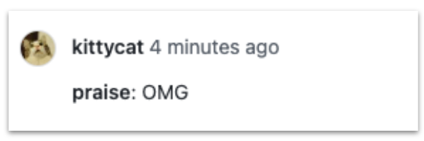
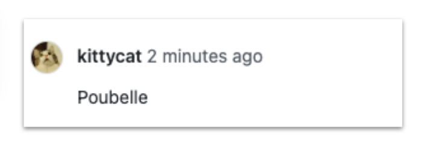
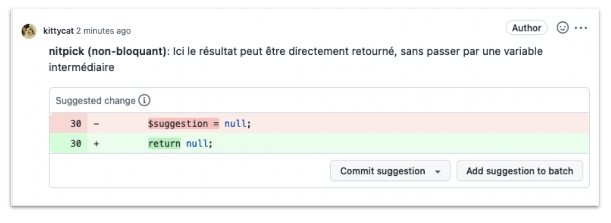

Au sein des équipes de développement, une activité bien connue est celle de la revue de code, et 
plus 
précisément de la **revue du delta du code**. Il s'agit de l'inspection par nos 
pairs du code proposé par nos soins, qui se trouve ainsi commenté pour répondre aux 
exigences de qualité de l'équipe et du projet. 

Les risques d’incompréhensions inhérents à la communication écrite, de malentendus
ou encore les remarques _malheureuses_ peuvent rendre cet exercice redouté tant par les 
relecteurs et relectrices 
que 
par celles et ceux dont le code est relu.

Avant d’arriver chez Bedrock, j’étais un peu 
inquiète. Je savais déjà que les 9 personnes de ma future équipe font tou(te)s de la revue de code. 
**Comment échangerons-nous? Saurai-je faire "bonne impression" via mes commentaires 
sur leur code ?** 

En arrivant, j’ai été très 
agréablement surprise de découvrir que l'équipe applique un 
standard, celui des conventions de commentaires, [ou conventional comments](https://conventionalcomments.org/). **Grâce à cela, mon 
onboarding a été grandement facilité** et j’ai découvert une façon plus efficace d'écrire mes 
commentaires !

**Disclaimer** : cet article est inspiré de ma conférence "_Revue de code : on n'est pas 
venu-e-s pour
souffrir !_" donnée à l'occasion du meet-up anniversaire Duchess chez Dataiku en 2022 et [au Forum
PHP 2022](https://afup.org/talks/4038-revue-de-code-on-n-est-pas-venu-pour-souffrir).

<iframe width="1127" height="773" src="https://www.youtube.com/embed/LVh6iQtJW2I" title="YouTube video player" frameborder="0" allow="accelerometer; autoplay; clipboard-write; encrypted-media; gyroscope; picture-in-picture" allowfullscreen></iframe>

## Petit rappel : pourquoi faisons-nous des revues de code ?

Passer en revue le code proposé par ses co-équipier(e)s est largement répandu dans les 
équipes de développeurs et développeuses. Bien sûr, la qualité du code en elle-même se trouve 
améliorée 
car chacun apporte un regard neuf sur ce qui est proposé, mais ce n'est pas tout. La 
revue de code est également une façon de nous tenir informé(e) de 
l'implémentation de nouvelles features, d'apprendre autant du métier que de la 
technique et enfin, d'apprendre à travailler ensemble. 


Voici une 
petite liste non exhaustive de l'intérêt de la revue de code : 

- Améliorer la qualité et la lisibilité du code grâce aux remarques de toutes les
  personnes de l’équipe
- Appliquer les standards adoptés par l’équipe (et les apprendre !)
- Détecter et corriger les éventuels bugs fonctionnels
- Favoriser la collaboration en équipe
- Former les développeurs et développeuses au fur et à mesure des remarques
- Partager les responsabilités : en approuvant une pull request ou une merge request, nous
  sommes responsables en tant qu'équipe du code ajouté/modifié au tronc commun !

## ...Et parfois, on souffre


Mais parfois, ce n'est pas tout rose. Les commentaires qu'on laisse peuvent vexer. On 
peut nous-même être vexé. Car certains jours, on peut manquer d'empathie. On peut avoir 
l'impression d'être plus compétent(e) en 
critiquant les autres, on veut se rassurer en se montrant plus qualifié(e). On peut également 
être habitué(e) à une culture de la compétition, nous poussant ainsi à faire des remarques désagréables à nos pairs.

## Comment le formatage de commentaire a-t-il amélioré mon arrivée dans l'équipe ?

La standardisation des commentaires a énormément amélioré mon intégration dans 
l'équipe. En effet, grâce à cela :

- J’ai pu rapidement me rendre compte de ce qui était bloquant / non bloquant et ainsi me 
  **concentrer sur les actions essentielles et prioritaires** à mener;
- **je n’ai pas eu à me poser de questions sur le ton employé par mes collègues ni sur leur 
  intention**;
- j'ai pu rapidement faire moi-même des revues de code **sans craindre d'être mal comprise**;
- j’ai eu des retours qui m’ont permis de **progresser sur la connaissance du fonctionnel** et 
  des standards de la team.

## Améliorer sa posture

Avant de parler du standard, je vous propose de nous interroger sur 
notre posture en tant que développeur et développeuse. Recevoir ou donner des commentaires, ce 
n'est pas aisé pour tous. **Notre ego peut interférer et dégrader la qualité de nos 
échanges avec nos collègues**. Aussi, avant de chercher à formater nos commentaires, nous pouvons 
nous interroger sur leur contenu.


L’Egoless Programming, proposé par [Gerald Weinberg](https://en.wikipedia.org/wiki/Gerald_Weinberg) en 1971 dans son livre _The Psychology of 
Computer Programming_, présente une dizaine de commandements pour nous 
aider à progresser.

Le principe est le suivant : **réduire au minimum les facteurs personnels lors des interactions 
avec ses pairs**, pour favoriser le travail en équipe et produire le maximum de qualité.

- Critiquez le code au lieu des personnes,
- Soyez factuels sur le code,
- N’attaquez jamais les personnes.

Je vous recommande de regarder cette excellente conférence sur l'egoless programming, où Olivier 
Thelu prend le temps de revenir sur tous les concepts :

<iframe src="https://player.vimeo.com/video/728605321?h=60e48e1686&title=0&byline=0&portrait=0" width="1127" height="773" frameborder="0" allow="autoplay; fullscreen; picture-in-picture" allowfullscreen></iframe>
<p><a href="https://vimeo.com/728605321">Les 10 commandements de la programmation sans &eacute;go - Olivier Thelu - MiXiT 2022</a> from <a href="https://vimeo.com/mixitconf">MiXiT</a> on <a href="https://vimeo.com">Vimeo</a>.</p>

Une autre excellente conférence de Kim Laï Trinh, lead développeur, et son [“Auto-critique de la 
revue de code
bienveillante”](https://afup.org/talks/3415-auto-critique-de-la-revue-de-code-bienveillante).

<iframe width="1127" height="773" src="https://www.youtube.com/embed/jMzhP1n19e8" title="YouTube video player" frameborder="0" allow="accelerometer; autoplay; clipboard-write; encrypted-media; gyroscope; picture-in-picture" allowfullscreen></iframe>

## Formatez vos commentaires !

Une fois qu'on a adopté une posture qui nous aide à mieux recevoir et donner des commentaires dans le cadre de nos revues de code, on peut réfléchir à la façon dont on les formate.

Grâce au standard des [conventional comments](https://conventionalcomments.org/), nous disposons d'une convention pour écrire des 
commentaires clairs et visuels et limiter les incompréhensions. Chacun de nous est invité 
à réfléchir à l'intention de son commentaire **avant** de l'écrire. 

Par exemple, avec ce commentaire qui peut prêter à confusion (le OMG qui signifie "Oh my god" 
peut être autant interprété comme quelque chose de négatif que de positif, notamment ici puisque 
nous n'avons pas le contexte 😈) : 



Ce commentaire peut être préfixé par `praise`, ce qui signifie éloge. Cela change radicalement 
le ton du commentaire. 



Voici un autre exemple laconique : `Poubelle`. 



Celui-ci peut être amélioré en étant préfixé par l'étiquette `nitpick`, qui signifie 
"tatillonner", ce qui diminue également son ton dramatique. De plus, l'urgence peut être 
indiquée (ici, `non-bloquant`) et le contexte est décrit et peut être exploité grâce à un patch 
proposant un code de remplacement.



La compréhension du commentaire est facilitée par l'effort fourni pour ajouter le maximum de
contexte possible. On gagne en lisibilité grâce à la catégorisation (étiquette), qui nous permet
également d'immédiatement savoir de quoi on parle. Par exemple, une `question` ne sera pas lue
de la même façon qu'une `suggestion` !

La contextualisation permet de savoir si on traite le retour immédiatement ou si on ouvre une
nouvelle pull request plus tard, pour rémedier au point soulevé. On limite ainsi les
quiproquos ou les pertes de temps sur des actions non prioritaires.
Et surtout, on limite les mauvaises impressions sur le ton employé.

### Description du standard

```
<label> [decorations]: <subject>

[discussion]
```

- **étiquette (label)** : “étiquette” pour signifier de quel genre de commentaire il s’agit
- **sujet (subject)** : le commentaire en lui-même
- **contexte supplémentaire (decorations)** (optionnel)  : labels supplémentaires pour donner plus d’indications (entre parenthèses, séparés par des virgules).
  Exemple : `non-blocking`, `blocking`, `test` …
- **discussion (optional)** : contexte, raisonnement ou tout autre élément pour aider à 
  comprendre le « pourquoi » et les « prochaines étapes » pour résoudre le commentaire

### Les labels

Voici la liste de labels ou étiquettes, extraits du standard :

- `praise`
- `nitpick`
- `suggestion`
- `issue`
- `todo`
- `question`
- `thought`
- `chore`
- `typo`
- `polish`
- `quibble`

L'équipe est, bien entendu, libre de choisir ou d'inventer ses labels ! Chez nous, le choix a été 
fait de respecter le standard tel qu'il est proposé, mais cela pourrait être rediscuté si besoin.

Voici quelques définitions (pour le reste, [se référer au site du standard](https://conventionalcomments.org/)):

#### Praise (éloge)

Grâce à ce commentaire, on souligne quelque chose de positif, on encourage la personne. Bien 
entendu, pas de second degré !

#### Suggestion (suggestion)

Les suggestions sont la majorité des commentaires qu'on laisse, en général. Il s'agit 
d'améliorations à apporter au sujet actuel. On cherchera à être explicite et clair, 

- expliquer en quoi il s'agit d'une amélioration;
- utiliser des patchs;
- utiliser des décorations **blocking** ou **non-blocking**.

#### Issue (problème)

Grâce aux issues, on met en évidence des problèmes spécifiques. Idéalement, on couple ce 
commentaire avec une `Suggestion`.

#### Thought (pensée)

Les pensées sont des idées qui surgissent lors de la relecture du code. Celles-ci ne sont pas 
bloquantes par nature, mais sont extrêmement précieuses, car elles peuvent conduire à des 
possibilités de mentorat.

## Appropriez-vous la méthode ! 

Bien entendu, vous n'êtes pas obligé d'utiliser toute la liste de labels proposée par le 
standard. Vous pouvez en choisir quelques uns, ou bien carrément vous en inspirer et créer les 
vôtres. C'est le choix qu'ont fait Camille et son équipe, [qu'elle décrit dans cet excellent 
article 
sur les conventional Comments et l'utilisation des emojis](https://www.24joursdeweb.fr/2021/conventional-comments-faire-des-revues-de-code-avec-le-smiley/). 

Ainsi, l'équipe a porté son choix sur une liste d'étiquettes illustrées par des emojis, qui 
traduisent à fois l'intention du commentaire et son urgence.
Voici quelques exemples, tirés de l'article :

`🥜 peanuts`
`❓ question`
`💬 discussion`
`🚨 alerte`
`🚫 no-go`
`👏 bravo`
`⚠️ warning`
`☠️ bad idea`
`✨ magic`
`🔥 burn-it-all`

## Quelques autres bonnes pratiques d'onboarding

Bien entendu, il y a plein d'autres façons d'aider vos nouveaux développeurs ou
nouvelles développeuses à découvrir le code. Voici quelques autres idées :

- On peut se familiariser avec le workflow d'une publication de pull request ou de merge 
request en faisant une petite modification (ajouter son nom dans un fichier, par exemple ?);

- on peut être accompagné(e) d'un “buddy” qui nous est assigné à l'arrivée dans l'entreprise avec 
qui on fait les premières revues de code en direct, et pas par écrit.

Une dernière bonne pratique très largement répandue : si les échanges par commentaires sont trop 
nombreux sur une même pull request, pourquoi ne pas se retrouver directement et résoudre en pair 
les 
points discutés ? 