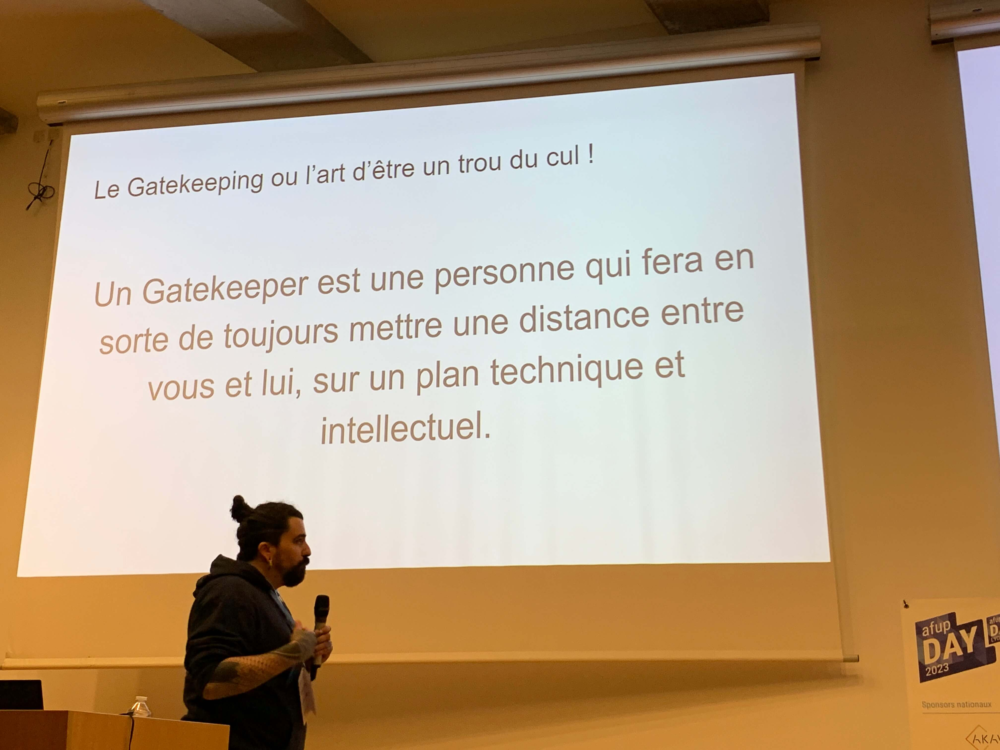
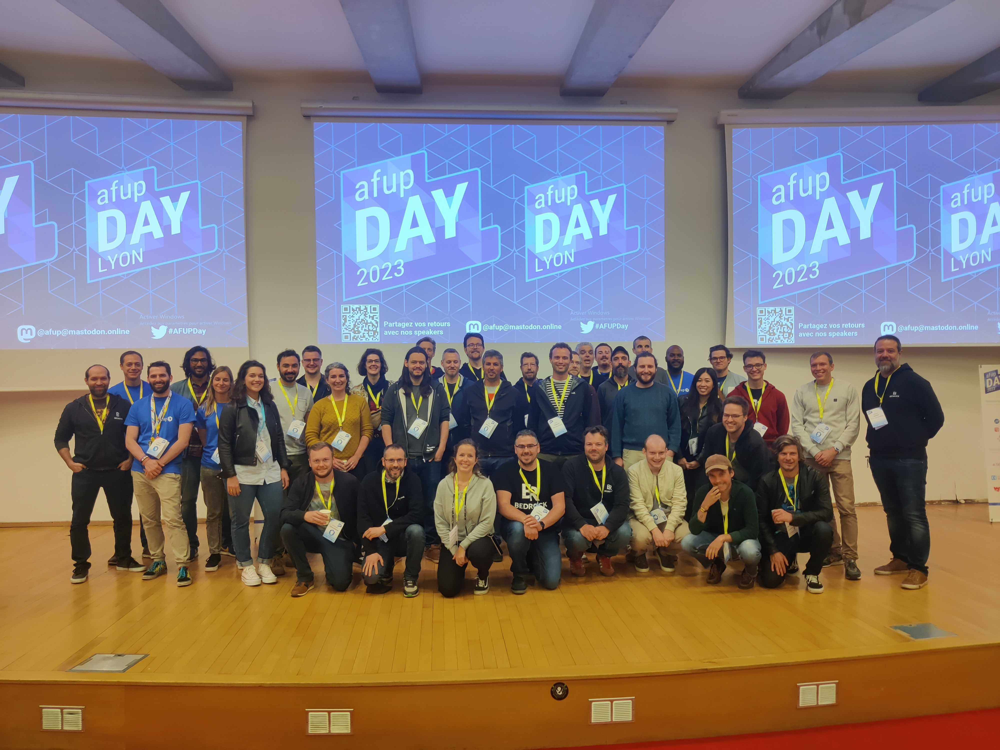

Comme à l'accoutumée, les équipes backend de Bedrock étaient présentes le 12 mai 2023 à CPE (au Campus Lyontech) pour une nouvelle édition de l'AFUP Day. 

Pour suivre les conférences qui gravitaient autour de PHP bien sûr, mais aussi pour soutenir notre collègue Pauline Rambaud qui était la star du jour (pour Bedrock du moins) 🤩 !

Et nous n'oublions pas non plus, les âmes braves de Bedrock qui ont revêti le maillot bleu de l'AFUP et qui ont donné de leur personne pour nous accueillir dans d'excellentes conditions.

Enfin **bref** (🐘), voici le petit récap habituel des différentes conférences de cette journée 👇

## Tirer parti du composant ExpressionLanguage de Symfony, laissez les utilisateurs finaux être créatifs !

> Conférence présentée par Florian MERLE et Mathias ARLAUD

Dans leur talk, Florian et Mathias nous parlent du composant Symfony Expression Language. 
Ce composant fournit au développeur un moteur d’expressions et permet l’utilisation de ces dernières dans la configuration d’un projet ou bien encore comme fondation d’un moteur de règles métiers. 
Si ce composant vous est inconnu, sachez qu’il est lui-même utilisé par Symfony : par exemple pour la sécurité sur les règles de validation des routes.

Florian et Mathias nous familiarisent avec le fonctionnement du composant : on peut définir des expressions simples qui ne requièrent pas d’être compilées en PHP (ex : “1+1”) et à l’inverse des expressions compilées en PHP qui vont correspondre à des règles personnalisées définies au sein de notre projet ("est_eligible_a_une_promo(client)"). 
Pour mieux comprendre comment tout cela fonctionne en interne, nous avons ensuite une présentation de comment les expressions sont interprétées grâce à de l’analyse lexicale et le principe d’arbre syntaxique.

Pour finir ce talk, nous avons le droit à une démonstration du composant comme moteur de règles métiers. 
On nous présente un petit site e-commerce où les administrateurs peuvent, via un formulaire, utiliser les règles métiers définies dans le projet et les ajuster pour correspondre au mieux à leurs besoins.

## Mentors : super-héros ou super-vilains ?

> Conférence présentée par Pauline RAMBAUD

On a choisi de ne rien vous dévoiler sur cette conférence donnée par notre collègue Pauline, il fallait être présent pour savourer l'instant 😉... 
Ceci dit, Pauline sera sûrement ravie d'en parler avec vous [sur Twitter](https://twitter.com/pauinegu).

## Monades : paradigme unique pour la programmation

> Conférence présentée par Baptiste LANGLADE

Dans cette [conférence](https://baptouuuu.github.io/talks/monads%20a-sync%20programming/), Baptiste nous a fait un rapide tour d’horizon des solutions existantes pour faire de l’asynchrone en PHP. 
Le conférencier nous a expliqué qu’il était difficile aujourd’hui de faire du synchrone et de l’asynchrone de la même manière, facilement.

C’est pour cela que le speaker a développé le composant [Sequence](https://github.com/Innmind/Immutable#sequence). 
Grâce à ce projet et sa [démo](https://www.youtube.com/watch?v=RwCJwKfbDhE), nous avons pu voir comment, sans changer le code (hormis une dépendance), nous pouvons faire des appels synchrones ou asynchrones.

Nous avons, au passage, eu la présentation du composant [Filesystem](https://github.com/Innmind/Filesystem) qui apporte des outils intéressants pour la manipulation de fichiers.

## Le Zéro Downtime Deployment en pratique

> Conférence présentée par Smaïne MILIANNI

Smaïne nous a présenté la logique à avoir lorsque l’on veut faire du ZDD avec deux exemples et les limites de cette pratique.

Les deux règles d’or à respecter concernant les changements sont :
- être rétrocompatibles, c'est-à-dire que les nouvelles modifications doivent fonctionner avec l’existant. 
  Si le déploiement fail cela ne doit pas empêcher la version actuelle de fonctionner.
- être livré par release

Cela implique de repenser la façon de construire une nouveauté et pour illustrer cela, Smaïne a donné l’exemple de l’ajout d’une colonne not null dans une base de données.

Objectif : ajouter une colonne not null dans une table

Découpage en deux releases :
1. Release 1
    - ajout d’une colonne A null dans la table
    - mise à jour de l’entité concernée dans le code initialisé à null
2. Release 2
    - mettre à jour les lignes sans valeur dans la colonne A avec une valeur par défaut
    - ajouter la contrainte NOT NULL sur la colonne A
    - mettre à jour l’entité en spécifiant l’attribut comme non nullable

Afin de s’assurer que chaque release peut fonctionner avec l’existant et anticiper les impacts que pourraient avoir les modifications, il ne faut pas hésiter à tester de façon automatique ou manuelle.

Suite à l’exemple, Smaïne a présenté les limites du ZDD qui sont :
- cette pratique a du sens si vous faites des releases fréquemment
- un changement majeur nécessitera toujours une maintenance
- tant que l’ensemble des releases prévues pour faire une modification ne sont pas en production, le système est considéré comme instable
- cette pratique nécessite de penser et de concevoir différemment les releases.

Pour conclure, le speaker a donné quelques clés pour se lancer dans le ZDD :
- former ses équipes
- documenter les processus mis en place
- itérer et s’améliorer avec chaque expérience
- tester et encore tester

## Démystifions les pratiques du Software craftsmanship !

> Conférence présentée par Thomas BOILEAU

Après une rapide présentation des différentes pratiques autour du _craftsmanship_ (Test Driven Development, Domain Driven Development, Clean Architecture, Architecture Hexagonale ...), Thomas nous raconte comment il est tombé dans le piège du **Gatekeeping**.

Qu'est-ce que le **Gatekeeping** ? D'après lui (cf. photo), c'est l'art de marquer son appartenance à un groupe en excluant les autres.

Tout commence avec une remarque lue sur Internet, du style "Si tu ne fais pas de TDD, alors tu n'es pas un vrai développeur", qui le complexera au point de le pousser à étudier et appliquer cette pratique jusqu'à son tour devenir l'auteur de ce genre de remarque.

En considérant le **craftsmanship** comme la solution universelle et en l'appliquant de manière dogmatique, il se retrouve à proposer des solutions inadaptées à ses projets et donc à nuire à ses clients.

L'objet de cette conférence sera donc de nous parler de comment il a su se remettre en question et sortir de l'impasse.

Comment faire pour ne plus être un gatekeeper ? 
Thomas nous parle alors de prendre du recul sur soi, d'être pragmatique et bien sûr de savoir faire preuve d'humilité. 
Mais il existe aussi des pratiques reconnues dans notre milieu telles que l'_Egoless programming_, le _Pair Programming_, ou tout simplement reconnaître à chacun le droit à l'erreur et connaître ses propres limites.

## Comment refondre un legacy sans cris et sans larmes - Retour d'expérience et bonnes pratiques

> Conférence présentée par Kevin BALICOT

À travers son retour d’expérience d’une refonte d’un très vieux projet PHP, Kevin BALICOT nous a offert sa recette d’une refonte progressive sans cris ni larmes :

1. Lister tous les problèmes de l’application
2. Définir une stratégie et des objectifs
3. Faire un inventaire de l’application
4. Mettre en place un Golden Master
5. Mettre des outils d’analyse de code
6. Implémenter des Design Pattern et des architectures
7. Consolider les choix avec des ADR et du Pair Programming
8. Tester !

Si vous souhaitez approfondir un de ces points, vous pouvez sans doute lui demander directement [sur Twitter](https://twitter.com/kevinbalicot).

## Le travail invisible en entreprise : le cas du glue work

> Conférence présentée par Camille CASTILLO

Nous avons découvert le concept du "glue work" lors de la première conférence de Camille.

Enfin, nous avons un terme pour décrire cette idée que nous avions tous.tes en tête, mais qui manquait d'une définition concrète.

Le "glue work" représente toutes ces tâches accomplies par les employé.e.s, notamment les développeur.euse.s, lors de leur travail quotidien, qui ne sont généralement pas facilement quantifiables et rarement valorisées par l'entreprise.

Camille a identifié trois catégories de "glue work" : social, managérial et technique.

Par exemple, organiser une sortie au restaurant favorise les liens sociaux. Planifier une réunion avec des clients renforce les relations professionnelles. Et effectuer une veille et proposer de nouveaux outils de développement relève de la dimension technique.

Malheureusement, en effectuant ces tâches essentielles à la vie de l'entreprise et même à sa productivité, les employé.e.s consacrent logiquement moins de temps à leurs tâches principales, comme le développement.

Cela peut devenir problématique si l'entreprise ne reconnaît pas la valeur de ces activités.

Alors quelles solutions pour prendre en considération le glue work ?

Tout d’abord, le repérer et se porter volontaire.

Un manager peut aussi veiller à répartir ces tâches.

Camille conclut en indiquant que le glue work est nécessaire à l’entreprise, qu’il faut l'identifier et être acteur.ice.s chacun à son niveau pour le faire reconnaître.

## Transformer efficacement du JSON en structure PHP fortement typée

> Conférence présentée par Romain CANON

Une chouette conférence qui présentait la librairie d'Object Mapping pour PHP [Valinor](https://github.com/CuyZ/Valinor), permettant de tirer parti au maximum des types PHP au runtime.

D'ailleurs suite à ça, certaines de nos équipes ont commencé à l'utiliser à Bedrock... Peut-être un prochain article de REX à prévoir 😉

## Les instruments des devs augmenté·e·s

> Conférence présentée par Gabriel PILLET

On a fini cette journée en beauté, par une vue d'ensemble des différents outils permettant dès aujourd'hui d'épauler les développeurs dans leur travail quotidien.

De PHPStan à GPT-4 en passant par GitHub Copilot, cette conférence, dont les slides étaient habillées d'images générées par une IA, nous a bien fait comprendre qu'on a tout intérêt à accueillir ces nouveaux outils, si on souhaite décupler notre productivité 🤞.

## À l'année prochaine !

