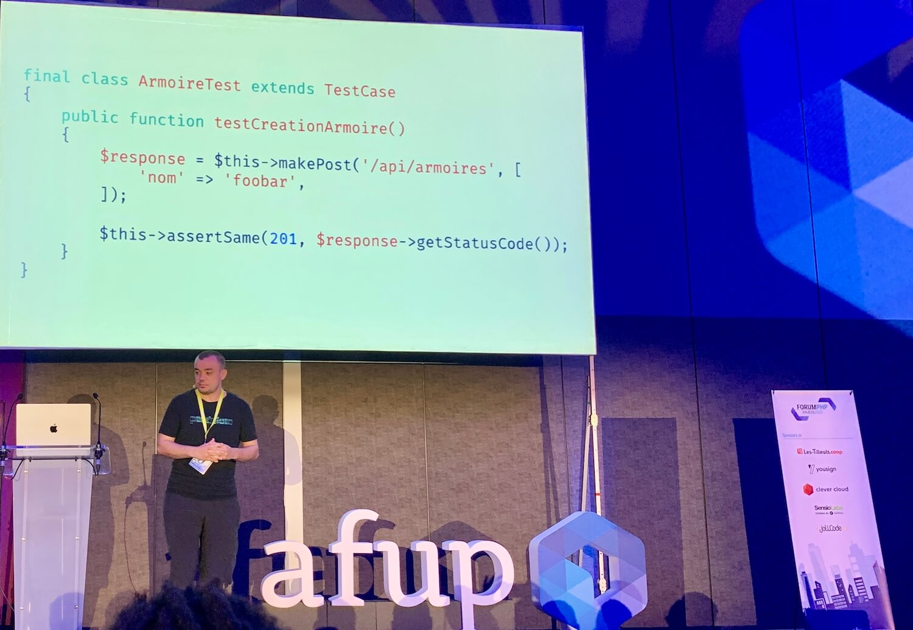
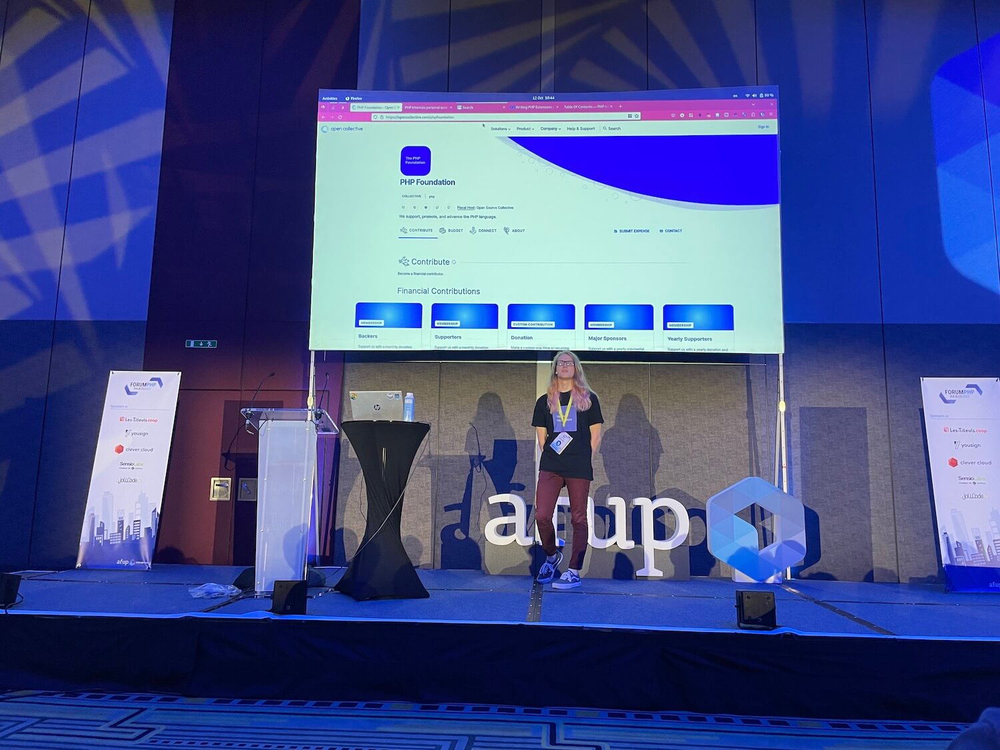
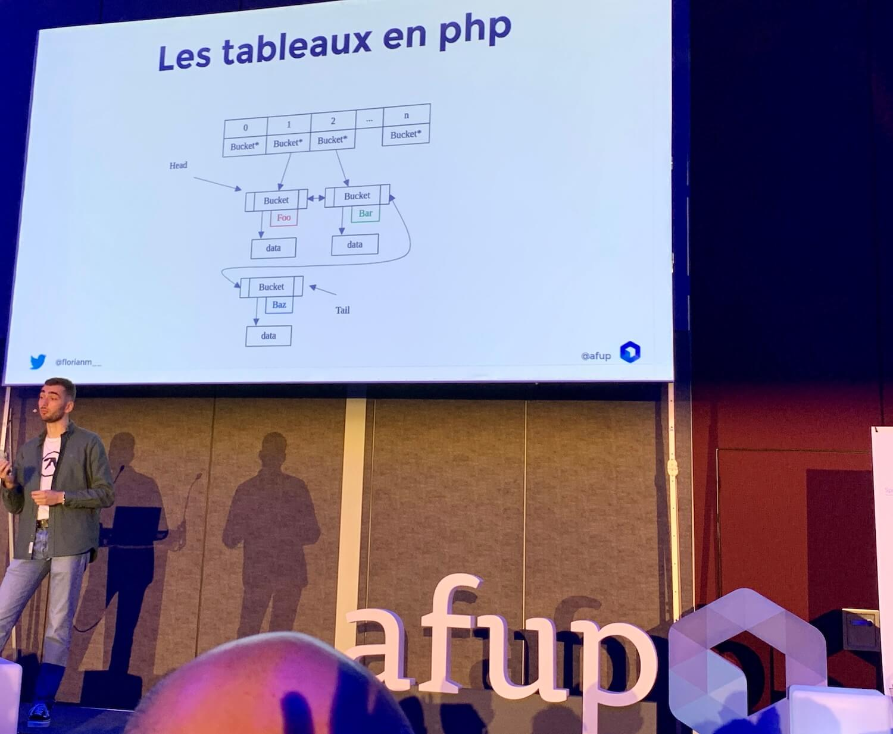
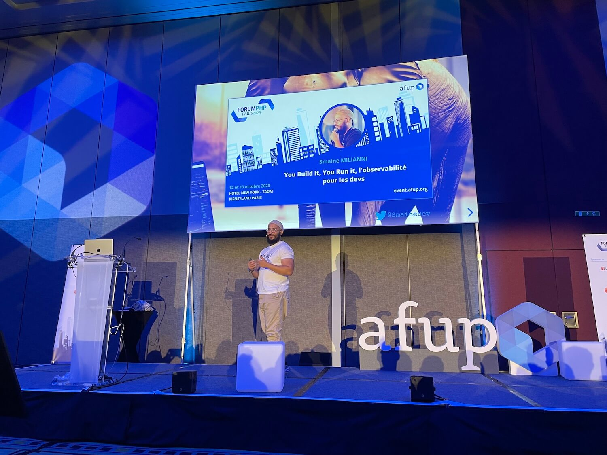
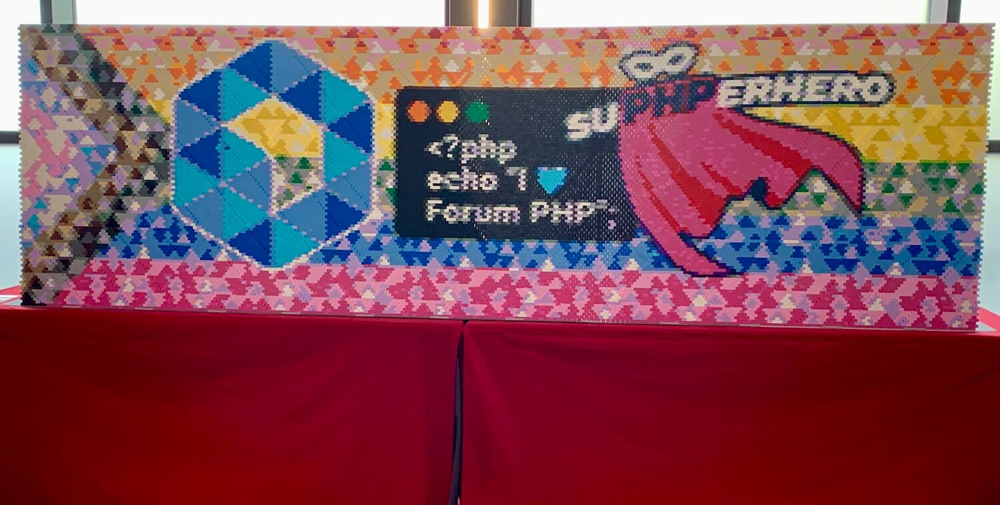

Cette année encore, Bedrock était présent au Forum PHP pour cette édition 2023.

Nous étions sept au total : trois organisateurs, trois visiteurs et une conférencière, Pauline Rambaud.

## Les conférences que l’on retient

### Why is PHP still awesome in 2023 ?

> Conférence présentée par [Frank Karlitschek](https://twitter.com/fkarlitschek), co-fondateur de [NextCloud](https://nextcloud.com)

La conférence s'est divisée en deux parties que l'on pourrait résumer de la
manière suivante :
* Une présentation assez détaillée de ce qu'est *NextCloud*
* Pourquoi le choix de `PHP`🐘 pour `NextCloud` ?

#### NextCloud

`NextCloud` est un outil comparable à *Google Workspace*, car il permet la gestion
de fichiers partagés, de documents de type Office, et propose aussi des outils
de conversations textuelles et d'appels vidéos.

Il existe en version desktop bien sûr, mais aussi en version mobile.
On peut noter qu'il est utilisé par le *Gouvernement Français*, ou encore
*l'Union Européenne*.

En somme, il constitue aujourd'hui une alternative crédible à ses concurrents
Américains ou Chinois.

Une de ses différences majeure toutefois est qu'il est *open-source*.

#### Pourquoi choisir PHP pour NextCloud ?

Les raisons que Frank nous donne sont les suivantes :

* `PHP`🐘 est facile à déployer
* Il est indépendant (il n'appartient pas à Google)
* Son isolation des process garantie une bonne scalabilité
* Il propose une bonne courbe d'apprentissage
* Il évolue depuis longtemps et est donc robuste
* Il a derrière lui une grosse communauté de développeur
* Un important écosystème d'intégration et de frameworks

Il évoque toutefois quelques limites qui subsistent à son sens :

* il reste (de moins en moins) facile d'écrire du code non sécurisé, malgré
  le système de typehinting ou les enums
* il reste des incohérences, par exemple dans les `array functions`
* il reste très limité dans la programmation fonctionnelle

Toutefois, Franck conclura sur le fait que sans `PHP`, `NextCloud` n'aurait
jamais été possible.

### Augmentez votre couverture : supprimez des tests

> Conférence présentée par [Baptiste Langlade](https://twitter.com/Baptouuuu)

Avez-vous déjà été confronté à la problématique de l'augmentation exponentielle
du nombre de tests de votre projet, et par conséquent, de l'augmentation du temps
d'exécution de vos tests ?

Ce fut le cas de Baptiste dans l'Application de gestion de Documents à laquelle
il a participé.

#### Vive le hasard

Sa réponse à ce problème fut la suivante : *jouer des tests au hasard*, autrement
dit faire du `Property Based Testing`.

L'idée est de générer aléatoirement des données pour couvrir le plus de cas
possible.

Ensuite, on écrit un test si un bug survient.

Cette approche se base sur la fameuse loi de Murphy qui veut que lorsqu'un problème
doit survenir, il arrive toujours trop tôt.

On mise donc sur l'aléatoire pour faire remonter les bugs plus rapidement.
Ainsi, on détermine que pour tout ensemble de donnée X, l'ensemble des tests
doit être vrai.

#### Blackbox

De cette approche est née [Blackbox](https://github.com/Innmind/BlackBox), une
librairie compatible `PHPUnit` permettant de faciliter et d'automatiser la mise
en place de tests basée sur le `Property Based Testing`.

Elle permet notamment de faire en sorte que les jeux de données que l'on va
insérer en input peuvent être vraiment divers et variés, et provoquer des
cas critiques non répertoriés.

Résultat : plus on joue les tests, plus notre confiance grandit dans l'application.

### Comment contribuer à PHP en 2023 ? Georges Banyard

> Conférence présentée par [Georges Banyard](https://twitter.com/Girgias)

Tout d’abord Georges Banyard a introduit la notion de compilation minimale de PHP en C, pour cela il a utilisé son blog
et nous a présenté les choses importantes à connaitre.

Puis, il a fait la présentation du code source de PHP et du moteur de recherche qu’il utilise.

Ensuite, il a commencé à nous montrer quelques ressources auxquelles se réferer si nous désirons contribuer à PHP.

Rappelons que PHP est un langage de programmation open-source et que toute personne désireuse de l’améliorer peut
proposer une implémentation.

Les ressources que nous pourrions utiliser si notre souhait était de créer une nouvelle fonction dans PHP seraient :

* des articles sur Zend (https://www.zend.com/resources/writing-php-extensions)
* le PHP internal books (https://www.phpinternalsbook.com/)
* ou bien encore la “Room 11” sur Stackoverflow où se retrouve de nombreux contributeurs PHP.

Georges Banyard est ensuite passé à la pratique et a codé en direct une nouvelle fonction de tri dans un
tableau `array_search`. Le but de cette conférence était de démystifier la contribution à PHP et de montrer aux gens que
finalement ce n’est pas si compliqué, il suffit de plonger dedans !

### Utilisez la bibliothèque standard PHP (SPL) au quotidien

> Conférence présentée par [Florian Merle](https://twitter.com/florianm__)

La bibliothèque [SPL](https://www.php.net/manual/fr/book.spl.php) ça vous dit quelque
chose ? En réalité, vous l'utilisez déjà au quotidien à travers les `Exceptions`
ou bien la fonction `spl_autoload_register` par exemple, mais Florian est venu
nous parler de certains aspects moins connus et pourtant très utiles.

#### Les structures de données

La plus évidente et la plus connue, qui a sans doute contribué à la facilité
d'accès de `PHP`🐘 est bien évidemment l'`array`. Mais si son avantage majeur
est le fait qu'il soit multi-usage, il se révèle en réalité assez peu optimisé
pour les gros volumes de données.

D'autres structures telles que les listes doublements chaînées
([SplDoublyLinkedList](https://www.php.net/manual/fr/class.spldoublylinkedlist.php)),
ou les `Heaps` ([SplHeap](https://www.php.net/manual/fr/class.splheap.php),
[SplPriorityQueue](https://www.php.net/manual/fr/class.splpriorityqueue.php) ont
été abordées, mais on constate rapidement qu'elles présentent l'inconvénient majeur
d'avoir de mauvaises performances par rapport à `array` et des nommages de méthode
peu intuitif.

#### PHP DS

Une alternative intéressante est [DS](https://www.php.net/manual/fr/book.ds.php),
qui ne présente pas de problème de gestion de priorité et de meilleures performances.

Florian nous a présenté notamment [DS\PriorityQueue](https://www.php.net/manual/en/class.ds-priorityqueue.php)
et [DS\Vector](https://www.php.net/manual/en/class.ds-vector), qui constitue une
alternative intéressante à `array`.

#### Les iterators

Enfin, nous avons vu les iterators de la SPl avec :

* [IteratorAggregate](https://www.php.net/manual/fr/class.iteratoraggregate)
  qui permet d'appliquer un traitement éventuel sur le tableau
* [AppendIterator](https://www.php.net/manual/fr/class.appenditerator)
  qui permet d'insérer d'autres itérateurs
* [IteratorIterator](https://www.php.net/manual/fr/class.iteratoriterator.php)
  qui renvoie un autre Iterator
* [InfiniteIterator](https://www.php.net/manual/fr/class.infiniteiterator.php)
  qui permet de boucler à l'infini (pensez à la fonction lecture en boucle de votre player audio)
* [CallbackFilterIterator](https://www.php.net/manual/fr/class.callbackfilteriterator.php)
  qui permet de filtrer les données à l'aide d'une callback.

### Apprendre à apprendre : petit dev deviendra grand - Aline Leroy

> Conférence présentée par Aline Leroy

Aline Leroy nous parle ici de sa reconversion, et des différentes expériences qu’elle a vécues au cours de son
apprentissage du code. Elle nous donne plein d’astuces et de clés pour améliorer notre façon d’apprendre et de
travailler notre plasticité cérébrale. Tout d’abord, il faut gérer son temps, alterner concentration et dispersion, et
comprendre qu’apprendre c’est créer des liens et des images mentales.

Aline Leroy nous conseille de commencer par faire une introspection afin de déterminer quels sont nos points forts et
faibles, quels sont nos objectifs et puis pour comprendre son propre fonctionnement. Ensuite, il faut faire preuve de
curiosité et ne pas se limiter à un domaine (pensez création de lien, plus le champ est grand, plus vous allez faire
des connexions). Nous pourrons aussi choisir de travailler par découpage, une partie des choses à apprendre, nous allons
devoir travailler notre mémoire. Il est aussi important que l’apprentissage soit une démarche active, prise de notes,
recherche, ne pas catégoriser et surtout, c'est un processus qui demande de la régularité.

Elle insiste sur l’aspect bien-être qui est très important pour apprendre, se mettre au calme, couper ses notifications
et puis on prend des pauses, car c’est là que tout le travail de liaison neuronale se fait. Une pause sportive et encore
plus recommandée, bien sûr ces temps de dispersion doivent être sur un temps maitrisé.

### You Build It, You Run It, l’observabilité pour les devs

> Conférence présentée par [Smaine Milianni](https://twitter.com/SmaineDev), développeur chez Yousign

L’observabilité est quelque chose de très important chez Bedrock, c’est pourquoi cette conférence était très
intéressante.

Smaine a découpé sa conférence en posant trois questions : pourquoi, comment et qui ?

#### Pourquoi faire de l’observabilité ?

Une application va forcément planter à un moment, nous dit Smaine pour répondre à sa première question.

L’observabilité permet non seulement de diminuer les risques que cela arrive, mais aussi d’anticiper les problèmes en
amont.

Au-delà des plantages, l’observabilité ouvre la porte à d’autres formes d’analyses :
* détecter les problèmes/changements de performance
* capter les comportements inhabituels
* ou simplement s’assurer qu’un système fonctionne correctement

#### Comment fait-on ?

Habituellement, l’observabilité s’appuie sur trois piliers : les logs, les métriques et les traces, auxquels Smaine
ajoute un quatrième : les alertes.

Pour résumer ces différents piliers :
* les logs doivent être lus, et donc être disponibles dans un outil dédié
* les métriques permettent d’observer l’état de santé d’une application
    * elles peuvent être techniques (CPU, temps de réponse d’une URL, etc)
    * ou métier (nombre de ventes par jour, nombre d’inscriptions, etc)
* les traces permettent de suivre le comportement d’une application
    * par exemple pour une requête HTTP, on aurait le temps passé dans chaque couche technique (base de données, un
      controller PHP, lecture de cache, etc)
* Et enfin, les alertes
    * elles ne doivent être envoyées qu’en cas de problème (pour éviter de lasser les lecteurs)
    * elles peuvent se baser sur les métriques (même métier)
    * elles peuvent être liées aux logs et aux traces pour aider à les comprendre

Smaine nous a également rapidement parlé des post mortems, qui sont essentiels après un incident pour apprendre des
erreurs et ne pas les reproduire.

#### Qui est responsable de la mise en place ?

L'entreprise de Smaine, Yousign, a une organisation sous forme de squads.
Un squad est composé de plusieurs métiers : dev, devops, PO, designer, chef de projet, etc.

Ils sont alors responsables à la fois de leur périmètre, mais aussi de son observabilité. En gardant cette
responsabilité au sein d’un squad, les équipes sont plus attentives et réactives en cas d’incident.

### Les femmes et le numérique

> Conférence présentée par [Isabelle Collet](https://twitter.com/colletisabelle4)

Isabelle Collet est ancienne développeuse et sociologue épanouie comme elle le dit elle-même. Ce qui lui donne matière à
nous expliquer beaucoup de choses sur “le choix des femmes de ne pas venir dans la tech”. Et bien, oui, pourquoi
sont-elles réticentes ?

Tout d’abord, Isabelle Collet nous parle de pays qui sont des contre-exemples, comme en Malaisie où les femmes sont la
majorité des postes informatiques et de développement, elles sont aussi responsables d’Université. Globalement, dans
certains pays d’Asie, les femmes sont fortement représentées dans le secteur tertiaire, et pourquoi ?
Car ces métiers sont considérés comme des “métiers de femmes”, non salissant, pas physique et surtout possibilité de
télétravail ce qui leur permet de s’occuper de leur famille.

Puis grâce à un petit retour dans le passé, nous découvrons que les femmes au départ étaient très présentes dans
l’informatique et plus précisément dans le développement. Les hommes étaient chargés de la conception des ordinateurs,
ce qui était bien vu dans la société, mais la programmation était un poste considéré comme inférieur. Ce qui va changer
cela est l’apparition du micro-ordinateur qui va inverser la tendance et les hommes vont devenir plus nombreux à coder
et les femmes vont progressivement “disparaître” du paysage informatique.

Pour remédier à cela, Isabelle Collet nous présente deux initiatives universitaires où pour rééquilibrer le taux
hommes/femmes des quotas ont été imposés pendant une dizaine d’années. Aujourd’hui l’équilibre de candidats se fait
naturellement.

En conclusion, les choses évoluent si on veut bien les faire évoluer. Il faut continuer les efforts d’inclusion et la
lutte pour que les femmes soient plus nombreuses dans la tech.

## Conclusion

Cette année, la fresque LEGO a célébré la diversité des membres de l’AFUP et bien sûr le PHP.

Ce forum fût l’occasion d’échanger avec de nombreuses personnes, de découvrir des sujets aussi bien techniques que
sociétaux. On ne peut que féliciter les conférencier·e·s et les bénévoles pour un Forum PHP encore très réussi !

