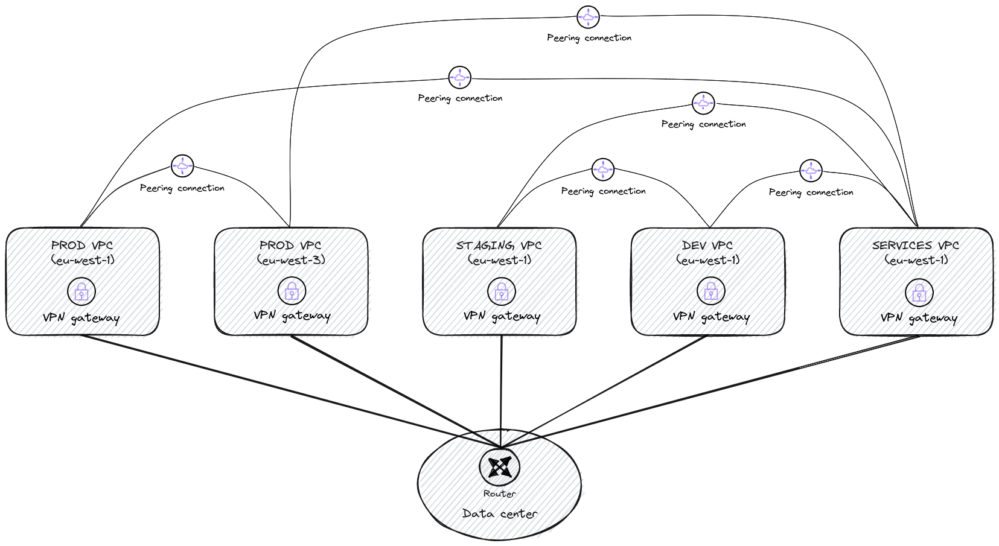
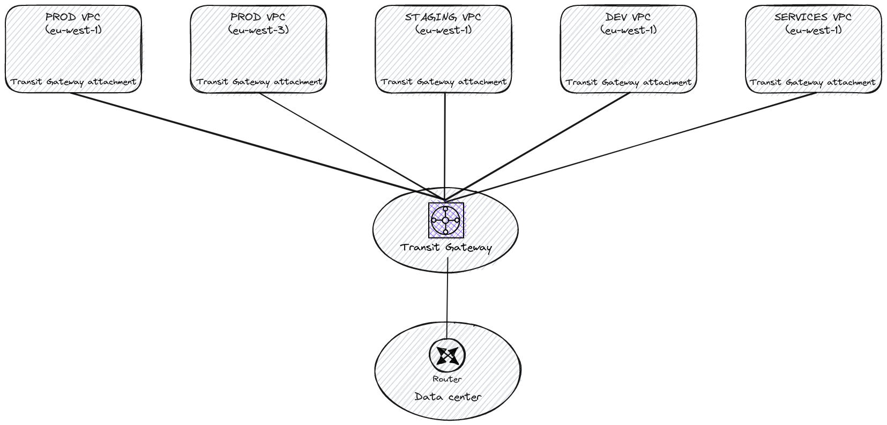

Managing the network of many interconnected AWS accounts can quickly lead to having a messy network architecture.  
Transit Gateway (TGW) service seems to be the way out of this. So how do you know if TGW is right for you?

This blog post will introduce how the service works and explain why we chose not to carry on with our migration to AWS Transit Gateway.
<!--more-->
## Transit Gateway’s backstory

Transit Gateway is a network transit hub that connects multiple VPCs and On-Premises sites to allows control traffic between them.  
It was created to provide a new approach of network implementation on AWS and to make network administration smoother.

VPC peering is a point-to-point connection between 2 VPCs.  
It is a great example of complex network management because it adds a new topology to the network architecture.  
On this diagram you can see an example of VPC peering usage. It's not that messy yet but at scale it will be.

By acting as a “cloud router”, TGW centralizes network connections and takes control of packet forwarding between VPCs.  

VPC peerings are not required anymore, we go back to a simpler star network topology thanks to Transit Gateway which really does address the complexity and restrictions of VPC peerings.  
At that point, TGW seems to be the perfect answer for a simpler network architecture.

## What about TGW at Bedrock?

We operate more than 20 different AWS accounts for our customers' platforms. Each account has a VPC with at least 3 private and 3 public subnets. We also manage AWS accounts for internal tools like ECR repositories, monitoring tools and shared s3 buckets. We configured Site-to-Site VPNs from On-Premises infrastructure to all the VPCs in these accounts.

From the creation of new AWS accounts to deploying the tenants’ platform, onboarding a new customer requires a lot of work and time.

Configuring VPCs Site-to-Site VPN is one of the steps that requires a lot of work. This is why we were interested in Transit Gateway at first.

### Proof of concept

We created a production like Proof of Concept infrastructure using three AWS accounts, two different regions, multiple VPCs and a single Site-to-Site VPN from TGW to On-Premises firewall.

#### How did we test TGW?

We started by trying to split routing domains.  
Centralizing network connections also means (with correct ACLs or Security Groups) that VPCs can reach all other VPCs. We want to control that.  
Transit Gateway attachments read their routes in the TGW route table they are associated to. This is how we manage routing domains.  
We create a Transit Gateway routing table and create routes for target networks.  
TGW attachments are able to propagate routes in a route table if we want to. But because of routing domains, we can't use that option and we have to add routes manually (attachments only read routes in the route table).

Then we tested Transit Gateway peering.  
TGW is a regional service, this means that we need to have a TGW for each active AWS region. We use TGW peering to interconnect them.  
We expected to have some way to propagate routes dynamically in the Transit Gateway peering route table. But it is not possible.

The last thing we tested is migrating from VPC Site-to-Site VPN to TGW VPN.  
Because of the amount of VPC Site-to-Site VPN we have, it was important for us to know if we could get a minimal down time on On-Premises to VPC connections when migrating to the Transit Gateway VPN.  
This process requires a lot of time because routes have to be deleted and created manually on each side.

Even if we noticed some pain points, tests went well. So we decided to initiate the migration to the Transit Gateway service.

### Why did we choose to rollback?

Everything was okay at first, we successfully migrated two VPC Site-to-Site VPN to our Transit Gateway VPN.

But then previous pain points became barriers:
- creating and managing routing domains is possible, but makes it impossible to use dynamic route propagation
- there is not option to propagate routes in VPC route table, they all have to be created manually
- data transfer cost is too high (and multiplied by the number of region on which you deployed TGW if your packets go through all these regions)
- migrating to Transit Gateway requires a planned maintenance because there is a network downtime

We took some time to talk about what to do next and concluded that migrating to Transit Gateway will just move the complexity of configuring VPC Site-to-Site VPNs to configuring TGW attachments and routes.

AWS support did not suggest enough solutions to the problems we faced, so we decided to rollback to VPC Site-to-Site VPNs.
