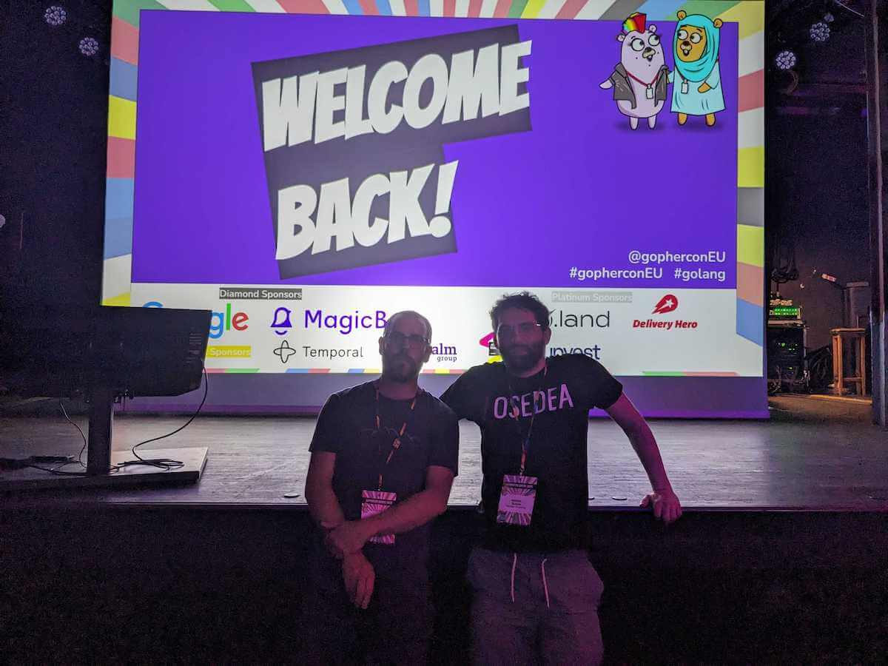
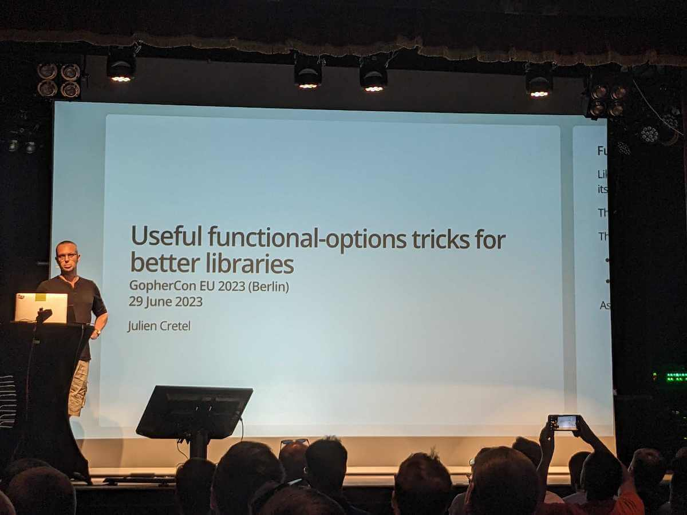
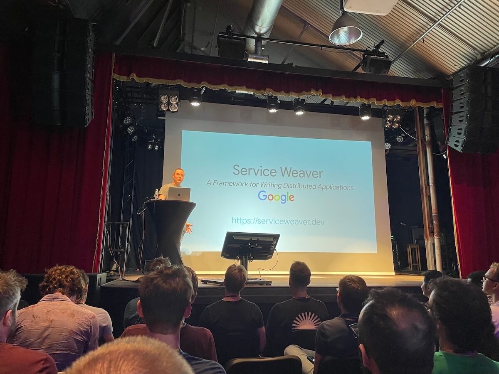

Depuis maintenant presque 1 an, la verticale Backend de Bedrock, s'ouvre à d'autres langages de programmation que PHP, à
savoir Golang et Rust.
C'est pourquoi cette année, pour la 1<sup>ère</sup> fois, 6 de nos collègues ont participé (2 en présentiel, 4 à
distance) à la [GopherCon EU](https://gophercon.eu) ayant lieu à Berlin.



La GopherCon EU, c'est un peu comme le Forum PHP, mais pour le Go et à un niveau international. À cette édition, environ
600 participants étaient présents sur place ou à distance depuis les 4 coins du monde (Brésil, États-Unis, Afrique du
Nord, Europe, Asie, Australie…) et bien sûr d’autres français.es.

Elle se déroule sur 1 semaine entière :

- Jour 1 : Visite de Berlin et table ronde
- Jour 2 : Atelier
- Jour 3 et 4 : Conférences
- Jour 5 : Interview avec les UX de l’équipe Go

L'évènement avait lieu dans un espace assez typique de l'Allemagne, un "Biergarten" que l'on pourrait traduire par
"Brasserie en plein air". On vous rassure tout de suite pas de bière pendant les conférences ;)

Les conférences se déroulaient principalement dans la salle de concert du Biergarten, cependant l'après-midi, il y avait
une 2ᵉ track qui se tenait dans un entrepôt de ventes aux enchères.


Lieux atypiques, pour nous, bonne ambiance, des gophers.euses très sympas, amicaux, respecteux.ses, tout pour assister à
des conférences fantastiques.

Nous ne pouvons vous présenter l'ensemble des conférences, mais en voici quelques-unes nous ayant marqués pour vous
donner envie d'en voir davantage :

## Keynote - State of the Go Nation

Les deux jours de conférences ont démarré par une Keynote donnée par [Cameron Balahan](https://twitter.com/cameronbalahan),
le Product Lead pour le Go chez Google.

Cette keynote a été l’occasion de revenir sur l’historique de Go en tant que plateforme depuis sa création en 2007
jusqu’à aujourd’hui avec l’arrivée prochaine de [la version 1.21](https://tip.golang.org/doc/go1.21) en août :

- 2007 : Création de go par Google (utilisé à 20% sur les projets Google)
- 2009 : Go devient open source
- 2012 : Sortie de Go 1.0, avec pour objectif de construire une plateforme stable et compatible dans le temps
- 2015 : Sortie de Go 1.5, qui apporte une augmentation des performances (via la mise en place du « low latency garbage collection »), un compilateur et runtime écrits en Go
- 2018 : Introduction des modules. Amélioration de la sécurité. Nouveautés : SBOM, fuzzing
- 2022 : Introduction des generics sans breaking changes

Une fois cet historique présenté, Cameron a parlé de l’avenir du Go et de son écosystème dans les années à venir. Pour
l’équipe de développement (dont plusieurs membres étaient présents), le Go n’est pas juste un langage de programmation
mais tout un écosystème : des outils pour les IDE (le plugin Go pour VS Code est maintenu par la team), la gestion des
dépendances, les systèmes de test, le formatting, le profiling, la CLI, la rétro-compatibilité, la documentation web et
bien sûr le langage lui-même.

La rétro-compatibilité est un point sur lequel il a beaucoup insisté, en parlant notamment de l’ajout des generics
dans [la version 1.18](https://tip.golang.org/doc/go1.18), et ce, sans aucun breaking change. Cet ajout est pour la Core
Team la modification la plus complexe ayant eu lieu sur le langage, et la plus complexe qu’il n’y aura jamais. Tout ça
pour dire qu’ils ne voient pas de raison à ce qu’il existe un jour un Go 2.0 et que le langage restera donc toujours
rétro-compatible dans ses futures versions.

## Useful Functional-Options Tricks For Better Libraries



[Julien Cretel](https://twitter.com/jub0bs) nous a présenté le pattern `functional options` à travers l'exemple d’une
petite librairie de gestion de `CORS`.

Pour faire cette première librairie, une première approche "classique" serait d'utiliser une fonction de création de
cors avec des paramètres pour chacune des options.

Il note plusieurs inconvénients :
- Pas très ergonomique
- Pas assez expressif
- Et pas extensible

```go
fcors.NewCORS([]string{"https://example.com"}, 0, nil)
```

Une première alternative est l'utilisation d'une struct `Config` qui contiendrait toutes les options possibles et de passer
cette struct en paramètre :

```go
type Config struct {
  Origins []string
  MaxAgeInSeconds uint
  RequestHeaders []string
}

func NewCORS(cfg Config) *Middleware
```

C'est plus extensible, mais certains inconvénients restent :

- pas de possibilité de ne pas passer un paramètre
- peu expressif

Il propose alors une autre possibilité : le `functional options` :

```go
func NewCORS(opts ...Option) *Middleware

func FromOrigins(origins ...string) Option
func MaxAgeInSeconds(delta uint) Option
func WithRequestHeaders(names ...string) Option
```

L'idée est d'utiliser des constructeurs nommés pour instancier des options selon les besoins et de passer ses options en
paramètre !

Les avantages qu'il y voit sont :
- le système est facilement extensible
- c'est beaucoup plus expressif

Il a ensuite détaillé certaines astuces pour aller plus loin avec ce pattern :
- « When order doesn't matter, users are happier »
- « Multiple calls to the same option »
- « Immutability »

Vous pouvez retrouver les slides de sa présentation [ici](https://github.com/jub0bs/talks/tree/main/2023/06/functional-options)
et cerise sur le gâteau, une librairie qui sert d'exemple existe : [https://github.com/jub0bs/fcors](https://github.com/jub0bs/fcors)

## Towards modern development of cloud applications with service weaver



Cette conférence, présentée par [Robert Grandl](https://twitter.com/GrandlRobert), est intéressante pour une entreprise
qui commence à utiliser Go. On peut se poser la question : Faut-il partir tout de suite sur des micro-services ou bien
commencer par un monolithe ?

L'idée générale de [Service Weaver](https://serviceweaver.dev) est de permettre aux développeurs de se concentrer sur le
développement de leur application sans se soucier de cette question d'architecture.

Grâce à ce framework, une application peut être développée comme une sorte de monolithe via des modules Go qui
communiquent via des interfaces. Le framework permet ensuite de déployer cette application de deux façons différentes :

- un monolithe, où les modules communiquent via des appels directs dans un seul fichier binaire final
- des micro-services, où les modules communiquent via des appels réseaux (gRPC) et sont déployés dans des containers
  séparés

Dans le cas d'un déploiement en Micro-services, le framework prend entièrement en charge la communication entre les
modules, sans aucun impact sur le code ou le développeur.

## Go Sync or Go Home: Advanced Concurrency Techniques for Better Go Programs

[Yarden Laifenfeld](https://twitter.com/YardenLaif), Software Engineer chez Rookout, nous a présentée les fonctionnalités moins connues des packages
[sync](https://pkg.go.dev/sync) et [x/sync](https://pkg.go.dev/golang.org/x/sync).

Voici les différents sous packages présentés lors de cette conférence :

#### sync - Wait Group

`WaitGroup` va permettre d'attendre que toutes les tâches soient terminées.
Son utilisation simplifie l'implémentation, la lecture du code, mais aussi la performance comparée au couple
goroutines/channels.

#### x/sync - Error Group

`ErrorGroup` permet de prendre en charge la propagation des erreurs, si une tâche renvoie une erreur, la tâche
principale peut agir en fonction.

#### x/sync - Single Flight (Do)

`Do` de `singleflight` permet de ne pas exécuter deux fois la même tâche avec la même valeur d'entrée. Si une entrée
similaire arrive avant la fin de la précédente, cette entrée va attendre le résultat de la précédente et retourner le
même résultat faisant ainsi gagner en performance.

Yarden nous a indiqué que _Kubernetes_ utilise ce mécanisme dans le `cached token authenticator` depuis maintenant
quelque temps.

Nous allons regarder dans les prochaines semaines si nous avons la possibilité d'utiliser ces patterns dans notre
codebase actuelle et l'avoir à l'esprit pour nos futurs développements.

## Pour conclure

Bedrock participe depuis longtemps directement ou indirectement à des événements liés aux différentes technologies
utilisées en interne.

Par exemple en 2023 : [Android Makers](https://tech.bedrockstreaming.com/2023/06/19/android-makers-23.html),
[l'AFUP Day](https://tech.bedrockstreaming.com/2023/06/06/afup-day-lyon-2023.html),
[le MiXiT](https://tech.bedrockstreaming.com/2023/04/25/mixit-lyon-2023.html),
[l'AWS Summit](https://tech.bedrockstreaming.com/2023/04/20/aws-summit-paris-2023.html),
[Kubernetes Community Days](https://tech.bedrockstreaming.com/2023/04/03/kubernetes-community-days.html)
et [Vue Amsterdam](https://tech.bedrockstreaming.com/2023/03/31/retour-vue-amsterdam-2023.html).

C'est donc dans la même logique que Bedrock a choisi de faire participer certains membres du backend à la GopherCon.

Parmi les 6 collègues présents à la conférence, certains viennent de commencer à utiliser le langage de programmation Go
tandis que d'autres commencent à avoir une certaine expérience. Ce fût donc l'occasion d'échanger, de partager et de
découvrir, aussi bien entre nous qu'avec les autres participants, différents sujets au sein de l'écosystème Go, qui
prend une part croissante dans notre plateforme.


