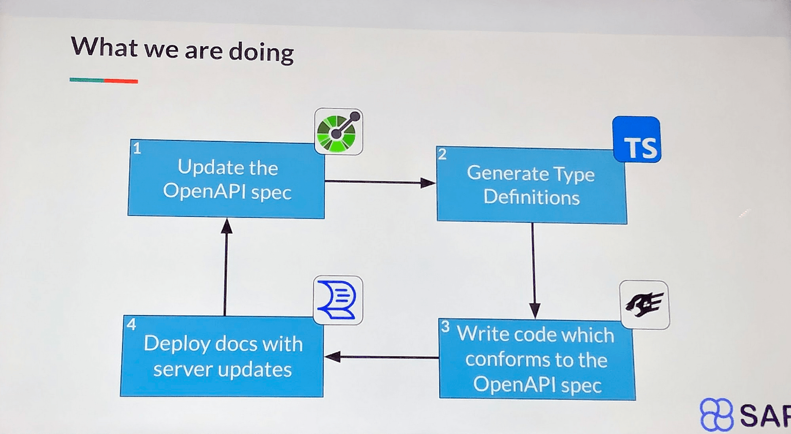
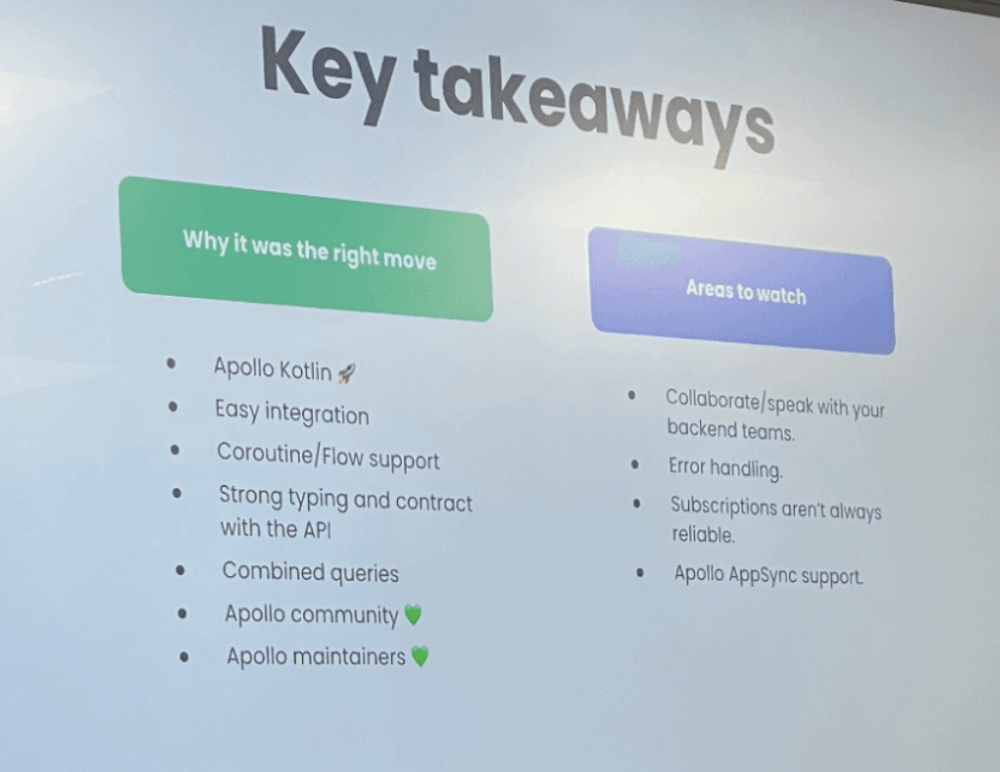
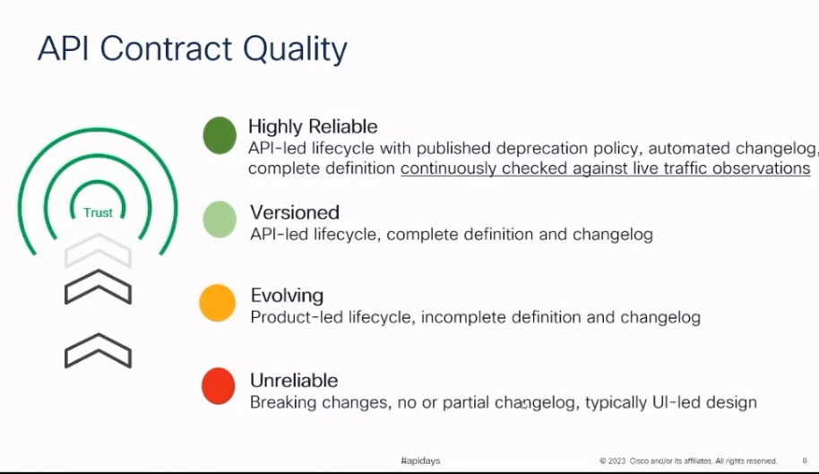
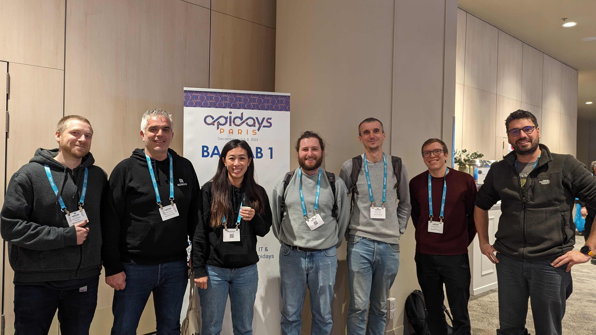

Cette année Bedrock a envoyé 7 de ses collaborateurs et collaboratrices (i.e. nous, les auteurs de cet article) à l'édition 2023 des conférences "API Days" à Paris.

L'événement a eu lieu au CNIT à La Défense (juste en face du marché de Noël) et a duré 3 jours, du Mercredi 06/12/23 au Vendredi 08/12/23.

En plus des 11 paires de chaussettes différentes 🧦 que nous avons réussi à débusquer en parlant aux différents partenaires sur place... En tout, [ce sont plus de 100 talks, répartis dans 9 salles, qui nous ont été présentés](https://www.apidays.global/paris/#schedule).

Voici, un résumé de quelques-uns des talks que nous souhaitions mentionner sur ce blog 👇

## Making the Most of Your OpenAPI Spec

> Conférence présentée par Alexander Broadbent (Principal Engineer - SAPI)

Cette conférence expliquait, en détail, une technique "design-first" permettant d'éradiquer les erreurs de "désynchronisation" entre la documentation d'une API et son comportement réel, tout en générant une partie du code.

Cette technique peut se résumer en quelques points : 
- la documentation OpenAPI est la source de vérité et décrit l'intégralité des endpoints de l'application (celle-ci peut être fragmentée en plusieurs fichiers)
- un outil ([redocly](https://github.com/Redocly/redoc)) regroupe tous les documents OpenAPI dans un même fichier
- un outil ([openapi-typescript](https://github.com/drwpow/openapi-typescript)) génère le typage Typescript correspondant au fichier OpenAPI
- un outil ([fastify-openapi-glue](https://github.com/seriousme/fastify-openapi-glue)) applique le typage Typescript généré sur le code des différents endpoints de l'API [Fastify](https://fastify.dev/) afin de s'assurer que le code produit par les développeurs est conforme à la documentation

Et pour les détails d'implémentation, le repository GitHub de la démo d'Alexander est disponible ici : [https://github.com/AlexBroadbent/openapi-demo](https://github.com/AlexBroadbent/openapi-demo) 

## Forget TypeScript, Choose Rust to build Robust, Fast and Cheap APIs

> Conférence présentée par Zacaria Chtatar (Backend Software Engineer - HaveSomeCode)

Cette conférence au titre subversif expliquait pourquoi Zacaria, développeur Typescript/NodeJS à ClubMed, en est arrivé à s'intéresser très fortement au langage de programmation Rust… Au point d'en faire la promotion, en anglais (respect), aux API Days.

La première partie de sa conférence parlait du langage de programmation Typescript, en dressant une liste de ses qualités (fullstack, très largement déployé en entreprise, écosystème riche, ...) et de ses défauts (gestion d'erreur optionnelle, typage éphémère, runtime principal peu performant, …). Cette première partie s'est achevée par un message clair : "Typescript is not enough".

La suite et fin de la présentation, quant à elle, était une introduction à Rust. 

Bien que nous étions surpris de voir que [le langage de programmation préféré des développeurs](https://survey.stackoverflow.co/2023/#section-admired-and-desired-programming-scripting-and-markup-languages) de ces 8 dernières années, et sur lequel [les plus grosses entreprises tech du monde misent aujourd'hui](https://foundation.rust-lang.org/members/), avait encore besoin d'être mis en avant en 2023... Zacaria a effectivement eu raison d'en remettre une couche, car encore trop peu d'entreprises françaises ont pris conscience des avantages qu'offre Rust.

Cependant, cette 2ème partie de conférence avait un goût de déjà vu pour nous car un de nos collaborateurs a déjà donné le même genre de conférence à Bedrock durant [nos LFT](https://tech.bedrockstreaming.com/lft/) 2 années auparavant (en partant de PHP plutôt que de Typescript)... Ceci étant, grâce à nos 2 ans d'expérience de Rust en production et pour les raisons évoquées par Zacaria durant son talk, Bedrock est en mesure de témoigner sa satisfaction d'avoir pris le temps de réécrire certaines des API les plus critiques de Bedrock en Rust. Et nous espérons que de nombreuses entreprises oseront suivre notre exemple, afin de permettre aux développeurs soucieux de la qualité de leur travail comme Zacaria, de disposer de ce merveilleux langage de programmation.

Et si vous ne comprenez toujours pas l'intérêt de Rust, [le talk de Zacaria est disponible en replay sur Youtube](https://www.youtube.com/watch?v=eSo3e3ugn5g).

## Real-Life REST API Versioning: Strategies and Best Practices

> Conférence présentée par Alexandre Touret (Senior Software Architect - Worldline)

La gestion des versions dans le contexte des API au sein d'une entreprise peut souvent s'avérer être un défi complexe et délicat. En effet, les interfaces de programmation applicative (API) constituent le cœur des interactions entre différents services et applications au sein d'un écosystème numérique. La nécessité de versionner ces API devient impérative pour garantir une évolution harmonieuse tout en préservant la compatibilité avec les systèmes existants.

Worldline fait partie des entreprises avec une architecture technique complexe, exposant à des clients finaux un modèle métier en constante évolution.
Ce problème fait très fortement écho avec le business model de Bedrock.

Dans sa conférence, Alexandre a présenté son retour d'expérience sur comment versionner une API. Et comment l'exercice est loin d'être un long fleuve tranquille. Voici les points clés que nous avons retenus : 

#### Toutes les APIs ne nécessitent pas d'être versionnées

Le versioning c'est compliqué. C'est un fait. Autant l'appliquer sur des APIs où ce principe est vraiment utile. Il est effectivement peut-être moins utile de versionner une API interne, non exposée sur internet ou avec un périmètre fonctionnel très limité ou stable.
Voici les questions proposées par Alexandre qui peuvent nous aider dans notre décision : ai-je besoin de versionner ? Combien de versions dois-je gérer en parallèle ? Est-ce que ma plateforme est compatible ? Quels sont les impacts sur ma configuration, mon modèle de données, **mon système d'authentification** (Alexandre a bien insisté sur ce point. Il ne faut pas négliger l'authentification dans la problématique du versioning) ?

#### Le versioning s'applique aussi sur une architecture en micro service

On a tendance à croire que seules "les grosses API" sont concernées par le versioning mais Alexandre nous a montré qu'il n'en est rien. Un micro service, aussi micro (voir macro) qu'il soit, gère à lui tout seul un périmètre fonctionnel. Il est donc légitime qu'il puisse évoluer au fil des versions.

#### Comment gérer le versioning

Plusieurs solutions, directement dans l'URL, via header (plus facile avec une API existante)
Alexandre a fortement déconseillé d'utiliser le versioning par content type. À la fois peu lisible et difficilement maintenable.

#### L'impact du versioning

Versionner une API change en profondeur nos manières de travailler. Et ce à plusieurs niveaux :
- Le code source, la technique. Il est indéniable que le code source ainsi que l'architecture technique de vos projets s'en verra impactés. L'impact ne s'arrête pas au code en lui-même, mais sur tout ce qui gravite autour. Nos bases de données, nos scripts, nos configurations serveur ou nos images docker par exemple
- Le produit. Nos API exposent le métier de notre produit. L'impact n'est donc pas que technique, mais aussi fonctionnel / produit. Une évolution de version technique entraine des breaking change et inversement. Il est donc très important, les équipes et produit travaillent de pair pour évoluer ensemble
- La livraison. Avoir plusieurs versions d'un API complexifie la mise en production de cette dernière. Il faudra très certainement revoir nos pipelines d'intégration et de déploiement. Ce point est, lui aussi, à ne pas négliger et nécessitera un travail commun au sein des équipes techniques

#### L'observabilité

Alexandre nous a aussi parlé de l'importance d'avoir de la visibilité sur ce qu'il se passe en production, et tout particulièrement à la maille des différentes versions de nos API.

L'observabilité est quelque chose de plus en plus répandu dans notre métier. Mais le versioning porte le concept encore un cran au-dessus.

Il est primordial d'être capable d'assurer une bonne observabilité de nos APIs à la maille : 
- De la version
- Des clients (via des API Keys dédiées)

Une bonne observabilité est la clé pour définir une bonne stratégie et être capable d'anticiper le dé commissionnement de versions obsolètes. Ce point est selon moi très important.

Il est très (très) compliqué de maintenir un nombre trop élevé de versions pour une même API. Sans parler d'obsolescence programmée, il faut trouver le bon niveau de maintenance pour éviter de tomber dans le piège de la dette technique. Pas facile comme sujet !

Pour finir, je tiens à remercier Alexandre pour sa conférence vraiment intéressante. Bourrée d'exemples concrets. J'ai vraiment senti une vraie maîtrise du sujet. Bravo ! Cette conférence est mon coup de cœur de l'API Days Paris 2023.

## Our Ongoing Journey From REST To GraphQL On Android

> Conférence présentée par Julien Salvi (Lead Android Engineer - Aircall)

Durant cette présentation, Julien Salvi, Lead Android Engineer chez Aircall nous fait un retour d'expérience sur la migration de l'équipe Android d'une API REST à une API GraphQL. Ce choix a été motivé par plusieurs raisons : 
- Une problématique globale sur le scaling de leur API REST
- L'efficacité et l'agrégation des données des API GraphQL
- La recherche d'une alternative Serverless
- L'objectif de limiter les perturbations pour les clients

Leur aventure débute mi 2020 et est toujours en cours.

Pour répondre à ces demandes, les équipes ont dirigé leur choix vers GraphQL pour créer leur nouvelles API, qui a plusieurs avantages selon Julien notamment: 
- La possibilité pour les clients de récupérer seulement les données dont ils ont besoin, cela évite l'over-fetching et l'under-fetching
- Les clients peuvent récupérer de multiples ressources dans une seule requête
- GraphQL propose un moyen d'établir une connection constante entre le client et le serveur, ce qui augmente la scalabilité en temps réel
- Le fort typage de GraphQL permet une communication claire, réduisant ainsi les erreurs
- L'amélioration de la performance globale grâce au batching des requêtes 

L'équipe Android utilise le service [AppSync d'AWS](https://aws.amazon.com/fr/appsync/), facilitant le filtrage, permetttant de faire du realtime, assurer une scalabilité et une bonne intégration avec ElasticSearch et DynamoDB.

Après les premières migrations vers les API GraphQL, le conférencier insiste sur l'importance du monitoring, qui chez eux est présent que ce soit pour les queries ou les mutations.

Voici les points à retenir de leur expérience

Pour finir, revenons sur un de leur point à surveiller, Julien nous évoque l'importance de la collaboration entre les équipes front et backend qui est également selon nous très importante, notamment pour optimiser l'efficacité des API. On peut citer comme actions par exemple, se mettre d'accord sur les meilleurs timeout à adopter sur les API ou aussi créer les schémas OpenApi ensemble.

## Why API Contracts matters

> Conférence présentée par Stéve Sfartz (Principal Architect - Cisco)

Cette présentation par le Principal Architect de Cisco nous explique pourquoi, dans une stratégie API First, le besoin d'avoir des contrats ainsi qu'un cycle de vie de l'API est primordial pour la cohérence du système.

Ils formalisent leur contrats d'API via OpenAPI Spécification, un standard pour les contrats d'API REST, en complément de documents OpenAPI, pour former la définition de l'API. A côté de cette définition, on trouve la gestion du cycle de vie (lifecycle) de l'API, pour informer des deprecated, du changelog et des Breaking Changes lors des versions majeures (semantic versionning).

Lors de la mise en place de ces contrats pour les API à cisco, une qualité (qu'ils appellent aussi Health Contract) y a été associée pour avoir une vue d'ensemble de la documentation des API. Ayant environ 2000 API, cette qualité ne peut pas être évaluée à la main au cas par cas, et passe donc par des outils d'analyse tels qu'un linter Spectral, pour éviter les erreurs et automatiser la génération de ce statut.

Vient ensuite la gestion du drift entre la documentation et le code (par exemple si une annotation est oubliée, une route non documentée) : la vérification du drift doit être faite lors de la CI/CD.

La conférence se conclut sur une question simple : "Quelle est la source de vérité pour vos API ?". La réponse est bien évidemment le code, mais une documentation générée automatiquement permet justement de s'en rapprocher grandement. A Bedrock, nos API GraphQL ont leur documentation (schéma) généré automatiquement à partir du code lors du merge d'une PR, ce qui permet d'éviter les oublis de mise à jour.

## Let's bring science into API docs

> Conférence présentée par Lana Novikova (Technical Writer - JetBrains)

Au cours de cette conférence, Lana Novikova explore comment fusionner les principes scientifiques avec une communication technique efficace dans la documentation des API. 
Elle partage également ses connaissances sur la façon dont les développeurs et développeuses consomment l'information en ligne, en mettant en lumière les liens avec différents styles cognitifs, le tout appuyé par des articles scientifiques. Elle explique de manière concrète comment ces principes peuvent être appliqués dans la documentation des API et comment ils peuvent contribuer à améliorer l'expérience des développeurs et développeuses.
[Sa conférence est une extension d'un précédent talk qu'elle a donné en 2022 à la "Write The Docs Australia"](https://www.youtube.com/watch?v=9SdGWU867bs)

La première étude que nous présente Lana s'intitule ["Patterns of Knowledge in API Reference Documentation"](https://www.cs.mcgill.ca/~martin/papers/tse2013a.pdf). 
Elle parle de la nature et de l'organisation des connaissances contenues dans la documentation de référence de centaines d'API au sein de deux plateformes technologiques : Java SDK 6 et .NET 4.0. L'étude a, entre autres, consisté à élaborer une taxonomie des types de connaissances et a pu dresser la liste de 12 types de connaissances distinctes dans la documentation de l'API :

À travers cette étude, nous pouvons donc évaluer le contenu de la documentation de notre API en fonction des types de connaissances et ainsi développer des modèles de documentation adaptés aux connaissances communément associées aux différents types de composants de l'api. De plus, aujourd'hui, des projets comme [the good docs project](https://thegooddocsproject.dev/) existent et proposent des templates de documentation basés sur ces données scientifiques.

La deuxième étude exposée dans cette conférence a comme titre ["How Developers Use API Documentation: An Observation Study"](http://sigdoc.acm.org/wp-content/uploads/2019/01/CDQ18002_Meng_Steinhardt_Schubert.pdf). Sa méthodologie consiste à l'observation active, via des screencasts et des protocoles verbaux, des activités des personnes participantes pendant le test. Les chercheurs et chercheuses ont évalué le taux de réussite, le temps passé sur les tâches et l'utilisation de la documentation et des catégories de contenu. L'objectif principal est d'observer comment les développeurs et développeuses abordent les tâches avec une API qu'elles ne connaissent pas. Il s'agit également d'analyser comment les développeurs et développeuses utilisent les ressources d'information proposées par la documentation de l'API. Cela permet de caractériser les stratégies adoptées par les développeurs et développeuses lorsqu'elles commencent à travailler avec une nouvelle API. La conclusion que Lana nous partage est qu'en moyenne, les personnes participantes ont utilisé la documentation de l'API environ 49 % du temps (Min : 31 %, Max : 68 %). La catégorie de contenu à laquelle il est fait référence le plus souvent est "API reference", suivie de "Recipes page".

Il se dégage que le temps que les personnes participantes consacrent aux différentes catégories de contenu varie considérablement d'une personne à l'autre. Sur la base de ces données, les chercheurs et chercheuses ont défini trois types de personnages de développeurs logiciels à la recherche d'informations ainsi que leurs approches lorsqu'ils opèrent celles-ci: Systematic learners, Opportunistic learners et Pragmatic learners. Pour les personnes curieuses d'approfondir le sujet, ces personae sont basés sur une autre étude intitulée ["What is an end user software engineer?"](https://www.researchgate.net/publication/30815675_What_is_an_End_User_Software_Engineer).

Lana Novikova conclut en mettant l'accent sur le fait qu'il faut respecter les différentes stratégies adoptées par les développeurs et les développeuses lorsqu'elles abordent une nouvelle API et nous propose d'appliquer ces conseils :
- Pour les "opportunistic learners", donner des exemples de code complets et exhaustifs en donnant la possibilité de masquer tout le reste et de relier le texte au code.
- Pour les "systematic learners", fournir des informations importantes de manière redondante et donner des connaissances de base pertinentes.
- Pour les "pragmatic learners" (et les autres), donner un moyen technique pour commencer à utiliser une API.

Je tiens personnellement à souligner qu'il est rare d'assister à une conférence aussi complète se basant sur autant de données scientifiques. Je ressors de cette conférence agréablement surpris de la qualité de tout ce qui a été proposé et des ressources mises à disposition. Je vous laisse avec [un lien contenant toutes les slides de la présentation de Lana Novikova](https://speakerdeck.com/lananovikova10/lets-bring-science-into-api-docs-c9bd5a57-df28-4fa3-9388-d2d9d9a044bd) qui expliquera bien mieux le propos que mon résumé. Bravo à elle et à son travail, en espérant voir de plus en plus de conférences de ce genre à l'avenir.

## Le mot de la fin

Si on vous a donné envie d'en savoir plus :
- le [site officiel de la conférence](https://www.apidays.global/paris/)
- la majorité des [talks sont disponibles sur Youtube](https://www.youtube.com/watch?v=NdlhxIVlSEM&list=PLmEaqnTJ40OryW56Qo3c-C7hXcaR89xii)
- certains speakers ont mis à disposition [les slides de leur talk](https://fr.slideshare.net/APIdays_official/presentations)

Bonnes fêtes de fin d'année !

