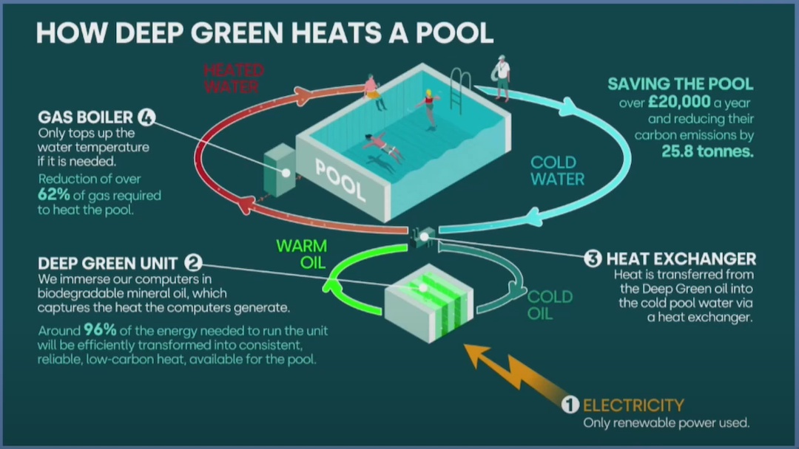
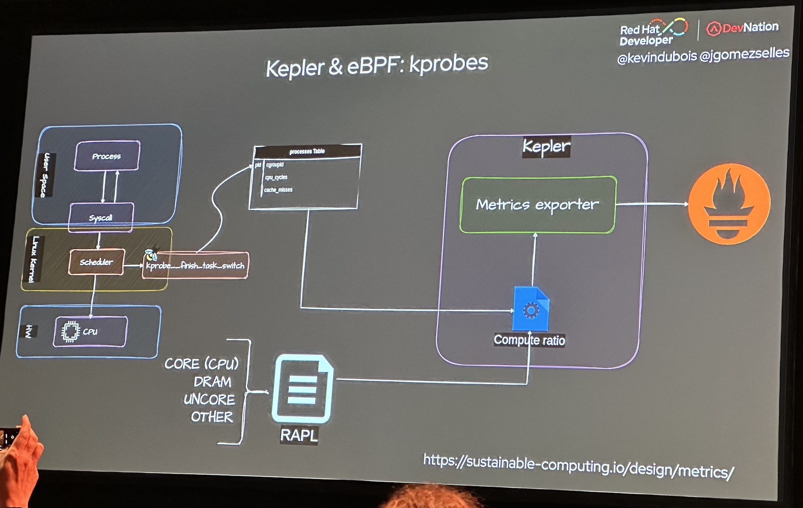

Two weeks ago, six of us were at KubeCon in Paris. For a few, it was their first KubeCon! For one, it was the fourth one. Since Copenhagen in 2018, which was before we started [moving to AWS and Kubernetes](https://leanpub.com/tci/), so much has changed -- and so much has not ;-)

## Big ideas

First of all, these four days clearly highlighted some wide topics.

### AI and GPUs everywhere

Seems like “AI” was the impossible-to-miss subject vendors were trying to push, this year! Still, while many are running experiments, not many have deployed and maintained workloads in production yet.

Like many, we have started using a few “AI” tools and are working on some ideas *(not hosting them ourselves yet, though)*, but we can’t help but feel “AI” and especially the “Generative AI” term is a bit over-used and some solutions we’ve seen were closer to good-old-ML.

As we are not planning on running our GenAI workloads on Kubernetes anytime soon, we haven’t been to many talks on this matter. Still, between re:Invent last year and KubeCon this year, you’ll find plenty of contents if that’s your thing 💪.

### Platform engineering is the new DevOps?

Next up, looks like *DevOps is dead* and *Platform Engineering is the new DevOps*!

On one hand, we clearly see having everything related to all your projects in one place brings tremendous value *(and we have a couple dashboards that go this way)*. Same with providing a common basis *(Terraform, Golang Skeleton, Helm chart)* most projects build upon instead of re-inventing it again and again.

On the other hand, we don’t think, today, *“being able to create a new service in one click and 15 seconds”* is a goal we should aim for. We’d rather rationalize micro-services and reduce network overhead. Remember, distributed systems are *“easy”*.

Still, Backstage has gained in traction over the past two years, and it would be the first tool we’d try if *(or when)* we’d wanted to invest on this path.

### Green Computing

⏩ [Heating Pools with Cloud Power: A New Wave in Green Computing - Saiyam Pathak, Civo & Mark Bjornsgaard, Deep Green Technologies](https://www.youtube.com/watch?v=H5NES1Is7rw)

Nowadays, data centers' electricity consumption uses 2% of the world's electricity and the demand is growing exponentially due to more and more data centers being built. A very large percentage of future consumption will be dedicated to AI through high consumption GPUs.

In this context, Deep Green is embracing a generational shift as a company building a new kind of data centers. They aim to build small edge data centers as close as possible to heat consumers in order to recapture and distribute the heat. Indeed, in classic data centers, a huge chunk of energy is wasted into heat not being used. Chance with datacenter is that a very large amount of heat is produced in the same place (in comparison with other kind of industry). Deep Green's computers are immersed into biodegradable oil which captures generated heat. Then, heat is transferred through heat exchangers to targets which can be swimming pools, private houses, offices... The process is simple and known for decades, but the smart move is to associate small edge data centers to heat consumers.

And what about CNCF and kubernetes? CNCF tools are allowing them to make this work as efficient as possible by:

 * monitoring heat consumption and carbon emissions with tools like Kepler
 * adapting workloads sizes
 * managing intelligent workload scheduling: scheduling the workload to the datacenter which is actually requiring to heat up a particular consumer (using ArgoCD deployment, for instance)

### Scaling depending on energy usage of instances

In recent years, sustainable IT has become a major issue for companies. At Bedrock streaming, we are committed to reducing the environmental impact of our platforms. One of the first steps in this transition is to understand the impact of our applications.

At kubeCon 2024, we were able to discover a number of interesting tools that we'll be testing in the near future.

#### Kepler

⏩ [Sustainable Computing: Measuring Application Energy Consumption in Kubernetes Environments with Kepler](https://www.youtube.com/watch?v=7_a9mCTcxkk)

[Kepler](https://sustainable-computing.io/) is a CNCF Sandbox project that uses eBPF to collect performance counters and other system statistics. Kepler estimates energy consumption per pod based on this data and exports it as Prometheus metrics.

#### PEAKS

⏩ [Empowering Efficiency: PEAKS - Orchestrating Power-Aware Kubernetes Scheduling](https://www.youtube.com/watch?v=WPrSnZ4lyjw)

Peaks aims to optimize the energy consumption of a kubernetes cluster during scheduling. Peaks relies on pre-trained ML models vs energy consumption to predict the most suitable nodes. The tool is not yet available, but development is progressing and a *Kubernetes Enhancement Proposal* will be opened in the sig-scheduling project.

Both tools represent significant advances towards more sustainable computing, and reflect the Kubernetes community's commitment to responsible innovation.

### Finops

Reducing -- or optimizing -- infrastructure costs has been a recurring topic at KubeCon for as long as we remember. Every year, there are talks about basic tools like HPA or ideas like using Spot instances *(like we do, for 100% our worker nodes!)*. This time, Karpenter has clearly become a leader.

The basics being covered, costs are still too high, and reducing them is getting even more complex than before as more stuff is deployed to Kubernetes. Thinks GPU-based or long-running workloads, for example.

We are beginning to see more and more approaches using **machine learning to forecast how much resources will be needed at a given time**, depending on past data. We, like others, have implemented [our own pre-scaling mechanism](/2022/02/03/prescaling.html) -- not based on ML yet, though.

### Kubernetes and Developer experience

DevOps and Ops, who manipulate Kubernetes and its objects everyday, we tend to forget: Kubernetes is not *(perceived as)* easy for our developers colleagues, who only write manifests every once in a while or use kubectl when their app fails.

During “Developers Demand UX for K8s”, Mairin Duffy and Conor Cowman presented the results of an UX research they did amongst Kubernetes users and identified the main issues developers encounter with it. Debugging network issues, YAML *(indentation, lack of validation, clean export)*, the infamous Crash Loop *(and disappering logs)*, CLI vs GUI… Yeah, we’ve had all of those!

We have partially solved some of these issues, both with technical solutions *(Helm + Helmfile, reusable Github Action workflows)* and training sessions, but debugging is still a pain :-/

## Things we are currently working on

### Keda

⏩ [Scaling New Heights with KEDA: Performance, Extensions, and Beyond - Jorge Turrado, SCRM Lidl International Hub & Zbynek Roubalik, Kedify](https://www.youtube.com/watch?v=_5_njiPr5vg)

In our ongoing quest to improve the efficiency of our Kubernetes clusters, we recently opted for Kubernetes Event-driven Autoscaling (KEDA), a project supported by the Cloud Native Computing Foundation (CNCF) and enjoying growing adoption by the community. This choice is in line with our desire to go further than the capabilities offered by our previous tool, the Prometheus adapter, thanks in particular to more refined scaling management based on various external metrics.

One of KEDA's real strengths is its ability to adjust scaling via *'scaling modifiers'*, allowing precise adjustment of the number of pods as required based on a calculation. At Bedrock Streaming this will enable us to refine our prescaling strategy, previously [based on an external metric provided by a go service](/2022/09/01/kubernetes-prescaling-we-open-source-our-solution.html), we'll be able to upgrade our system to something simpler and more precise. Maybe evolve from a simple calculation of minimum pods and multipliers, to a more sophisticated approach.

The presentation by Zbynek Roubalik and Jorge Turrado, KEDA maintainers, highlighted KEDA's effectiveness in meeting various load requirements through the use of a variety of external metrics, making scaling more accurate.

### Cilium

Cilium (and eBPF) were well represented at KubeCon, with a number of conferences on the subject.

This came at just the right time, as we are currently in the process of migrating to this CNI. This one, based on eBPF (with all that that implies) seemed to us to be a good replacement for our current CNI.

With cilium: no more KubeProxy, and no more IPtables, which for large clusters is a major performance factor.

Cilium also enables network traffic to be filtered with NetworkPolicies inbound and outbound.

Another feature we particularly like is "[cluster-mesh](https://cilium.io/use-cases/cluster-mesh/)”, which allows you to communicate between several clusters in a fairly simple way, at least on paper 😊! (conference available [⏩ here](https://www.youtube.com/watch?v=qbB3TEiOb24))

We were also able to see new features such as GatewayAPI support from version 1.15, and the use of [`stateDB`](https://github.com/cilium/statedb) from version 1.16 to manage the state of cilium objects (and therefore reconciliation in the event of inconsistent state (conference available [⏩ here](https://www.youtube.com/watch?v=YX0sql_3dt8&list=PLj6h78yzYM2PHDqy_nINY8-462uYzb18d&index=2))).

## Tools and idea we want to try 💪 

KubeCon is also a great way to discover or re-discover new technologies or tools. We won’t share an exhaustive list *(see you there next year!)*, but here are a few we are excited about:

 * WebAssembly *(especially [SpinKube](https://www.spinkube.dev/))*: we are running some workloads at-edge on WASM and see a huge potential there. WASM in Kubernetes is intriguing, maybe as a way to reduce pods startup time?
 * [OpenFeature](https://openfeature.dev/): for feature-flipping, A/B testing… Glad to see the emergence of an open standard!
 * Working with multiple Kubernetes clusters: not something we think we need for now, but after hearing about Federation years ago, [Karmada](https://karmada.io/) seems to be the current tool for this.
 * [mirrord](​​https://mirrord.dev/): to develop locally as-if inside a Kubernetes cluster, forwarding network and file accesses.

### Crik & Criu: creating snapshots for interrupted pods

⏩ [The Party Must Go on - Resume Pods After Spot Instance Shut Down - Muvaffak Onuş, QA Wolf](https://www.youtube.com/watch?v=c2MbSM9-7Xs)

During the conference held by Muaffak Onuş of the CNCF, an innovative solution was highlighted to mitigate the instability of spot instances: the [CRIK](https://github.com/qawolf/crik) project, which leverages [CRIU](https://criu.org/Main_Page) to provide backup and restore functionality for Kubernetes pods. By leveraging CRIU, CRIK can capture the state of processes within a pod before a spot instance shutdown, and then restore them, making it easier to resume work after a spot reclaim for exemple.

A kubernetes controller is deployed, which monitors the state of nodes. When a pod with the required criu configuration is going to be deleted it consults the controller to check if the node is going to be deleted to dump all it’s processes, file descriptors etc… Before being restored on another one.

This technology is particularly relevant for Bedrock Streaming, where our entire Kubernetes clusters are based on EC2 spot instances. The use of CRIK could transform the way we manage extended jobs, particularly for our machine learning / AI teams, by ensuring the continuity of jobs lasting several hours despite instance interruptions. The integration of CRIK promises to substantially improve the resilience and efficiency of our cloud operations. We plan to test Crik at one of our future r&d days.

### Cilium as cluster-mesh

⏩ [Simplifying Multi-Cluster and Multi-Cloud Deployments with Cilium - Liz Rice, Isovalent](https://www.youtube.com/watch?v=qbB3TEiOb24)

One thing that caught our attention was the native Cluster-Mesh feature which could allow us to connect multiple clusters between them with little effort and potentially multiple cloud providers between them.

To allow each Cilium’s components to communicate between them an internal load-balancer is deployed in each cluster.

There are some prerequisites to allow cluster mesh though:

 * CIDR block must not overlapped
 * Each cluster needs to have their own unique ID and name
 * All clusters need to use Cilium as their CNI
* Cluster Mesh option has to be enabled on each cluster

Liz Rice did a live presentation of cluster mesh capabilities with some use cases and functionalities like:

 * Creation of global services
 * The ability to setup affinity rules for local cluster and remote one, to prefer the usage of local cluster pods and fallback to remote if needed.
 * Setup of network policies to cluster level with the Cilium's ability to add custom labels to pods to identify the cluster they're running on.

Even if for now the usage of multi-cluster through different cloud providers is not a common use case the fact that Isovalent succeeded to make it that simple is very impressive

Cilium is now the new standard and we are glad to have chosen it on our clusters.

### OpenFGA

⏩ [Federated IAM for Kubernetes with OpenFGA - Jonathan Whitaker, Okta](https://www.youtube.com/watch?v=UaK1EnRgrng)

Among the presentations that stood out for us, the one from [OpenFGA](https://openfga.dev/) really grabbed our attention. OpenFGA, or Fine Grained Authorization, is an open source project that promises to transform the way we manage authorization and identity federation in modern applications.

OpenFGA is a universal authorization solution that enables complex authorizations to be modeled in a granular way. Inspired by Google's Zanzibar project, OpenFGA offers a developer-friendly API, while guaranteeing performance and security.

OpenFGA gives us the ability to define detailed access policies, which is crucial for identity and access management in dynamic environments like Kubernetes.

The OpenFGA tool represents a major advance in the field of IT security. Its flexibility, performance and open approach make it an ideal candidate for companies looking to implement robust identity federation. The presentation at KubeCon 2024 only confirmed the immense potential of this tool.

## Things that are no longer “problems”

 * Basic reactive auto-scaling. Still challenges: using >50% of resources, predictive pre-scaling, long-running tasks.
 * Basic Kubernetes observability. Still challenges: observability at large-scale and/or for large distributed systems that go beyond Kubernetes.
 * Using EC2 Spot instances -- we’ve been doing it for years for 100% our worker nodes. Now, with Karpenter, others seem to be doing it more and more.

## Conclusion

Why do we keep going to KubeCon -- and other conferences? Well, three goals:

 * discovering new approaches and tools that might help us better serve our customers in the future;
 * confirming the solutions we are working with are used by many others in the community, which *(probably)* means they are *(still)* the right tools;
 * and learning how to do some things better every day.

And it’s funny how each of us noticed different matters, depending on which parts of our platform we work on and depending on our experience and knowledge in Cloud Native solutions!

If we were to suggest a few things to KubeCon’s organizers:

 * 30 minutes talks is sometimes a bit short and longer talks could go deeper into technical details;
 * rooms were not big enough for popular talks -- and we’re talking about “tech” talks ;-)
 * food 😵. I mean, we’re French 😅

Once again, we come back from KubeCon full of energy and ideas, ready for an exciting new year!
