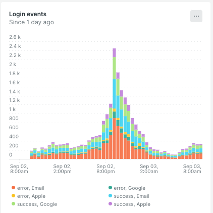
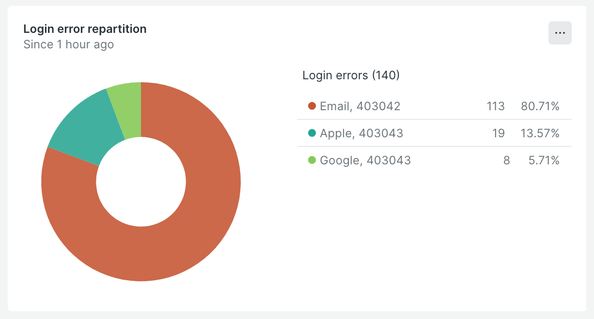
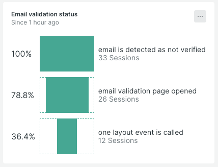

 
At *Bedrock*, we develop a streaming solution tailored for European media companies. Our application is a customizable white-label product used by millions across Europe. Bedrock’s clients have high expectations for stability, early incident detection, quick resolution, and effective communication during those times. Naturally, our goal is to deliver a stable product, and we dedicate significant effort toward this objective. 

However, about two and a half years ago, our mobile team faced serious challenges in monitoring production. The tagging systems were pushing events into a tool that developers were not kin to use. The graphs were not intuitive and difficult to generate, making them hard to interpret. Each team across the company was managing its own monitoring practices. Monitoring was largely manual.  
Too many problems were brought to the attention of the team by a complaint of our client to the support team. We knew we had to make a change. 

Several organization-wide measures were implemented (like tools to streamline incident reporting and improved communication processes with our clients), but on the tech side, we also needed to play our part. 

## Setting Our Goals and Expectations 

We began by defining our goals: 

* Confidence in Releases: We needed certainty that what we shipped was functioning as expected. 
* Standardized Practices: It was crucial to align monitoring practices and tagging plans across teams. 
* Early Problem Detection: Our goal was to identify issues as early as possible. 
* Quick Data for Support Teams: We aimed to swiftly provide support with relevant metrics, such as the number of users impacted and the duration of incidents. 
* Developer Adoption: The selected tool had to be user-friendly, offering easy graph creation, visually appealing layouts, straightforward querying, and an ergonomic interface. 
* Automated Alerts: We needed a system that could automatically alert us of potential issues. 
* Configuration Portability: Regularly exporting our dashboards and alerts configuration was key, ensuring we could redeploy the setup if needed. 

Bedrock chose New Relic. It’s important to note that this is not the only monitoring tool available, and we’re not claiming that others can’t meet our needs (we didn’t explore them deeply enough to say). What we do know is that New Relic has been widely adopted across our tech teams and has proven to be an effective solution to reach our requirements. 

## Our Implementation Path 

Here’s the approach we took: 

* Shared Documentation: We created unified documentation for technical tagging plans across front-end teams, organized by domain and feature. 
* Common Dashboards: We developed shared dashboards for the Android and iOS teams, organized by domain (e.g., one for the Player, one for the Core, one for User Life Cycle, and one for iOS-specific features). 
* Automated Notifications: A Slack notification system was set up to alert teams whenever the documentation changes, ensuring everyone stays informed. 

## Advanced Queries with New Relic Insights 

New Relic Insights, powered by NRQL (New Relic Query Language), allows developers to create powerful queries to extract specific information. Below, we illustrate how various NRQL queries translate into different types of graphs and charts on our dashboard: 

 
### Example 1: Count Query with Line chart 

 ```
 SELECT count(*) 
 FROM Actions 
 WHERE actionName = 'LoginAction' 
 FACET status, authenticationMethod 
 TIMESERIES auto 
 ```

This query counts the number of occurrences of the 'LoginAction' event, faceted by the status and authenticationMethod fields. The `TIMESERIES` auto clause visualizes this count over time, showing trends or spikes in login activity. 

How It Renders: The line chart displays the count of login actions over time, with different lines for each combination of status and authentication method (Google, Apple, Email). This allows us to track how login activity changes over time and to compare different types of logins or statuses. 

 

### Example 2: Count Query with Pie chart 

```
 SELECT count(*), WHERE status = 'error' 
 FROM Actions 
 WHERE actionName = 'LoginAction' 
 FACET authenticationMethod, errorCode 
```
 
This query counts the number of login actions that resulted in errors, faceting by authenticationMethod (Google, Apple, Email) and errorCode. It helps identify which authentication methods and error codes are most common. 

How It Renders: The pie chart visualizes the distribution of login errors across different authentication methods and error codes. Each slice represents the proportion of errors associated with a particular method or error code, making it easy to see which are most problematic. 

  
 
### Example 3: Percentage Query with Billboard chart 

 ```
 SELECT 100 - percentage(count(*), WHERE status = 'error')  
 as `Successful login` 
 FROM Actions 
 WHERE actionName = 'LoginAction' 
 SINCE 2 hours ago 
 COMPARE WITH 1 day ago  
```

This query calculates the percentage of successful login actions (i.e., those that did not result in errors) within the last two hours, compared to the same period one day ago. It helps track success rates and identify any improvements or declines in login performance. 

How It Renders: The billboard chart prominently displays the percentage of successful logins as a large, bold number. The comparison with the previous day is also displayed, allowing for quick assessment of whether the success rate has improved or worsened. 

 
  
 
### Example 4: Funnel Query 

```
   SELECT funnel(sessionId AS session, 
   WHERE name = 'EmailValidationStatus' AND isVerified IS false AS 'email not verified', 
   WHERE name = 'EmailNotVerifiedPageOpe' AS 'email validation page opened'), 
   WHERE name = 'LayoutPageOpen’ AS 'one layout event is called ') 
   FROM Actions 
 ```

This funnel query tracks user sessions through key steps in an email verification process. It identifies users with unverified emails and checks if they opened the email validation page. This helps monitor conversion rates and potential drop-offs in the user journey. 

How It Renders: The funnel chart visualizes the sequence of user actions, showing the number of users at each step of the email verification process. This makes it easy to see where users drop off and which steps might need improvement. 

   

## Configuring Alerts with New Relic 


When setting up New Relic alerts, we used both static and anomaly thresholds based on the feature's behaviour: 

* Static Thresholds: Applied to features with predictable, consistent performance, where specific limits are well-defined.  
For example, we used static thresholds for the Login/Register and Consent features, where behaviour is stable and deviations are easily identifiable. 

* Anomaly Detection: Used for features with dynamic patterns where a fixed threshold isn’t suitable. 
We applied anomaly detection for example to the Payment feature since transaction patterns can vary significantly based on many factors. 

This combination allows us to accurately monitor both stable and variable features. 

### Alert Policies 

An alert policy determines who should be notified when an alert is triggered. It defines notification channels, user groups, and actions to take. To create an alert policy: 

* Go to "Alerts & AI" in your New Relic dashboard. 
* Create a new alert policy and define the actions to take when an alert is triggered. 
* Associate the policy with the channels or emails that should receive the alert notifications. 

### Alert Conditions 

Alert conditions define the thresholds at which an alert should be triggered. To configure an alert condition: 

* In your New Relic dashboard, go to "Alerts & AI." 
* Create a new alert condition by specifying criteria such as response time or error rate. 
* Define the thresholds and conditions necessary to trigger the alert. You can use anomaly detection or static thresholds depending on your feature needs. 
* Associate this condition with the specific alert policy you have defined. 


### Code of alerts with Terraform  

Here’s a simple example of Terraform code to configure an alert condition that triggers when a spike in login errors (critical or warning) is detected: 
 
```
  resource "newrelic_nrql_alert_condition" "authentication_login_error" { 
  account_id                   = "account_id" 
  policy_id                    = "policy_id" 
  type                         = "static" 
  name                         = "authentication_login_error" 
  description                  = "This alert fires when the % of login errors gets too high in a given time" 
  enabled                      = true 
  violation_time_limit_seconds = 259200 

  nrql { 
    query = "SELECT percentage(count(*), WHERE status = 'error') * IF(count(*)<100, 0, 1) FROM Actions WHERE actionName = 'LoginAction'" 
  } 

  critical { 
    operator              = "above" 
    threshold             = 10 
    threshold_duration    = 3600 
    threshold_occurrences = "all" 
    
  } 

  warning { 
    operator              = "above" 
    threshold             = 8 
    threshold_duration    = 3600 
    threshold_occurrences = "all" 

  } 

  fill_option        = "none" 
  aggregation_window = 3600 
  aggregation_method = "event_flow" 
  aggregation_delay  = 600 
} 
```

Explanation: 

This Terraform script configures an NRQL static alert condition for monitoring login errors. The alert triggers if the percentage of login errors exceeds a threshold. The NRQL query calculates the error percentage and multiplies it by 0 if the event count is less than 100 (to avoid false positives from low activity). The critical condition triggers if the error rate is above 10% for at least 1 hour. The warning condition triggers if the error rate is above 8% for the same duration.  The script also sets up an aggregation window and delay to smooth out any short-lived spikes. Once this condition is met, an alert is sent to the Slack channel configured in the previous steps. 
 

## Brighter Outlook with Enhanced Monitoring 

Now, with our new monitoring solution in place, we're seeing a significant improvement in how we handle critical issues. Alerts are delivered instantly, allowing us to respond to problems as they arise. Even when we receive warnings, we can act proactively to prevent potential issues from escalating. 

This immediate and precise alerting system ensures that our dedicated teams whether they handle backend issues or other areas are promptly informed and can address concerns before they impact our users. This proactive approach not only enhances our overall performance but also improves our operational efficiency. 

Overall, this solution has proven to be more effective and practical for our project, enabling us to maintain higher levels of stability and deliver a better experience for our clients. We're confident that this improvement will continue to support our success and growth moving forward. 

 
### Reference: 
[Steal this dashboard](https://newrelic.com/blog/how-to-relic/steal-this-dashboard )

 
