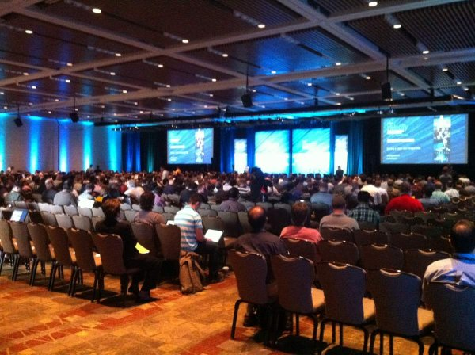
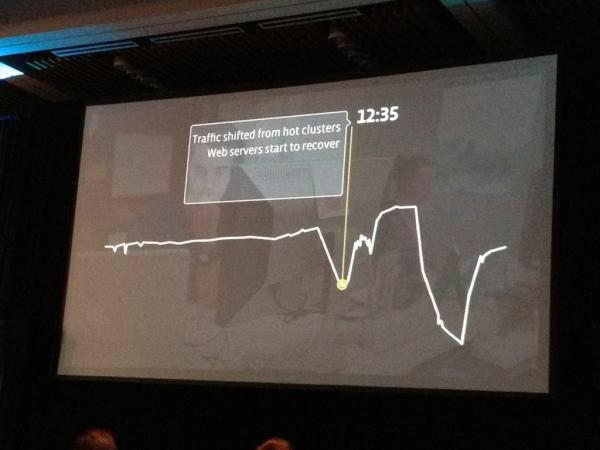
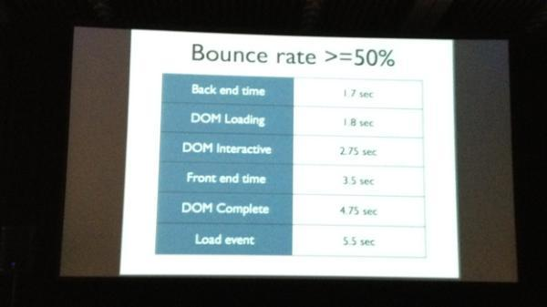

Compte rendu des tracks DevOps/WebPerf de cette deuxième journée de cette Vélocity Conférence à Santa Clara (Californie) qui marque l'ouverture "officielle" de la conférence, la veille étant considérée comme des conférences bonus orientées Tutoriaux.

La matinée offrait un track unique dans une salle gigantesque.

Vidéo d'intro à la Vélocity !

 <iframe allowfullscreen="" frameborder="0" height="360" src="https://www.youtube.com/embed/Vxq9yj2pVWk?wmode=transparent&fs=1&feature=oembed" width="640"></iframe>

L'ouverture officielle est donc présentée par Steve Souders (Google) et John Allspaw (Etsy), toujours dans un show l'américaine, et même déguisés. 

S'enchaine ensuite un condensé de session plutôt courte par des acteurs très prestigieux du web.

*(Crédit photo : https://instagr.am/p/MV5xAAJLSt/ )*

#### [DevOps] Building for a billion Users, par Jay Parikh (Facebook)

Première conférence du matin, avec une présentation du "VP of Infrastructure Engineering at Facebook".

On suis avec attention, une présentation très dense de l'infrastructure de Facebook, avec quelques chiffres hors normes.

La philosophie Facebook est présentée en 4 points :

1. Focus on Impact
2. Move Fast
3. Be Bold
4. Be Open

Avec une explication sur les fameux Bootcamp cher Facebook, formation obligatoire auquelle tout le monde participe en rentrant chez Facebook.

Une présentation très brève des outils internes utilisés et développés par Facebook : Perflab, GateKeeper (sorte de Feature Flipping), Claspin, Tasks, SevManager ...

Une explication sur les procédures de déploiement chez Facebook et leur gestion du cache, sur leur volonté de constamment tout refaire, pour toujours être meilleur.

Et pour finir, une anecdote assez drôle sur un incident ayant eu lieu chez Facebook, où toutes les fonctionnalités "non terminées" se sont un jour retrouvées en production.

Bref, une conférence intéressante, mais très dense, dont je vous conseille de regarder la vidéo çi dessous.

> "Fix More, Whine less." Jay Parikh

<iframe allowfullscreen="" frameborder="0" height="360" src="https://www.youtube.com/embed/oodS71YtkGU?wmode=transparent&fs=1&feature=oembed" width="640"></iframe>

#### [DevOps] Investigating Anomalies, par John Rauser (Amazon)

Belle surprise de la journée, avec cette conférence sur la gestion d'incident, qui raconte l'histoire de l'épidémie de Cholera ayant eu lieu à Londres en 1854, et comment John Snow, trouver l'origine de l'épidémie, en se concentrant sur les données, et non pas seulement sur les chiffres.

> "Explaining anomalies often makes your theroy bulletproof" John Rauser

Une deuxième partie était concentrée sur le fait d'étudier les extremités sur vos échantillons de manière à trouver ce qui n'allait pas. Point de vue très instructif.

La vidéo ci dessus est un "must-see" de la Vélocity.

> "Look at the extremes and you'll find things that are broken" John Rauser

<iframe allowfullscreen="" frameborder="0" height="360" src="https://www.youtube.com/embed/-3dw09N5_Aw?wmode=transparent&fs=1&feature=oembed" width="640"></iframe>

#### [DevOps] Building Resilient User Experiences, par Mike Brittain (Etsy)

Le message autour de cette présentation, est que votre application DOIT s'adapter aux incidents. Si possible faire en sorte que cela ne soit même pas percu par la plupart de vos internautes. En découpant chacune des fonctionnalités de votre site, vous devez pouvoir ne pas afficher celle qui ne fonctionne pas correctement sans que cela impact vos utilisateurs (Graceful Degradation).

Les slides sont disponible ici : [https://www.slideshare.net/mikebrittain/building-resilient-user-experiences-13461063](https://www.slideshare.net/mikebrittain/building-resilient-user-experiences-13461063)

<iframe allowfullscreen="" frameborder="0" height="360" src="https://www.youtube.com/embed/bM0yL0eQ9EM?wmode=transparent&fs=1&feature=oembed" width="640"></iframe>

#### [WebPerf] Predicting User Activity to Make the Web Fast, par Arvind Jain (Google), Dominic Hamon (Google)

La présentation commence avec un rappel sur "How Fast is the web today".   
 En quelques chiffres :

- Chrome ~2.3s/5.4s page load time (median/mean)
- Google Analytics ~2.9s/6.9s page load time (median/mean)
- Mobile ~4.3s/10.2s page load time (median/mean)

 D'autres infos sont partagées venant du très utile [HttpArchive](https://httparchive.org/) ...

On assiste ensuite la présentation des fonctionnalités de "Prefetch" de google et du Prerendering en place dans la barre de recherche de Chrome : "Omnibox", ceci ayant pour but de rendre le web encore plus rapide.

Tout cela donne des idéées sur la façon de prédire ce que vont faire les internautes, et sur nos gestions d'"autocomplete".

<iframe allowfullscreen="" frameborder="0" height="360" src="https://www.youtube.com/embed/RnMI-dCWgec?wmode=transparent&fs=1&feature=oembed" width="640"></iframe>

#### [WebPerf] Performance Implications of Responsive Web Design, par Jason Grigsby (Cloud Four)

Une autre conférence que j'attendais grandement, sur le Responsive Web Design. Le sujet est parfaitement maitrisé, et tous les reproches que je peux faire cette techno en ce moment, sont mentionnés, expliqués, et certaines solutions ou idées sont données ! Du tout bon.

A retenir, la méthode conseillée qui est de faire du Mobile First Responsive Web design, c'est dire commencer par la version mobile, puis faire la version web, et non l'inverse.

Les slides ici : [https://speakerdeck.com/u/grigs/p/performance-implications-of-responsive-design](https://speakerdeck.com/u/grigs/p/performance-implications-of-responsive-design)

La conférence n'étant pas disponible en vidéo, vous pouvez déjécouter Jason Grisby lors d'une interview suite sa conférence en vidéo si dessous.

*(Crédit photo : [https://www.flickr.com/photos/stuart-dootson/4024407198/](https://www.flickr.com/photos/stuart-dootson/4024407198/) )*

<iframe allowfullscreen="" frameborder="0" height="360" src="https://www.youtube.com/embed/jsAVpYJMGIc?wmode=transparent&fs=1&feature=oembed" width="640"></iframe>
Jason Grigsby interview la Vélocity Conf 2012

#### [WebPerf] RUM for Breakfast - Distilling Insights From the Noise, par Buddy Brewer (LogNormal), Philip Tellis (LogNormal, Inc) & Carlos Bueno (Facebook)

RUM aka Real User Monitoring est un terme qui est revenu très régulièrement durant cette Velocity. Nous avions pour cette conférence notamment, deux personnes de LogNormal dont le créateur de Boomerang.js : [https://yahoo.github.com/boomerang/doc/ ]( https://yahoo.github.com/boomerang/doc/)et Carlos Bueno de Facebook.

La présentation expliquait comment mesurer des métriques de performances venant d'utilisateurs réel, comment analyser toutes les données, en filtrer le "bruit", et quoi en tirer. Le tout était très instructif, surtout sur la partie filtrage de données (Band Pass Filtering, IQR Filtering ..).

Slides : [https://www.slideshare.net/buddybrewer/rum-for-breakfast-distilling-insights-from-the-noise](https://www.slideshare.net/buddybrewer/rum-for-breakfast-distilling-insights-from-the-noise)

#### [WebPerf] Rendering Slow? Too Much CSS3? Ask RSlow, par Marcel Duran (Twitter Inc.), David Calhoun (CBS Interactive)

On retrouve ici une présentation assez fun du résumé de la conf sous forme de Waterfall (voir photo).

Le talk a ensuite abordé les notions de rendering au niveau CSS avec au départ un cas d'étude : Réaliser le logo de ySlow en CSS3 entièrement. On observe de manière assez drôle le rendu finale dans les différents navigateurs (éclat de rire général sur IE off course). Vous pouvez les retrouver sur les slides ci dessous.

La conférence part ensuite sur quelques tests réalisés sur Chrome uniquement (à prendre donc avec des pincettes) sur les performances CSS3 de chacun de ces cas :

1. background-image vs css3 gradient
2.  vs css background-image
3. @font-face vs  vs sans-serif
4. animated gif vs css3 spinner

L'étude est intéressante, et mériterais d'être creusée sur d'autres navigateurs, mais cela est rendu très difficile par le fait que seul Chrome sait exporter les données de rendu de sa Timeline ...

Les slides sont dispo ici :   
[https://docs.google.com/presentation/d/1b7rdeXYdmL3lmT24GAaC14eOSkq5qt6FM-yLSeFykQk/edit?pli=1](https://docs.google.com/presentation/d/1b7rdeXYdmL3lmT24GAaC14eOSkq5qt6FM-yLSeFykQk/edit?pli=1)

#### [WebPerf] Time To First Tweet, par Dan Webb, par (Twitter Inc) & Rob Sayre (Twitter)

Dan et Rob nous parle performances coté client chez Twitter, et la réecriture du Front-End.

La notion de Time To First Tweet, correspond au temps de navigation jusqu'a l'affichage du premier twiit sur la Timeline. Cette mesure est prise grace à la Navigation Timing Api, supportée dans IE>=9, Firefox & Chrome notamment.

Twitter à aussi abandonné progressivement, l'utilisation des hashbangs (les #! dans l'url), pour utiliser la PushState Api, ainsi que le templating coté client ([Mustache.js](https://mustache.github.com/) et [Hogan.js](https://twitter.github.com/hogan.js/)) pour repasser sur un templating serveur avec leur migration de Ruby vers Java, avec au final 75% de temps client gagné sur le 95th Percentile !

Conférence très intéressante, notamment sur la manière de charger les Javascripts.

Plus de détail sur le blog technique de Twitter : [https://engineering.twitter.com/2012/05/improving-performance-on-twittercom.html](https://engineering.twitter.com/2012/05/improving-performance-on-twittercom.html)

Les slides sont disponible : [https://speakerdeck.com/u/danwrong/p/time-to-first-tweet](https://speakerdeck.com/u/danwrong/p/time-to-first-tweet)

#### Conclusion Day 2 :

Encore une journée riche en informations et idées. Le rythme étant beaucoup plus soutenu, et la fatigue s'accumulant, il n'était pas évident d'être à 100% dans chaque talk :-)

En attendant le CR Ops, et celui du Day 3, vous pouvez relire le CR du Day 1 :   
[https://tech.bedrockstreaming.com/cr-velocity-conference-day-1-dev-webperf](/cr-velocity-conference-day-1-dev-webperf)

P.S : Retrouvez moi sur twitter : [@kenny_dee](https://twitter.com/#!/kenny_dee)

[Playlist Youtube Velocity US 2012](https://www.youtube.com/playlist?list=PL80D9129677893FD8)
