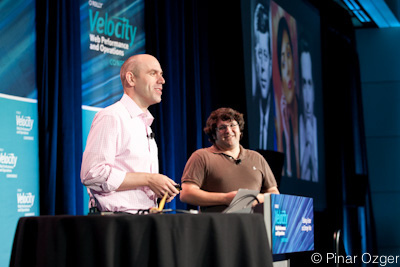
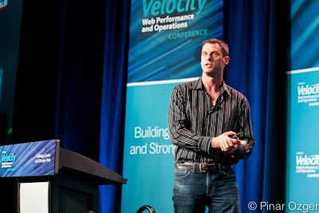
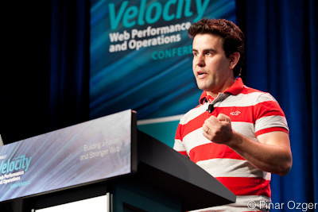
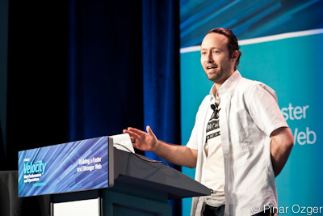
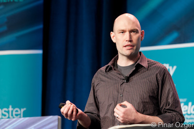
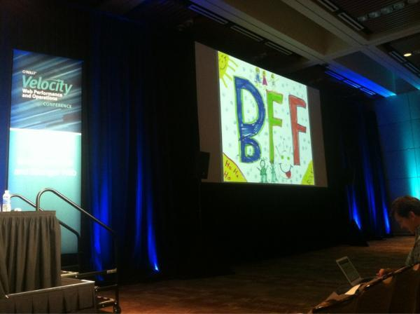
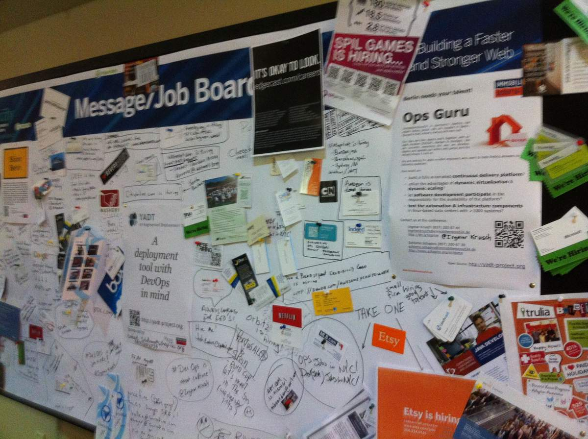

Dernière journée de cette monstrueuse conférence qu'est la Vélocity Conférence.

On commence dans la joie et la bonne humeur avec la "Seven Databases Song" :D

<iframe allowfullscreen="" frameborder="0" height="360" src="https://www.youtube.com/embed/bSAc56YCOaE?wmode=transparent&fs=1&feature=oembed" width="640"></iframe>

#### [Mobile WebPerf] The Performance of Web vs. Apps, par Ben Galbraith (Walmart.com) & Dion Almaer (Walmart.com)

Petit sujet assez trollesque sur les WebApps vs Apps. Conférence hyper énérgétique et très drôle ! Notamment le passage à 12mn dans la vidéo, où l'on compare le mode de distribution des apps natives à ce que cela donnerait si les show tv devraient être distribués de la même manière en prenant l'exemple de la série Friends : Hilarant !

L'idée intéressante sur la fin du talk, concerne le rendu de l'application, qui grâce [Node.js](https://nodejs.org/) (dispo désormais en v0.8.0 enfin) peut être aussi bien fait coté client que serveur suivant le client qui demande. A creuser.

<iframe allowfullscreen="" frameborder="0" height="360" src="https://www.youtube.com/embed/MksKaRpWD-o?wmode=transparent&fs=1&feature=oembed" width="640"></iframe>

#### [WebPerf] Akamai Internet Insights, Stephen Ludin (Akamai)

Petit talk de Stephen Ludin "Chief Architect for Akamai’s Site Acceleration and Security group".

Après une présentation assez hallucinante en quelques chiffres du traffic et des données qui passent chez Akamai :

Toutes les 60 secondes => 1 milliard 3 de logs, + de 6200 heures de vidéos streamés ...

Il a aussi partagé une initiative louable et très intéressante sur un projet de partage des données récoltées chez Akamai : [https://www.akamai.com/io](https://www.akamai.com/io)

On y observe quelques statistiques (relativement peu date) sur les browsers notamment. On voit d'ailleurs quelque chose d'assez fun sur les IE8 : chaque weekend, on apercoit une baisse de présence sur IE8 (qui se retrouve sur d'autres navigateurs plus récent) ... Bref, on voit encore que c'est le monde de l'entreprise qui ralenti la propagation des navigateurs récents !

Source :   
[https://www.akamai.com/html/io/io_dataset.html#stat=browser_ver&top=5&type=line&start=20120601&end=20120626&net=n](https://www.akamai.com/html/io/io_dataset.html#stat=browser_ver&top=5&type=line&start=20120601&end=20120626&net=n)

Et slides ici :   
[https://assets.en.oreilly.com/1/event/79/Akamai%20Internet%20Insights%20%20Presentation.pptx](https://assets.en.oreilly.com/1/event/79/Akamai%20Internet%20Insights%20%20Presentation.pptx)

#### Lightning Demos, par Marcel Duran (Twitter Inc.), Nat Duca (Google), Lindsey Simon (Twist)

Ensuite, viennent trois sessions de Lightning Talk : 5 minutes pour présenter un sujet.

On commence par Marcel Duran, créateur de [Yslow](https://yslow.org/), célèbre extension WebPerf de Firebug à l'origine, qui fait son petit bonhomme de chemin depuis :

- Disponible dans quasiment tous les browsers
- Ruleset personnalisable (cf C3PO voir plus bas)
- Une version en ligne de commande (en Node.Js) pour extraire les données YSlow partir d'un [HAR](https://www.softwareishard.com/blog/har-12-spec/) : [https://github.com/marcelduran/yslow/wiki/Command-Line-%28HAR%29](https://github.com/marcelduran/yslow/wiki/Command-Line-%28HAR%29)
- Un serveur Node.js que vous pouvez tester ici nécessitant aussi un HAR : [https://yslow.nodester.com/](https://yslow.nodester.com/)
- et le meilleur pour la fin, une version pour [Phantom.Js](https://phantomjs.org/) (Projet très impressionnant d'Headless Browser) qui vous permet de simplement mentionner l'url et d'avoir le résultât en sortie ! Avec en plus la possibilité via le format TAP (Test Any Protocol), d'intégrer les résultats dans votre Intégration Continue pour éviter les régressions. Juste ultime, tout est expliqué sur ce Github : [https://github.com/marcelduran/yslow/wiki/PhantomJS](https://github.com/marcelduran/yslow/wiki/PhantomJS)

J'ai hâte d'implémenter tout ca chez M6Web :) Une vidéo à voir donc absolument :

<iframe allowfullscreen="" frameborder="0" height="360" src="https://www.youtube.com/embed/XocIVwbfc1k?wmode=transparent&fs=1&feature=oembed" width="640"></iframe>

On continue dans le lourd, avec Nat Duca qui travaille sur le développement du navigateur Chrome et qui nous démontrer une feature très bas niveau mais au combien intéressante : le [chrome://tracing/](chrome://tracing/)

Cette fonctionnalité va vous permettre de profiler les actions du navigateur au plus bas niveau possible. Encore un excellent nouvel ajout au niveau du panel d'outillage du browser Chrome destination des développeurs. Voir vidéo ci dessous :

<iframe allowfullscreen="" frameborder="0" height="360" src="https://www.youtube.com/embed/g19aMgHCfWU?wmode=transparent&fs=1&feature=oembed" width="640"></iframe>

Et pour finir cette jolie session de Lightning Talk, Lindsey Simon, nous présenté Browserscope : [https://www.browserscope.org/](https://www.browserscope.org/)

Outil dont la puissance et l'interêt pour tout développeurs Front-end Desktop ou Mobile n'est plus démontrer.

Si vous ne connaissez pas, passez 5 minutes de votre temps sur cette vidéo :

<iframe allowfullscreen="" frameborder="0" height="360" src="https://www.youtube.com/embed/RwvcjPE2Rm0?wmode=transparent&fs=1&feature=oembed" width="640"></iframe>

#### [WebPerf] Browsers, par Luz Caballero (Opera Software), Tony Gentilcore (Google), Taras Glek (Mozilla Corporation)

Petite déception sur cette classique des Vélocity, où les talks ce sont plutôt concentré sur les nouveautés des browsers mobile de Google et Opéra Mini, et où le gars de Mozilla n'a pas jouer le jeu et préféré parler de la lenteur du SetTimeout Javascript ainsi que de l'api LocalStorage ...

Slide Mozilla :   
[https://people.mozilla.com/~tglek/velocity2012/#/step-1](https://people.mozilla.com/~tglek/velocity2012/#/step-1)

Slide Opéra mini avec notes :   
[https://www.slideshare.net/gerbille/speed-in-the-opera-mobile-browsers-13476236](https://www.slideshare.net/gerbille/speed-in-the-opera-mobile-browsers-13476236)

Concernant Google, la conférence par Tony Gentilcore (créateur de FasterFox pour ceux qui ce souviennent) était plus intéressante, déja par l'annonce suivante :

> Chrome for Android will be the default browser starting with Jelly Bean

 Tony Gentilcore

Il a aussi parlé du fonctionnement de WebKit, du Compositor Thread, ainsi que du [Chrome Remote Debugging](https://wesbos.com/remote-debugging-mobile-chrome-android/)

Pour info, Google a peu de temps après annoncé [la présence de Chrome sur iOs !](https://twitter.com/googlechrome/status/218394457257684993)

#### [DevOps] Simple log analysis and trending, par Mike Brittain (Etsy)

On retrouve Mike sur un sujet un peu différent : Comment analyser des logs Apache pour en sortir des graphites. Quelques astuces sur la fonction PHP [apache_note()](https://us.php.net/apache_note) sont mentionnées, sur le traitement des logs avec les commandes linux "awk" et "sed", et l'utilisation assez étonnante de Gnuplot pour grapher : [https://www.gnuplot.info/](https://www.gnuplot.info/) !

Les slides sont dispos ici : [https://www.mikebrittain.com/blog/2012/06/22/velocity-2012/](https://www.mikebrittain.com/blog/2012/06/22/velocity-2012/) , et les codes d'exemples sur Github : [https://github.com/mikebrittain/presents](https://github.com/mikebrittain/presents)

Encore pas mal d'idées piocher ! (Ca commence faire beaucoup d'idées ...)

#### [WebPerf] Social Button BFFs, par Stoyan Stefanov (Facebook)

Stoyan n'est plus présenter dans l'industrie des performances web. Il est désormais chez Facebook, travailler sur les performances des plugins, dont le "Like" ! Suivez le sur Twitter, c'est bourré de superbes infos [@stoyanstefanov](https://twitter.com/stoyanstefanov) ainsi que son blog : [https://www.phpied.com/](https://www.phpied.com/) !

L'idée du talk est de faire en sorte que les boutons sociaux (et widgets tiers) en général, deviennent vos BFF ! (Best Friend Forever :D) : [https://www.phpied.com/social-button-bffs/](https://www.phpied.com/social-button-bffs/)

Il explique de quel manière doit-on intégrer ces widgets sur nos sites, et vous permet de le vérifier par l'extension Chrome qu'il a développé [3PO#Fail](https://https://www.phpied.com/3po-fail/) (3PO = 3rd Party Optimization) ou via une [extension de RuleSet pour YSlow](https://www.phpied.com/3po/).

Les slides ici : [https://www.slideshare.net/stoyan/social-button-bffs](https://www.slideshare.net/stoyan/social-button-bffs)

> "Friends don't let friends do document.write" Stoyan Stefanov

#### [WebPerf] 5 Essential Tools for UI Performance, par Nicole Sullivan (Stubbornella)

Encore un excellent talk pour ce dernier jour avec Nicolas Sullivan, Experte et consultante dans l'optimisation CSS, sur le fonctionnement très précis de la gestion des CSS par vos navigateurs et toutes les optimisations récentes qu'ils y ont apportées, ainsi qu'une démo (qui fait toujours son petit effet dans une salle Geek) de Tilt sur Firefox

Les slides ne sont malheuresement pas encore en ligne, mais cela ne devrait tarder sur [son Slideshare](https://www.slideshare.net/stubbornella/).

Vous pouvez retrouvez l'idée du talk sur l'interview ci dessous réalisée elle aussi lors de la Vélocity.

<iframe allowfullscreen="" frameborder="0" height="360" src="https://www.youtube.com/embed/TqoHng448TQ?wmode=transparent&fs=1&feature=oembed" width="640"></iframe>

#### Conclusion

Voil, c'est terminé pour ce compte rendu en 3 actes de ce que j'ai vécu et retenu cette Vélocity Conférence 2012. François prendra le relais pour présenter sa vision d'autres talks, mais orientés Ops (Sysadmin).

J'espère que ces comptes rendu auront servi à partager quelques outils, liens ou best practices qui vous donnerons des tonnes d'idées de nouvelles choses à faire coté Web dans votre société. De mon coté, comme la Vélocity Berlin l'année dernière, j'ai appris beaucoup et apprécié une grande partie des conférences. Cette conf reste pour moi (et nous chez M6Web) la plus importante au monde sur les aspects de Performance.

Pour finir, je vous remercie pour vos retours (et je vous invite à continuer m'en faire un maximum) et lectures. Vous pouvez en connaitre d'avantage sur les autres talks avec quelques vidéos gratuite disponible sur   
[https://www.youtube.com/playlist?list=PL80D9129677893FD8](https://www.youtube.com/playlist?list=PL80D9129677893FD8), Ainsi que les slides qui continuent d'arriver sur  
[https://velocityconf.com/velocity2012/public/schedule/proceedings](https://velocityconf.com/velocity2012/public/schedule/proceedings)

Et pour ceux que ca intéresse, sachez que Oreilly mettra disposition un pack complet des vidéos pour généralement un tarif autour des 400$, et qu'une Vélocity Europe aura lieu Londres les 3 et 4 octobre 2012.

Merci tous !

- CR Vélocity Day 1 : [https://tech.bedrockstreaming.com/cr-velocity-conference-day-1-dev-webperf](/cr-velocity-conference-day-1-dev-webperf)
- CR Vélocity Day 2 : [https://tech.bedrockstreaming.com/cr-velocity-conference-2012-day-2-devops-webperf](/cr-velocity-conference-2012-day-2-devops-webperf)

*(Crédit photo : [https://www.flickr.com/photos/oreillyconf/sets/72157630300659948/](https://www.flickr.com/photos/oreillyconf/sets/72157630300659948/))*

Le Job Board assez hallucinant !
