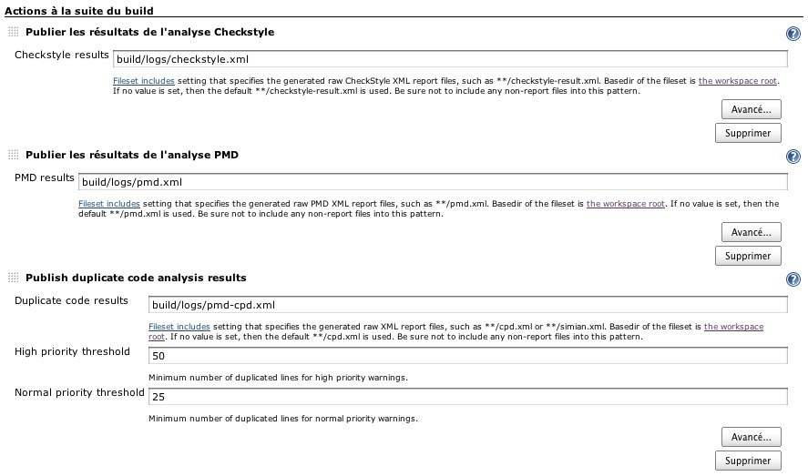
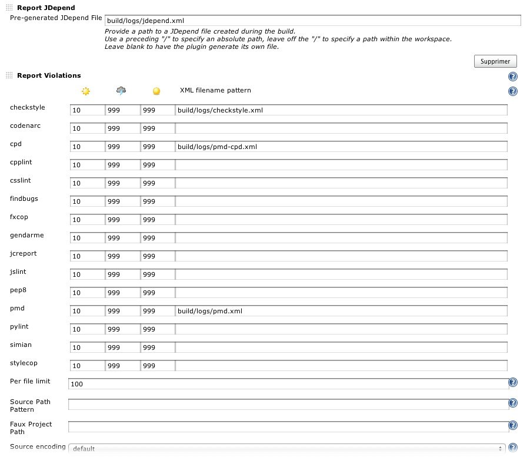

Chez M6 Web nous tentons de créer une approche open-source intra entreprise. L'objectif est que certains composants génériques adaptés notre métier puissent être crées et diffusés largement parmis les dizaines de projets gérés chaque année. Un prochain post traitera de cette problématique.

Dans cette optique, il faut nous assurer de la qualité et la non régréssion de ces composants. Pour cela nous avons mis en place Jenkins afin d'assurer l'intégration continue de nos tests unitaires. Voici un exemple d'intégration avec Atoum (ce n'est pas forcement la meilleur méthode, n'hésitez pas à la commenter).

Structure du composant :

- ./src contient les classes du composants au format PSR-0
- ./tests contient les TU Atoum
- ./build-tools/jenkins contient les fichiers de configuration pour Atoum et Ant
- ./vendor contient les dépendances externes du projet (gérées avec Composer)

Voici le composer.json utilisé.

Voici le fichier de configuration de Atoum : build-tools/jenkins/atoum.ci.php et celui de jenkins build-tools/jenkins/build.xml

(cette configuration inclut l'ensemble des outils d'analyse statique que l'on utilise)

Enfin, voici la configuration faire sur Jenkins (en image).

Via cette conf on obtient le résultat des tests (naturellement) ainsi que la couverture de code des tests avec la coloration des lignes couvertes ou non couvertes dans les classes testées.

