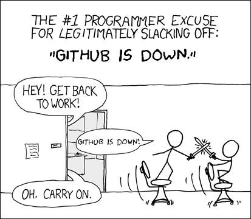
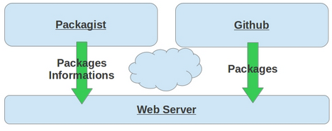
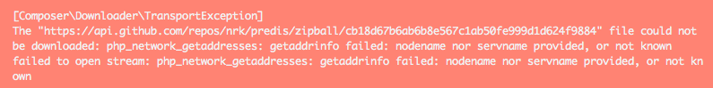
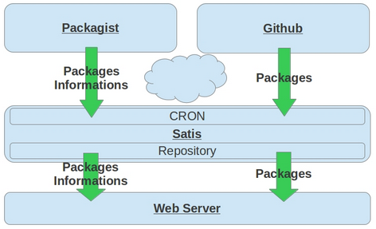

First a thought about [github](https://github.com/), [composer](https://getcomposer.org/doc/), [packagist](https://www.packagist.org) : we like / adore / thanks the contributors, for those great services and all the open source people dropping great software on it.

That said, picture yourself operating an online PHP service, generating hundreds euros per hour (cool isn’t it ?).

If you use [Symfony2](https://symfony.com/) and other public packages, like us, you’re probably deploying your application using composer.

Suddenly the service is dealing with more and more and more traffic (maybe someone talk about on national tv … or Justin Bieber tweet something … maybe :) ). No problem, says the system administrator (yes our sysadmins are cool), lets pop more virtual machines and deploy more instance of the service !

And then :

boum ! =>``composer install`` command can't download distant packages on api.github.com (website is down, or the network connection or whatever).

Good luck explaining to your boss that you rely on free hosting service to deploy your business critical website !

This is our situation. So here how we deal with that.

# Principles.

We chose to use [Satis](https://getcomposer.org/doc/articles/handling-private-packages-with-satis.md) - a great tool provided by the Composer team. The main idea is, regulary download packages and their informations on our local servers. We (at M6Web) deployed services on our local infrastructure and on S3 servers in Amazon Web Services.

# How to ? For your local network.

We set 2 different satis instance. One for our private packages, and another for all the dependencies we use (basically around Symfony2). The first one (satis-private) will build every 5 minutes, the second (satis-public) every half hour.

for example :

* satis-private.yourcompany.com
* satis-public.youcompany.com

Satis for private package configuration (data/satis.json) :

    {
        "name": “satis-private",
        "homepage": "https://satis-private.yourcompany.com",
        "archive": {
            "directory": "dist",
            "absolute-directory" : "/srv/data/satis-private/dist",
            "format": "zip",
            "skip-dev": true
        },
        "repositories": [
            { "type": "git", "url": "git://git.youcompany.com/great-bundle" },
            { "type": "git", "url": "git://git.youcompany.com/great-component" },
            { "type": "git", "url": "git://git.youcompany.com/awesomelib" },
            { "type": "git", "url": "git://git.youcompany.com/raoul" },
    …
        ],
        "require-all": true
    }

Satis for public package configuration (data/satis.json) :

    {
        "name": “satis-public",
        "homepage": "https://satis-public.yourcompany.com",
        "archive": {
            "directory": "dist",
            "format": "zip",
            "skip-dev": false,
            "absolute-directory" : "/srv/data/satis-public/dist"
        },
        "repositories": [
            { "type": "composer", "url": "https://packagist.org" }
        ],
        "require": {

            "m6web/firewall-bundle" : "*",
            "m6web/statsd-bundle"   : "*",

            "doctrine/orm"               : "~2.3",
            "doctrine/common"            : "~2.4",
            "doctrine/dbal"              : "~2.3",
            "doctrine/doctrine-bundle"   : "~1.2",

            "naderman/composer-aws"      : "~0.2.3",
    …
        },
        "require-dependencies": true
    }

On the crontab, add this command for each satis instance :

    php -d memory_limit=xx bin/satis build data/satis.json web

(increasing memory_limit was mandatory for us with satis-public).

Please note the require-dependencies directive. It tell satis to digg on sub-dependencies on the required packages. And yes, it can take a while. You will probably hit the Github API rate limit. To increase it, add a Github key on your composer configuration file on the satis servers.

    $ cat .composer/config.json
    {
        "config": {
            "github-oauth": {
                "github.com": “xxxxxx"
            }
        }

    }

In your projects, edit the composer.json and replace the repositories entry by

    "repositories": [
        {
            "type": "composer",
            "url": "https://satis-private.yourcompany.com"
        },
        {
            "type": "composer",
            "url": "https://satis-public.yourcompany.com"
        },
        {
            "packagist": false
        }
    ],

Remove your composer.lock and vendors then run ``composer update`` on the project.
``"packagist": false"`` mean : “do not search missing packages on packagist.com”. If a package is missing during install, you have to add it in satis-public configuration file then try again.

*that's it :)*

# How to ? For AWS.

## Sync our 2 satis servers with an S3 bucket.

On satis servers, use [s3cmd](https://s3tools.org/s3cmd) to keep in sync the S3 bucket. Let’s say : yourcloud-satis.

Add some commands after the build script of satis :

    php -d memory_limit=xx bin/satis build data/satis.json web
    cd web
    sed 's#https://satis-private\.yourcompany\.com#s3://yourcloud-satis/satis-private#' packages.json > packages-cloud.json
    s3cmd put index.html s3://yourcloud-satis/satis-private/index.html
    s3cmd put packages-cloud.json s3://yourcloud-satis/satis-private/packages.json
    cd /srv/data/satis-private/
    s3cmd sync ./dist s3://6cloud-satis/satis-private/

(do the same for satis-public).

## update your projects

In your projects, edit the composer.json and replace the repositories entry by

    "repositories": [
        {
            "type": "composer",
            "url": "https://s3-eu-west-1.amazonaws.com/yourcloud-satis/satis-private/"
        },
        {
            "type": "composer",
            "url": "https://s3-eu-west-1.amazonaws.com/yourcloud-satis/satis-public/"
        },
        {
            "packagist": false
        }
    ],

## Enable the AWS plugin in EC2 servers

Add our repositories in `"./composer.json` file of the user used to deploy your code.

    "repositories": [
        {
            "type": "composer",
            "url": "https://s3-eu-west-1.amazonaws.com/yourcloud-satis/satis-private/"
        },
        {
            "type": "composer",
            "url": "https://s3-eu-west-1.amazonaws.com/yourcloud-satis/satis-public/"
        },
        {
            "packagist": false
        }
    ],

You have to install the [S3 plugin for composer](https://github.com/naderman/composer-aws) on your EC2 instance.

    $ composer global require "naderman/composer-aws:~0.2.5"

If you don't use [IAM roles](https://aws.amazon.com/iam/), add the following composer config on your EC2 servers (`~/.composer/config.json`) :

    {
        "config": {
            "amazon-aws": {
                "key":    "KEYYYYYY",
                "secret": "seeeeecret"
            }
        }
    }

`composer install --prefer-dist` command will now download all the packages files from S3 !

Thanks to [Pierre](https://twitter.com/peikk00) and [Jeremy](https://twitter.com/JJourdin) for their help.

Found a typo or bad english langage, just propose a [pull request](https://github.com/BedrockStreaming/tech.bedrockstreaming.com/blob/master/_posts/2013-12-02-composer-installation-without-github.md).
