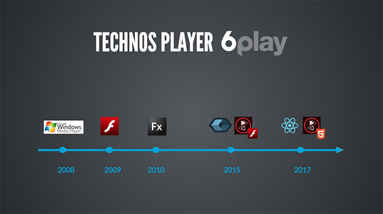

# Présentation du Paris Video Tech
Mercredi 1er février avait lieu la [troisième édition du Paris Video Tech](https://parisvideotech.com/pvt-3-a-react-based-mse-player-cmaf-demystified-and-roland-garros-360/), un meetup orienté autour de tous les sujets techniques de la vidéo : players HTML5, formats, encodage, distribution, publicité, ...

L'équipe Player de M6 Web (Frédéric Vieudrin, Nicolas Afresne, Malik Baba Aïssa et Vincent Valot) présentait le nouveau player HTML5 de 6play.fr : un player MSE multi-formats, développé entièrement en React, le framework JS qu'on ne présente plus et qui fait le succès du nouveau 6play.fr depuis 2015.

La rencontre se déroulait dans les locaux de France Télévision à Paris et proposait trois talks :

* **6play : un player MSE en React** *par l'équipe Player de M6Web*
* **CMAF Démystifié** *par [Cyril Concolato](https://twitter.com/cconcolato)*
* **Retour d'Expérience de Roland Garros 360** *par l'équipe innovation de France Télévision*

# 6play : un player MSE en React

### Présentation de 6play.fr
Dans la première partie, nous avons présenté le contexte technique de [6play.fr](https://www.6play.fr), autour de [React](https://facebook.github.io/react/), ainsi que les chiffres clés du site.

Après un rappel de l'historique des players du site de Replay des [chaînes du Groupe M6](https://www.groupem6.fr/le-groupe/activites/antenne/), nous avons présenté les enjeux de la refonte de notre précédent player et évoqué nos contraintes.

### Architecture du player en React / Redux

En octobre 2015 sortait [le nouveau 6play.fr](https://www.6play.fr), une [Single Page App développée en React-Redux et Isomorphique](/isomorphic-single-page-app-parfaite-react-flux/). Le succès de cette refonte nous a poussé à étudier le refonte du player 6play sur la même stack technique, historiquement en Video.js.

En complément de l'approche composant proposée par React, [Redux](https://redux.js.org/) nous a apporté la solution à la gestion de l'état du player dans le temps. En effet, son fonctionnement par événements et actions était parfaitement adapté aux événements de la balise `<video>`.

### Media Engines
Inspiré du système [multi-techs de Video.js](https://github.com/videojs/video.js/blob/master/docs/guides/tech.md), nous avons développé notre propre système de *Bridge* pilotant les différents SDK Video du marché : [hls.js](https://github.com/dailymotion/hls.js), [dash.js](https://github.com/Dash-Industry-Forum/dash.js), [Adobe Primetime Browser TVSDK](https://www.adobe.com/marketing-cloud/primetime-tv-platform/video-player-sdk.html), et HTML5.

Tous les *Bridges* communiquent ainsi de la même manière avec notre player React au travers des [MediaEvents HTML5](https://developer.mozilla.org/fr/docs/Web/API/HTMLMediaElement).

### Intégration continue, tests, outils et méthodes de travail

Les tests automatisés font partie intégrante des développements chez M6Web. Tester unitairement nous permet de valider nos classes et méthodes, tester fonctionnellement assure le bon fonctionnement du player sur plusieurs navigateurs et évite les régressions.

Nous utilisons les [Webhooks de Github](https://developer.github.com/webhooks/) pour executer nos tests, déployer un environnement de recette dédié et nous notifier du statut de la Pull Request dans [Slack](https://slack.com/).

[Les slides de notre présentation](https://slides.com/fvieudrin/6play-player-meetup-pvt/live#/)

# Revoir l'événement en replay

<iframe src="//www.dailymotion.com/embed/video/x5ahpei" width="700" height="392" frameborder="0" allowfullscreen="allowfullscreen"></iframe>

