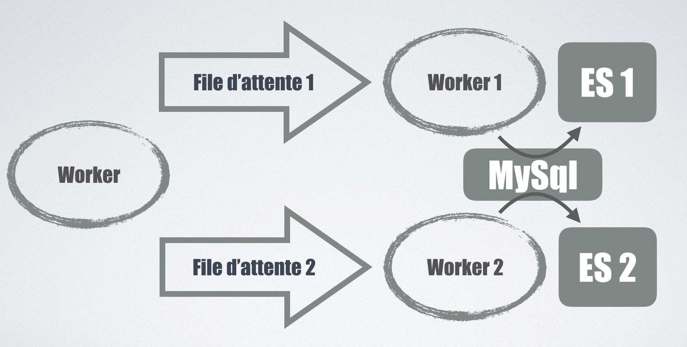
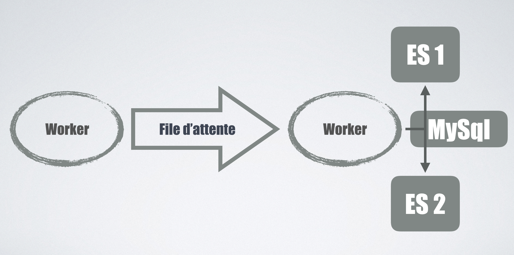
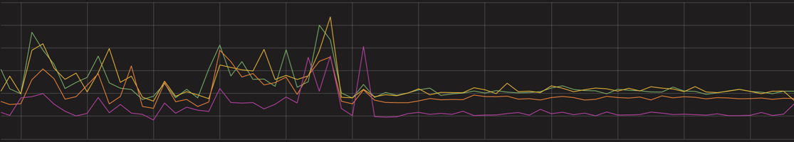

Pour assurer la scalabilité des performances de l'API 6play, les données suivent tout [un *workflow*](/2016/11/24/une-donnee-presque-parfaite) pour être dénormalisées et stockées dans [Elasticsearch](https://www.elastic.co/products/elasticsearch).
Mi-2016, nous avons identifié des dysfonctionnements majeurs sur nos serveurs, entrainant parfois des interruptions de service.
Suite à quelques mesures d'urgences pour stabiliser l'existant, nous avons entrepris de mettre à jour notre version d'Elasticsearch pour bénéficier des dernières améliorations.
Nous étions alors sur la [version 1.7](https://www.elastic.co/downloads/past-releases/elasticsearch-1-7-0), et souhaitions passer en [version 2.0](https://www.elastic.co/downloads/past-releases/elasticsearch-2-0-0).
Après plusieurs mois d'efforts pour effectuer cette migration sans interruption de service ni gel technique, nous voici en version… [5.2](https://www.elastic.co/downloads/past-releases/elasticsearch-5-2-2)!
Voici le récit de cette grande migration, et ce que l'on a appris tout au long de ce périple.

## La théorie

Il n'y a pas de méthode magique pour changer de cluster sans coupure, la stratégie adoptée est assez classique: 
 
 * dupliquer les écritures sur le nouveau cluster
 * basculer les lectures sur le nouveau cluster
 * arrêter les écritures sur l'ancien cluster

Il n'est pas nécessaire d'enchaîner toutes les étapes dans la même journée, cela présente donc l'avantage de pouvoir étaler les déploiements dans le temps en fonction des disponibilités,
ainsi que de surveiller attentivement le *monitoring* pendant quelques jours pour vérifier que l'infrastructure supporte bien les changements apportés.

## Écritures en *Y*

Nous utilisons [des *workers* Php](/2016/06/23/video-phptour-worker-php) pour détecter les changements dans notre BDD,
suite à quoi un message est publié dans une file d'attente pour être traité par un autre *worker* qui se chargera de synchroniser les entités entre MySQL et Elasticsearch.
Il était primordial que le cluster de production ne soit pas impacté par les éventuelles erreurs rencontrées sur le nouveau cluster.
Une de nos premières intentions était de publier le message de mise à jour dans une deuxième file d'attente, consommée par des workers dédiés eux aussi au nouveau cluster.

Le gros inconvénient est que cela impliquait de doubler toutes les lectures sur la BDD, toutes les requêtes devaient être executées une fois par cluster,
cela risquait donc d'impacter d'autres services.
Nous sommes donc partis sur une solution purement logicielle, puisque pour chaque entité mise à jour ce sont les workers qui les envoient sur chaque cluster.

Il est par contre nécessaire de gérer correctement les erreurs, que faire si une erreur intervient sur un cluster mais pas l'autre?
Si le nouveau cluster devient instable et que l'on renvoie les messages systématiquement dans la file d'attente, on risque d'accentuer inutilement la charge en écriture sur le cluster stable en production.
Notre compromis est de définir comme *master* le cluster de production (celui où les données sont lues), et seules ses erreurs provoquent la génération d'un nouveau message.
Les erreurs sur le cluster *slave* sont monitorées, mais ne génèrent pas de nouveaux messages dans la file d'attente.
Effectivement, puisque chaque soir nous resynchronisons **toutes** les données entre MySql et Elasticsearch, on peut se permettre d'avoir des données *moins fraiches* sur le cluster *slave* le temps d'une journée.

Initialement, nous pensions que ce système *master/slave* serait temporaire, mais très rapidement nous avons pérennisé ces développements, cela nous permettait de tester facilement différents clusters,
ou encore de vérifier que les données étaient bien indexées de la même manière, faire des *rollbacks* en urgence… 

Une dernière difficulté était de faire cohabiter deux version différentes du *Sdk* [Elasticsearch Php](https://github.com/elastic/elasticsearch-php) dans le même projet.
Il y a effectivement une incompatibilité entre les versions `2.*` et `5.*`, et nous n'avons pas eu d'autre choix que de cloner la librairie concernée et de changer tous les *namespaces* pour éviter les conflits de noms.
Malgré tout, ce ne sont pas les écritures dans Elasticsearch qui nous ont posé le plus de problèmes.

## Migration des requêtes

Il y a eu de nombreux changements apportés entre la version `1.7` et `5.0` et souvent pour le mieux.
Les différentes évolutions de syntaxes ont généralement vite été faites, car nous avions pris soin d'encapsuler la construction des requêtes via quelques fonctions *helper* (une sorte de *query builder*).
Il nous a donc suffit de changer ces quelques fonctions pour traduire les anciennes requêtes vers la nouvelle syntaxe. 

Une erreur classique que nous faisions en `1.7` était de se contenter d'un *mapping* par *défaut*, qui avait le mérite de fonctionner sans efforts avec nos requêtes et nos données.
Lors du passage à la version `5.0`, Elasticsearch a commencé à refuser certaines de nos requêtes car elles ne pouvaient pas être performantes.
Il fallait choisir, soit activer explicitement des options de mapping en faisant un compromis sur les performances générales,
soit affiner le *mapping* pour qu'il soit plus adapté à la nature de nos requêtes.
Il s'agit d'un bon exemple de [*Leaky Abstraction*](https://www.joelonsoftware.com/2002/11/11/the-law-of-leaky-abstractions/),
on a beau utiliser des outils pour s'abstraire de la façon dont sont stockées les données, nous sommes toujours obligés de comprendre ce qu'il se passe à l'intérieur pour en tirer les meilleures performances.
Heureusement pour nous notre mapping était assez trivial à changer, car nous n'utilisons pas Elasticsearch pour faire de la recherche [*full-text*](https://en.wikipedia.org/wiki/Full-text_search)
mais seulement pour des recherches exactes sur des identifiants, des codes… Il nous a généralement suffit d'utiliser le nouveau type [`keyword`](https://www.elastic.co/guide/en/elasticsearch/reference/current/keyword.html)
pour que nos requêtes puissent être acceptées.

Pour s'assurer du bon fonctionnement des APIs suite à ces nombreux changements, nous avons investi du temps pour écrire des tests fonctionnels de bout en bout,
pour vérifier que les résultats restaient inchangés malgré le changement de version de cluster.
Bien sûr, même si en local nos tests étaient au vert, des erreurs pouvaient apparaître en production.
Le scénario était alors simple, faire un *rollback*, ajouter les tests correspondants aux nouvelles erreurs detectées, les faire passer en local, puis recommencer !

Ce qui nous a peut-être le plus éprouvé dans cette migration, c'est une [regression introduite dans la version `5.2`](https://github.com/elastic/elasticsearch/issues/23796)
qui avait pour conséquence de changer certains de nos tableaux vides en valeur `null`.
Il nous a fallut quasiment repasser sur chaque requête pour retransformer ces valeurs en quelque chose de cohérent. 
Quand on avait de la chance, ce *bug* faisait échouer nos tests, mais il est malheureusement arrivé que ce soient les *parseurs* json des applications 6play de production qui en fassent les frais, avec différents plantages à la clé… 

## Conclusions

Cette migration fut longue et parfois douloureuse, heureusement les résultats sont maintenant au rendez-vous!

De plus, cela nous a donné l'occasion d'investir un peu de temps pour améliorer nos tests fonctionnels, et pour développer un système robuste pour la réplication des données sur plusieurs clusters Elasticsearch.
On peut néanmoins se poser des questions sur la stratégie très *offensive* de changement de version de la part de Elasticsearch,
autant de *releases* avec autant de changements en si peu de temps, il faut être capable de suivre!
Pendant que nous finalisions notre production sur la version `5.2`, la `5.3` a eu le temps de sortir, et la `6.0` est apparue en beta.
Nous allons essayer de profiter un peu de ce nouveau cluster avant de poursuivre vers une nouvelle grande migration :)
