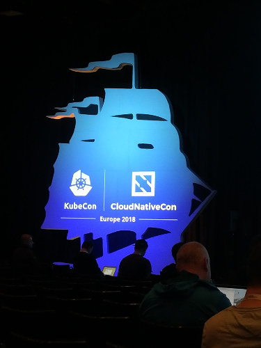

At the very beginning of May, we (Pascal and Vincent) went to KubeCon 2018. It was a three-days long event, with more than 300 conferences. 4300 people met at Bella Center, a huge conference place close to Copenhagen in Denmark. Here are some of our notes about some talks we saw.

# Keynotes

## CNCF Project Update - Liz Rice, Technology Evangelist, Aqua Security; Sugu Sougoumarane, CTO, PlanetScale Data; Colin Sullivan, Product Manager, Synadia Communications, Inc. & Andrew Jessup, Co-founder, Scytale Inc.

During this keynote, I realized the CNCF is helping a lot more projects than I thought it was: it's not just Kubernetes. I will take a closer look to some of them in the future -- they are all listed on [l.cncf.io](https://landscape.cncf.io/).

## CERN Experiences with Multi-Cloud Federated Kubernetes - Ricardo Rocha, Staff Member, CERN & Clenimar Filemon, Software Engineer, Federal University of Campina Grande

OK, so, sometimes, it actually is *rocket-science* (or pretty close to it). It's nice seeing Kubernetes used for science and research, on a federation of around 400 clusters!

# Whats Up With All The Different Container Runtimes? - Ricardo Aravena, Branch Metrics

Overview of the different containers runtimes, starting with OpenVZ in 2006 (still maintained, but the last 2.7 version is not as stable as the previous one, and it doesn't support Kubernetes), and LXC (Kubernetes support is low-priority WIP and LXC uses a specific image format) in 2011. Docker (initially based on LXC) arrived in 2013 and things have gone insane since then. With libcontainer and `rkt` in 2014, OCI in 2015 and CRI in 2016. Today, Kubernetes supports several runtimes.

`rkt` could be interesting from a security point of view (supports TPM and VMs). With Kubernetes 1.10, the default runtime is [`runc`](https://github.com/opencontainers/runc). [`crun`](https://github.com/giuseppe/crun) is the most interesting runtime for performances, but is WIP and isn't currently used much. Kata, released in 2018 has the best security (it runs containers in VMs) and is OCI compliant, but is slower and more heavyweight. Other very specific runtimes include nvidia, railcar, pouch, lmctfy, systemd-nspawn...

Basically, today and for most workloads, you should go with the standard docker/containerd runtime. There is a convergence towards OCI, it's the default for Kubernetes and docker is going to adopt the CRI plugin.

# Introduction to Istio Configuration - Joy Zhang, Google

An introduction to the [Istio Service Mesh](https://istio.io/). All Istio components are CRDs. CRDs are becoming a standard when it comes to kubernetes customizations, here requests proxying.

This talk described Istio components, notably:

*        Mesh config - global Istio config
*        Service config - Istio operators config
*        Consumer config - overrides config model
*        Galley - Istio config per cluster

FYI: you need as much `Galleys` as you have clusters + environments.

# Continuous Delivery Meets Custom Kubernetes Controller: A Declarative Configuration Approach to CI/CD - Suneeta Mall & Simon Cochrane, Nearmap

Kubernetes is great but, CI/CD is not really its job -- and CI/CD depends a lot on the company you work at and its culture. Here, they started deploying their applications with `kubectl` and YAML files, and even if CI usually doesn't cause much troubles, CD is not that easy. And using a managed CI (CircleCI, shippable, AWS Codepipeline...) means exposing Kubernetes's control plane on the Internet, which is not great. Also, the *Gitops* approach with its *git is the source of truth* mindset is OK, but committing version numbers again and again *pollutes* the history with a lot of noise -- when this history could be kept in the cluster itself.

So, they went with some kind of CD *lite*: a service running in the cluster, which monitors the registry and deploys the new version of an image when it sees it. This means the cluster doesn't need to access git and the CI chain doesn't need to access the cluster, making the configuration simpler.

The tool they developed for this is [`nearmap/cvmanager`](https://github.com/nearmap/cvmanager). It seems relatively easy to install and configure. And I like the idea of having a gap between Git/CI and CD. I may have to test this, especially to see what it can do when it comes to canary or blue/green deployments, but this is one of the things I saw at KubeCon I will discuss with my colleagues!

# Practical and Useful Latency Analysis using Istio and OpenCensus - Varun Talwar, Stealth Startup & Morgan McLean, Google

OpenCensus (distributed tracing metrics system) + Istio is the combo provided for this talk to let devs debug the most of their apps.

OpenCensus is a tracing tool, like the CNCF's project Opentracing. It can be implemented in many languages, starting with those we use: PHP and javascript.

OpenCensus can trace RPC and http APIs calls.

You can install a dedicated dashboard that gives a lot of metrics out of the box (like 90th percentiles, etc.) and allows customizable ones.

Mixer (Istio tool) makes the aggregation between those metrics from what is gathered by OpenCensus.

This definitely need to be tested, but not sure it is worth migrating from OpenTracing to OpenCensus.

# Habitat Builder: Cloud Native Application Automation - Elliott Davis & Fletcher Nichol, Chef.io (Habitat.sh)

I had never heard of [Habitat](https://www.habitat.sh/) before, so I was kind of curious what this was about. This idea of platform-independent build artifacts (with exporters for docker, Kubernetes, Helm) could be interesting for some teams, but it's not a need I currently have. The automated deployments might be interesting though, but we are already looking at other tools.

# Kubernetes and Taxes: Lessons Learned at the Norwegian Tax Administration - A Production Case Study - Bjarte S. Karlsen, The Norwegian Tax Administration

Really nice production case study from the Norwegian Tax Administration about their k8s platform. They are currently using Rancher 2.0 + OpenShift + CodeFresh on top of k8s. All their Docker images are alpine based. They develop Java applications.

One idea kept my attention is the tagging of their containers:

*        Pushing docker image tag 1.2.3 also pushes tag 1.2 and tag 1.
*        So going to v2 and rolling back to v1 effectively rolls out 2.0.0 to 1.2.3 without knowing the exact subversions.
*        You are assured that the tag of the major version always points to the latest subversion.

It's not clear to me how to implement that. Maybe a codefresh hack. But still, I found the approach interesting.

Another lesson for those who want to migrate from on-premise to the cloud is to keep things that work on-premise and simply migrate them on cloud as it is. That will ease the migration. You can rethink all afterward if needed, but the first step is to migrate, not rebuild from scratch plus migrating.

As they use CodeFresh for CI/CD, it's easy for them to automate their pipelines. That's another lesson: automate everything. To automate, you need to standardize.

Another lesson is to use what is rock-solid. We all see a lot of tools and startups around the cloud nebula. A lot of them won't last and some will, like Kubernetes. This is the tip: use what will last. Don't build your whole infrastructure on something unstable or with poor pro/community support.

The final point I kept from this really good rex, is to create a predictable infrastructure. You cannot guess what will happen. You have to know and use the right tools/annotations to make it behave the way you want, predictably and repeatedly.

# How to Export Prometheus Metrics from Just About Anything - Matt Layher, DigitalOcean

This presentation was about a few good practices to follow when it comes to exposing Prometheus metrics from a Go application. Basically, you should use the Go client library, be really careful about concurrency, build reusable packages, write unit-tests, use `promtool check-metrics`, and read and follow the Prometheus metrics best practices.

# Continuously Deliver your Kubernetes Infrastructure - Mikkel Larsen, Zalando SE

Another really good rex from Zalando from their utilization of k8s in prod and lessons learned.

They talked of Stups, a Zalando toolset around AWS. That definitely needs to be tested.

From their experience of managing a k8s cluster on AWS EC2s, they gave us few tips:

*        Always upgrade to the latest k8s version
*        Manage the smallest possible number of clusters
*        Automate all the things. The only manual step should be merging PRs. This is a base *GitOps* principle.
*        Define an AWS HA control plane setup behind ELBs. That can be debated but this is a good first step.
*        All cluster config files must be git versioned (another *GitOps* principle). An upgrade is then only a git branch merge at some point.

Some of the points above can be achieved via a CD tool. I remember they use Jenkins for that, but not 100% sure. Alongside this CD tool, there should be a CI tool (or one tool for both).

They gave us some points on CI tests too:

*        Run [e2e conformance tests for k8s config files](https://github.com/kubernetes/community/blob/master/contributors/devel/e2e-tests.md)
*        Run statefulSet tests
*        Run any additional homemade tests

For those who are using AWS, keep in mind the following: volumes cannot be mounted across several AZ.

Keep yourself away from unavailability by always setting `minAvailable`.

Final tip: If you go for a self-managed k8s cluster (not EKS, GKE, etc.), check that nodes are up and running before continuing upgrade.

I really enjoyed this rex that was full of good prod-ready advices.

I recommend you take a look at [the slides](https://schd.ws/hosted_files/kccnceu18/18/2018-05-02%20Continuously%20Deliver%20your%20Kubernetes%20Infrastructure%20-%20KubeCon%202018%20Copenhagen.pdf)

# Seamless Development Environments on Kubernetes using Telepresence - Ara Pulido, Bitnami

Kubernetes is a great production environment, but it feels like development environment is kind of an afterthought: even for a simple application, if you want to develop (locally?), things are not easy. People are currently using two distinct ways: using docker compose to replicate the production environment (but compose doesn't do everything: rbac, job, ingress... and having to maintain everything twice is not fun), or build/push/deploy-to-k8s and wait many seconds everytime one wants to F5 on a page, which is unberably slow (I wouldn't ask my developer colleagues to do this for even half a day!).

The solution proposed during this conference is [Telepresence](https://www.telepresence.io/). It allows a developer to swap out a pod from a cluster and *inject* her own pod, running locally, at its place. Some sort of VPN is established between her computer and the cluster, which means the pod running locally behaves just like if it was still in the cluster (including DNS, service discovery, access to non-Kubernetes managed services and all).

There are still limitations and constraints (if two developers want to work on the same service, they'll each need their own namespace in the cluster, as two people cannot swap out the same pod), but plans for this project are interesting and I will definitely take a closer look at it in a couple of months, when I start thinking more about our development stack!

We went to Datawire’s booth and saw a nice demo. And also learnt about other tools, such as Forge and Ambassador that can [duplicate production requests to a local pod](https://www.getambassador.io/reference/shadowing). We found that this feature is ultra dope!

# Performance and Scale @ Istio Service Mesh - Fawad Khaliq, VMware Inc, Laurent Demailly, Google & Surya V Duggirala, IBM

Return of Istio devs on project's recent updates: closed PRs, enhancements, etc.

That was not really what I was looking for so I went to some bootcamps to say hi, especially the HAProxy bootcamp one that is always a good moment. Special thanks to Baptiste for his time and the awesome talk we had!
For the record: HAProxy has it's own [Ingress Controller](https://www.haproxy.com/fr/blog/haproxy_ingress_controller_for_kubernetes/)

# From Data Centers to Cloud Native - Dave Zolotusky & James Wen, Spotify

This last conference of the first day was about Spotify's migration from their on-premise datacenters to *the cloud*. For many years, they were doing everything on-prem (including a 3000 nodes Hadoop cluster -- the largest in Europe, at the time), often developing their own proprietary software (like custom monitoring, proprietary messaging framework, custom Java service framework, custom container orchestrator, ... Some have been open-sourced). The first step for them has been to get out of their own datacenters, moving everything to *another datacenter* (but still using their proprietary stuff). It took them three years and a half, trying to make this migration as seamless as possible for the development teams.

Next step is to become *cloud native*, especially moving to Kubernetes. They did this in several steps, starting small by sending production traffic to one service deployed to one cluster for one hour (allowed them to validate DNS, logging, service discovery, metrics system, networking). Then, three services on one cluster (permissions, namespaces, quotas for each namespace, developers documentation). After that, services on a *volunteer* basis (clusters, scripted clusters creation, secrets, deployment tooling based on a wrapper around `kubectl`, CI integration => a lot of learning for a lot of people). Then, two high-traffic services, including a service receiving 1.5 million requests per second (horizontal auto-scaling, network setup, confidence, reference for other projects). And, finally, self-service migration, with teams migrating when they want, following the docs, and ops not always knowing what's running in the cluster (reliability, alerts, on-call, disaster recovery, backups, sustainable deploy). Everything going pretty much fine by now, it's time to investigate on a few *odd things* and specific needs, with a temporary ops team assembled to help.

The most important idea here is you don't have to do everything right from the start. For example, they waited quite a long time before setting up a sustainable deployment method, which might seem odd to many of us. But it allowed them to move forward and validate a lot of things one after the other. That's something I will keep in mind: if it worked for them (4000 employees, including 500 techies), it could work for many other companies!

# Jenkins X: Easy CI/CD for Kubernetes - James Strachan, CloudBees

This might be one of the hottest project of this early 2018.

We already saw this project that was created in February, and we are using it for testing purposes. We hope to use it in production very soon.

For those of you who don't know Jenkins-X:

*        It's piloted by `jx`, a command line tool (Mac/Linux)
*        It drives a Jenkins instance + Docker Registry + Nexus + Chartmuseum + Monocular
*        It allows you to manage your app's deployments via Jenkins blueocean's pipelines with k8s endpoints
*        That means Jenkins will be able to run CI tests, Continuously Deploy your project to preview, staging, prod and so on with Skaffold/Helm to k8s
*        Jenkins will run pipelines from the `Jenkinsfile` in the repo to do that CI/CD part
*        In the provided pipelines given with `jx import`, you will use provided docker images that embed `jx` cli and other tools to manage the deployments of your app.
*        That allows you to promote your app between stages, build your docker image, etc. in your pipeline steps.
*        Those deployments are based on Helm Charts in the repo.
*        Jenkins-x follows *GitOps* strategy, that means anything useful is stored in each app's repo: it is versioned and git events will trigger pipelines.

Jenkins-X brings this CI/CD part that was missing for k8s users. Gitlab + gitlab-ci were already doing that for some years now, but nothing was that fancy for GH users.

We are very excited about Jenkins-X, as it answers a lot of problematics and brings in gitops as core concept. We're actively adopting it and we hope to give feedback asap.

# Keynote: Anatomy of a Production Kubernetes Outage - Oliver Beattie, Head of Engineering, Monzo Bank

This keynote was about  major outage at Monzo. You can read more about it in the [post-mortem](https://community.monzo.com/t/resolved-current-account-payments-may-fail-major-outage-27-10-2017/26296/94) they posted after it happened. Basically, even when you are careful, an outage can still happen: several causes combined with a very specific bug happening with specific versions in a specific case and voilà. Nice talk, and nice to hear a bank being so open!

# Keynote: Prometheus 2.0 – The Next Scale of Cloud Native Monitoring - Fabian Reinartz, Software Engineer, Google

Prometheus is *the* monitoring stack everyone seems to be using now. This keynote presented how much faster Prometheus 2.x is, compared to Prometheus 1.x. Having never used the 1.x versions, I have to admit I never suffered from it. It is still nice noting 2.x scales much better (requires less RAM/CPU and its performances don't degrade much with a huge number of metrics).

# Welcome reception

This first day ended with a nice buffet at Bella Center, next to the sponsor booths. As we each one went to see different talks, it allowed us to chat about what we saw and heard, even if we didn't stick around too long, after such a long day -- especially knowing there would be two more just after!

