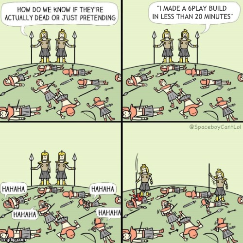

Ça faisait un très très long moment ! Voici le retour des [devfacts](/tags.html#devfacts) !

# L'erreur est humaine
> Il faut mieux recevoir une erreur 500, que 500 erreurs

# L'odeur du code
> Le code de merde, tu sais quand c'est le tien, c'est comme les pets, pas la peine de git blame.

# Restons zen !
> _ Ah mais en fait !!! Je comprends pourquoi tu viens tôt le matin! Tu viens parce que c'est calme !!!!

>_ Tais toi Mehdi !!

# Prévoir l'imprévisible
> C'est la première étape de l'étape suivante.

# Ce matin au chiffrage 
> J'ai pensé 5 mais j'ai mis 3...

# Schroedinger app
> _ Ça marche ?

>_ Je sais pas mais c'est en prod !

# L'effet de serre
> _ Il fait froid dans le bureau

> _ Bah démarre 2-3 docker sur ton Mac, ça devrait résoudre le problème

# Les priorités
> _ Alleeeez, s'il te plaiiiiiiiit !

> _ Les incidents d'abord, les détails graphiques après !

Petite nouveauté, voici quelques mèmes maison !

