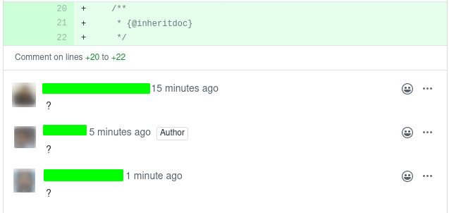
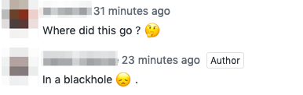
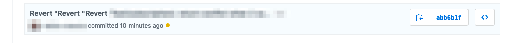

Reprenons un rythme soutenu des [devfacts](/tags/#devfacts) !

# Des branchements surprenants
>  Ah tu test ta branche en prod ? Tu peux y aller, si tu touches pas au staging pas de soucis

# Angular conventional commit

Trouvé dans l'historique


# Time is relative

> Non mais c'est normal, ce sont des mois de 5 minutes

# Le confinement à la campagne, c'est parfois compliqué

> Dédicace a tous ceux qui comme moi, vont passer une bonne semaine à batailler avec internet ! (au moins, j’ai assez de débit pour un mp3).
> 320 Kbps

# Apple 💰

> Quand ca parle d’argent, Apple ne se rate pas généralement

# Le courage

> Une MEP le vendredi avec la CI KO, vous êtes mes héros 😍

# Note à moi-même

> TODO: test if my code is the problem

# Aucun abus

> Bon, je crois que je vais m'auto-déclarer meilleur développeur de l'année!

# Une semaine qui commence bien

> 3 push master, lundi matin, 11h30. La semaine va être bonne

# Soit gentil, pas méchant, c'est pas gentil d'être méchant

> A: "Je comprends pas l’API elle repond rien"

> B: "T’as essayé de demander gentiment ?"

```json
{
    "error": {
        "status": 400,
        "message": "Invalid parameters 'MAIS_TU_VAS_ME_REPONDRE_UN_TRUC_COHERENT_BORDEL_DE_MERDE_!?!?!?!?!?!?!?!?!!' for route 'xxxxxxxxxxxxx'"
    }
}
```

# Des réponses magiques

> "so this case is never expected, but obviously it happens" Ah 😅, nous voilà rassuré

# Alerte générale

> Quand on crée une alerte pour pouvoir la mettre en silence juste après 👌

# Le consentement

> A: "J’ai insisté et c’est passé"

> B: "Tu as insisté mais est-ce que tu as pensé au consentement de GraphQL et de postgre ?" 

# 🦥, moi paresseux ? 

> Même ne rien faire c'est déjà pas mal de taf

# ? Question ? 



# 🍗 Mnom Mnom

> A: "Ah mince j'ai pas mis mon texte en escalope"

> B: "?"

> A: "Entre quote"

# La documentation éternelle

> Les temps changent mais pas les readme

# Les petits génies

> Nan mais attendez vous à plein de commentaires disant que c’est codé avec les pieds, et que Jean-Kevin, 16 ans, aurait mieux fait en 2j pendant son week-end chez sa mamie Germaine, pendant qu’il faisait une pause dans le développement du nouveau Bitcoin.

# Blackhole sun

En parlant de lignes supprimées.



# Technique de sioux

> Nan mais réécrit les status 404 en 200 et ça marchera !

# On peut revert une fois, mais pas quinze !



# Définition AWS

> AZ = Ama Zones

# Heureusement pour nous

> Les cas sans erreurs fonctionnent très bien

# Manager === 🐐 ?

> La formatrice : je vous donne un mot et vous me donnez le premier mot qui vous passe par la tête.

> La formatrice : “Chef” ?

> Un participant : Chèvre

# Il n'y a pas de "mais" !

> Je ne veux pas remettre en cause toute l’architecture MAIS …

# 🐒 Singe ? 

> Quand j'entends "Go/NoGo", mon cerveau comprend "Bonobo"

# Avec du savon !

> A: "Ils font du SOAP!"

> A: "C’est pour être bien propre"

# L'automatisation DIY

> C'est automatiquement fait à la main

# 🦥 le retour

> La paresse n’est pas un défaut, c’est une optimisation

# Astuce de pro!

> Si vos collègues et votre conscience vous embêtent quand vous dites « je vais tester ce changement en prod », dites à la place « je vais valider ce changement en prod ». Vous verrez, ça ira tout de suite mieux !
