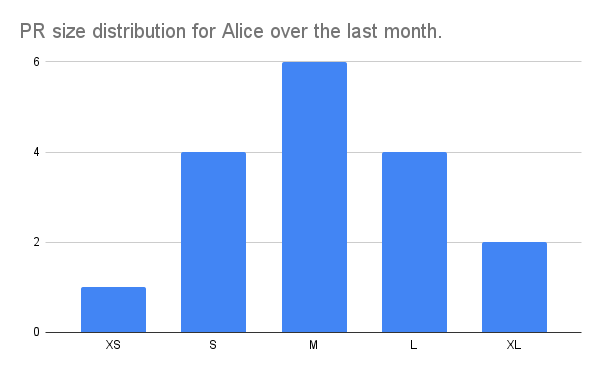

## Smaller PR for a reduced mental load

For several years at Bedrock Streaming the technical teams have used the _Pull Requests_ code review for each project. 
Between collective ownership, quality improvement, regression detection, knowledge sharing, learning, there is no question in this article to further legitimize the immense interest to implement this practice in your teams.

This practice can however lead to some problems, each developer who proposes Pull Requests for review by his colleagues can sometimes propose monstrous diffs.
Sometimes constrained by certain project mechanics or tools, but sometimes also by the "Wheelbarrow" effect.

> While I was there, I took the opportunity to modify this too.

It always starts from a good will, however, to make PR that changes several _intentions_. 
By creating his _wheelbarrow_, the developer is adding diff to a pull request that deviates from the original intent.

Limiting the number of _intentions_ of a pull request often simplifies the proofreading of it.

> Has anyone ever had the pleasure of reviewing a Pull Request with more than 1000 lines of changes with more than 100 modified files?

We also forget that making a "big" Pull Request can also generate a mental load on the person or persons assigned to its development. 
We have to remember the modified files, we are more likely to generate conflicts.

> Ok, lets make smaller PR's! We promise!

## You can't improve anything without measuring it

Saying "from now on we do smaller PR[^pr]" is a pious hope.
We have been doing application monitoring for a long time, we know that thanks to these measurements we are able to understand if the evolution is rather positive or not.
Why not do it on our PR sizes?
Why not implement monitoring on our devs?

The idea is absolutely not to measure/comparison the performance of our developers. 
It would not be positive for the engineering manager and the dev to compare the performance of one developer against another. 
We are all different after all!

**The size of a dev's PRs does not reflect his productivity at all, it just allows to evaluate the personal and collective mental load produced.**
There are other measures we would like to follow, but let's start with the size of the PR.

Be warned, the purpose of this metric is not to say _"Oh! you made an XL size PR that's not right"_ 😡.
It happens from time to time, and it's not bad.
You should rather look at the distribution of PR sizes of a dev.

Let's take the example of a dev named Bob who would have this distribution over the last month:


Here we see that Bob is globally making large PRs (taking arbitrary t-shirt sizes), seeing this we can say: _As a TechLead, how can I best accompany Bob to make smaller PRs?_

Next, let's look at Alice's profile, which has a more centered distribution:


Here, we can say that overall the majority of RPs are of moderate size (in this absolute scale), so the mental load should be lower than for Bob.
_This remains an interpretation that will require some discussion to be sure._

[^pr]: Alias for Pull Request

## How to set it up?  

If you are interested in this measure and like us you use the Github Actions solution for your automation, it will be very easy for you to implement our brand new _pr-size-labeler_ in your projects.

To do so, you can add a workflow to your Github repository:

```yaml
name: 🏷 PR size labeler

on: 
  pull_request:

jobs:
  pr-labeler:
    runs-on: ubuntu-latest
    name: Label the PR size
    steps:
      - uses: BedrockStreaming/pr-size-labeler@v1.1.0
        with:
          token: ${{ secrets.GITHUB_TOKEN }}
          exclude_files: .lock # RegExp of your excluded file pattern
```

The action will then put `Size/S`, `Size/XL` tags on your PRs automatically according to the number of modified files and the number of added or deleted lines.

🧙‍ **You can change the text of the labels used and even the thresholds for each size as you wish.
[Take a look at Github presentation page of this Github action.](https://github.com/marketplace/actions/pull-request-auto-size-labeler)**

Once set up, you should also notice the added labels can allow to evaluate the time needed for the review before starting it.

> I've got 30 minutes to spare, I'm not going to start reviewing this PR XL.

It's now your turn to play!
