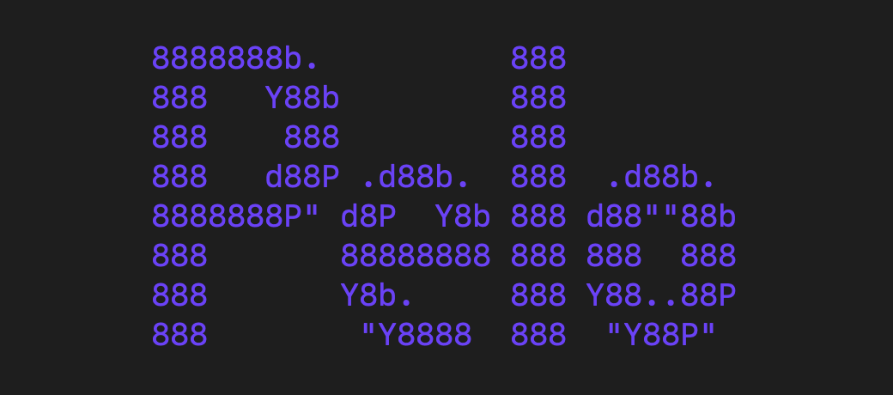
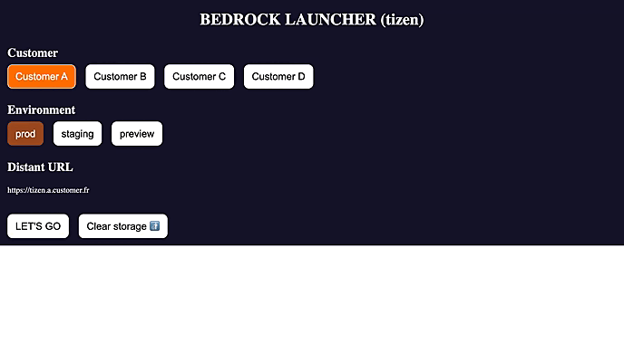
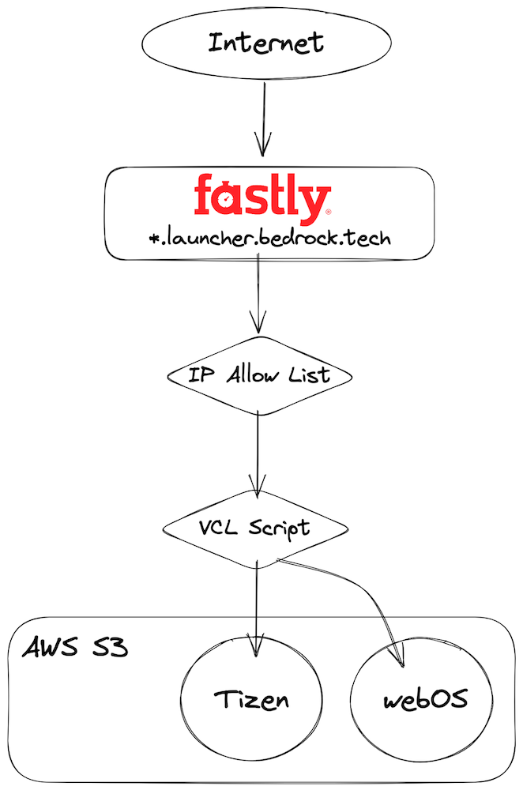
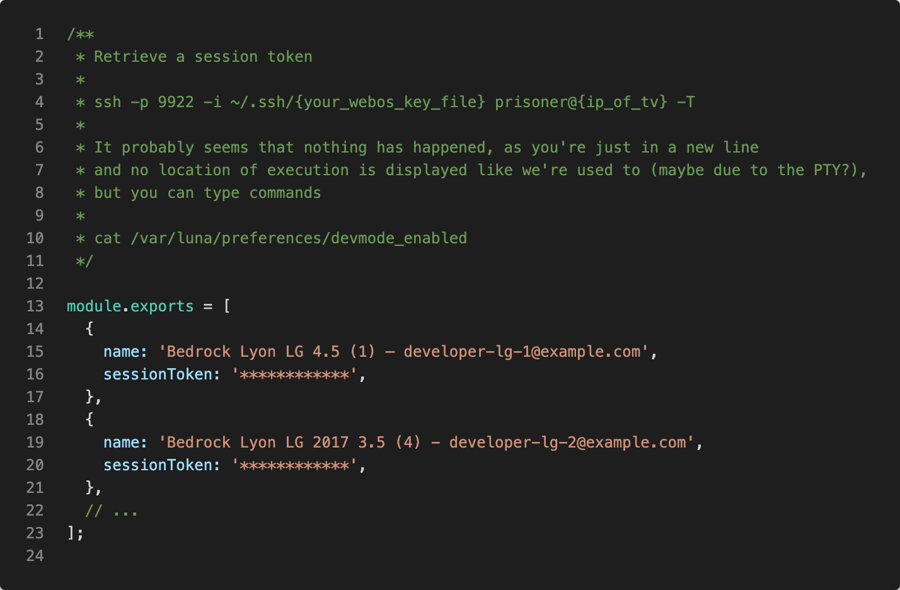
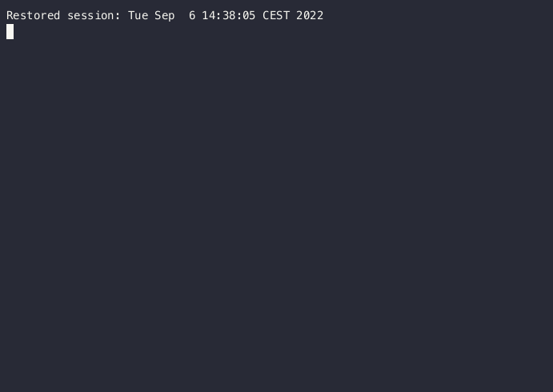

At Bedrock, we build and run streaming applications on a wide variety of OTT devices (more than 60 different ecosystems). While testing and experimenting is easy on web and mobile devices, even for non-developers, it’s not as easy for Connected TV (CTV). In this article, you’ll discover how all of our employees can now access testing and pre-release environments on TV devices, with ease and without any technical knowledge.

## Bedrock TvJS Project

### How does it work ?

To address the growing number of CTVs vendors in the market, we have a one-and-only monorepo project named “TVJS”. It is a React application which we can deploy almost everywhere almost anywhere with the same code, UI and UX. The magic part? There isn’t much manufacturer-specific code in that application, most of those particularities are handled by our homemade JS library named PELO (Platform Easy Life Officer). *For non-French readers, “pélo” is a Lyon/Grenoble city slang to designate “someone”.*

In a few words, PELO is a set of libraries showing a unified front API for TV developers, so they don’t have to keep in mind every TV specific details and custom APIs (like lifecycle, keyboard, storage handling, and more). PELO also provides several CLI tools allowing the use of proprietary manufacturer SDKs, with a common shared API.

There are at least two ways to deploy a TV application:
- A fully packaged solution, where all application files and resources are stored on the TV. Everytime you want to update it, application you have to go through the manufacturer QA process. Doing so, you can develop either a web application that will run through the TV’s Web Engine, or a native TV application.
- The hosted solution, where the TV packaged application only redirects to a web application that you are responsible for. It grants much more flexibility, and delivery speed, as deployment and propagation of a new version are almost instantaneous.

We chose the second way as we are addressing a big number of devices and need all the flexibility we can have for deployments -- and, sadly, for rollbacks too. Therefore, we host and deploy our CTV applications like any other website and we control the TV Browser Engine to navigate to specific domain names.

Three teams are working on this project, on the same repository:
- a team dedicated to Core features (like catalog, user lifecycle)
- a team dedicated to Player features (video playback and advertising)
- and a team supporting legacy devices

Developer teams are supported by a QA team. It is responsible for functional quality assurance on Pull Requests and pre-releases. Quality assurance designates any processes to ensure a service meets its quality requirements in terms of experience, stability, ...

### Develop & release process

We do our maximum to ensure the best quality of service and experience of what we deliver to our customers and their end-users. We have a strong culture of automated testing & tech reviewing which allows us to deliver almost without a sweat... Still, at our scale, missing a bug means a bad experience for thousands or millions of people! And that’s something we won’t accept without a fight!

> One of Bedrock's Values is: ROCK-SOLID, ALWAYS

As a consequence, we also have dedicated QA teams testing our work for a subset of device models and versions, before it is being merged to the main codebase, and before going to production as part of a release. They are doing so by connecting TVs to specific environments that are deployed on-demand: previews and staging.

Let’s show off a little bit: at the beginning of 2022, thanks to the TVJS project, we were able to deploy production code to 7 manufacturers, and 38 device versions, meaning 266 combinations to check before launching a release into production! And these numbers are ever increasing!

### My wish: make testing environments easily accessible

We love showing-off a bit over the applications we deliver on such a huge number of device models, but that doesn’t go with ease nor without pain.

Testing a specific environment on a device was not possible for non-project members (other teams, support, business & product teams, managers ...). Starting a preview or a staging application requires a deep understanding of the project, proprietary SDKs (even with our PELO CLI), shell, Git commands and advanced knowledge of how devices work in Developer Mode. This was a major issue: it causes interruptions for developers, slows delivery down, reduces our Time To Market.

QA teams assigned to the project know its basics, they can use PELO CLI and proprietary SDKs, but cannot debug issues they may encounter with such tools: they have to ask developers to take actions for them (as this is not their core job). Using those tools is also time-consuming and time is of the essence when running quality checks while preparing a release.

Many teams also want to start environments by themselves, to test their own developments on back-end services, to investigate when a customer creates a support ticket, ...
The most important of them are Video teams, responsible for video encoding, transcoding and packaging: they are constantly testing new streams and features, and need a way to test their content by themselves, without asking around for a TVJS developer.

## Our answer: The Launcher App !

### What does it do ?

I’ve developed a TV application to quickly and efficiently start a specific environment. Using the TV remote, people can select the wanted environment and be redirected to it instantly, having the app like they would with the specific app installed.

Typing long texts is painful for TV users. So, when selecting the preview environment, it shows another set of options where users can input a specific PR number. A background process will ask our Github if it knows the PR number, if it is deployed on the selected customer/manufacturer and will pre-fill the branch name. If not specified, it will default back to our master preview that is updated whenever we merge code to the master branch.

### Technical Architecture

The launcher is part of the TVJS monorepo, developed using React and re-using modules and packages for UI and Navigation allowing it to have minimum maintenance cost.

For the first iterations of development of the launcher, I hosted it on AWS Amplify, but the Core team quickly integrated it back to a regular production deployment process we have at Bedrock.

An automatic process builds the javascript bundle and assets and sends everything to AWS S3. The launcher will then be served through Fastly CDN. We build and deploy a unique launcher per compatible manufacturer on their own domain names (as-of-writing, Samsung Tizen, LG webOS and Hisense). For security reasons, those Fastly services are only accessible from our office networks.

### Unreliability of launcher app installation

I’m proud of this launcher and it is already saving loads of time for our QA teams ! They love it, as it helps them focus on their primary role: ensuring service & experience quality. Still, installing the launcher application on every device in our office is a huge amount of work! And, unfortunately, not a persistent one.

To develop and test apps on live devices, we need to set them in “Developer Mode”. And each manufacturer has its own way, more or less time-consuming. Worse, whenever Developer Mode expires, all applications installed during this time are uninstalled from the device! Which means we have to install the launcher again after a brief period of time.
- [Tizen Developer Mode](https://developer.samsung.com/smarttv/develop/getting-started/using-sdk/tv-device.html)
- [LG webOS Developer Mode](https://webostv.developer.lge.com/develop/getting-started/developer-mode-app)

That period of time varies. For Samsung Tizen, we’re not absolutely sure, but it’s almost a month. For LG webOS, it is 50 hours if you don’t extend the Developer Mode or if you connect another TV with the same Developer Account.

Specifically for LG, I did set up a CRON that automatically extends the Developer Mode, but sometimes it is being disconnected without reason... Or a mishandling by team members can cause the CRON to fail.

Therefore, we aren’t 100% sure the launcher application will be up and ready on all the office devices when work begins in the morning, which means developers will have to manually re-install the launcher when asked by another Bedrock employee. It generates frustration for both QA and developers as they are wasting precious time to re-install the launcher.

Don’t worry though, I already have a couple of ideas to ensure the installation becomes reliable! I’ll talk more about these it in a future article.

## Conclusion

Any Bedrock employee can now start an office CTV, use the launcher app, select customer and environment, hit Let’s Go and access the environment they need to work!

What we started to measure, and hopefully we’ll have more refined metrics over the next months, is the time QA teams are gaining per day. They needed an average of 15 minutes to start up a TV, set up the Developer Mode, and install the wanted app through CLI. They are validating 5 PRs per day, on 2 different devices at minimum, they almost gain one hour per day. That means our Time To Market is faster, and our QA teams have more time to do exploratory testing as well as refining their tests and writing more automated tests. Something that is not as measurable as time, is the enhanced peace of mind for them to go to work every morning knowing they have a tool designed for them to focus on their core work.

This has improved the QA team overall velocity! And it makes the whole project more accessible for any employee. However, there is still room for improvement regarding launcher deployment and stability over time, and this is something I will cover in our next article.

I hope you liked this article and it helped you if you’re trying to achieve something similar!
