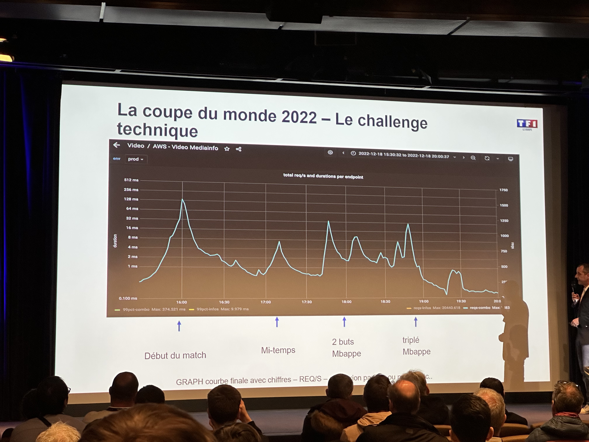
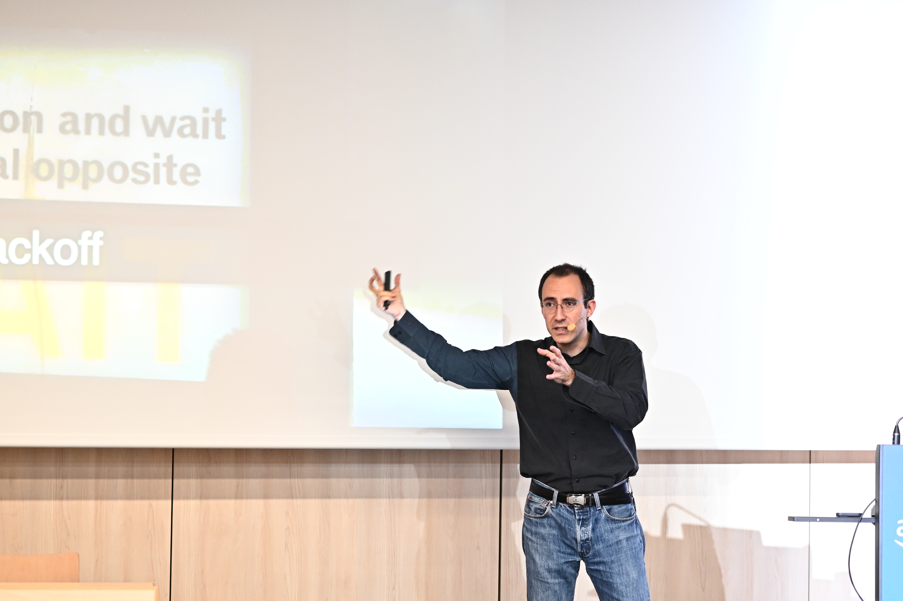
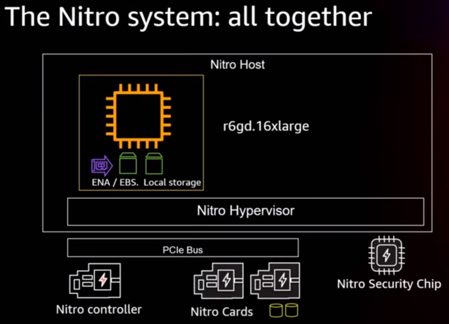
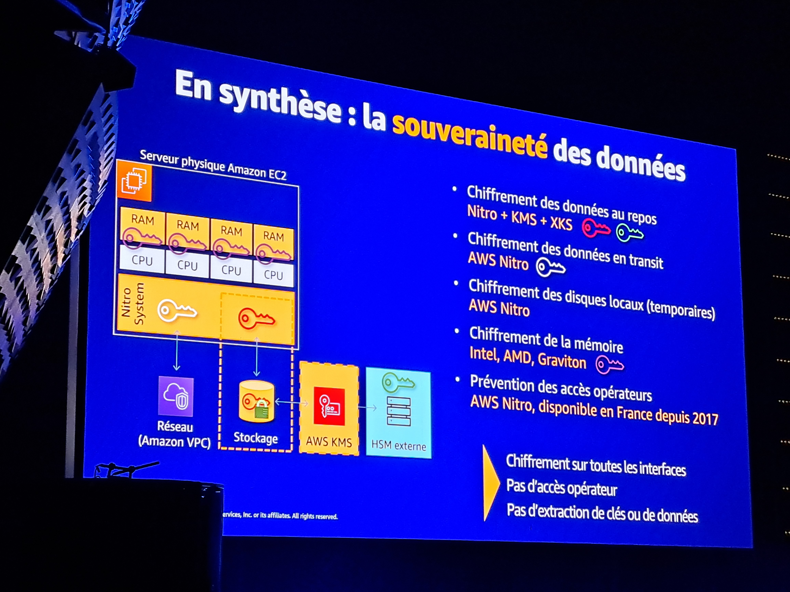

L’AWS Summit Paris 2023 s’est déroulé le 4 avril. C’était pour nous l’occasion de découvrir les dernières innovations au cœur des services AWS, comme la solution d’IA d’aide au développement nommée CodeWhisperer. De plus, [Pascal Martin, Principal Engineer](https://twitter.com/pascal_martin), y assistait aussi en tant que speaker pour partager notre expérience en conception et maintenance de Systèmes Distribués.
En plus des deux points précédemment cités, nous verrons aussi comment eTF1 s’est préparé pour la Coupe du Monde de la FIFA 2022, ou de souveraineté et de son application chez AWS.

## À vos côtés pour les grands moments : AWS, TF1 et la Coupe du Monde de la FIFA 2022

Conférence présentée par : 
- Imane Zeroual - Senior Technical Account Manager, AWS
- Djamel Arichi, Head of Managed Services and Support, eTF1
- Ali Oubabiz, Head of Digital Infrastructure, eTF1
- Remy Pinsonneau, Architecte, eTF1

[eTF1](https://tech.tf1.fr/) partage son retour d’expérience sur la Coupe du Monde de foot 2022 et les défis surmontés pour que leur plateforme de replay myTF1 propose une parfaite expérience utilisateur tout au long de l’événement.

La présentation, coanimée par Imane, Senior Technical Manager de chez AWS, permet aussi d’en apprendre un peu plus sur le programme IEM d’accompagnement de clients AWS lors d’événements critiques. Nous avons d’ailleurs déjà exploité ce programme chez Bedrock Streaming.
Challenge technique pour les équipes eTF1, la Coupe du Monde de football 2022 a battu plusieurs records de la plateforme, dont des pics à plus de 2,4 Millions d’utilisateurs simultanés. L’événement a été préparé en collaboration avec les équipes d’AWS pour adapter les infrastructures à recevoir de fortes charges.

Trois points critiques identifiés :
- Authent/backend, les millions d’utilisateurs vont s’authentifier dans une fenêtre de 15 minutes.
- Delivery vidéo, tout au long de l’événement une forte charge, constante, est attendue. 
- Publicité, pic de charge très important mais ponctuel.

Des scénarios de tests de performances ont été effectués à l’aide de K6, pour chacun des points. La préproduction a servi d'environnement de test, avant d'effectuer une validation finale sur la production. Du travail a été également réalisé sur les services AWS : par exemple, les tables DynamoDB ont été basculées en OnDemand afin de profiter de l’élasticité plus rapide du service, malgré les coûts supplémentaires, comparé au mode provisionné.
Au niveau des clusters Kubernetes, les applications ont été redimensionnées à la hausse (mémoire, cpu, HPA) pour anticiper les pics de charge et ne pas seulement se reposer sur du scaling réactif. 

Lors de la compétition, une War Room était ouverte suivant l’importance des matchs. Elle était composée d’intervenants AWS grâce au programme IEM, de personnels techniques eTF1 et de membres du service management pour pouvoir réagir en cas d’imprévus. 
La War Room a d’ailleurs été mise à contribution puisque la plateforme à subi des attaques DDOS pendant certains matchs. Le CDN Cloudfront et WAF ont permis de les contenir. 

Chez Bedrock Streaming, nous étions curieux de ce retour d’expérience : nous avons préparé ce même type d’événement lors de l'Euro de football 2020. Les défis à surmonter sont les mêmes que ceux que nous avions rencontrés et nous sommes arrivés à des conclusions similaires dans nos choix techniques. Nous avions d’ailleurs développé un outil pour répondre au problème de scalabilité dans kubernetes durant l’Euro 2020 et que nous utilisons toujours aujourd’hui, [un article de blog à ce sujet est disponible ici](https://tech.bedrockstreaming.com/2022/09/01/kubernetes-prescaling-we-open-source-our-solution.html).

## Comment bien débuter avec Amazon CodeWhisperer

Conférence présentée par : 
- Sébastien Butreau, Senior Partner Solutions Architect, AWS 
- Sébastien Grazzini, Principal Solutions Architect, AWS

Amazon annonce une sortie grand public, prochaine, de son assistant de développement par IA CodeWhisperer (update: depuis, [CodeWhisperer est passé GA](https://aws.amazon.com/blogs/aws/amazon-codewhisperer-free-for-individual-use-is-now-generally-available/)).  
Nous avons eu droit à une démonstration de l’outil. En quelques minutes et seulement à l’aide de quelques commentaires, les deux présentateurs ont produit un script python capable de prendre en entrée un répertoire de photos et donner en sortie un JSON qui, pour chaque photo, donnait le nom de la célébrité présente dessus. 

Chez Bedrock Streaming, nous pensons qu’il est très important de suivre ce nouveau tournant que prend l’aide au développement via l’IA depuis quelques mois. Nous prévoyons de tester lors de nos journées R&D Github Copilot et Amazon CodeWhisperer. 

L’outil d’Amazon a quelques atouts, notamment la fonctionnalité de suivi des références qui permet de savoir si du code proposé est similaire à du code utilisé pour l’apprentissage et peut-être protégé par une licence incompatible avec notre usage. De plus, l'intégration du SDK Amazon est assez poussée et cela prend tout son sens, notamment lors du développement pour des lambdas AWS où l’outil semble très performant. 

## Bienvenue dans le Monde Merveilleux des Systèmes Distribués

Cette année encore, nous avons eu la chance de pouvoir partager notre expérience, lors d’une conférence donnée par [Pascal](https://twitter.com/pascal_martin), Principal Engineer et [AWS Hero](https://aws.amazon.com/developer/community/heroes/pascal-martin/) : « Bienvenue dans le Monde Merveilleux des Systèmes Distribués »

Pourquoi s’embêter avec des Systèmes distribués ? Comment en tirer profit ? Quels dangers ? Scalabilité, coordination et résilience : trois grands axes pour ce talk, basé sur l’expérience acquise par les équipes Bedrock, tant infra que devs, depuis plusieurs années.

En tant que speaker, pouvoir partager avec notre communauté est toujours aussi agréable ! Et, dans le public, il était assez intéressant d’entendre les réactions de nos voisins lorsque Pascal racontait certaines anecdotes ou présentait certains concepts. Les problématiques que nous rencontrons dans nos métiers, nous sommes nombreux à les rencontrer, et c’est tout l’intérêt des événements comme AWS Summit : apprendre les uns des autres !

Cette présentation n’a malheureusement pas été enregistrée lors du Summit, mais Pascal l’a redonnée depuis à MixIT, où elle a été enregistrée -- et les vidéos devraient être bientôt publiées ;-)

## La souveraineté des données chez AWS

Une des conférences portait sur les thèmes de la Souveraineté dans le Cloud AWS et du Règlement européen Général sur la Protection des Données (RGPD). Lors de cette présentation, Stephan Hadinger (Directeur de la Technologie chez AWS) a exposé le cadre de ce règlement et sa mise en application au sein de l'infrastructure AWS. C'est cette partie qui était, d'après nous, la plus intéressante, étant donnée sa dimension technique. 

RGPD est un regroupement de règles qui régissent et protègent les droits des résidents d'Union Européenne. Il porte sur le respect de la confidentialité et la protection des données personnelles. Toute entreprise exerçant dans l'UE y est soumise. Dans le cas présent, la RGPD couvre à la fois les clients AWS (comme Bedrock) et les utilisateurs finaux (comme les utilisateurs des services Bedrock).

Chez AWS, la Souveraineté est synonyme d'autonomie stratégique et s'exprime de la façon suivante :
- la possession des données clients : tous les clients AWS ont le contrôle de leurs données et applications, et nous verrons comment ;
- le choix de la localisation des données, via la possibilité d'héberger l'intégralité des données sur le territoire de son choix, en France par exemple ;
- l’accès au meilleur de la technologie, qui favorise l'innovation ;
- et la possibilité de changer de solution (pas de lock-in).

Les clients sont les seuls possesseurs de leurs données, ils en ont le contrôle total : AWS n'a aucun droit d'usage des données de leurs clients. De plus, AWS n'a pas accès aux données et ne déplace pas (géographiquement) les données de ses clients. 

L'implémentation technique de ces concepts repose, entre autres, sur le chiffrement systématique des données. AWS Nitro est une des briques d'architecture qui en est responsable pour les EC2 (depuis 2013 pour la partie réseau). Nitro permet le chiffrement de toute la chaîne de données (réseau, volumes de stockage) et comprend plusieurs composants :
- Carte Nitro dédiée au échanges externes (réseau + accès aux EBS, stockage persistant)
- Carte Nitro pour le stockage local (stockage temporaire attaché à l'hôte)
- Hyperviseur Nitro (il s'agit d'un hyperviseur basé sur linux KVM, mais grandement modifié pour les besoins, pas de sshd, pas de systemd, pas de couche réseau)
- Puce de sécurité Nitro (qui empêche le client d'avoir accès aux composants de l'hôte, procède à la mise à jour des firmwares des composants du serveur et gère le sécure boot afin de contrôler l'état des firmwares des composants avant de démarrer l'hôte).

Au delà du chiffrement dont il est principalement question ici, Nitro permet aussi de grandement augmenter les performances des EC2 en limitant l'impact de l'hyperviseur sur le CPU utilisé par les clients. Dans le cas d'une virtualisation classique, toutes les tâches listées ci-dessus sont effectuées par le processeur lui-même, grignotant ainsi de la puissance des machines. Ici, Nitro permet de décharger le CPU de ces tâches en le rendant ainsi dédié aux EC2.

AWS utilise aussi des solutions telles que Key Management Service (KMS) pour chiffrer les données de plus d'une centaine de ses services. Il s'agit là aussi d'un système de protection des données des utilisateurs : seul l’opérateur possédant la clé de chiffrement est capable de lire les données de ces services. 
Une version étendue de KMS est même disponible pour les clients les plus soucieux de la protection de leurs données : [External Key Stores](https://docs.aws.amazon.com/kms/latest/developerguide/keystore-external.html). XKS est un dispositif physique pouvant être hébergé en dehors des locaux d'AWS. Il est même capable de se “défendre" contre les attaques physiques en procédant à l'effacement des clés lors d'une tentative d'intrusion physique. Il s'agit probablement de l'ultime implémentation de sécurité et de souveraineté chez AWS.

Tout au long de cette conférence, on a bien senti que le but d'AWS, afin de respecter les données de ses usagers, était de faire en sorte de ne pas pouvoir accéder aux données de ses clients.

# Le mot de la fin

L’AWS Summit comportait plus d’une centaine de sessions et nous avons juste eu l’occasion d’effleurer le contenu proposé lors de cette journée. 

Nous avons commencé à [migrer vers Le Cloud](https://leanpub.com/6cloud) en 2018 et notre premier AWS Summit Paris était en 2019 -- nous y avions d’ailleurs [déjà parlé de cette migration au cours d'un autre événement](https://www.youtube.com/watch?v=xLELSIEt2xA&list=PL2ime9SGTcqcJWATAbNDvSVsTQyMridf3&index=11).

Depuis, que de chemin parcouru ! Cette année, nous pensions moins à Kubernetes, à DynamoDB ou aux optimisations de coûts, sur lesquels nous avons bien bossé depuis 2019. Notre attention était plus attirée vers des sujets que nous avons commencé à travailler plus récemment et où nous avons encore des challenges majeurs, comme les approches pleinement serverless ;-)
