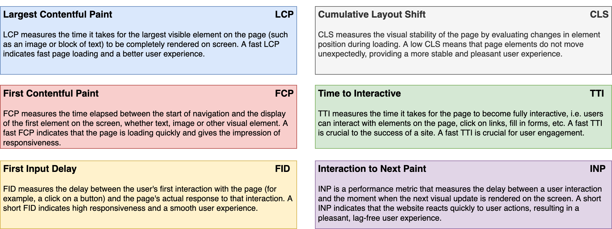
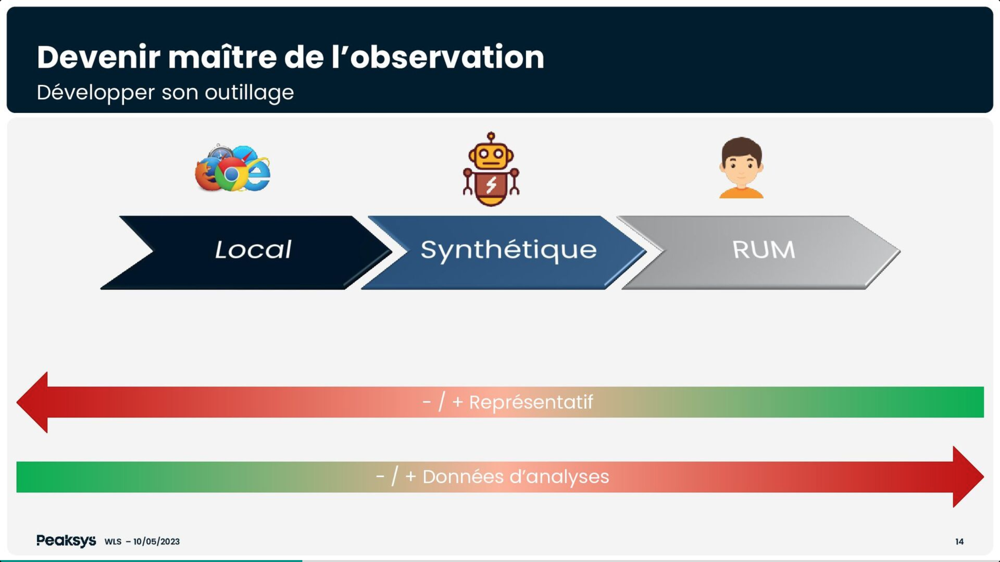

The Frontend Bedrock teams were present at the 2023 edition of the _We Love Speed_ conference in Paris on May 10. Its aim is to share as widely as possible knowledge and experience in the field of web performance.

Webperf, or web performance, refers to the set of techniques and best practices aimed at optimizing the loading speed and user experience (UX) of websites. It covers various aspects such as page loading time, interface responsiveness, animation fluidity, server request processing capacity, etc.

Webperf is still a major challenge in today's web industry, influencing UX, website visibility and overall commercial success. This article summarizes the topics discussed at this year's _We Love Speed_ conference and gives an overview of the 2023 approach to web performance.

## Table of contents

- [Why optimize your sites' webperf?](#why-optimize-your-sites-webperf)
  - [It's all about money 🤑](#its-all-about-money-)
  - [What about SEO?](#what-about-seo)
- [How do you take up performance projects?](#how-do-you-take-up-a-performance-project)
  - [Build a long-term strategy based on usages](#build-a-long-term-strategy-based-on-usages)
  - [Take cognitive biases into account to prioritise optimisations](#take-cognitive-biases-into-account-to-prioritise-optimisations)
  - [Performance must be a company-wide concern](#performance-must-be-a-company-wide-concern)
- [What are the tools to measure and improve performance?](#what-are-the-tools-to-measure-and-improve-performance)
  - [Use the right tools to understand performance issues…](#use-the-right-tools-to-understand-performance-issues)
  - […and the right approach to fix them](#and-the-right-tools-to-fix-them)
  - [MPA vs SPA](#mpa-vs-spa)
- [Implement performance improvements](#implement-performance-improvements)
  - [Using bfcache](#using-bfcache)
  - [Preloading, Preconnecting and HTML](#preloading-preconnecting-and-html)
  - [Lazy…](#lazy)
  - [Taking care of the Consent Management Platform (CMP)](#taking-care-of-the-consent-management-platform-cmp)
  - [Self-host blocking thirdparties](#self-host-blocking-thirdparties)
  - [Use Server-side Rendering (SSR) and optimize it!](#use-server-side-rendering-ssr)
  - [103 Early hints](#103-early-hints)
- [Webperf at Bedrock](#webperf-at-bedrock)

## Why optimize your sites' webperf?

### It's all about money 🤑

Improving the webperf just for the technical challenge is not interesting in a company's perspective and can't make the approach durable. [Boris Schapira in his talk _"Parlons de valeur"_](https://www.youtube.com/watch?v=wh0zCqZRuSs) 🇫🇷 shows how important it is to talk about **value** to make optimisation projects part of an organisation's strategy.

Web performance is essential, as it has a direct impact on user satisfaction, engagement and the overall success of a website. Fast performance enables users to access information quickly, interact without delay and navigate smoothly. On the other hand, slow loading times, frozen interfaces or high response times can lead to user frustration, lower engagement and higher bounce rates.

A lot of articles on the net have proved **the impact of the webperf on users' engagement**.

> Here is [a great article from Google](https://web.dev/why-speed-matters/) or [hundreds of case studies](https://wpostats.com/) from WPO stats, a site listing case studies demonstrating the impact of web performance optimization.
>
> Reducing perceived waiting time by 40% increased search engine traffic and sign-ups by 15% at Pinterest. For Mobify, each 100ms reduction in homepage loading speed yields an average increase in annual sales of almost $380,000!

So, depending on the site's field, it's relatively easy to link the webperf approach to an objective of user views or loyalty, but also with the brand image. And the company's governance will be able to quickly measure the benefits in terms of return on investment.

### What about SEO?

Moreover, search engines such as Google also give a relative importance on website performance in their ranking algorithms. More optimized sites often benefit from better positioning in search results, which can have an impact on their visibility and traffic.

However, [Philippe Yonnet's talk _"Quel est le véritable impact des problèmes de web performance sur le SEO ?"_](https://www.youtube.com/watch?v=uWqQCOX52i4) 🇫🇷 reveals that actually the Google webperf scoring is in reality quite low in all the parameters taken into account in the ranking algorithm. Relevant content is always the first factor in top positioning. As it was the case with responsive design a few years ago, the Google's communication around webperf is aimed more at **encouraging good practices** in the web community than at penalizing slow sites.

## How do you take up performance projects?

### Build a long-term strategy based on usages

You need a strategy and a speech! [Boris Schapira](https://www.youtube.com/watch?v=wh0zCqZRuSs) 🇫🇷 defines 5 steps:

1. Identify the sticking point
2. Associate a value to the project for the business
3. Invest time for the optimizations
4. Evaluate the ROI
5. Sustain the approach over time (it should never be a one shot project)

> We now universally use the [Google's Core Web Vitals KPI](https://web.dev/vitals/) (CWV) to model the UX:
>
> - Do users have a stable visual response? ➡️ it's measured through the _Cumulative Layout Shift_ (CLS)
> - Do users quickly see content they can trust? ➡️ it's measured through the _Largest Contentful Paint_ (LCP)
> - Can users quickly interact with the page in a qualitative way? ➡️ it's measured through the _First Input Delay_ (FID)

But these KPI are a limited reflection of the UX, and it is hard to link it to a representative value. It's possible to have a super-fast LCP and still have a feeling of slowness or discomfort on the user's side. For example, a page that quickly displays the thumbnail of a film (LCP criterion) but takes a long time to display the film's cast list (which is the content the user wants) won't be great for the UX.

**You need to correlate these measures with usages**. There is no magic solution for this but segmenting sessions is a good practice to focus on relevant optimizations:

- take a period of time where the measure is representative (e.g. on our streaming sites, the activity period is mainly in the evening)
- take into account the fact that different actions or events on your site may not involve the same users (so not the same devices, etc.)
- take "short" indicators to measure the impact of the performance (e.g. if users are on a product list, monitor the viewing of the product page and not the purchase of the product)
- take into account the market you're addressing (e.g. food click & collect users are more likely to wait the loading of the next page than users on a retail site)

### Take cognitive biases into account to prioritise optimisations

When it comes to prioritising performance subjects, there are several strategies to consider. [Philip Tellis in his talk _"Understanding Cognitive Biases in Performance Measurement"_](https://www.youtube.com/watch?v=6KwW5v5rce4) 🇬🇧 shed light on the psychological aspect of performance, focusing on cognitive biases.

Philip made a powerful statement: _"If you have a brain, you have a bias_". Let's explore three examples that demonstrate how biases can impact your work and how you can leverage them to your advantage.

#### Slowest is the norm

The negativity bias reveals that negative experiences tend to leave a stronger impression than positive ones, even if their intensity is the same. This is crucial to keep in mind when optimizing your app's performance. Ideally, the slowest page should not be more than 15 times slower than the fastest page. Users might perceive the slower page as the norm for your app.

To counteract this bias, it's important to be transparent with your users. You can display a message indicating that the page is slow and assure them that efforts are underway to resolve the issue. Interestingly, slow pages have been associated with a 38% increase in heart rate, similar to watching a horror movie. **By prioritizing performance and being honest with your users, you can mitigate stress and anxiety.**

#### Take care at the beginning and end

The serial position effect highlights that people tend to remember the beginning and end of an experience more vividly. This is particularly relevant for our work in developing applications for Smart TVs, where performance challenges arise in two areas: page loading and remote control navigation. Taking this bias into account, we've learned that **investing more time in optimizing page load times can significantly increase end-user satisfaction**. Furthermore, statistics show that a 500ms increase in delay leads to a 26% rise in frustration.

#### Take care at the beginning 😅

The escalation of commitment bias refers to the inclination to persist in an endeavor once a significant investment of money, effort, or time has been made. Applying this bias to our app development, we recognize the importance of ensuring that the initial pages users encounter are fast, as this positively influences user retention. **There is a direct correlation between a smooth initial experience and increased user engagement.**

These are just three examples among many others that Philip presented in his thought-provoking talk. It was an insightful perspective on performance, viewed through the lens of our cognitive biases. We all possess biases, and as developers, our objective is to acknowledge them and harness their power to inform the future updates of our apps.

### Performance must be a company-wide concern

While optimizing specific parts of your app is essential, it's important to remember that you work in a company composed of diverse individuals with varying roles, perspectives, and concerns. Therefore, it's crucial to extend performance awareness across all departments of your organization.

La Redoute, an international clothing retailer, provides an excellent example of addressing this issue by creating a performance community within their company through the talk [_"Comment construire une communauté Web Perf dans son orga ?"_](https://www.youtube.com/watch?v=aGi-vxC6ttA) 🇫🇷.

To provide some context, La Redoute faces not only performance issues but also challenges related to synchronization and contributions on their platform. To tackle these challenges, they established a community that brings together individuals from different departments, including technical, marketing, finance, design, product, SEO, and more.

It's vital to ensure that performance is not solely the responsibility of one department, as **each department can contribute valuable insights and support that ultimately benefit the entire company**.

This community meets weekly to exchange knowledge and share updates on performance-related topics. After six months, they began witnessing the initial benefits, and **within one year, they deemed the community mature**. They continue to hold these meetings, recognizing that the objective is not to prevent all issues but rather to minimize their impact and respond swiftly.

La Redoute's approach is truly inspiring and serves as a great example of fostering collaboration and cross-departmental engagement to address performance challenges.

## What are the tools to measure and improve performance?

When analyzing a website's performance, it's essential to take several key criteria into account in order to become the ["Sherlock Holmes of Web Performance" as would say Ludovic Lefebvre](https://www.youtube.com/watch?v=q65w_luvB3A) 🇫🇷. In addition of the CWV mentioned above, there are other commonly used performance analysis criteria:

To measure/evaluate your site's performance according to these criteria, there are 3 types of sources: Local (devtools), Synthetic (CI/CD / online scan tools), RUM (Real User Monitoring).

### Use the right tools to understand performance issues...

Jean-Pierre Vincent gives more details about how to measure performance in his talk ["Mesure ou meurs : diagnostics rapides"](https://www.youtube.com/watch?v=r-go-1z7XYw) 🇫🇷, but here is a summary of the key tools:

- Local development tools - devtools
  - Chrome & Firefox DevTools: a set of development tools integrated into the browser, for analyzing performance, debugging JavaScript code, inspecting DOM elements, etc.
  - Lighthouse DevTools (Chrome): a Chrome DevTools extension that provides automated audits to evaluate performance, accessibility, SEO optimization, etc.
- Synthetic testing - CI/CD and online analysis tools
  - [WebPageTest](https://www.webpagetest.org/): an online tool for evaluating website performance by running tests on different browser configurations, network connections and geographical locations.
  - [Lighthouse CI](https://github.com/GoogleChrome/lighthouse-ci): a Lighthouse-based continuous integration (CI) solution that automates web performance and quality audits with every deployment.
- Real User Monitoring
  - [New Relic](https://newrelic.com): an application performance monitoring platform that provides real-time visibility into the performance of your web applications, including usage metrics, load times, etc.
  - [Grafana](https://grafana.com/): a data visualization platform that can be used to display and analyze performance monitoring data collected from a variety of sources, including RUM tools.

It's important to note that each type of analysis data has its own advantages and is used in specific contexts. Local data is useful for real-time development and debugging, synthetic data enables performance to be compared and optimized in a reproducible way, while RUM data, just as explained by [Tim Vereecke in his "Noise Canceling RUM" talk](https://www.youtube.com/watch?v=vfl-C1FZSwE) 🇬🇧, provides a true view of UX. It is generally recommended to use a combination of these different data sources to identify/target problems or opportunities for performance improvement.

### ...and the right approach to fix them

Once you've identified the relevant performance criteria and used the analysis tools to measure your website's current performance, it's essential to stabilize the various criteria before setting improvement targets and finally implement said improvements. Here are the steps to follow:

1. Stabilize criteria
- **Analyze the results** of the performance measurements for each criterion you've identified. Identify areas where improvements are needed, and problems that affect performance stability. For example, LCP depends on the appearance of the widest element on the page. It's important that this element is always the same on the same page type, otherwise there will be no consistent result and optimization will be impossible.
- **Examine performance metrics** over a sufficiently long period of time to detect trends and variations. This will help you understand whether performance problems are constant or sporadic.
- **Identify factors** that could influence performance, such as code changes, server updates, new features, content contributions, etc.

2. Setting improvement targets
- **Determine the performance levels** you want to achieve for each criterion, based on benchmarks, best practices or objectives specific to your application.
- **Define measurable and realistic objectives** for each performance criterion. For example, you could aim to reduce page load time by 20%, improve server response time by less than 200 ms, or reduce bounce rate by 15%.
- **Prioritize goals** according to their impact on your website's UX and business objectives (see [above section about cognitive biases](#take-cognitive-biases-into-account-to-prioritise-optimisations)).

3. Plan and implement improvements
- **Identify the specific actions to be taken** to achieve each improvement objective. This may include code optimizations, server configuration adjustments, resource optimizations, caching, etc.
- **Establish an action plan** for each objective, defining the necessary steps, responsibilities, deadlines and resources required.
- **Implement improvements** iteratively, and measure performance regularly to assess the impact of changes.
- **Repeat the process** of analyzing, stabilizing and improving performance iteratively to continue optimizing your website.

> ⚠️ It's important to bear in mind that website performance is often an ongoing process, as needs, functionalities and conditions change over time. It is therefore advisable to regularly monitor performance and continue to identify new opportunities for improvement to deliver a superior UX.

### MPA vs SPA

The performance possibilities are not the same between **Single Pages Applications (SPA)** and **Multiple Pages Applications (MPA)**.

MPAs are simple to measure: each page is independent. The first page loads resources and then caches certain resources. It's therefore important to be able to distinguish between measurements based on a user's first visit and those based on browsing (which is much faster).

SPAs are more difficult, because apart from the initial page load, there is other page load. Initial loading is often heavier (because of JS framework), and therefore slower. Page changes can't be measured simply since only the initial load is taken into account. Research is currently underway in browsers to improve the collection of information on page changes in SPAs. This new metric is called `soft-navigation` and is currently being tested on Chrome and specified by web organizations. Yoav Weiss explains this in his talk ["Soft Navigations are hard!!"](https://www.youtube.com/watch?v=pQLRoABCnqg) 🇬🇧.

## Implement performance improvements

There are many technical tips for improving performance. While the list is far from exhaustive, we can go here through some of those mentioned at the conference.

### Using bfcache

At the time of writing, around 10% of a given user's navigation consists of **clicking on the “Go back” button** of their browser. More often than not, however, these users will then need to wait for the page to load again, despite the fact that the browser already did that work a few seconds beforehand.
In order to help reduce that waiting time, browsers recently began to release what's called the Back/Forward cache (Also known as bfcache).

Like its name suggests, it caches the page the user is leaving, so that if they go back using their browser features, they’ll see the cached page instead. Barry Pollard talks about the bfcache in the ["Top Core Web Vitals Recommendations for 2023"](https://youtu.be/fJrKeh-Np8c?t=1100) talk 🇬🇧.

### Preloading, Preconnecting and HTML

Another possible improvement explained by Barry Pollard is to use HTML properties to preload and preconnect resources. He explains here that there is one important rule with HTML and the way it's processed by web browsers: it is parsed **line by line**, and it can be paused.

When a browser is trying to render a web page, if it runs across something trying to call an url (such as loading a CSS file), then it’ll wait until said CSS file is fully loaded, before being able to keep going.
However this behavior can be somewhat altered by using the `rel` HTML property to prepare some of that stuff ahead. For example, `rel=”preload”` will tell the browser to start loading said CSS asynchronously, as soon as a user opens the page. For an API, it will be the `rel=”preconnect”` that will allow the website to start the handshake with an API as soon as possible.

If a resource needs to be even higher-priority, there is the `fetchpriority` attribute which will make the browser fetch that resource as soon as possible. If used correctly, [it can have immense benefit](https://twitter.com/senthil_hi/status/1589676464215326720) on LCP.

### Lazy...

Images, and especially high-quality ones, can take up a lot of a website's loading time, and are often considered the Largest Content of a website, **dictating the LCP value**. However, usually a user isn't seeing every image of a website at the same time. That’s where we can use lazy-loading.

The goal of lazy-loading is to make sure that a user is only loading the images they are seeing. Here again exists an HTML attribute that can take care of everything, named `loading`. It can receive the `lazy` value in order to only load an image when approaching the screen.

However, that lazy-loading property is not limited to images only. A component can be lazyloaded as well, such as a chat component that doesn't need to load until the user clicks on the chat icon.

### Taking care of the Consent Management Platform (CMP)

A lot of websites, us included, are using a lot of third parties. We are not judging their usefulness here, we need them. This is why Andy Davies dedicates an entire talk about [how to tame the speed impact of 3rd-party tags](https://www.youtube.com/watch?v=q3M4he-QxCA) 🇬🇧.

As he explains, **each new thirdparty comes with its own compounding issues**. Adding another domain and thus another need to connect to a distant API, reheating the connection… A lot of these actions are taking network time, time that is actively needed to load a lot more data for a website.

It is important to understand how our thirdparties work, and the limitations they inherently have. For example, we **CANNOT, and should NEVER** try to preconnect to them. Preconnecting to a thirdparty discloses a user IP address, which according to GDPR laws at the time of writing, is considered a personnel data. If our user did not consent to share their data, we should never try to connect in the first place.

Therefore, a big hurdle is that we need to collect the user's consent to be able to connect to our thirdparties API. The first improvement to make is therefore to optimize the CMP, to make sure it loads fast and it shares the user’s consent with us as soon as possible.

### Self-host blocking thirdparties

Sometimes, thirdparties can be needed to display anything at all to the user (e.g. for A/B testing). Since our user's browser has limited network capabilities, it will try to prioritize its requests, and requests that are going to another domain are far down the line. For this exact reason, Andy Davies, [in his talk](https://www.youtube.com/watch?v=q3M4he-QxCA) 🇬🇧, recommends to self-host these thirdparties, so that they are on the same domain as our website and are prioritized by the browser.

### Use Server-Side Rendering (SSR) and optimize it!

> ℹ️ This is far from an easy to implement solution, and may require you to change your framework altogether.

Implementing SSR is a solution that is so powerful that it had a dedicated talk, where Kévin Raynel and Marting Guiller explained [how Lazy Hydrate, Never Hydrate, and Resumable JS](https://www.youtube.com/watch?v=2b48sOTD4dc) 🇫🇷 can be used to improve Web Performance.

By allowing the code of an application to be pre-rendered in a server before being sent to a browser, you can dramatically decrease the time it takes for a user to be able to interact with the page. At Bedrock, we understood the power of SSR very early on, when we implemented it with React in 2015 for the new JS version of [6play.fr](https://www.6play.fr)! Since then, we haven't looked back, but we will need to fine-tune the hydratation to keep the best.

### 103 Early Hints

> Do note that this is an experimental feature ⚠️

In his excellent [Web Protocols for Frontend Developers](https://www.youtube.com/watch?v=0kKdMqIhvZs) talk 🇬🇧, Robin Marx details extensively what is called the 103 Early Hints feature and how it can be used to improve your performance.

103 Early Hints is a status code used to send preliminary headers in a response, providing the client with potential resource information before the main response is sent. This enables the browser to optimize its call flow.

There are many other implementation tips covered by the conference, such as the new [Speculation Rules API](https://developer.chrome.com/blog/prerender-pages/), but we can't talk about everything here 😉

## Webperf at Bedrock

Bedrock's technical teams have long been aware of the importance of web performance. Since we set up our first full JS frontend in 2015, we have been implementing best practices (SSR, lazy loading, prefetching, code spitting, image optimization, etc.) and we try to carry out regular optimization projects.

But we know that we still have a lot to do in this area, particularly in terms of long-term monitoring and company-wide concern.

Following this conference, there are lots of things we'd like to try out, such as using the `fetchpriority` attribute to improve our LCP, optimizing the hydration of our SSR (perhaps with the use of [React Server Components](https://vercel.com/blog/understanding-react-server-components)) or studying the new experimental features.

On our TV platforms developed in JS, hardware constraints are forcing us to go even further in optimizing performance, particularly in terms of memory usage. For example, a project is underway to use a global lazy loading to improve the management of rows of programs and videos. To be continued...

## Keep at it! 💪

All in all, performance is definitely anything but an easy task to do. There is no magic formula that will make all your problems go away. Even if you manage to hold a long workshop of several weeks (or even months!) that will finally fix your performance issues, if it does not become a habit in your developer teams, it will never be over. **Performance is a habit, built through practice and good communication**. But it can be achieved.

_Authors: [Etienne Doyon](https://github.com/EtienneDOYON), [Alexandre Gory](https://github.com/agory), [Maxime Blanc](https://twitter.com/jeansmaug), [Florent Dubost](https://twitter.com/fooragnak)_
