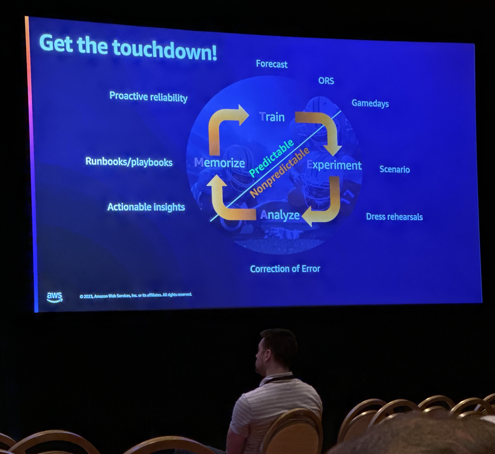
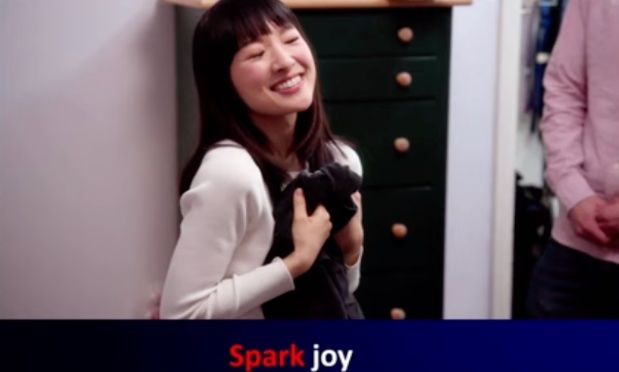
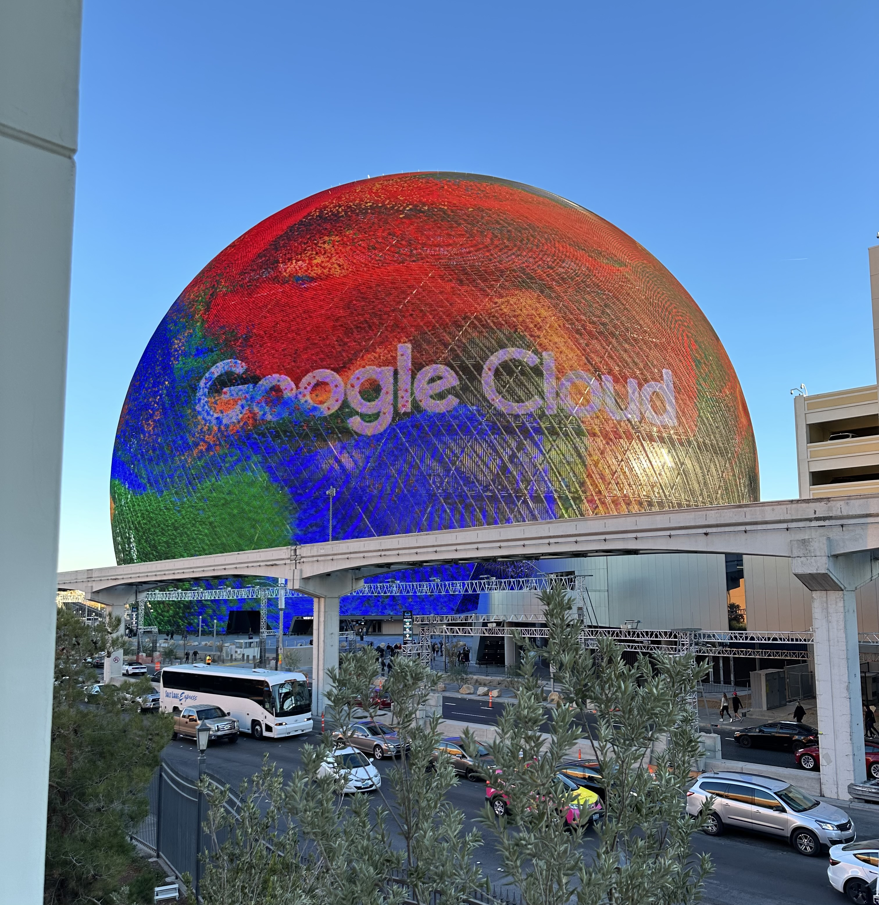

AWS re:Invent 2023 was a showcase for GenAI. It was the announcement of Amazon Q, Amazon's new AI assistant, that attracted the most interest, designed to meet the specific needs of businesses.

Alongside these announcements, we had the opportunity to attend talks by some of the major players in streaming, such as Prime Video, Peacock, Netflix and Spotify. Their presentations offered valuable insights into their challenges, successes and lessons learned, enriching our own understanding of the sector.

## How Amazon scales resilience to new heights 

Olga Hall, Director of Live Events Availability & Resilience at Amazon Prime Video, and Lauren Domb, Chief Technologist, WWP Federal Financial Services, WW Chaos Engineering Lead at AWS, [discussed the importance of resilience in the streaming industry](https://www.youtube.com/watch?v=r3J0fEgNCLQ).

They highlighted the high cost of downtime and the impact on companies' ability to serve their customers. We're talking about an average of $300,000 per hour across the industry.  

In their view, preparing engineering teams for peak loads and streaming is very similar to preparing sports teams for major events. So they created a "resilience playbook", a series of strategies and tactics inspired by the most successful sports teams, to help their teams become resilient in the face of the unpredictable.

They also shared their experience of broadcasting Thursday night soccer matches on Prime Video, highlighting how they had to manage unpredictable conditions, such as weather-related match delays, which extended the duration of the peak workload.

Availability is considered the number 1 feature at Amazon Prime Video. All projects and workflows are listed, budgeted and included in the list of expected features, with availability always at the top of the list.
To guarantee the availability of their services, they run load tests three times a week in each region, scaled for peak usage. This enables them to detect bugs before they affect users, and ensure that their systems are ready to handle the highest loads.

At Bedrock Streaming, we share this focus on resilience. Our applications incorporate circuit breakers, we run load tests very regularly and practice chaos engineering. 
These practices at Amazon Prime Video offer an interesting perspective on how we might further improve our resilience at Bedrock Streaming. We were particularly impressed by the resilience score per application approach. This is definitely something we'll be exploring in conjunction with a feature flipping by service approach.

## Surviving overloads: How Amazon Prime Day avoids congestion collapse

Jim Roskind, Distinguished Engineer at Amazon.com, and Ankit Chadha Solution Architect at AWS [shared their experiences and knowledge at the conference](https://www.youtube.com/watch?v=fOYOvp6X10g). Formerly of Google, where he oversaw Google Chrome metrics and performance, Jim now works for Amazon with a singular mission: to buy less of AWS products. This approach, aimed at reducing IT costs, is supported by AWS, which wants to teach all its customers how to optimize their spending.

However, this quest for efficiency and cost reduction is not without risks. One of Jim's main concerns is congestion collapse, a phenomenon that can lead to a drop in productivity and even paralyze a system. To help us understand this phenomenon, Jim presented a series of pragmatic examples and theories on congestion collapse.

What is congestion collapse?

Congestion collapse occurs when demand exceeds a system's capacity. This leads to the build-up of queues, reduced productivity and, in extreme cases, the complete cessation of productive work. This phenomenon is not uncommon and can occur in a variety of situations, from highways to web servers.

Jim shared some examples to illustrate this phenomenon, the main one was about 
Amazon Prime Day 2018. Even giants like Amazon aren't immune to congestion collapse. 
He hadn't anticipated customer interest in a particular product. They had a massive demand for a product display and the service ended up being unavailable. At this point, traffic increased again sharply as customers began reloading the page. Above all, it highlights the fact that, as their services are slow to respond, the answers are no longer relevant, leaving us with a system that is 100% loaded and no longer doing anything useful.

These examples show that congestion collapse is a real problem that requires constant attention and planning. 

At bedrock we've also encountered congestion collapse. For example, during busy events such as soccer matches, we've already encountered the case where a massive influx of users would cause the platform to become unavailable, at which point all the users would press F5 at the same time, drastically increasing the traffic on an already struggling platform. Moreover, requests are queued up and we end up answering requests issued 1 or 2 min earlier, and therefore answering people who have surely already left. 

Jim mentions this issue, which has happened at amazon.com. 

They were able to implement 2 solutions in particular. 

- The first, when the servers can no longer respond, is to display a page with a message warning the user to wait a while and try again in a while. This had a surprisingly noticeable effect. Users were no longer repeatedly pressing the F5 button.

- Secondly, they have implemented mechanisms to detect massive retries and thus avoid transmitting traffic to their backend. In particular, they have implemented this in the WAF service.

At Bedrock Streaming we already display a page in case of trouble, but we can improve it to suggest to the user to wait before retrying. Moreover, we use Cloudfront and WAF on almost all our services. We have a few rules on WAF that allow us to deny traffic that seems illegitimate, but we're going to work on a new rule to avoid transmitting untimely user retries in the event of an overloaded system. 

## Netflix caching 
*“Who in this room is a netflix user?” (90% of the room raises its hand)*: no doubt Prudhviraj Karumanchi, software engineer & Sriram Rangarajan, Senior Distributed Systems Engineer at Netflix, conference speakers, know how to introduce their talk and remind us that they are the market giants. [During their conference](https://www.youtube.com/watch?v=85TiFrDhCR4), they presented how Netflix uses the EVCache solution for multi-region cache replication.

Netflix likes to say that one of its missions is to spread joy. This involves two aspects: offering users a fully personalized homepage and 
benefiting from a scalable, low-cost architecture (so that Netflix's techies are happy too). 

This conference addressed many of the issues we are familiar with: a home page that calls on a large number of microservices to display content to the user, scaling issues, cost management...

The heart of the conference detailed the architecture implemented by Netflix teams to replicate cache across multiple regions using EVCache, Kafka and SQS. 

It was also interesting to see that at Netflix, as with us, it's important to build with costs in mind: after analyzing the costs of their inter-region traffic, they finally decided to remove their network load-balancer to make their architecture more cost-efficient.

A long part of the conference was dedicated to the observability of the replication stack: our teams have also done a lot of work on this issue in recent years, so it was interesting to compare our practices on the subject of observability.

While we don't yet work on the same scale as Netflix, attending this conference allowed us to reinforce our idea that caching is essential in the architecture of a platform such as Bedrock Streaming. And it gives us new ways for reflection...

## Takeaways from Reinvent2023. The newcomers’ point of view

It's often said that "what happens in Vegas stays in Vegas", but for some of us, this edition of Re:invent was our first time at a conference of this magnitude. So it's hard not to share some of our feedback with you!

First of all, a word about Vegas, the city of excess which hosts Re:invent every year, and which has been transformed for us into an open-air R&D ground! From Fremont Street to the brand-new Sphere, there are screens EVERYWHERE in this city, which has aroused our curiosity as video streaming professionals... 

On the eve of Reinvent, the city is transformed: tourists give way to speakers from all over the world, advertising screens talk of nothing but cloud solutions, scalability and artificial intelligence... It's an incredible phenomenon to behold!

With over 70,000 participants, nothing can be left to chance in the organization of Reinvent. It's impressive to see (Vegas traffic jams aside) how smoothly the whole conference runs. A sort of "human load-balancing" has even been arranged so that each speaker can have lunch in record time! 

The keynotes organized during Reinvent (5 in all) are events within events! The expected crowds are so huge that several overflow rooms are planned in addition to the main ballroom where the speaker is based.
We were able to attend two of them: Adam Zelipsky's (CEO of aws) - for which the speakers were greeted by a fantastic rock band at 7:30 a.m., a guaranteed wake-up call - and Werner Vogels' (CPO & VP of amazon.com), where this time the welcome was provided by a fantastic string quartet.

While Adam Zelisky's conference was undoubtedly a masterpiece (production, new services announced, influential clients such as Lidia Fonseca, chief digital and technology officer at Pfizer, speaking), it was Dr. Vogels' conference that impressed us the most.

Based on [the laws of the "frugal architect"](https://thefrugalarchitect.com/), this keynote spoke to everyone: technicians, business people, product managers... It took up the elementary concepts of what should motivate our design of IT solutions: cost awareness, the indispensable balance between commercial and technical needs, or the danger of never questioning oneself, quoting Grace Hopper: "One of the most dangerous phrases in the English language is: *'We've always done it this way'*"
We encourage you to watch [the replay of this keynote](https://www.youtube.com/watch?v=UTRBVPvzt9w), a must-see!

Beyond the gigantism of the event, let's look at what we've taken away from our participation in Reinvent. Attending a conference is always an opportunity to take a step back on our current work themes: we attended many conferences on resilience, scalability and new architectures: 
- it enabled us to compare our practices with those of major players in the sector (Prime, Spotify, Peacock...),
- to transpose these themes into a context completely different from our own (“[1.5 million requests per second—a story from the Brazilian elections](https://www.youtube.com/watch?v=fGyvsNE4vh8)”)
- or to appreciate the work we've done over the year, which sometimes goes beyond what's presented at conferences (“[Use new IAM Access Analyzer features on your journey to least privilege](https://www.youtube.com/watch?v=JpemUkU8INA)”)

For all these reasons, no doubt Bedrock Streaming teams will be betting on Reinvent again next year!
