The 2024 GopherCon Europe took place in Berlin. Four of us had the opportunity to take part in the event in-person while
others could attend the talks virtually.

# Talks

## The Business of Go - Cameron Balahan Go Product Manager

Cameron Balahan, a Product Manager at the Golang Team, kicked off GopherCon 2024 with a compelling talk on the business
side of Go. He shared insights into the strategic decisions that shape the development of the Go language, emphasizing
the importance of balancing innovation with stability to meet the needs of both enterprise users and the broader
developer community.

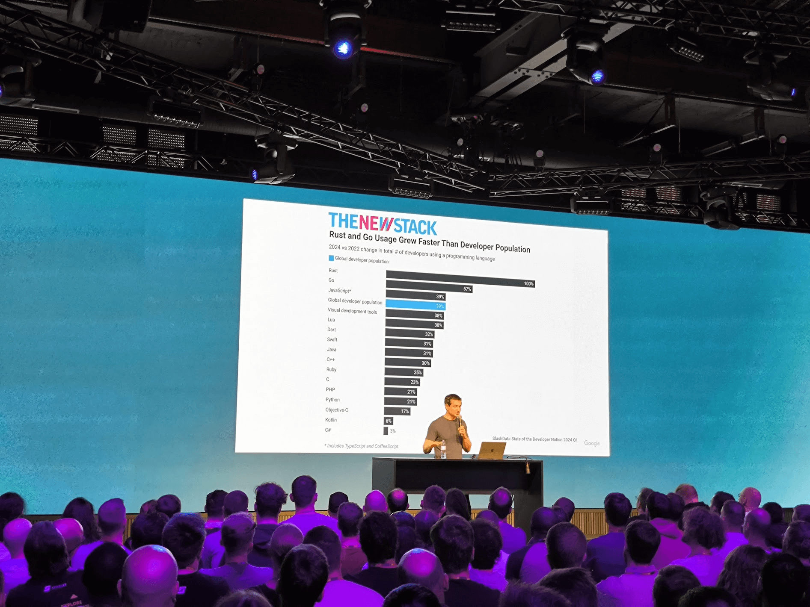
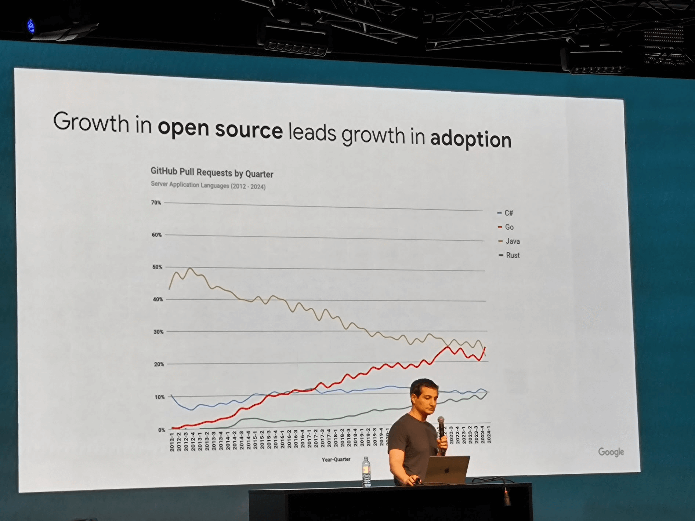

## Memory Optimization - Diana Shevchenko

Diana Shevchenko from Datadog delivered an enlightening session on memory management in Go, particularly focusing on how
data on the heap is stored in chunks known as `mspans`. She highlighted the benefits of this approach, such as efficient
memory access and CPU cache optimization, while also discussing potential pitfalls like logical grouping and code
readability challenges.

### Key Takeaways:
 - **Benefits**: Efficient memory access, CPU cache optimization.
 - **Challenges**: Logical grouping, code readability, versioning, and backward compatibility.

## Domain Driven Design - Robert Laszcak

Robert, a principal engineer, shared valuable insights on simplifying Go projects using Domain-Driven Design (DDD). He
highlighted a recurring challenge: project complexity. Both accidental complexity, stemming from over-engineering, and
essential complexity, inherent in each feature, were identified as major hurdles. Ignoring essential complexity often
leads to increased accidental complexity, making projects cumbersome and prone to becoming legacy systems quickly.

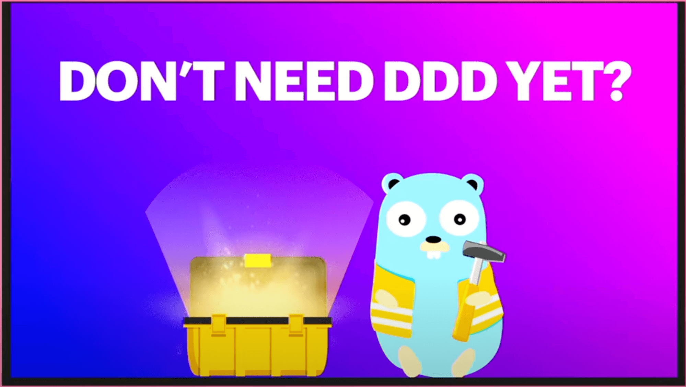

To illustrate the problem, the engineer introduced a fictional company, Bing Mate, which developed an API for issuing
invoices and processing payments. Initially, the company delivered new features weekly. However, a year later, despite
maintaining a healthy codebase, they struggled to implement similar features promptly, triggering concerns about their
productivity.

### The Initial Solution: Microservices and Kubernetes

Bing Mate attempted to solve their issue by hiring more developers and transitioning from a monolithic application to a
microservices architecture on Kubernetes. Despite achieving the ideal Kubernetes setup, they still faced slow software
delivery. This led to a realization that the complexity of their microservices architecture might be the root cause.

In this Fake company, Emily conducted an investigation. She discovered that Bing Mate had split their monolithic
application by database tables, resulting in closely related services that increased complexity. The solution proposed
was to merge these related services into a more cohesive microservice, or a "micro-monolith", reducing the need for
extensive inter-service communication. To manage the complexity of this new service, Domain-Driven Design (DDD) was
introduced.

### Key DDD Patterns To Take Home

1. Always Keep Valid State in Memory:
The first pattern emphasizes maintaining valid state within the application. By encapsulating the state and ensuring
that only valid data can be instantiated, the integrity of the application is preserved. This is achieved by using
private properties and constructors that enforce validation rules, ensuring that no invalid state can exist in memory.

2. Keep Domain Database-Agnostic:
The second pattern involves separating domain logic from database logic. By using the repository pattern, interactions
with the database are abstracted, allowing the domain logic to remain clean and focused on business rules. This
separation not only makes the code more maintainable but also facilitates testing and potential database changes in the
future.

3. Reflect Business Logic in Code:
The third pattern advocates for aligning code with business terminology. By using the same language and terms that
business stakeholders use, the code becomes more readable and understandable for non-technical team members. This
alignment enhances communication and ensures that the software accurately represents business requirements.

### Conclusion

While these patterns provide a solid starting point, they represent just a fraction of what DDD offers. Domain-Driven
Design encompasses a wide array of techniques that address various aspects of software development, from architecture to
requirement gathering. By integrating these patterns into their projects, developers can create more maintainable and
scalable systems, ultimately leading to more efficient software delivery.

The engineer concluded the talk by emphasizing the importance of understanding and utilizing DDD, especially in complex
projects. They also provided materials and resources for further learning, encouraging developers to explore and
implement DDD in their own projects.

## DB Connection Pool - Agniva De Sarker

Agniva De Sarker of Mattermost delivered a detailed presentation on the intricacies of database connection pooling in Go.

He emphasized the importance of using an efficient database schema for logical database operations and discussed the
limitations of pgbouncer. Agniva highlighted that the ideal solution is a single pool serving multiple requests,
although Mattermost itself is not designed to be multi-tenant.

### Highlights

 - **Key Concepts**: Efficient database schema, pgbouncer.
 - **Project**: Mattermost's Perseus project was discontinued due to security concerns.
 - **Resource**: [Mattermost Perseus Project](https://github.com/mattermost/perseus)

Agniva's insights into database connection pooling underscored the importance of an efficiently designed database
schema, which defines how data is logically organized within a relational database. This includes logical constraints
such as table names, fields, data types, and the relationships between these entities, all crucial for optimal
performance and scalability in Go applications.

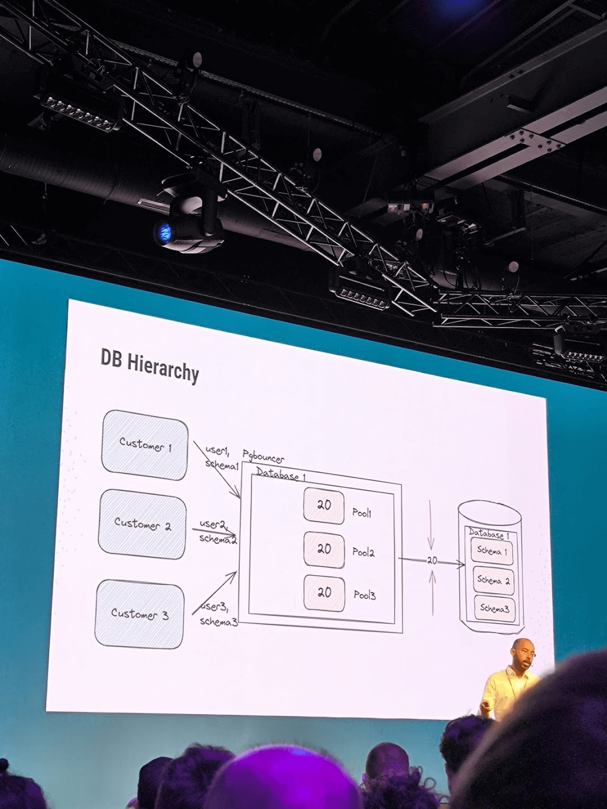
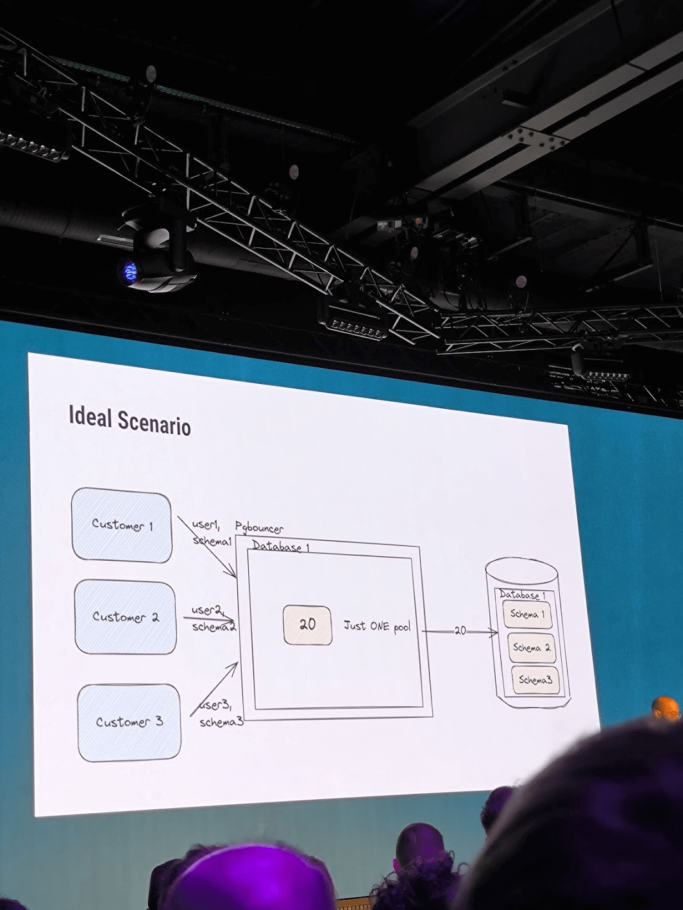
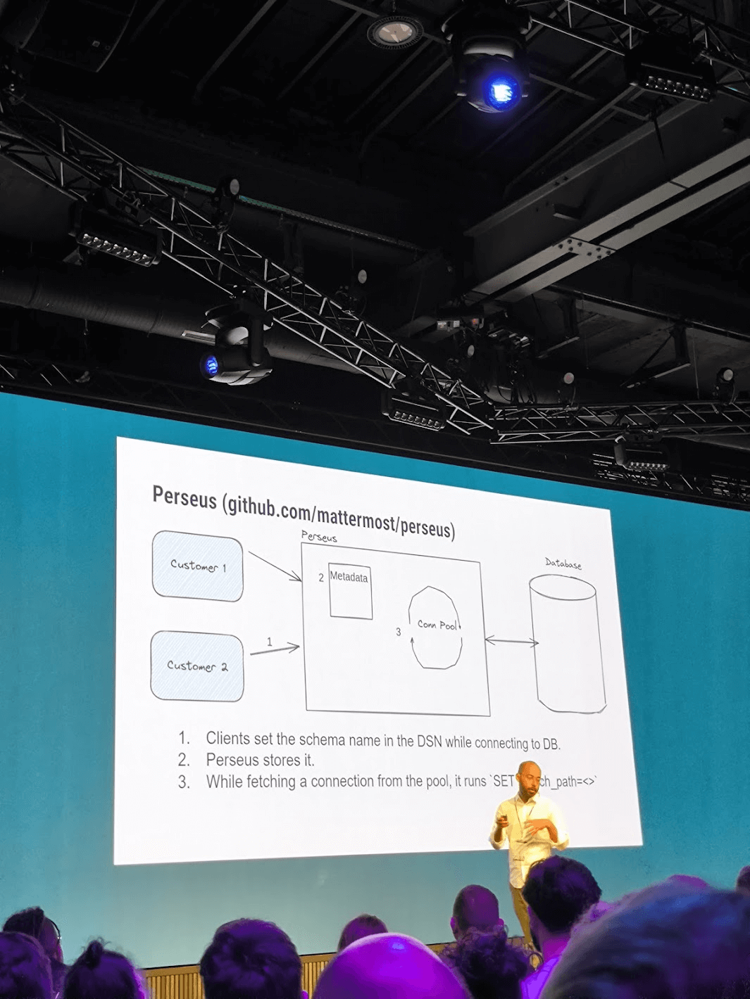

## AI Application in Go - Travis Cline

Travis Cline introduced `LangChainGo`, a library designed to integrate Go with the generative AI ecosystem. This library
simplifies writing LLM-based programs in Go, supporting various models like `ChatGPT`. Travis outlined current
capabilities and future plans for LangChainGo, including core simplification, advanced agent support, and deeper
integration with tools like `LangSmith`.

### Capabilities

 - Structured Output
 - Tool Calling
 - Vector Database (Sequoia)

### Future Plans

 - Core Simplification
 - Documentation
 - Advanced Agent Support
 - Deeper Integration

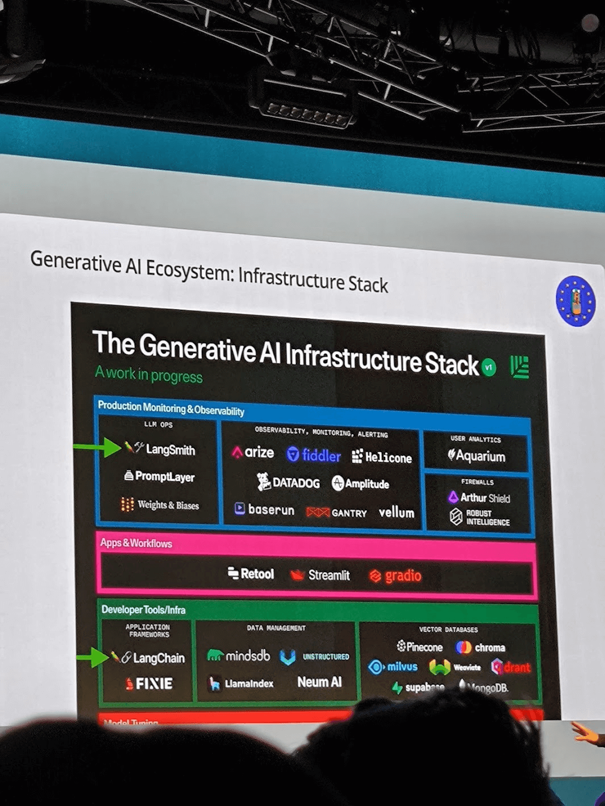
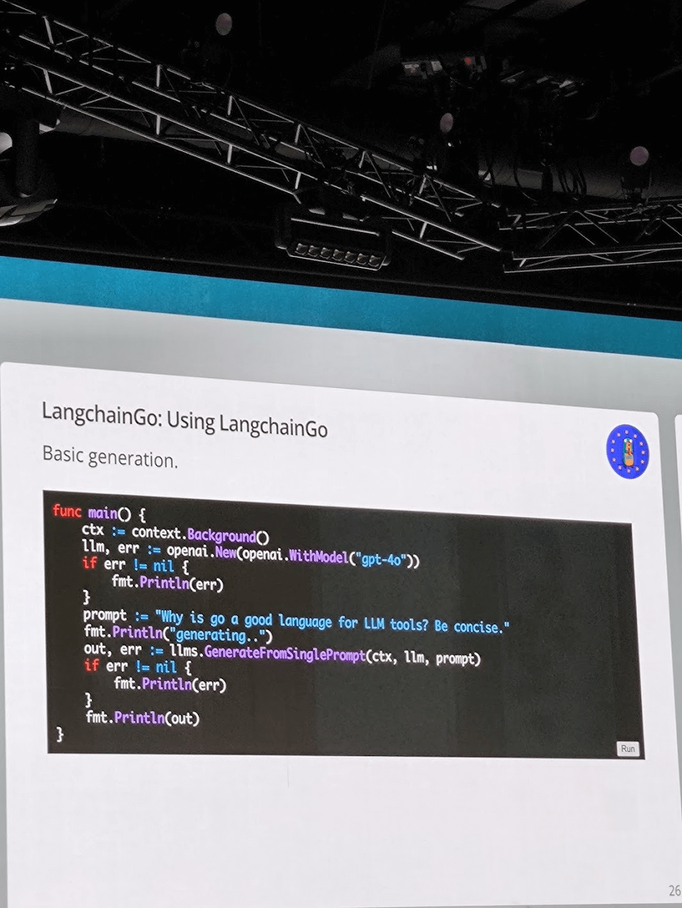

## Concurrent Go - Raghav Roy

Raghav Roy introduced the `TLA+` specification language, a formal method for verifying distributed and concurrent systems.

He demonstrated how TLA+ can be used to model and verify concurrent Go programs, ensuring that they are free from unexpected behaviors.

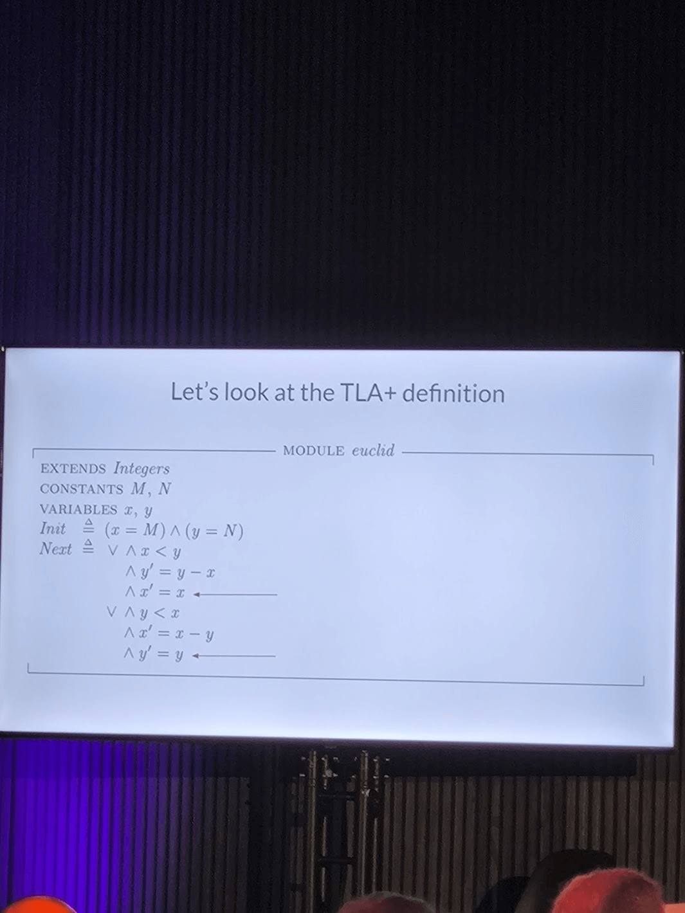

## Technical Docs - Hila Fish

Hila Fish provided a comprehensive guide on creating effective technical documentation. She stressed the importance of
various document types, including system design briefs, on-call runbooks, and project planning documents. Hila also
discussed the benefits of thorough documentation, such as reducing work volume and enabling self-service, thereby
increasing developer velocity.

### Documentation Types

 - System Logical Design/Brief
 - On-Call Runbooks
 - Code README
 - Onboarding Docs
 - Project Planning Docs
 - Docs as Code
 - Slack Pinned Messages
 - Slack bot

### General Guidelines

 1. **Know Your Audience**: Tailor documentation for internal maintainers or external users. Make sure people understand it
 2. **Decide/Abide by Documentation Type**: Use markdown for docs as code, integrate diagrams, and ensure CI/CD validations.

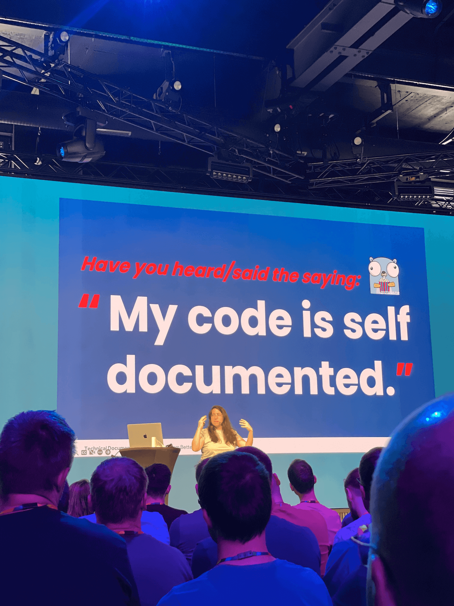

Her tips aim to have a well-documented code and not a self-documented one. She recommends that we should not feel forced
to write everything but at least documente whatever we can and keep it simple.

Below are some of the suggested links shared to help us:
1. [Go Official Style Guide](https://go.dev/blog/godoc)
2. [Google Style Guide](https://google.github.io/styleguide/go/)
3. [Technical Writing Tips](https://docs.google.com/document/u/0/d/1naq4pq0otqb78hkQ8enJBLd_yHqLeMC93fFJAnaK0Rc/mobilebasic) by Hila Fish

## Frames & Pointers - Felix Geisendörfer

Felix Geisendörfer's session focused on performance profiling and tracing tools in Go, including pprof, frame pointers,
and various tracing utilities like Gotraceui and Traceutils. He demonstrated how these tools can help developers
understand and optimize their Go applications.

### Tools Highlighted

 - pprof
 - Frame Pointers
 - Gotraceui
 - Traceutils

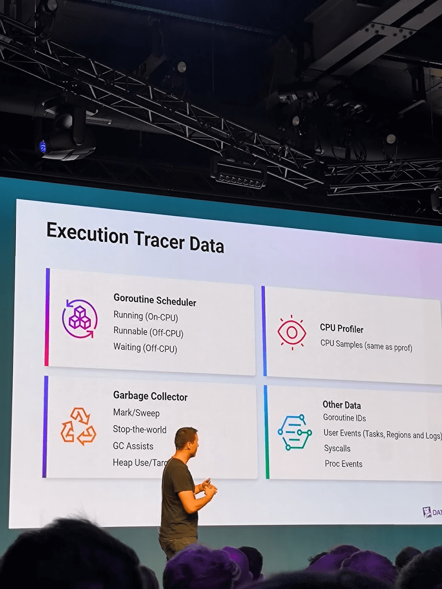
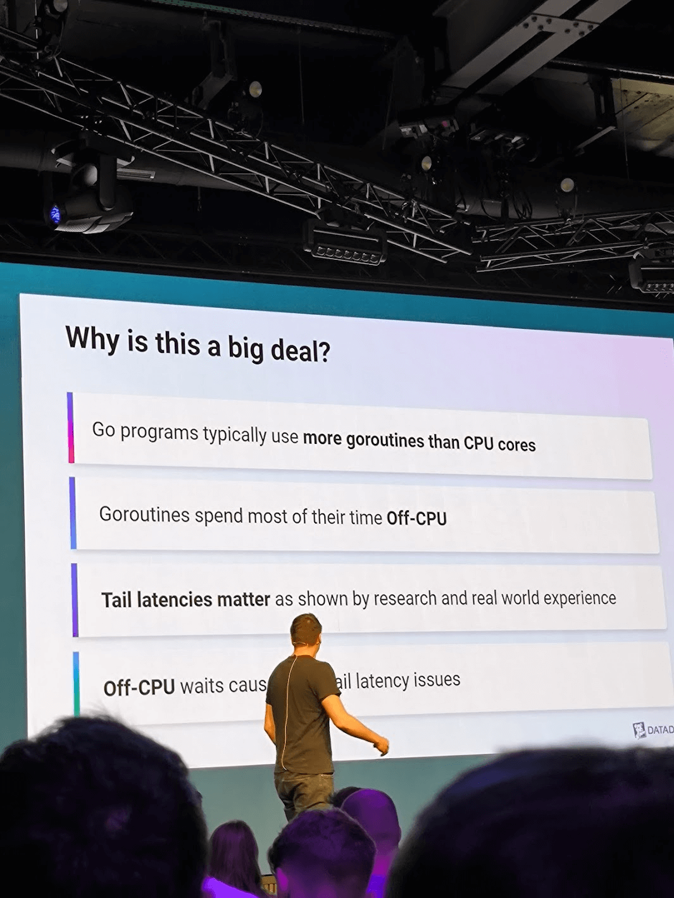

## Securing Containers - Zvonimir Pavlinovic

Zvonimir Pavlinovic discussed container security, introducing `govulncheck`, a vulnerability scanning tool developed by
the Go team. He presented data on vulnerability findings in containers and discussed the capabilities of `Scalibr`, a
software composition analysis library that works across different types of binaries.

### Key Points

 - **Tool**: govulncheck
 - **Vulnerability** Findings: Detected symbols in 54% of containers, mostly Go vulnerabilities.
 - **Library**: Scalibr, supports various binary types.

### Resources

 - [govulncheck](https://go.dev/doc/security/vuln/)
 - [Scalibr](https://github.com/google/osv-scalibr)

## Anti Patterns - Rabieh Fashwall

Rabieh proposes some good practices:

- when using generics is relevant
- that can be resumed in “don’t reinvent the wheel” i.e. use native go functions instead of homemade code can have
  impact on performances. He shares simple examples and validates them with simple benchmarks.

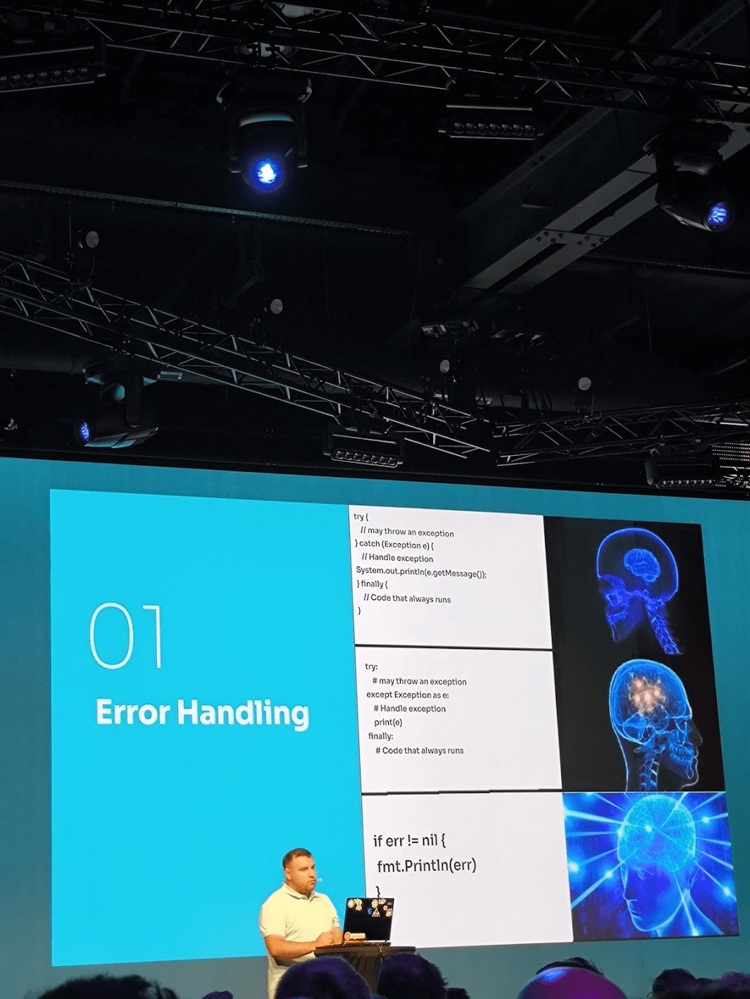

# Conclusion

These two days were a great chance to meet people involved in the language's development and learn more about a wide
range of topics related to the Go language. Because the event was so well-organized, we were able to exchange in general
benevolence with a large number of GO users.

Our only regret is the somewhat short duration of the talks, which occasionally prevented us from digging deeper into
certain subjects and the lack of a Q&A period with the speakers at the conclusion of their presentation though you can
still ask them questions all along the event.
