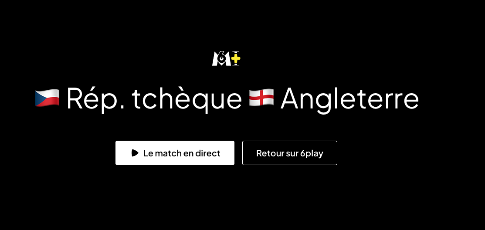
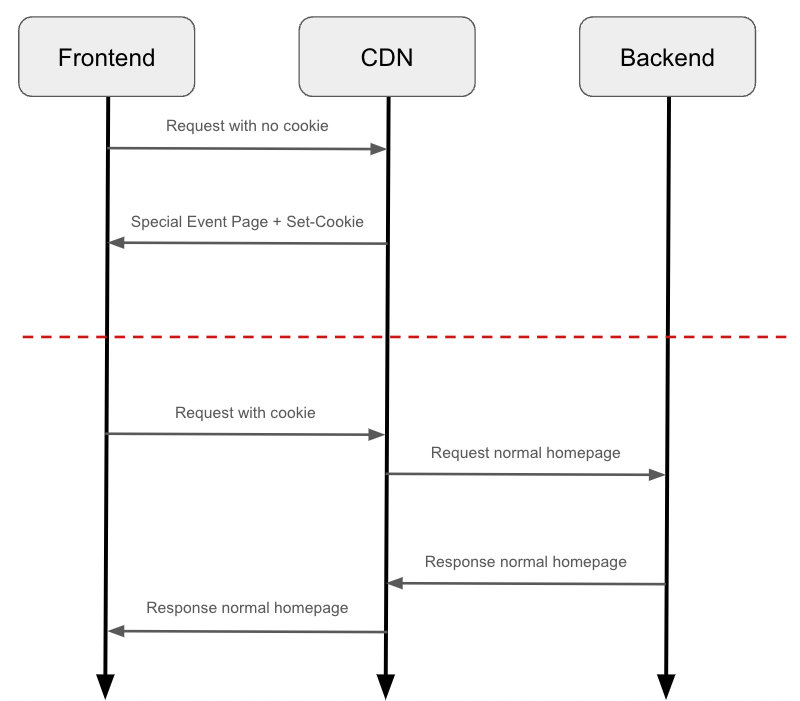
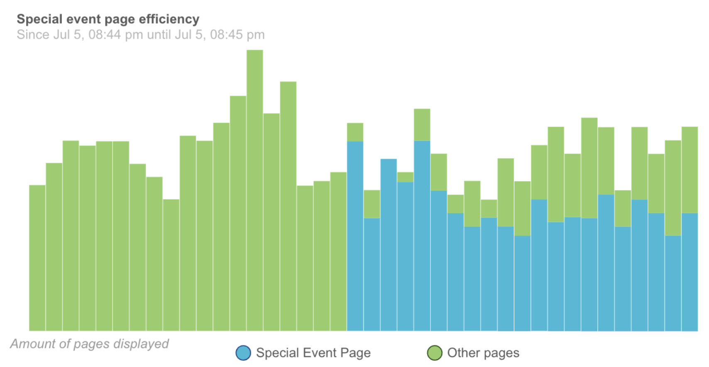
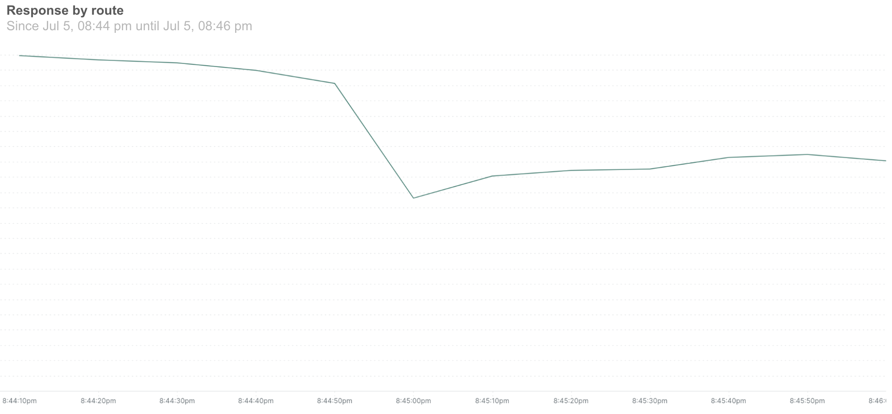

Earlier this year took place the [Euro soccer competition](https://www.uefa.com/euro2024/), spanning over a month and with thousands of people tuning all over the world to watch the matches. One of our customers, [M6+](https://www.6play.fr/), was streaming several of these games - And during the competition, hundreds of thousands of browsers, phones and TVs were able to seamlessly stream the matches with no major issue at all. It was, however, no easy feat to reach that state. How did we do that? What were the challenges we faced, the solutions we envisioned? In this article, we'll discuss one of the features we developed specifically for the Euro: something that we called the **"Special Event Page"**.

## The need behind the Special Event Page

This feature was actually first developed back in 2021, for a similar reason: yet another Euro soccer tournament! Back then, it was a very simple feature: display a page to the user, once per session and prior to any kind of backend call, that would prompt them to go to the football. Here's what it looked like:

It was a very simple page (no background, only the two teams and two buttons were displayed), which was only developed for the Web clients, but it served its purpose.
For every soccer evening, we would handle far more traffic than what we usually handled. If each one of these users would load a personalized homepage, search for a program, navigate around the app and do all kind of other actions, then it wouldn't take long for our backend servers to explode under the pressure, especially as most users who want to watch a football match arrive “at the same time”, over a few minutes before it starts, which makes it difficult for our servers to scale accordingly. Each user that saw that Special Event page and clicked on the Live button was one that was immediately directed to their content, **without any kind of backend call**. It was a very simple solution, it worked very well, felt great for our users, and it allowed us to alleviate a lot of the pressure our backend APIs would have otherwise faced.

At the same time, the Special Event page was very useful for our end users. Enabled a few minutes before the match, and staying available for the entire duration, it allowed any new user that was arriving to the platform to **quickly be able to reach the corresponding live, without spending time searching for it beforehand**, directly reducing friction time.

However, this was far from a perfect solution, as it presented a few issues that we needed to fix in order to be ready for the Euro 2024:
- This page was **entirely managed by the Web team**. Our customer did not have any input on it, if they wanted to make a change they'd have to request it, and we'd then have to integrate it in our web application, and then deploy it, preventing any last-minute modifications. We needed a process that could be documented, followed, and would allow lightning-fast modifications to the Special Event page.
- As it was only managed by the Web team, **the traffic generated by phones and TVs did not benefit from this feature**. This was a major issue, as these devices could prove to be a lot of traffic. For example, usage of mobile devices suddenly spiked at every goal, with a lot of users in the street taking out their phone to check out what happened when they heard screams around them. We needed a new solution that could impact all platforms, not just the Web.
- It was overall not pretty 😅 We ourselves weren't really huge fans of the old page, we wanted a new one that'd be more ✨ *shiny* ✨

With all of these in mind, in preparation for the Euro of this year, we began to create what would be the new Special Event Page.

## Attack plan

One of our first goals was to make sure that most platforms (with a target goal of **more than 90% of them**) would get access to that feature. If we wanted to be able to sustain as much traffic as possible without hiccup, we'd have to reach as many users as possible in one shot, and not spend time working on device-specific implementations. For this reason, we decided to opt for **a backend-first strategy**: ideally the work on different fronts would be minimal, and our backend would be responsible to handle and answer the Special Event page whenever it is needed.

After consideration, we decided to go for **a Cookie-based solution**. When one of our fronts would request the homepage, for example, the request would first be caught by our CDN. It'd check for the existence of a given cookie in that request. If the cookie was present, then the user already saw the special event page and we'd let the request go through. If the cookie was not present, then we'd return the Special Event page to the user, along with **a new `Set-Cookie` header that would save that cookie to the user's device**, preventing them from seeing the Special Event page again for a given duration.
The Special event page content would be a static, non-personalized version of a page that resembled one our backend API could return for the homepage, hosted in the cloud. We’d then be able to edit that page on the fly without bothering the frontend teams.

With this solution, we also reaped another benefit: phone apps. When a new version of the application is released, not everyone always updates theirs. We could require an update, but it’s not really a good experience for a user to be prompted to update their app ever-so-often (and it can translate into a slight portion of our audience choosing to uninstall the app instead), so that's a mean we wish to avoid as much as possible. With the solution described above, managing everything using nothing but cookies and http headers meant that not a single line of code needed to be written by our frontend teams, so aside from one small change to enable cookie storage (That we could plan for long in advance), **no new version was needed**!

However, it wasn't perfect either.

## Web challenges : Cookies and SSR

The first issue we encountered, we probably should've guessed earlier that it would happen: cross-domain cookies. While cookies work wonders when they are set by the same domain that's using them, here, our cookies were set on [6play.fr](https://www.6play.fr/) by the domain [6cloud.fr](https://layout.6cloud.fr). At first, when we tested locally, this wasn't an issue.

However, nowadays, as a mean to ensure users privacy, **most browsers block these kind of cookies** to prevent cross-domain tracking. While our cookies weren't trying to gather anything from our users, they were blocked nonetheless! With no existing way of indicating that this was a functional cookie (as it'd otherwise probably be abused by these exact tracking tools that browsers aim to block 😅), we had to find another solution specifically for the Web. We ended up having to code a second logic on the Web code directly, detecting whenever a Special Event page was displayed and setting a cookie from the website itself, to prevent this third-party cookie blocking. Even though this required a bit more code, this ended up working like a charm for the web.

The second issue we encountered was with **Server-Side Rendering**, that the Web (again!) use plenty (we talked about this a while ago, [right here!](https://tech.bedrockstreaming.com/2017/05/17/spa-mode-isomorphism-js)). When a page is requested, the SSR first renders the page on the server, and serves it to the client: it allows a user to see an immediate result, while their own device is processing the page. That result is also served to web crawlers such as Google SEO robots! However, in our architecture, SSR responses are not user-specific, and **we can't detect cookies of each user on the server side**. As a result, the server would always respond the Special Event Page, and every user would see it for a split second before the client-side code takes over again. Moreover, it'd completely break our SEO! To prevent that issue, we chose to whitelist the IP addresses of our servers, in order to specify to our CDN not to send it the Special Event page under any circumstances.

## Final result

With these small issues now behind us, the Special Event was ready to be released. We prepared the static files, configured the last details for the cookie duration, and voilà!

As soon as the feature came live, we could instantly see the impact it had on our traffic, with **the pressure on our servers diminishing drastically**.

While the Special Event page was a success, enabling our users to reach the soccer matches with nothing more than **one single click**, while at the same time allowing us to reduce a lot of the incoming traffic on our backend servers, it was not the only feature that we developed to prepare for such a massive event. We also worked on quite a few topics, such as the *layout at edge*, or a huge workshop on a way to *load-test efficiently our services*. We will communicate about these at some point in the future, so keep an eye out for this!

